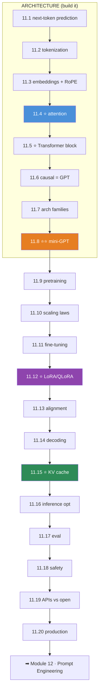
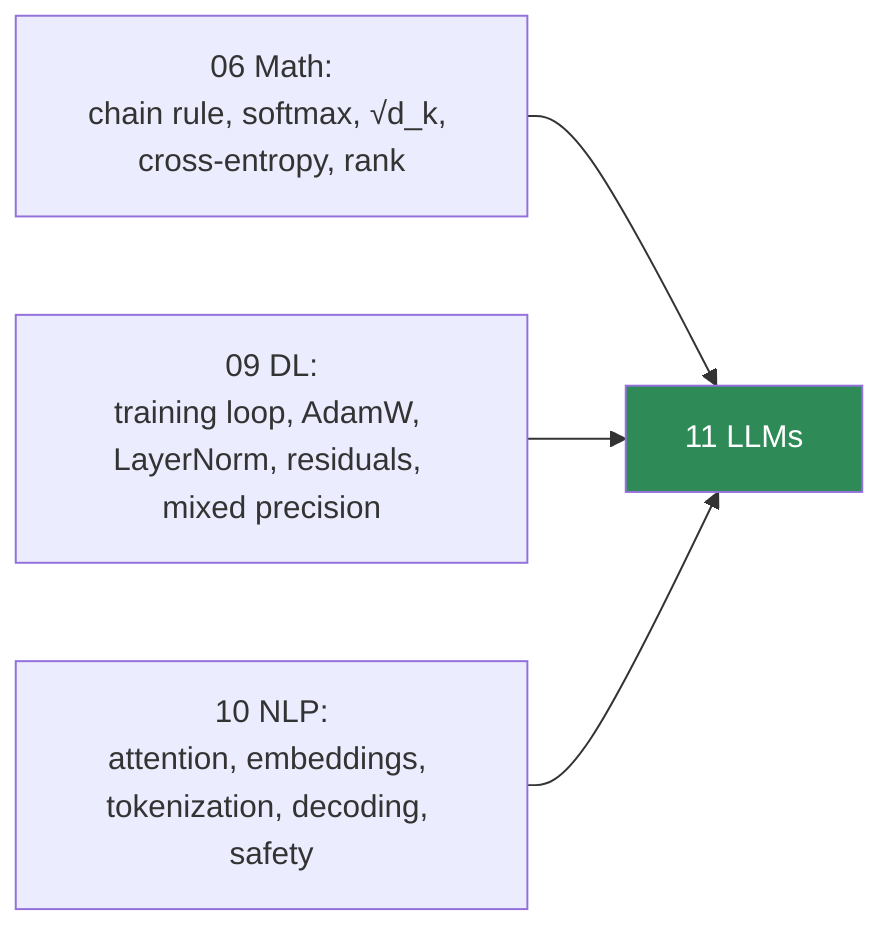

# 11.21 · Projects & Module Summary

[⬅ 11.20 Production LLM Architecture](11.20-production-architecture.md) · [🏠 Module 11](../README.md) · [➡ Module 12 · Prompt Engineering](../../12-Prompt-Engineering/README.md)

> **The lesson in one line:** Eight projects that take you from a character-level language model to a fine-tuned, optimized, production-served LLM — and the consolidation of everything: an LLM is next-token prediction, built from attention, scaled, aligned, and engineered.

---

## The eight projects

| # | Project | Proves you can | Lessons |
|---|---|---|---|
| 1 | **Character-Level Language Model** | the LM objective, end to end | [11.1](11.1-what-is-a-language-model.md) |
| 2 | **Tokenizer From Scratch** | BPE, the atom of an LLM | [11.2](11.2-tokenization.md) |
| 3 | **Attention From Scratch** | the core operation, verified | [11.4](11.4-attention.md) |
| 4 | **Mini Transformer** ⭐ | a working GPT, by hand | [11.5](11.5-transformer-architecture.md)–[11.8](11.8-build-mini-transformer.md) |
| 5 | **Small Language Model** | pretrain + scale it | [11.9](11.9-pretraining.md), [11.10](11.10-scaling-laws.md) |
| 6 | **Fine-Tuning Project** | base → instruction-follower | [11.11](11.11-fine-tuning.md) |
| 7 | **LoRA Fine-Tuning** | adapt a big model cheaply | [11.12](11.12-peft-lora.md) |
| 8 | **LLM Inference API** ⭐ | serve it, optimized & safe | [11.14](11.14-inference-decoding.md)–[11.20](11.20-production-architecture.md) |

```
code/11-llms/
├── README.md
├── requirements.txt          # torch, transformers, peft, bitsandbytes, vllm, fastapi
├── char-lm/                  # 1  (11.1)
├── tokenizer/                # 2  (11.2)
├── attention/                # 3  (11.4)
├── nano-gpt/                 # 4  ⭐ (11.8) — the flagship of the first half
├── small-lm/                 # 5  (11.9, 11.10)
├── finetune/                 # 6  (11.11)
├── lora/                     # 7  (11.12)
├── inference-api/            # 8  ⭐ (11.20) — the flagship of the second half
└── shared/                   # the 09.10 trainer, tokenizer, KV cache
```

> [!IMPORTANT]
> **Two projects are load-bearing. `nano-gpt` ([11.8](11.8-build-mini-transformer.md))** proves you understand the *architecture* — you built a working GPT from tokens to generation. **`inference-api` ([11.20](11.20-production-architecture.md))** proves you understand the *engineering* — you served it with KV cache, quantization, caching, guardrails, and monitoring. **Build these two well and you can read any LLM paper and design any LLM system.** Projects 1–3 build up to nano-GPT; 5–7 train and adapt it; 8 serves it.

---

## Project highlights

**Project 4 — Mini Transformer (nano-GPT) ⭐.** Full spec in [11.8](11.8-build-mini-transformer.md). A complete decoder-only Transformer in PyTorch — tokenizer, embeddings, causal attention, FFN, residuals, generation — trained until it produces coherent text. **The moment an LLM stops being magic.**

**Project 5 — Small Language Model.** Pretrain nano-GPT properly ([11.9](11.9-pretraining.md)) with a real data pipeline (clean → dedup → tokenize → shard) and reproduce a **scaling law** ([11.10](11.10-scaling-laws.md)) — loss vs parameters on log-log axes.

**Project 7 — LoRA Fine-Tuning ⭐.** Full spec in [11.12](11.12-peft-lora.md). Fine-tune an open model with QLoRA on a single GPU; serve **swappable adapters** from one base. The technique that democratized fine-tuning.

**Project 8 — LLM Inference API ⭐.** Full spec in [11.20](11.20-production-architecture.md). A production service: KV cache ([11.15](11.15-kv-cache.md)), quantization + continuous batching ([11.16](11.16-inference-optimization.md)), caching, guardrails ([11.18](11.18-safety.md)), and monitoring. **A real, deployable LLM system.**

---

## 📊 Module Summary — everything, connected

### The twenty-one lessons as one arc



### The ideas that did the most work

| Idea | Where it reappeared |
|---|---|
| **⭐ Everything is next-token prediction** | 11.1 → pretraining (11.9), generation (11.14), fine-tuning (11.11) |
| **⭐ Attention = softmax(QKᵀ/√d)·V** | 11.4 (built) → block (11.5) → causal (11.6) → KV cache (11.15) |
| **The O(n²) / context-length wall** | 11.4, 11.5, 11.15, 11.16 |
| **⭐ Memory is the constraint** | Adam 3× (11.9), LoRA (11.12), KV cache (11.15), quantization (11.16) |
| **Prefill (compute-bound) vs decode (memory-bound)** | 11.15 → 11.16 → 11.20 |
| **⭐ The training loop never changes** | 11.8, 11.9, 11.11 — still [09.10](../../09-Deep-Learning/weeks/09.10-training-loop.md) |
| **Probable ≠ true (hallucination)** | 11.1, 11.13, 11.17, 11.18 |
| **⭐ MLOps & evaluation don't change** | 11.17, 11.20 inherit [08.17](../../08-Machine-Learning/weeks/08.17-production-ml.md)/[10.13](../../10-NLP/weeks/10.13-production.md) |

> [!IMPORTANT]
> **The whole module was one claim, proven: an LLM is not a black box.** It's next-token prediction ([11.1](11.1-what-is-a-language-model.md)), computed by stacked self-attention blocks ([11.4](11.4-attention.md)–[11.5](11.5-transformer-architecture.md)) you built by hand ([11.8](11.8-build-mini-transformer.md)), pretrained on the internet ([11.9](11.9-pretraining.md)), scaled by predictable laws ([11.10](11.10-scaling-laws.md)), fine-tuned and aligned into an assistant ([11.11](11.11-fine-tuning.md)–[11.13](11.13-alignment.md)), and served with engineering that's mostly about **memory** ([11.15](11.15-kv-cache.md)–[11.16](11.16-inference-optimization.md)) and **the system around the model** ([11.18](11.18-safety.md)–[11.20](11.20-production-architecture.md)). **Scale changed the magnitude of capability, not the mechanism** — and you now understand the mechanism.

### How this cashed in the whole handbook



Nothing in this module was invented from nothing: attention ([10.7](../../10-NLP/weeks/10.7-attention.md)), the training loop ([09.10](../../09-Deep-Learning/weeks/09.10-training-loop.md)), cross-entropy/perplexity ([06.8](../../06-Mathematics/weeks/06.8-information-theory.md)), the rank argument behind LoRA ([06.3](../../06-Mathematics/weeks/06.3-linear-algebra-2.md)), subword tokenization ([10.2](../../10-NLP/weeks/10.2-text-processing.md)), sampling ([10.8](../../10-NLP/weeks/10.8-seq2seq.md)), and the MLOps discipline ([08.17](../../08-Machine-Learning/weeks/08.17-production-ml.md)) all came from earlier modules. **Module 11 was assembly, scale, and engineering.**

---

## ✅ Self-assessment

**Architecture**
- [ ] I can explain why everything an LLM does is next-token prediction
- [ ] I can implement BPE tokenization and explain byte-level BPE
- [ ] I can explain token/positional embeddings and why RoPE is used
- [ ] I can **write attention from scratch** (single + multi-head + causal)
- [ ] I can describe every component of a Transformer block
- [ ] I can **build and train a mini-GPT** and explain each line
- [ ] I know why decoder-only won and the three architecture families

**Training & adaptation**
- [ ] I understand the pretraining pipeline and why memory is the constraint
- [ ] I can explain scaling laws and the Chinchilla result
- [ ] I understand SFT, loss masking, and catastrophic forgetting
- [ ] I can explain **LoRA/QLoRA** and why they work (low rank)
- [ ] I understand RLHF, reward models, and **DPO**

**Serving & operating**
- [ ] I can explain decoding strategies and the creativity/reliability trade-off
- [ ] I understand the **KV cache** and prefill vs decode
- [ ] I know the inference optimizations (quantization, batching, speculative decoding)
- [ ] I know why LLM evaluation is hard and how to do it
- [ ] I can design safety defenses (injection, least privilege)
- [ ] I can choose API vs open vs self-hosted
- [ ] I can design a production LLM architecture

---

## 🎯 What this module bought you

**Before:** an LLM was magic — attention was an equation, "fine-tuning" and "RLHF" were buzzwords, and serving was someone else's problem.

**Now:**
- You know **an LLM is next-token prediction**, and you **built a working one** from tokens to generation.
- You understand **every component** — tokenizer, embeddings, RoPE, attention, the block, causal masking — because you implemented them.
- You know how models are **pretrained, scaled (Chinchilla), fine-tuned (SFT + loss masking), adapted cheaply (LoRA/QLoRA), and aligned (RLHF/DPO)**.
- You understand **inference deeply** — decoding, the **KV cache**, prefill vs decode, quantization, continuous batching, speculative decoding.
- You can **evaluate, secure, and deploy** LLMs, and choose the right deployment.
- You can **read an LLM research paper** and recognize every component.

**You understand modern Transformer-based LLMs deeply enough to build small ones, fine-tune open ones, optimize inference, and design production systems** — the goal of the module.

---

## 🧭 Where this leads

| Next | What Module 11 gives you |
|---|---|
| [**12 · Prompt Engineering**](../../12-Prompt-Engineering/README.md) | ⭐ You know *why* prompting works (in-context learning, [11.1](11.1-what-is-a-language-model.md)) and how decoding/context shape output |
| [**13 · RAG**](../../13-RAG/README.md) | The fix for hallucination ([11.1](11.1-what-is-a-language-model.md)); embeddings + generation you already understand |
| [**14 · Agents**](../../14-Agents/README.md) | LLMs + tools + least privilege ([11.18](11.18-safety.md)) |
| [**15 · Fine-Tuning**](../../15-Fine-Tuning/README.md) | Deep dive on [11.11](11.11-fine-tuning.md)/[11.12](11.12-peft-lora.md) |
| [**16 · MLOps**](../../16-MLOps/README.md) | Productionizing [11.20](11.20-production-architecture.md) at scale |

> [!IMPORTANT]
> **You've reached the summit of the foundations track.** Modules 06–11 took you from the [chain rule](../../06-Mathematics/weeks/06.4-calculus.md) to a production LLM, first-principles the whole way. Everything after this — prompting, RAG, agents, fine-tuning, MLOps — is *application* of what you now understand at the mechanism level. **You are no longer someone who uses LLMs; you are someone who understands them.**

---

## 📄 Module cheat sheet

| Lesson | The one thing |
|---|---|
| **11.1** | everything is **next-token prediction**; probable ≠ true |
| **11.2** | the **token** is the atom; BPE; byte-level = no unknowns |
| **11.3** | tokens→vectors + position; **RoPE** = relative, extrapolates |
| **11.4** | ⭐ `softmax(QKᵀ/√d)·V`; **GQA** shrinks the KV cache |
| **11.5** | ⭐ block = attention + FFN, residual + norm; FFN holds the knowledge |
| **11.6** | **causal mask** = GPT; generation is sequential |
| **11.7** | encoder (understand) / decoder (generate) / enc-dec (seq2seq) |
| **11.8** | ⭐⭐ a **mini-GPT is pure assembly** — build it |
| **11.9** | pretraining = the loop at scale; **memory** is the constraint; dedup |
| **11.10** | ⭐ scaling laws; **Chinchilla** ~20 tokens/param; over-train for cheap inference |
| **11.11** | SFT teaches **behavior**; **loss masking**; forgetting |
| **11.12** | ⭐ **LoRA/QLoRA** — low-rank, fine-tune 70B on one GPU |
| **11.13** | alignment: RLHF (reward model + PPO) → **DPO** (simpler) |
| **11.14** | temperature/top-p; creativity vs reliability |
| **11.15** | ⭐ **KV cache**; prefill (compute) vs decode (**memory**-bound) |
| **11.16** | **quantize first**; continuous batching; speculative decoding |
| **11.17** | perplexity → benchmarks → human; **contamination**; no single number |
| **11.18** | **prompt injection** (unfixable); **least privilege**; assume hijack |
| **11.19** | API vs open vs self-hosted → **privacy & cost-at-scale** |
| **11.20** | ⭐ the **system around the model**; caching; MLOps unchanged |

**⭐ The one equation:** `Attention(Q,K,V) = softmax(QKᵀ/√dₖ)·V`.
**⭐ The one idea:** an LLM is next-token prediction, built from attention, scaled, aligned, and engineered — **not a black box.**

---

## 📚 References — the short list

1. **Vaswani et al. (2017) — _Attention Is All You Need_.** ⭐⭐ The architecture.
2. **Karpathy — _Let's build GPT_ / nanoGPT / _Let's build the GPT Tokenizer_.** ⭐⭐ Build it yourself; this module *is* this.
3. **Brown et al. (2020) — _GPT-3_** & **Hoffmann et al. (2022) — _Chinchilla_.** Scale and scaling laws.
4. **Ouyang et al. (2022) — _InstructGPT_** & **Rafailov et al. (2023) — _DPO_.** Fine-tuning and alignment.
5. **Hu et al. (2021) — _LoRA_** & **Dettmers et al. (2023) — _QLoRA_.** Efficient adaptation.
6. **Kwon et al. (2023) — _vLLM / PagedAttention_.** Inference serving.
7. **Jay Alammar — _The Illustrated Transformer / GPT-2_.** ⭐ Visual intuition.

---

## 🧭 Navigation

| Direction | Link |
|---|---|
| ⬅ Previous | [11.20 · Production LLM Architecture](11.20-production-architecture.md) |
| ➡ Next module | [12 · Prompt Engineering](../../12-Prompt-Engineering/README.md) |
| 🏠 Module | [Module 11](../README.md) |
| 📖 All lessons | [Lesson index](README.md) |
| 🗺 Roadmap | [ROADMAP.md](../../../ROADMAP.md) |
