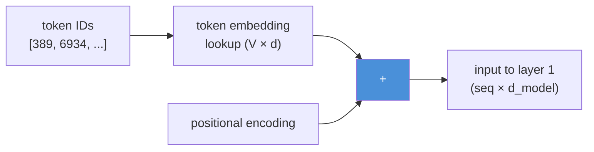
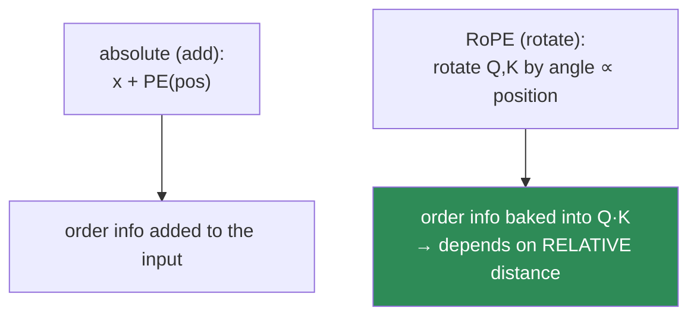
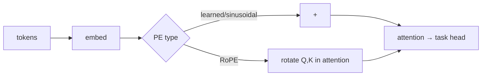

# 11.3 · Embeddings & Positional Encoding — Giving Tokens Meaning and Position

[⬅ 11.2 Tokenization](11.2-tokenization.md) · [🏠 Module 11](../README.md) · [➡ 11.4 Attention](11.4-attention.md)

> **The lesson in one line:** A token ID becomes a vector via an embedding lookup, but attention is order-blind — so you must *also* inject position, and how you do it (learned, sinusoidal, or **RoPE**) decides how far the model can extrapolate.

---

## 🎯 Learning objectives

- Understand **token embeddings** as the trainable lookup table that turns IDs into vectors.
- Understand *why* Transformers need **positional information** at all (attention is a set operation).
- Compare **learned**, **sinusoidal**, and **rotary (RoPE)** positional encodings — and why modern LLMs use RoPE.
- Reason about **embedding dimension** (`d_model`) and its role throughout the model.

## ✅ Prerequisites

- [10.4 embeddings](../../10-NLP/weeks/10.4-word-embeddings.md), [06.11 transformer math incl. positional encoding](../../06-Mathematics/weeks/06.11-transformer-math.md).
- [11.2 tokenization](11.2-tokenization.md) — you have token IDs.

---

## 🧠 Mental model

> [!IMPORTANT]
> **Two things must happen before a token enters the Transformer: it must gain *meaning* (a semantic vector, via the embedding table) and *position* (where it sits in the sequence, via positional encoding).** Attention treats its input as an unordered *set* — "the cat sat" and "sat the cat" look identical to it — so without positional information the model literally cannot tell word order. The input to the first Transformer layer is **token embedding + positional information.**



---

## Token embeddings — IDs become vectors

The **token embedding table** is a trainable matrix of shape `(vocab_size, d_model)`. Row *i* is the `d_model`-dimensional vector for token ID *i*. Turning a token into its vector is an **indexing operation** ([09.8](../../09-Deep-Learning/weeks/09.8-building-models.md), [10.4](../../10-NLP/weeks/10.4-word-embeddings.md)) — not a matmul.

```python
import torch.nn as nn
token_embedding = nn.Embedding(vocab_size, d_model)   # e.g. (50257, 768) for GPT-2
# ids: (batch, seq) → embeddings: (batch, seq, d_model)
```

Unlike static Word2Vec ([10.4](../../10-NLP/weeks/10.4-word-embeddings.md)), these embeddings are trained **jointly with the whole model** on the next-token objective — they start random and become meaningful because good embeddings help predict the next token. And unlike Word2Vec, the *final* representations are contextual, because attention ([11.4](11.4-attention.md)) mixes them; the embedding table just provides the starting point.

> [!NOTE]
> **Weight tying:** many LLMs share the input embedding matrix with the output projection (the layer that maps the final hidden state back to vocabulary logits). Both are `vocab_size × d_model`; tying them saves a large chunk of parameters and often improves quality — the same table that encodes "token → vector" also scores "vector → token." ([11.2](11.2-tokenization.md) noted this is a big parameter block.)

---

## Why position must be injected

Here is the crux, and it surprises people. **Self-attention is permutation-invariant.** Look at the formula ([10.7](../../10-NLP/weeks/10.7-attention.md), [11.4](11.4-attention.md)): `softmax(QKᵀ/√d)·V`. It's a weighted sum over all positions with no inherent notion of *order* — shuffle the input tokens and the set of outputs is just shuffled the same way; the *content* is unchanged. To attention, "dog bites man" and "man bites dog" have identical token *sets*, so without extra information it cannot distinguish them ([10.3 BoW's flaw](../../10-NLP/weeks/10.3-text-representation.md), returning to haunt us).

> [!IMPORTANT]
> **This is the price of dropping recurrence.** An RNN got word order for free — it *read* the tokens in sequence. Attention processes all tokens simultaneously (its great advantage — [10.7 parallelism](../../10-NLP/weeks/10.7-attention.md)), but that same simultaneity means order is lost and must be **explicitly added back**. Positional encoding is the tax you pay for parallelism. Every Transformer needs it; the interesting question is *how*.

---

## Three ways to encode position

### 1. Learned positional embeddings

The simplest: a second trainable table of shape `(max_seq_len, d_model)`, one vector per position, **added** to the token embedding. Position 0 gets a learned vector, position 1 another, etc. (Used by GPT-2, BERT.)

- ✅ Simple, effective, lets the model learn whatever position representation helps.
- ❌ **Cannot extrapolate** beyond `max_seq_len` — there's no vector for position 5000 if you only trained to 1024. Hard context ceiling.

### 2. Sinusoidal positional encoding

The original Transformer's choice ([06.11](../../06-Mathematics/weeks/06.11-transformer-math.md), Vaswani et al.). A **fixed** (non-learned) pattern of sines and cosines at geometrically-spaced frequencies:

$$PE_{(pos, 2i)} = \sin\!\left(\frac{pos}{10000^{2i/d}}\right), \quad PE_{(pos, 2i+1)} = \cos\!\left(\frac{pos}{10000^{2i/d}}\right)$$

Each dimension is a sinusoid of a different wavelength; together they give every position a unique fingerprint.

- ✅ **No parameters**; defined for any position, so it *can* extrapolate in principle.
- ✅ The clever property: because $\sin(a+b)$ and $\cos(a+b)$ are linear combinations of $\sin a, \cos a, \sin b, \cos b$, **relative positions are expressible as linear transforms** — the model can learn to attend "3 tokens back" consistently.

> **[FIGURE: Sinusoidal positional encoding heatmap.** A grid, position on the y-axis (0–100), embedding dimension on the x-axis (0–128). Each row is a position's encoding; low dimensions oscillate fast (short wavelength), high dimensions slowly (long wavelength), forming a smooth striped pattern. Caption: "Every position gets a unique fingerprint from sinusoids of geometrically-spaced frequencies — like a binary counter in continuous form."**]

### 3. Rotary Positional Embeddings (RoPE) — the modern default

Used by Llama, GPT-NeoX, most current open models. Instead of *adding* a position vector, RoPE **rotates** the query and key vectors by an angle proportional to their position, *inside the attention computation*.



The key insight: after rotating Q and K by their positions, the dot product $Q_m \cdot K_n$ depends **only on the relative distance $m - n$**, not the absolute positions. So attention naturally scores "how far apart are these two tokens," which is what actually matters linguistically.

| | Learned | Sinusoidal | **RoPE** |
|---|---|---|---|
| Trained? | ✅ | ❌ fixed | ❌ fixed (rotation) |
| Absolute or relative | absolute | absolute (relative-friendly) | **relative** |
| Applied | added to input | added to input | **rotates Q,K in attention** |
| Extrapolates to longer context? | ❌ | somewhat | ✅ **much better** (+ interpolation tricks) |
| Used by | GPT-2, BERT | original Transformer | **Llama, most modern LLMs** |

> [!IMPORTANT]
> **RoPE won because relative position is what matters and because it extrapolates.** Language cares about *distance* ("the adjective modifies the nearby noun"), not absolute index, and RoPE encodes distance directly in the attention score. Crucially, it enables **context-length extension** — techniques like position interpolation and NTK scaling stretch a RoPE model trained at 4K to run at 32K+ with minimal retraining, which is how "long-context" models are made ([11.15](11.15-kv-cache.md), [11.16](11.16-inference-optimization.md)). When you read "we extended the context window," it's almost always RoPE manipulation.

---

## Embedding dimension (`d_model`)

`d_model` is the width of the model — the size of every token vector as it flows through the layers. It's the single most pervasive hyperparameter: token embeddings, attention projections, feed-forward inputs, and residual streams are all `d_model` wide.

| Model | `d_model` | Layers | Params |
|---|---|---|---|
| GPT-2 small | 768 | 12 | 124M |
| GPT-2 XL | 1600 | 48 | 1.5B |
| Llama-2 7B | 4096 | 32 | 7B |
| Llama-2 70B | 8192 | 80 | 70B |

> [!NOTE]
> **`d_model` is the "bandwidth" of the residual stream.** Every token carries a `d_model`-dim vector through the whole network; that vector is the model's entire working memory about that position. Wider = more capacity per token but quadratically more compute in the feed-forward layers ([11.5](11.5-transformer-architecture.md)) and more memory. Scaling laws ([11.10](11.10-scaling-laws.md)) balance width, depth, and data.

---

## ⚡ Performance & GPU considerations

- **The embedding table is a major memory block** — `vocab × d_model` ([11.2](11.2-tokenization.md)); weight tying halves it.
- **RoPE is cheap** — it's element-wise rotation on Q and K, negligible compute, and adds no parameters.
- **Positional encoding interacts with the KV cache** ([11.15](11.15-kv-cache.md)) — RoPE is applied to keys as they're cached, so it composes cleanly with incremental decoding.
- **Long context is a memory problem, not just a position problem** — even with RoPE extrapolation, the KV cache and O(n²) attention are what actually limit context ([11.15](11.15-kv-cache.md)).

## 🔒 Security considerations

> [!CAUTION]
> - **Long-context extrapolation can degrade safety.** Pushing a model far beyond its trained context (via aggressive RoPE scaling) can weaken instruction-following and alignment in the tail, opening a window for [jailbreaks that hide instructions late in a long prompt](11.18-safety.md).
> - **Position confusion aids injection.** If system instructions and user data aren't clearly separated (by special tokens and position), an attacker can exploit the model's positional handling to make injected text look authoritative ([11.18](11.18-safety.md)).
> - **Embeddings memorize** ([10.4](../../10-NLP/weeks/10.4-word-embeddings.md), [10.14](../../10-NLP/weeks/10.14-ethics-safety.md)) — trained token embeddings encode corpus statistics and can leak.

## 🚫 Common mistakes

| Mistake | Consequence |
|---|---|
| **Forgetting positional encoding** | model is order-blind — "dog bites man" = "man bites dog" |
| **Using learned PE then exceeding max_seq_len** | no vector for out-of-range positions → crash or garbage |
| **Assuming any model extrapolates to any length** | only RoPE (with scaling) extends well; learned PE can't |
| **Adding RoPE to the input like sinusoidal** | RoPE *rotates Q,K in attention*, not added to embeddings |
| **Confusing d_model with vocab size** | d_model = vector width; vocab = number of tokens |

## ✅ Best practices

- **Always add positional information** — it's non-negotiable for any attention model.
- **Prefer RoPE for new decoder-only LLMs** — relative, parameter-free, extrapolates.
- **Respect the trained context length**; use documented extension methods (position interpolation) rather than naive length increases.
- **Tie input/output embeddings** to save parameters unless you have a reason not to.
- **Match `d_model` to your compute/memory budget** via scaling-law guidance ([11.10](11.10-scaling-laws.md)).

## 🏋️ Exercises

1. **Prove order-blindness.** In NumPy, run a single self-attention layer ([10.7](../../10-NLP/weeks/10.7-attention.md)) on token embeddings for "dog bites man" and "man bites dog" *without* positional encoding. Show the per-token outputs are just permuted (order lost). Add positional encoding and show they now differ meaningfully.
2. **Sinusoidal PE.** Implement the sinusoidal formula. Plot the encoding as a heatmap (positions × dimensions). Verify each position's vector is unique.
3. **Relative property.** Show empirically that for sinusoidal PE, `PE(pos+k)` is a linear function of `PE(pos)` for fixed k (fit a linear map, check the residual).
4. **RoPE by hand.** Implement RoPE rotation for a small head dimension. Verify that `rotate(q, m) · rotate(k, n)` depends only on `m - n` for a couple of position pairs.
5. **Extrapolation test.** Train a tiny model with learned PE up to length 32, then feed length 64. Show it fails. Repeat with sinusoidal/RoPE and show graceful behavior.
6. **d_model sweep.** For a fixed tiny Transformer, vary `d_model` ∈ {64, 128, 256}. Report parameter count and validation perplexity. Chart the trade-off.

## 🛠️ Mini project — "Positional Encoding Lab"

**Goal:** implement and compare all three positional schemes on the same tiny model, and *measure* extrapolation.

**Requirements**
- Implement learned, sinusoidal, and RoPE positional encodings.
- Plug each into a tiny Transformer ([11.8](11.8-build-mini-transformer.md) preview) trained on a length-sensitive toy task (e.g., "copy the token N positions back").
- Train at one context length, **evaluate at a longer one**, and chart accuracy vs length for each scheme.
- Visualize sinusoidal PE and RoPE rotation.

**Folder structure**
```
positional-lab/
├── encodings.py       # learned | sinusoidal | rope
├── tiny_model.py      # minimal attention block using a pluggable PE
├── extrapolate.py     # train short, test long; accuracy vs length
├── visualize.py       # PE heatmap, RoPE rotation
└── README.md
```

**Architecture diagram**


**Evaluation:** accuracy vs sequence length, per scheme — the extrapolation curve is the deliverable.
**Testing:** assert order-blindness without PE; assert RoPE's relative-distance property numerically.
**Future improvements:** add position interpolation to the RoPE model and show it extends context; carry the best scheme into [11.8](11.8-build-mini-transformer.md).

## 📄 Cheat sheet

| Concept | One line |
|---|---|
| **Token embedding** | trainable `(vocab × d_model)` lookup; ID → vector |
| **Weight tying** | share input embedding with output projection → save params |
| **⭐ Why positional encoding** | attention is **permutation-invariant** — order must be added |
| **Learned PE** | trainable per-position table; simple; **can't extrapolate** |
| **Sinusoidal PE** | fixed sines/cosines; parameter-free; relative-friendly |
| **⭐ RoPE** | **rotate Q,K by position** → attention depends on **relative distance**; extrapolates |
| **d_model** | model width; the residual-stream bandwidth per token |
| **⭐ Context extension** | almost always RoPE scaling (position interpolation/NTK) |

## 🎴 Flashcards

- **What is the token embedding table?** → A trainable `(vocab_size, d_model)` matrix; a token ID indexes its row (a lookup, not a matmul).
- **⭐ Why do Transformers need positional encoding?** → Self-attention is permutation-invariant (a set operation); without position, word order is lost.
- **Why did dropping recurrence create the position problem?** → RNNs read tokens in order (order for free); attention processes all at once, so order must be added back.
- **Learned vs sinusoidal PE?** → Trainable per-position table (can't extrapolate) vs fixed sinusoids (parameter-free, relative-friendly, extrapolates somewhat).
- **⭐ What is RoPE and why is it the modern default?** → It rotates Q and K by an angle ∝ position so the attention score depends on *relative* distance; it's parameter-free and extrapolates well.
- **How are long-context models usually made?** → By scaling RoPE (position interpolation / NTK) to extend beyond the trained length.
- **What is d_model?** → The width of every token vector through the model — the residual-stream bandwidth.
- **What is weight tying?** → Sharing the input embedding matrix with the output projection to save parameters.

## 💬 Interview questions

1. Why must a Transformer add positional information, and what property of attention makes it necessary?
2. Compare learned, sinusoidal, and rotary positional encodings. Why do modern LLMs use RoPE?
3. What is the key mathematical property of RoPE regarding relative position?
4. How are long-context models created from shorter-context ones?
5. What is d_model, and how does it propagate through the architecture?
6. What is weight tying and why is it used?

## 📝 Summary

- A token becomes a vector via the **trainable embedding table** (`vocab × d_model`), often **tied** with the output projection.
- **Self-attention is permutation-invariant**, so **positional information must be explicitly injected** — the tax for dropping recurrence and gaining parallelism.
- **Learned PE** is simple but can't extrapolate; **sinusoidal PE** is fixed and relative-friendly; **RoPE** rotates Q/K so attention depends on **relative distance**, and it's the modern default because it extrapolates — the basis of long-context extension.
- **`d_model`** is the model's width and pervades every layer; scaling laws balance it against depth and data.

## 📚 References

1. **Vaswani et al. (2017) — _Attention Is All You Need_ (sinusoidal PE).** ⭐
2. **Su et al. (2021) — _RoFormer: Rotary Position Embedding_.** ⭐⭐ RoPE.
3. **Press et al. (2022) — _ALiBi_.** Another relative-position scheme worth knowing.
4. **Chen et al. (2023) — _Extending Context Window via Position Interpolation_.** ⭐ How long-context is made.
5. **[06.11 Transformer Math](../../06-Mathematics/weeks/06.11-transformer-math.md).** Your own derivation of positional encoding.

---

## 🧭 Navigation

| Direction | Link |
|---|---|
| ⬅ Previous | [11.2 · Tokenization](11.2-tokenization.md) |
| ➡ Next | [11.4 · Attention](11.4-attention.md) |
| 🏠 Module | [Module 11](../README.md) |
| 📖 Lessons | [Lesson index](README.md) |
