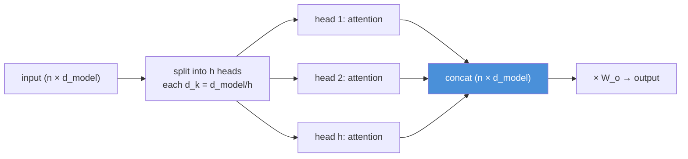
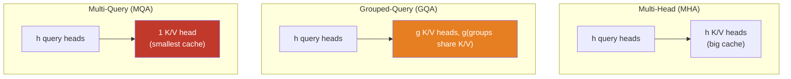
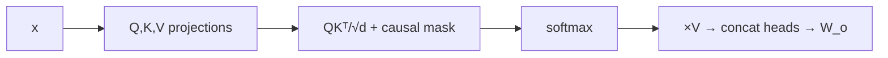

# 11.4 · Attention — From Scratch, Again, For LLMs ⭐

[⬅ 11.3 Embeddings & Positional Encoding](11.3-embeddings-positional.md) · [🏠 Module 11](../README.md) · [➡ 11.5 Transformer Architecture](11.5-transformer-architecture.md)

> **The lesson in one line:** You built attention in [10.7](../../10-NLP/weeks/10.7-attention.md); here you rebuild it in the LLM's own terms — single-head, multi-head, and the GQA/MQA variants that make billion-parameter inference affordable.

---

## 🎯 Learning objectives

- Re-derive **scaled dot-product attention** and implement single- and multi-head attention in **NumPy, then PyTorch**.
- Understand attention specifically as the LLM's mechanism for **mixing information across the context**.
- Understand **Multi-Query (MQA)** and **Grouped-Query (GQA)** attention and why every large model uses them.
- Preview **FlashAttention** and the **O(n²)** wall that dominates LLM engineering.

## ✅ Prerequisites

- [10.7 attention from scratch](../../10-NLP/weeks/10.7-attention.md) — **this lesson assumes it.** We go faster and deeper here.
- [11.3 embeddings + RoPE](11.3-embeddings-positional.md) — Q/K carry position.

---

## 🧠 Mental model

> [!IMPORTANT]
> **Attention is how a token gathers information from the rest of the context.** Each token forms a **query** ("what do I need?"), every token offers a **key** ("what am I about?") and a **value** ("here's my content"), and each token's new representation is a relevance-weighted blend of all values. In an LLM this is *the* mechanism of computation — the feed-forward layers process each token independently; **attention is the only place tokens talk to each other.** Everything an LLM "reasons" about, it reasons by attending.

This is [10.7](../../10-NLP/weeks/10.7-attention.md) verbatim. We repeat it because it is the load-bearing operation of the entire module, and because the LLM-scale variants (multi-head details, GQA, FlashAttention, causal masking, KV cache) all build directly on the mechanism.

---

## The formula (recall)

$$\text{Attention}(Q, K, V) = \text{softmax}\!\left(\frac{QK^\top}{\sqrt{d_k}}\right)V$$

| Step | Shape | Meaning |
|---|---|---|
| $QK^\top$ | (n, n) | every token's relevance to every other |
| $\div\sqrt{d_k}$ | (n, n) | ⭐ variance fix — keeps softmax from saturating ([10.7](../../10-NLP/weeks/10.7-attention.md)) |
| softmax (rows) | (n, n) | weights summing to 1 per query |
| $\times V$ | (n, d) | weighted blend of values |

The `√d_k` scaling, the reason it exists (dot-product variance grows with dimension → softmax saturation → vanishing gradients), and the Q/K/V roles are all fully derived in [10.7](../../10-NLP/weeks/10.7-attention.md). If any of that is fuzzy, reread it — everything here depends on it.

---

## 💻 Single-head attention (NumPy)

```python
import numpy as np

def softmax(x, axis=-1):
    x = x - x.max(axis=axis, keepdims=True)      # stability (06.9)
    e = np.exp(x); return e / e.sum(axis=axis, keepdims=True)

def attention(Q, K, V, mask=None):
    d_k = Q.shape[-1]
    scores = Q @ K.swapaxes(-1, -2) / np.sqrt(d_k)     # (..., n, n)
    if mask is not None:
        scores = np.where(mask, scores, -np.inf)       # causal mask (11.6): block the future
    weights = softmax(scores, axis=-1)
    return weights @ V, weights
```

The `mask` argument is the one LLM-specific addition: setting future positions to $-\infty$ before softmax makes attention **causal** ([11.6](11.6-decoder-only.md)) — a token can attend to the past and itself, never the future. That single line is what turns "attention" into "GPT."

---

## Multi-head attention — several relationship channels

One attention head computes one kind of relevance. Language has many simultaneous relationships (syntactic, coreferential, positional), so we run **h heads in parallel**, each with its own smaller Q/K/V projections, then concatenate and project ([10.7](../../10-NLP/weeks/10.7-attention.md)).



Each head projects to $d_k = d_{model}/h$, so h heads cost roughly the same as one full-width attention — diversity of relationship types for free. Studies show heads specialize (some track the previous token, some resolve coreference, some attend to syntactic heads) — emergent, not designed.

```python
class MultiHeadAttention(nn.Module):        # PyTorch
    def __init__(self, d_model, n_heads):
        super().__init__()
        self.n_heads, self.d_k = n_heads, d_model // n_heads
        self.qkv = nn.Linear(d_model, 3 * d_model)      # fused Q,K,V projection
        self.out = nn.Linear(d_model, d_model)

    def forward(self, x, mask=None):
        B, T, D = x.shape
        q, k, v = self.qkv(x).chunk(3, dim=-1)          # each (B, T, D)
        # reshape to (B, heads, T, d_k)
        q, k, v = [t.view(B, T, self.n_heads, self.d_k).transpose(1, 2) for t in (q, k, v)]
        scores = q @ k.transpose(-2, -1) / self.d_k**0.5
        if mask is not None:
            scores = scores.masked_fill(mask == 0, float('-inf'))
        out = (scores.softmax(-1) @ v).transpose(1, 2).reshape(B, T, D)
        return self.out(out)
```

---

## MQA and GQA — the inference-cost fix every big model uses

Here is the LLM-specific twist that [10.7](../../10-NLP/weeks/10.7-attention.md) didn't cover, and it matters enormously for serving. During generation, the **KV cache** ([11.15](11.15-kv-cache.md)) stores the keys and values of every past token, for every head — and that cache is often the memory bottleneck. Multi-head attention stores K and V for *all* h heads. Two variants cut that cost:



| | **MHA** | **GQA** | **MQA** |
|---|---|---|---|
| Query heads | h | h | h |
| Key/Value heads | h | g (1 < g < h) | 1 |
| KV cache size | largest | **medium** | smallest |
| Quality | best | ~MHA | slight drop |
| Used by | GPT-2, original | **Llama-2 70B, most modern** | PaLM, some |

> [!IMPORTANT]
> **GQA is the standard in modern large models because it slashes the KV cache with almost no quality loss.** The query heads stay full (they do the "thinking"); the keys and values are shared across groups of query heads, so you cache far fewer K/V tensors. For a 70B model serving long contexts, the KV cache can rival the model weights in size ([11.15](11.15-kv-cache.md)) — GQA can cut it several-fold. This is a pure *inference-economics* optimization that reshaped attention design: **the memory cost of remembering the past drove the architecture.**

---

## FlashAttention & the O(n²) wall

The attention score matrix is $(n, n)$ — quadratic in sequence length ([10.7](../../10-NLP/weeks/10.7-attention.md)). At 100K tokens that's $10^{10}$ entries; materializing it is impossible. **FlashAttention** computes exact attention **without ever forming the full $(n,n)$ matrix** — it tiles the computation and fuses softmax into the matmul, keeping everything in fast on-chip SRAM. Same math, dramatically less memory traffic → several-fold speedup and the ability to handle long contexts.

> [!IMPORTANT]
> **FlashAttention is not a new algorithm — it's a memory-access rewrite of the same math.** The lesson: at LLM scale, the bottleneck is usually **moving data**, not doing arithmetic ([the memory-bandwidth theme, 09.14](../../09-Deep-Learning/weeks/09.14-performance.md)). Attention is memory-bound; FlashAttention wins by minimizing reads/writes to slow high-bandwidth memory. You won't implement it by hand, but knowing *why* it exists — the O(n²) memory of the score matrix — is essential to understanding LLM performance.

---

## ⚡ Performance & GPU considerations

- **Attention is O(n²) in time and memory** — the central scaling constraint ([11.15](11.15-kv-cache.md), [11.16](11.16-inference-optimization.md)).
- **Use fused, optimized kernels** — `torch.nn.functional.scaled_dot_product_attention` dispatches to FlashAttention automatically; never hand-roll attention in production.
- **GQA/MQA reduce KV-cache memory**, the actual bottleneck for long-context serving ([11.15](11.15-kv-cache.md)).
- **Attention is matmul-heavy → Tensor-Core-ideal**; run it in bf16/fp16 ([09.14](../../09-Deep-Learning/weeks/09.14-performance.md)).

## 🔒 Security considerations

> [!CAUTION]
> - **Attention weights are not faithful explanations** ([10.7](../../10-NLP/weeks/10.7-attention.md)) — don't present a heatmap as proof of why a model produced an output in a high-stakes setting.
> - **Long-context = large attack surface** — O(n²) means a maliciously long input is a compute/memory DoS vector; cap input length ([11.18](11.18-safety.md)).
> - **Attention can be steered by injected content** — since attention freely mixes all context, injected instructions in a document can capture the model's "focus" (prompt injection, [11.18](11.18-safety.md)).

## 🚫 Common mistakes

| Mistake | Consequence |
|---|---|
| **Dropping `√d_k`** | softmax saturates → vanishing gradients ([10.7](../../10-NLP/weeks/10.7-attention.md)) |
| **Wrong softmax axis** | weights don't normalize over keys → nonsense |
| **Forgetting the causal mask** | model sees the future → invalid LM ([11.6](11.6-decoder-only.md)) |
| **Hand-rolling attention in production** | slow; use fused kernels (FlashAttention) |
| **Ignoring KV-cache cost** | OOM at long context; use GQA/MQA ([11.15](11.15-kv-cache.md)) |
| **Confusing #query heads with #KV heads** | that distinction *is* GQA/MQA |

## ✅ Best practices

- **Always scale by `√d_k`; use numerically stable softmax.**
- **Use `scaled_dot_product_attention`** (auto-FlashAttention) in real code.
- **Choose GQA** for new large models — near-MHA quality, much smaller KV cache.
- **Apply the causal mask** for any generative (decoder) model ([11.6](11.6-decoder-only.md)).
- **Build it by hand once** (the project) so the kernel is transparent, then never again.

## 🏋️ Exercises

1. **Single-head, verified.** Implement `attention` in NumPy; rebuild in PyTorch; assert `torch.allclose` on random inputs.
2. **Multi-head.** Extend to h heads with $d_k = d_{model}/h$. Confirm parameter count ≈ single full attention. Inspect whether different heads attend differently on a sentence with a pronoun.
3. **Causal mask.** Add a lower-triangular mask. Verify each position attends only to itself and earlier positions (upper triangle of weights is 0).
4. **GQA.** Implement grouped-query attention with g < h KV heads. Measure the KV-cache memory reduction vs MHA for a given sequence length.
5. **O(n²) empirically.** Time attention for n ∈ {128, 256, 512, 1024, 2048}. Fit the curve; confirm quadratic. Estimate where a naive implementation OOMs.
6. **Compare to the kernel.** Benchmark your hand-rolled attention vs `F.scaled_dot_product_attention` on a GPU. Report the speedup.

## 🛠️ Mini project — "Attention, LLM-Grade"

**Goal:** implement the full attention family — single-head, multi-head, causal, and GQA — verified against PyTorch, ready to drop into the [11.8 mini-Transformer](11.8-build-mini-transformer.md).

**Requirements**
- Scaled dot-product, multi-head, causal masking, and **GQA** in NumPy + PyTorch.
- `torch.allclose` verification against `F.scaled_dot_product_attention`.
- A **KV-cache-size comparison** (MHA vs GQA vs MQA) as a function of sequence length and layers.
- An **O(n²) benchmark** with a fitted curve.

**Folder structure**
```
attention-llm/
├── attention.py       # sdpa, multi_head, causal, gqa
├── verify.py          # torch.allclose vs PyTorch
├── kv_memory.py       # MHA/GQA/MQA cache-size comparison
├── benchmark.py       # O(n²) timing
└── README.md
```

**Architecture diagram**


**Testing:** `torch.allclose` vs PyTorch; causal mask zeroes future weights; GQA output shape matches MHA; float64 gradient check.
**Evaluation:** the KV-memory table and O(n²) curve are the deliverables.
**Future improvements:** wire this attention into [11.5](11.5-transformer-architecture.md)'s block and [11.8](11.8-build-mini-transformer.md)'s model; add RoPE ([11.3](11.3-embeddings-positional.md)) to Q/K.

## 📄 Cheat sheet

| Concept | One line |
|---|---|
| **⭐ Attention** | `softmax(QKᵀ/√dₖ)·V` — the only place tokens exchange information |
| **Q/K/V** | what I seek / how I'm matched / what I deliver (learned) |
| **√dₖ** | variance fix; without it softmax saturates |
| **Multi-head** | h parallel heads (d_k=d_model/h) → many relationship types, ~same cost |
| **Causal mask** | set future scores to −∞ → decoder / GPT ([11.6](11.6-decoder-only.md)) |
| **⭐ MHA / GQA / MQA** | h / g / 1 K-V heads → shrinking **KV cache** |
| **⭐ GQA** | the modern default: near-MHA quality, much smaller cache |
| **FlashAttention** | exact attention without materializing the (n×n) matrix — memory rewrite |
| **⭐ O(n²)** | the central cost/scaling wall of LLMs |

## 🎴 Flashcards

- **⭐ Where in an LLM do tokens exchange information?** → Only in attention; feed-forward layers process each token independently.
- **State the attention formula and why √dₖ.** → `softmax(QKᵀ/√dₖ)·V`; the scaling prevents softmax saturation (dot-product variance grows with dₖ).
- **What is multi-head attention?** → h parallel attention operations with d_k=d_model/h, capturing different relationship types at ~the cost of one.
- **⭐ What's the difference between MHA, GQA, and MQA?** → Number of key/value heads: h, g (grouped), or 1 — shrinking the KV cache.
- **⭐ Why does every large model use GQA?** → It cuts KV-cache memory (the long-context bottleneck) several-fold with almost no quality loss.
- **What does the causal mask do?** → Sets future positions' scores to −∞ so each token attends only to itself and the past — makes attention a valid LM.
- **What is FlashAttention?** → An exact attention implementation that never materializes the (n×n) matrix, minimizing memory traffic — same math, much faster.
- **⭐ What is attention's fundamental cost?** → O(n²) in time and memory — the central LLM scaling constraint.

## 💬 Interview questions

1. Explain scaled dot-product attention and the role of each of Q, K, V. Why the √dₖ scaling?
2. What is multi-head attention and why is it better than one large head?
3. Explain MHA vs GQA vs MQA. Why do modern large models use GQA?
4. What is the KV cache's relationship to attention head design?
5. What does FlashAttention optimize, and why is attention memory-bound?
6. How does the causal mask turn attention into a language model?

## 📝 Summary

- Attention is **the only mechanism by which tokens exchange information** in an LLM — `softmax(QKᵀ/√dₖ)·V`, exactly as built in [10.7](../../10-NLP/weeks/10.7-attention.md).
- **Multi-head** attention runs h parallel heads for diverse relationship types at ~the cost of one.
- **GQA/MQA** reduce the number of key/value heads to shrink the **KV cache** — GQA is the modern standard, cutting long-context serving memory with negligible quality loss.
- **FlashAttention** makes attention fast by rewriting its memory access (never materializing the $(n,n)$ matrix), because attention is memory-bound.
- The **O(n²)** cost is the central scaling wall — the theme of the KV cache ([11.15](11.15-kv-cache.md)) and inference optimization ([11.16](11.16-inference-optimization.md)).

## 📚 References

1. **Vaswani et al. (2017) — _Attention Is All You Need_.** ⭐⭐
2. **Shazeer (2019) — _Fast Transformer Decoding_ (MQA)** & **Ainslie et al. (2023) — _GQA_.** ⭐ The KV-cache-saving variants.
3. **Dao et al. (2022) — _FlashAttention_** & **Dao (2023) — _FlashAttention-2_.** ⭐⭐ The memory rewrite.
4. **[10.7 Attention From Scratch](../../10-NLP/weeks/10.7-attention.md).** Your own hand-built foundation.
5. **Elhage et al. (2021) — _A Mathematical Framework for Transformer Circuits_.** Attention-head interpretability.

---

## 🧭 Navigation

| Direction | Link |
|---|---|
| ⬅ Previous | [11.3 · Embeddings & Positional Encoding](11.3-embeddings-positional.md) |
| ➡ Next | [11.5 · Transformer Architecture](11.5-transformer-architecture.md) |
| 🏠 Module | [Module 11](../README.md) |
| 📖 Lessons | [Lesson index](README.md) |
