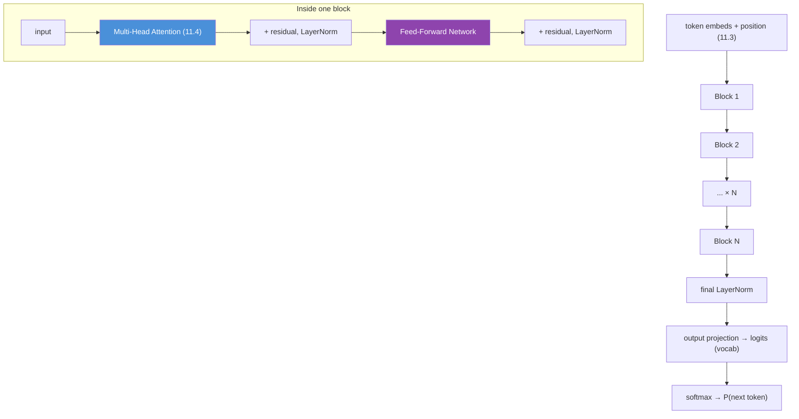
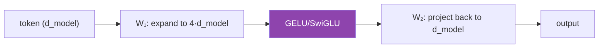
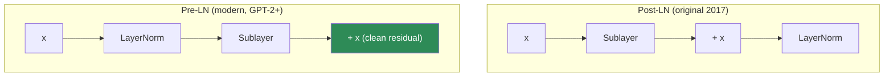
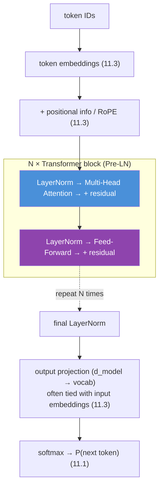
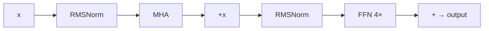

# 11.5 · Transformer Architecture — Every Component, Assembled ⭐

[⬅ 11.4 Attention](11.4-attention.md) · [🏠 Module 11](../README.md) · [➡ 11.6 Decoder-Only Transformers](11.6-decoder-only.md)

> **The lesson in one line:** A Transformer is a stack of identical blocks, and each block is just two sublayers — attention and a feed-forward network — each wrapped in a residual connection and a normalization, repeated N times.

---

## 🎯 Learning objectives

- Assemble the full Transformer block: **attention + FFN, each with residual + LayerNorm**.
- Understand the **residual stream** as the model's information highway.
- Understand the **feed-forward network** (where most parameters and "knowledge" live) and **Pre-LN vs Post-LN**.
- Read a complete architecture diagram from token IDs to output logits.

## ✅ Prerequisites

- [11.4 attention](11.4-attention.md), [11.3 embeddings + position](11.3-embeddings-positional.md).
- [09.8 nn.Module](../../09-Deep-Learning/weeks/09.8-building-models.md), [09.13 LayerNorm & residuals](../../09-Deep-Learning/weeks/09.13-regularization.md) — the components you already own.

---

## 🧠 Mental model

> [!IMPORTANT]
> **A Transformer is a `for` loop over one block, N times.** Each block does exactly two things: (1) **attention** — let tokens exchange information ([11.4](11.4-attention.md)); (2) a **feed-forward network** — let each token process what it gathered, independently. Both are wrapped in a **residual connection** (add the input back) and a **normalization** (stabilize the scale). That's the whole architecture. GPT-3 is this block 96 times; Llama-70B is it 80 times. **There is no other structure to learn — depth is repetition.**



---

## The two sublayers

### Sublayer 1 — Multi-head attention (the "mix" step)

Covered in [11.4](11.4-attention.md). Tokens attend to each other; each token's representation becomes a relevance-weighted blend of the whole context. **This is the only step where information moves *between* positions.**

### Sublayer 2 — Feed-forward network (the "think" step)

After gathering context, each token is processed **independently** by a small MLP applied at every position (the same weights everywhere — position-wise). It expands to a larger hidden dimension, applies a nonlinearity, and projects back:

$$\text{FFN}(x) = W_2 \, \sigma(W_1 x + b_1) + b_2$$

Typically the hidden dimension is **4× `d_model`** (e.g., 4096 → 16384 → 4096), and $\sigma$ is **GELU** or **SwiGLU** (a gated variant used by Llama). This is the [Linear → nonlinearity → Linear from 09.8](../../09-Deep-Learning/weeks/09.8-building-models.md).

> [!IMPORTANT]
> **The feed-forward layers hold ~two-thirds of the parameters — and, interpretability research suggests, most of the model's factual "knowledge."** Attention decides *what to combine*; the FFN decides *what to do with it*, and its wide hidden layer acts like a giant key-value memory that stores learned facts and patterns. When people say a model "knows" something, that knowledge largely lives in FFN weights. This is why FFN width (the 4× factor) is a major capacity dial ([11.10](11.10-scaling-laws.md)) and a prime target for [pruning/quantization (11.16)](11.16-inference-optimization.md).



---

## The glue: residual connections + normalization

Two ideas you already know ([09.11 residuals](../../09-Deep-Learning/weeks/09.11-cnns.md), [09.13 LayerNorm](../../09-Deep-Learning/weeks/09.13-regularization.md)), and they are what make deep Transformers trainable.

### Residual connections — the information highway

Each sublayer's output is **added** to its input: `x + Sublayer(x)`. This creates the **residual stream** — a `d_model`-wide highway running the full depth of the network, to which each block *adds* its contribution rather than replacing.

> [!IMPORTANT]
> **The residual stream is the right way to picture a Transformer.** Think of a wide bus carrying each token's representation from input to output. Every attention and FFN sublayer *reads* from the bus, computes something, and *adds* it back — it never overwrites. This gives a clean gradient highway (the [λⁿ / vanishing-gradient fix from 09.4/09.11](../../09-Deep-Learning/weeks/09.11-cnns.md)) so 80-layer networks train, and it's why interpretability researchers analyze what each layer *writes to the residual stream*. Without residuals, deep Transformers simply don't train.

### Layer normalization — keeping the scale sane

**LayerNorm** ([09.13](../../09-Deep-Learning/weeks/09.13-regularization.md)) normalizes each token's vector across its features (mean 0, variance 1, then a learned scale/shift). It's batch-independent — essential for variable-length text ([09.13](../../09-Deep-Learning/weeks/09.13-regularization.md)). Modern models often use **RMSNorm**, a cheaper variant that skips the mean-centering (just scales by the root-mean-square) — used by Llama, and slightly faster with equal quality.

### Pre-LN vs Post-LN — a small choice with big consequences

Where does the LayerNorm go — before or after each sublayer?



| | **Post-LN** (original) | **Pre-LN** (modern) |
|---|---|---|
| LayerNorm position | after the residual add | before the sublayer |
| Residual path | passes through LayerNorm | **clean, unnormalized** |
| Training stability | needs careful warmup; can diverge deep | **stable**, trains deep networks easily |
| Used by | original Transformer | GPT-2 onward, ~all modern LLMs |

> [!TIP]
> **Pre-LN won because it keeps the residual highway clean.** Putting the norm *inside* the sublayer branch (not on the residual path) means gradients flow straight through the residual stream unimpeded, so very deep models train without the finicky learning-rate warmup Post-LN required. A tiny rearrangement of one operation, decisive for training 100-layer models — a recurring lesson: in deep learning, *where* you put normalization matters as much as *whether*.

---

## The complete architecture, end to end



Every LLM is this diagram. The variations across GPT, Llama, and others are details: RoPE vs learned PE ([11.3](11.3-embeddings-positional.md)), GQA vs MHA ([11.4](11.4-attention.md)), RMSNorm vs LayerNorm, SwiGLU vs GELU, Pre-LN placement. **The skeleton is invariant.**

### The parameter budget

For one block with `d_model = d` and FFN hidden `= 4d`:

| Component | Params (approx) |
|---|---|
| Attention (Q,K,V,O) | 4d² |
| FFN (up + down) | 8d² |
| LayerNorms | ~2d (negligible) |
| **Per block** | **~12d²** |

> [!NOTE]
> **Total params ≈ 12 · N · d² (plus embeddings).** For GPT-3 (d=12288, N=96): 12 × 96 × 12288² ≈ 174B — matching its 175B. This back-of-envelope formula lets you estimate any model's size from its width and depth, and shows the **FFN (8d²) dominates the attention (4d²)** — two-thirds of compute and parameters, as noted above.

---

## ⚡ Performance & GPU considerations

- **Compute is dominated by matmuls** (attention projections + FFN) — Tensor-Core-ideal, run in bf16 ([09.14](../../09-Deep-Learning/weeks/09.14-performance.md)).
- **The FFN is the biggest FLOP consumer** per token (8d² vs attention's 4d² for short sequences); attention overtakes it only at long context (O(n²)).
- **Activation memory** for the residual stream and FFN intermediate (4×d) is large during training — [gradient checkpointing (09.14)](../../09-Deep-Learning/weeks/09.14-performance.md) trades compute to save it.
- **RMSNorm and SwiGLU** are chosen partly for GPU efficiency, not just quality.

## 🔒 Security considerations

> [!CAUTION]
> - **Knowledge in FFN weights = memorized data.** Since facts (and memorized PII/secrets, [10.14](../../10-NLP/weeks/10.14-ethics-safety.md)) live in FFN weights, model weights are sensitive artifacts; extraction attacks target exactly this ([11.18](11.18-safety.md)).
> - **The residual stream carries everything**, including any injected instruction's influence — there's no architectural firewall between "system" and "user" content ([11.18](11.18-safety.md)).
> - **Depth ≠ safety.** More layers add capability, not guardrails; safety comes from alignment ([11.13](11.13-alignment.md)) and system design ([11.20](11.20-production-architecture.md)), not architecture.

## 🚫 Common mistakes

| Mistake | Consequence |
|---|---|
| **Forgetting residual connections** | deep model won't train (vanishing gradients) |
| **Post-LN without warmup for deep models** | training diverges; prefer Pre-LN |
| **Thinking attention holds the "knowledge"** | most facts live in FFN weights |
| **Omitting the final LayerNorm** | unstable output logits |
| **Under-sizing the FFN** | major capacity loss; 4×d_model is standard |
| **Overcomplicating the mental model** | it's one block, repeated N times — that's all |

## ✅ Best practices

- **Use Pre-LN** (and RMSNorm) for stable deep training.
- **FFN hidden = 4× d_model** unless you have a reason otherwise.
- **Keep the residual stream clean** — norms inside sublayer branches, not on the residual path.
- **Estimate size with ~12·N·d²** before training; it sets memory and compute expectations.
- **Reuse `nn.TransformerEncoderLayer`/build-your-own** — but build one by hand first ([11.8](11.8-build-mini-transformer.md)).

## 🏋️ Exercises

1. **Block by hand.** Draw the data flow through one Pre-LN block for a single token, labeling shapes at every step (d_model throughout, 4×d_model inside the FFN).
2. **Parameter count.** Compute the parameter count of one block for d_model=768. Verify total ≈ 12·N·d² + embeddings for GPT-2 small (N=12, vocab=50257).
3. **FFN as memory.** Read the "FFN as key-value memory" idea (Geva et al.). Summarize why the wide hidden layer can store facts.
4. **Pre vs Post-LN.** Train two tiny deep Transformers (say 12 layers), one Pre-LN one Post-LN, same LR. Show Post-LN struggles/diverges without warmup.
5. **RMSNorm.** Implement RMSNorm; verify it matches LayerNorm-minus-centering; benchmark the speed difference.
6. **Residual ablation.** Remove the residual connections from a small Transformer and show training collapses.

## 🛠️ Mini project — "A Transformer Block, From Scratch"

**Goal:** implement one complete, correct Pre-LN Transformer block in PyTorch, the reusable unit for [11.8](11.8-build-mini-transformer.md).

**Requirements**
- Multi-head attention ([11.4](11.4-attention.md)) + position-wise FFN (4×, GELU/SwiGLU).
- Pre-LN with residual connections; RMSNorm option.
- Causal-mask support ([11.6](11.6-decoder-only.md) preview).
- Shape and gradient tests; a parameter-count check against the 12d² formula.

**Folder structure**
```
transformer-block/
├── attention.py       # from 11.4
├── ffn.py             # position-wise MLP (GELU/SwiGLU)
├── block.py           # Pre-LN: norm→attn→+res ; norm→ffn→+res
├── norm.py            # LayerNorm + RMSNorm
├── test_block.py      # shapes, gradients, param count
└── README.md
```

**Architecture diagram**


**Testing:** input/output shapes equal; gradients flow to all params; param count ≈ 12·d²; overfit a tiny sequence.
**Evaluation:** stack N blocks and confirm stable training on a toy sequence.
**Future improvements:** stack these into the full [11.8 mini-GPT](11.8-build-mini-transformer.md); add GQA ([11.4](11.4-attention.md)) and RoPE ([11.3](11.3-embeddings-positional.md)).

## 📄 Cheat sheet

| Component | Role |
|---|---|
| **⭐ The block** | attention + FFN, each with residual + norm — repeated N times |
| **Attention sublayer** | tokens exchange information (the only cross-token step) |
| **FFN sublayer** | per-token processing; **4×d_model** hidden; holds ~⅔ of params & "knowledge" |
| **⭐ Residual stream** | the info highway; sublayers *add*, never overwrite → trainable depth |
| **LayerNorm / RMSNorm** | per-token scale stabilization; RMSNorm skips centering (faster) |
| **⭐ Pre-LN vs Post-LN** | norm before sublayer (stable, modern) vs after (needs warmup) |
| **Final LN + output projection** | → vocab logits → softmax → P(next token) |
| **Param count** | ≈ **12·N·d²** + embeddings |

## 🎴 Flashcards

- **⭐ What are the two sublayers of a Transformer block?** → Multi-head attention (tokens mix) and a position-wise feed-forward network (per-token processing).
- **What's the only step where information moves between tokens?** → Attention; the FFN processes each token independently.
- **⭐ Where does most of an LLM's "knowledge" live?** → In the feed-forward weights (the wide 4×d_model hidden layer acts like key-value memory).
- **What is the residual stream?** → A d_model-wide highway through the depth of the network that each sublayer adds to (never overwrites), enabling trainable depth.
- **⭐ Pre-LN vs Post-LN?** → Norm before the sublayer (clean residual, stable, modern) vs after the residual add (original, needs LR warmup).
- **What is RMSNorm?** → LayerNorm without mean-centering (scale by root-mean-square) — cheaper, equal quality, used by Llama.
- **How do you estimate a model's parameter count?** → ≈ 12·N·d_model² plus embeddings.
- **What makes deep Transformers trainable?** → Residual connections (gradient highway) + Pre-LN normalization.

## 💬 Interview questions

1. Draw and explain a Transformer block. What does each sublayer do?
2. Why are residual connections essential? What is the "residual stream"?
3. Where do most parameters and factual knowledge live, and why?
4. Explain Pre-LN vs Post-LN and why modern models use Pre-LN.
5. What is RMSNorm and why is it used over LayerNorm?
6. Estimate the parameter count of a Transformer from its width and depth.

## 📝 Summary

- A Transformer is **one block repeated N times**; each block is **attention (tokens mix) + FFN (per-token processing)**, each wrapped in a **residual connection and normalization**.
- The **FFN (4×d_model hidden) holds ~two-thirds of the parameters and most of the model's factual knowledge**; attention decides what to combine, the FFN decides what to do with it.
- **Residual connections** form the **residual stream** — an information highway that makes deep networks trainable; **LayerNorm/RMSNorm** stabilize scale.
- **Pre-LN** (norm before the sublayer) keeps the residual path clean and trains deep models stably — the modern standard.
- Every LLM is this skeleton (**params ≈ 12·N·d²**); GPT/Llama differences are component swaps (RoPE, GQA, RMSNorm, SwiGLU), not new structure — ready to be built in [11.8](11.8-build-mini-transformer.md).

## 📚 References

1. **Vaswani et al. (2017) — _Attention Is All You Need_.** ⭐⭐ The architecture.
2. **Xiong et al. (2020) — _On Layer Normalization in the Transformer Architecture_ (Pre-LN).** ⭐ Why Pre-LN is stable.
3. **Geva et al. (2021) — _Transformer Feed-Forward Layers Are Key-Value Memories_.** ⭐ Knowledge in the FFN.
4. **Zhang & Sennrich (2019) — _RMSNorm_** & **Shazeer (2020) — _GLU Variants (SwiGLU)_.** The modern component choices.
5. **Jay Alammar — _The Illustrated Transformer_** & **[06.11 Transformer Math](../../06-Mathematics/weeks/06.11-transformer-math.md).** ⭐ Visual + mathematical.

---

## 🧭 Navigation

| Direction | Link |
|---|---|
| ⬅ Previous | [11.4 · Attention](11.4-attention.md) |
| ➡ Next | [11.6 · Decoder-Only Transformers](11.6-decoder-only.md) |
| 🏠 Module | [Module 11](../README.md) |
| 📖 Lessons | [Lesson index](README.md) |
