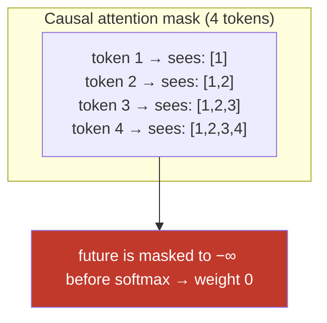
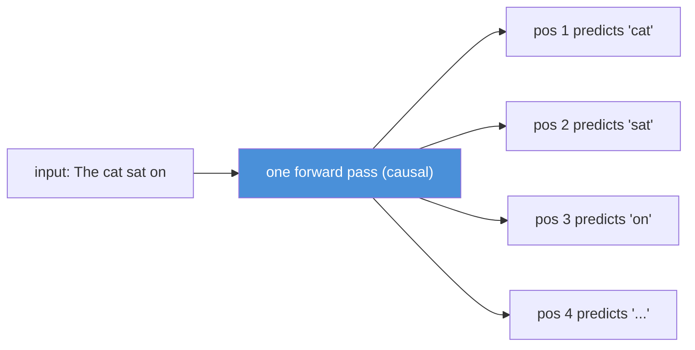
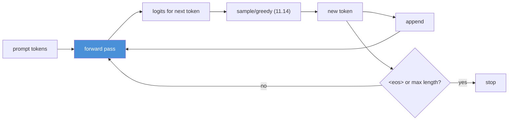
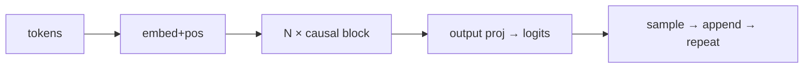

# 11.6 · Decoder-Only Transformers — Causal Masking and Why GPT Won

[⬅ 11.5 Transformer Architecture](11.5-transformer-architecture.md) · [🏠 Module 11](../README.md) · [➡ 11.7 Encoder / Decoder Types](11.7-encoder-decoder-types.md)

> **The lesson in one line:** A decoder-only Transformer is the block from [11.5](11.5-transformer-architecture.md) with one addition — a causal mask so each token sees only the past — and that single constraint is what makes it a generator, which is why every modern chat LLM is decoder-only.

---

## 🎯 Learning objectives

- Understand **causal masking** and how it enforces the autoregressive property.
- Understand **autoregressive generation** as a loop over the decoder-only model.
- Understand why the field converged on **decoder-only** architectures for general-purpose LLMs.

## ✅ Prerequisites

- [11.5 the Transformer block](11.5-transformer-architecture.md), [11.4 attention & the mask](11.4-attention.md), [11.1 the LM objective](11.1-what-is-a-language-model.md).

---

## 🧠 Mental model

> [!IMPORTANT]
> **A decoder-only model is the Transformer stack from [11.5](11.5-transformer-architecture.md), plus a rule: when computing attention, a token may look at itself and every token before it — never after.** That "never after" is the **causal mask**, and it is the entire difference between an understanding model (BERT) and a generator (GPT). The mask makes the model predict each position from only its past, which is exactly the [next-token objective of 11.1](11.1-what-is-a-language-model.md) — so a decoder-only model *is* an autoregressive language model.



---

## Causal masking — the one addition

Recall attention scores are an $(n, n)$ matrix ([11.4](11.4-attention.md)). The causal mask sets all entries **above the diagonal** (future positions) to $-\infty$ *before* softmax, so their weights become exactly 0. Each token's output is a blend of only itself and earlier tokens.

```python
import torch
# Lower-triangular mask: position i may attend to positions 0..i
mask = torch.tril(torch.ones(n, n)).bool()          # True = allowed
scores = scores.masked_fill(~mask, float('-inf'))    # block the future
weights = scores.softmax(dim=-1)                      # future → 0
```

> [!IMPORTANT]
> **Why the mask matters for training: it lets you train on all positions at once.** With the causal mask, a single forward pass over a sequence computes the next-token prediction for *every* position simultaneously — position 1 predicts token 2, position 2 predicts token 3, etc. — because each is correctly prevented from seeing its own answer. This is [teacher forcing (10.8)](../../10-NLP/weeks/10.8-seq2seq.md) made parallel: one pass, n training signals, no leakage. **The mask is what makes Transformer LM training so efficient** — you get a loss at every token from one forward pass, unlike an RNN's sequential steps.



---

## Autoregressive generation — the loop

At inference there's no ground truth, so the model runs the [11.1](11.1-what-is-a-language-model.md) loop:



Each step: run the model, get a distribution over the next token, pick one ([decoding, 11.14](11.14-inference-decoding.md)), append, repeat until `<eos>` ([11.2](11.2-tokenization.md)) or a length cap. **Generation is inherently sequential** — token *t* needs token *t−1* — which is why it's the expensive part of serving and why the [KV cache (11.15)](11.15-kv-cache.md) exists (naively, each new token re-runs attention over the whole prefix).

> [!NOTE]
> **The model decides when to stop by emitting `<eos>`.** Instruction-tuned models learn, from their fine-tuning data, to produce the end-of-sequence token when a response is complete — that's how a chatbot "knows" to stop talking. Length caps are a safety net; the natural stop is `<eos>` ([11.11](11.11-fine-tuning.md), [11.14](11.14-inference-decoding.md)).

---

## Why decoder-only won

By 2020 the field had three architecture families ([11.7](11.7-encoder-decoder-types.md)): encoder-only (BERT), encoder-decoder (T5), and decoder-only (GPT). General-purpose LLMs converged on **decoder-only**. Why?

| Reason | Explanation |
|---|---|
| **Generation is the general interface** | Any task can be framed as text-in, text-out ("Summarize: …", "Translate: …", "Q: … A:"). A generator does them all; an encoder can't generate. |
| **Simplicity + scale** | One stack, one objective, one mask — easy to scale to trillions of tokens. No separate encoder/decoder to balance. |
| **In-context learning** | Decoder-only models trained on next-token prediction exhibit strong few-shot learning ([11.1](11.1-what-is-a-language-model.md)) — prompt them with examples and they continue the pattern. |
| **Efficient training** | The causal mask gives a loss at every token from one pass (above) — maximal signal per FLOP. |

> [!IMPORTANT]
> **The decisive insight: "predict the next token" is a *universal* task.** Translation, summarization, question-answering, coding, and reasoning can *all* be expressed as "continue this text." A single decoder-only model trained on enough text learns them jointly, and you select the task at *inference* time with a prompt — no task-specific architecture. This is the realization that collapsed NLP's zoo of specialized models into one general model, and it's the foundation of the entire [prompt-engineering discipline (Module 12)](../../12-Prompt-Engineering/README.md). Encoder-only models are still better for pure *understanding* tasks ([11.7](11.7-encoder-decoder-types.md)), but *generation generalizes*, and generation is decoder-only.

---

## 🏭 Production examples

| Model | Type |
|---|---|
| **GPT-4, Claude, Llama, Mistral, Gemini** | decoder-only |
| **Code models (Copilot, CodeLlama)** | decoder-only |
| **BERT, RoBERTa (classification/NER)** | encoder-only ([11.7](11.7-encoder-decoder-types.md)) |
| **T5, BART (translation/summarization)** | encoder-decoder ([11.7](11.7-encoder-decoder-types.md)) |

## ⚡ Performance & GPU considerations

- **Training is parallel** (causal mask → all positions at once); **generation is sequential** (one token per forward pass) — the fundamental asymmetry ([10.8](../../10-NLP/weeks/10.8-seq2seq.md)).
- **Naive generation is O(n²) per token** (re-attends the whole prefix) → the [KV cache (11.15)](11.15-kv-cache.md) makes it O(n) per token.
- **The causal mask is free** — it's applied inside the attention kernel (FlashAttention has a causal variant, [11.4](11.4-attention.md)).

## 🔒 Security considerations

> [!CAUTION]
> - **The prompt and the generated text share one stream** — the model can't architecturally separate "system instructions" from "user input" from "its own prior output," which is the structural root of **prompt injection** ([11.18](11.18-safety.md)).
> - **Generation is unbounded by default** — always enforce `<eos>` handling *and* a max-length cap to prevent runaway generation (cost/DoS).
> - **Autoregressive drift** — an early bad/unsafe token conditions all subsequent tokens ([exposure bias, 10.8](../../10-NLP/weeks/10.8-seq2seq.md)); one jailbroken token can steer the whole completion.

## 🚫 Common mistakes

| Mistake | Consequence |
|---|---|
| **Forgetting the causal mask** | the model sees the future → invalid LM, leaks the answer |
| **Using a masked (BERT) model to generate** | it can't — no notion of "next" ([11.1](11.1-what-is-a-language-model.md)) |
| **No `<eos>` handling** | generation never stops |
| **Naive generation without a KV cache** | O(n²) per token → painfully slow ([11.15](11.15-kv-cache.md)) |
| **Assuming generation can be parallelized** | it's autoregressive — sequential by nature |

## ✅ Best practices

- **Apply the causal mask** in every decoder attention layer.
- **Handle `<eos>` and cap length** for controlled, safe generation.
- **Use a KV cache** for efficient generation ([11.15](11.15-kv-cache.md)).
- **Frame tasks as text-in/text-out** to exploit the decoder-only generality.
- **For pure understanding tasks, consider an encoder** ([11.7](11.7-encoder-decoder-types.md)) — decoder-only isn't always optimal.

## 🏋️ Exercises

1. **Causal mask by hand.** Build a 5×5 lower-triangular mask; apply it to a random score matrix; verify each row's future weights are 0 after softmax.
2. **Parallel training signal.** Take a length-6 sequence; show how one masked forward pass yields 5 next-token predictions (and losses) simultaneously.
3. **Generation loop.** Implement greedy autoregressive generation with a tiny model: forward → argmax → append → repeat until `<eos>`. Cap the length.
4. **Mask ablation.** Remove the causal mask during training and show the loss collapses to ~0 (the model trivially copies the answer it can now see) — the leakage the mask prevents.
5. **BERT can't generate.** Explain, with the attention pattern, why a bidirectional model has no natural way to generate left-to-right.

## 🛠️ Mini project — "A Decoder-Only Generator"

**Goal:** turn the [11.5 block](11.5-transformer-architecture.md) into a causal, generating model — the direct precursor to [11.8](11.8-build-mini-transformer.md).

**Requirements**
- Stack N Pre-LN blocks with **causal masking** in every attention layer.
- A generation loop with greedy + sampling ([11.14](11.14-inference-decoding.md) preview) and `<eos>`/length stopping.
- Demonstrate **parallel training** (loss at every position from one pass) vs **sequential generation**.

**Folder structure**
```
decoder-only/
├── model.py           # embed + N causal blocks + output projection
├── generate.py        # autoregressive loop, <eos>, max_len
├── train.py           # parallel next-token loss (09.10 loop)
└── README.md
```

**Architecture diagram**


**Testing:** assert causal mask blocks the future; assert one forward pass yields n−1 losses; assert generation halts on `<eos>`.
**Evaluation:** train on a toy corpus; check it generates coherent continuations.
**Future improvements:** this *is* the core of [11.8](11.8-build-mini-transformer.md) — add tokenizer ([11.2](11.2-tokenization.md)), RoPE ([11.3](11.3-embeddings-positional.md)), and a KV cache ([11.15](11.15-kv-cache.md)).

## 📄 Cheat sheet

| Concept | One line |
|---|---|
| **Decoder-only** | the [11.5](11.5-transformer-architecture.md) stack + a **causal mask** = GPT |
| **⭐ Causal mask** | future positions → −∞ before softmax; each token sees only itself + the past |
| **Parallel training** | causal mask → loss at **every** position from one forward pass |
| **Autoregressive generation** | forward → sample → append → repeat until `<eos>` (sequential) |
| **`<eos>`** | how the model signals it's done |
| **⭐ Why decoder-only won** | generation is a **universal** interface; any task = text-in/text-out |
| **Cost** | training parallel, **generation sequential** → KV cache ([11.15](11.15-kv-cache.md)) |

## 🎴 Flashcards

- **⭐ What makes a Transformer "decoder-only"?** → A causal mask: each token attends only to itself and earlier tokens (never the future).
- **How is the causal mask implemented?** → Set future positions' attention scores to −∞ before softmax (lower-triangular allowed mask).
- **⭐ Why does the causal mask make training efficient?** → One forward pass yields a next-token loss at every position simultaneously, with no answer leakage.
- **How does a decoder-only model generate?** → Autoregressively: forward → pick next token → append → repeat until `<eos>` or max length.
- **How does the model know when to stop?** → It emits the `<eos>` token (learned during instruction tuning).
- **⭐ Why did general-purpose LLMs converge on decoder-only?** → Generation is a universal interface — every task is text-in/text-out — plus simple scaling and strong in-context learning.
- **Why can't a masked (BERT) model generate?** → It's bidirectional with no notion of "next"; generation requires predicting from only the past.

## 💬 Interview questions

1. What is causal masking and how does it turn a Transformer into a language model?
2. Why does the causal mask make Transformer LM training efficient?
3. Walk through autoregressive generation. Why is it sequential and expensive?
4. Why did the field converge on decoder-only architectures for general LLMs?
5. Why can't BERT generate text? What can it do better than GPT?
6. How does a chat model know when to stop generating?

## 📝 Summary

- A **decoder-only Transformer** is the [11.5](11.5-transformer-architecture.md) stack plus a **causal mask** that lets each token see only itself and the past — making it an autoregressive language model.
- The causal mask enables **parallel training** (a next-token loss at every position from one forward pass) while **generation remains sequential** (one token per pass).
- The model **generates by looping** — forward, sample, append — stopping at `<eos>`.
- **Decoder-only won** because generation is a **universal interface**: any task is text-in/text-out, so one model with the right prompt does everything — the foundation of prompt engineering ([Module 12](../../12-Prompt-Engineering/README.md)).

## 📚 References

1. **Radford et al. (2018/2019) — _GPT / GPT-2_.** ⭐ Decoder-only causal LM.
2. **Brown et al. (2020) — _GPT-3_.** ⭐⭐ Why decoder-only + scale = general capability.
3. **Raffel et al. (2020) — _T5_** & **Wang et al. (2022) — _What Language Model Architecture… for Zero-Shot Generalization_.** Architecture comparison.
4. **[10.8 Seq2Seq](../../10-NLP/weeks/10.8-seq2seq.md).** Teacher forcing and autoregressive decoding.

---

## 🧭 Navigation

| Direction | Link |
|---|---|
| ⬅ Previous | [11.5 · Transformer Architecture](11.5-transformer-architecture.md) |
| ➡ Next | [11.7 · Encoder / Decoder / Encoder-Decoder](11.7-encoder-decoder-types.md) |
| 🏠 Module | [Module 11](../README.md) |
| 📖 Lessons | [Lesson index](README.md) |
