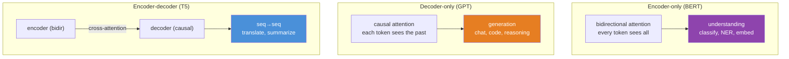
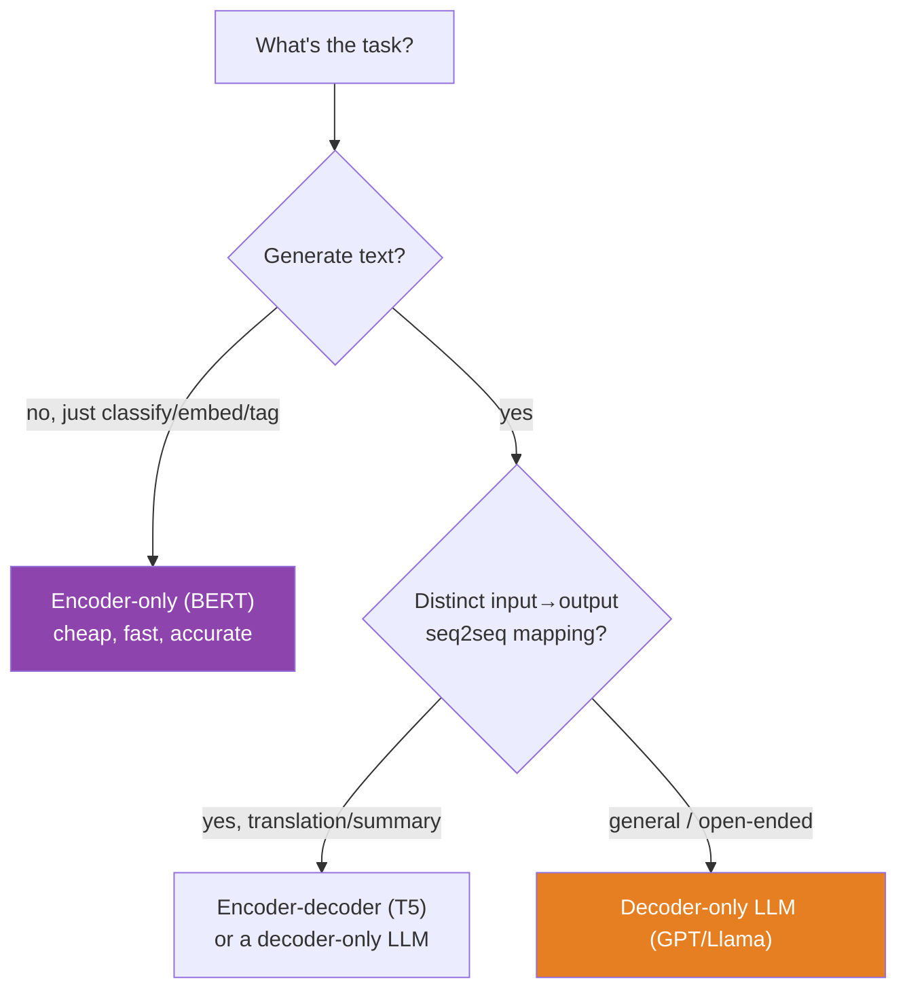
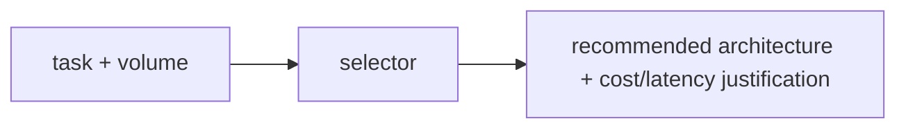

# 11.7 · Encoder-Only, Decoder-Only, Encoder-Decoder — Choosing the Architecture

[⬅ 11.6 Decoder-Only Transformers](11.6-decoder-only.md) · [🏠 Module 11](../README.md) · [➡ 11.8 Build a Mini Transformer](11.8-build-mini-transformer.md)

> **The lesson in one line:** The same Transformer block assembles into three families — encoder-only (BERT, understands), decoder-only (GPT, generates), and encoder-decoder (T5, transforms) — and the right choice follows directly from whether your task is understanding, generation, or sequence-to-sequence.

---

## 🎯 Learning objectives

- Distinguish the three architectures by their **attention pattern** and what each is for.
- Map each to its canonical models and best-fit tasks.
- Choose the right family for a given problem — and know why decoder-only dominates while the others persist.

## ✅ Prerequisites

- [11.6 decoder-only & causal masking](11.6-decoder-only.md), [11.5 the block](11.5-transformer-architecture.md), [10.6 the four NLP task shapes](../../10-NLP/weeks/10.6-nlp-tasks.md).

---

## 🧠 Mental model

> [!IMPORTANT]
> **All three families are built from the same block ([11.5](11.5-transformer-architecture.md)); they differ only in the attention mask and how many stacks they use.** Encoder-only: **bidirectional** attention (see everything), no generation — for understanding. Decoder-only: **causal** attention (see the past), generates — for generation. Encoder-decoder: an encoder (bidirectional) plus a decoder (causal) linked by **cross-attention** — for turning one sequence into another. The choice is not about a fancier model; it's about the attention pattern your task needs.



---

## The three families

### Encoder-only (BERT, RoBERTa)

**Bidirectional** attention — every token attends to every other token, both directions. Trained with the **masked LM** objective ([11.1](11.1-what-is-a-language-model.md)): predict randomly masked tokens using both-sided context. It produces rich **contextual embeddings** ([10.7](../../10-NLP/weeks/10.7-attention.md)) of the input but **cannot generate** — there's no "next token" when you can already see everything.

- **Best at:** understanding tasks — classification, NER, sentence embeddings, retrieval ([10.6 shapes 1, 2, 4](../../10-NLP/weeks/10.6-nlp-tasks.md)).
- **Why still used:** for pure classification/embedding, a bidirectional encoder is often more accurate and far cheaper than a giant decoder — you don't need a 70B generator to detect spam.

### Decoder-only (GPT, Llama, Claude, Mistral)

**Causal** attention — each token sees only the past ([11.6](11.6-decoder-only.md)). Trained on next-token prediction; **generates** by autoregression. The general-purpose LLM.

- **Best at:** generation and *anything framed as generation* — chat, code, reasoning, and (via prompting) classification and extraction too.
- **Why dominant:** generation is a universal interface ([11.6](11.6-decoder-only.md)); one model does all tasks with the right prompt.

### Encoder-decoder (T5, BART, original Transformer)

Two stacks: a **bidirectional encoder** reads the input into representations, and a **causal decoder** generates the output, attending to the encoder's output via **cross-attention** ([10.8](../../10-NLP/weeks/10.8-seq2seq.md)). The classic seq2seq shape.

- **Best at:** sequence-to-sequence transformation where input and output are distinct — translation, summarization, and "text-to-text" framing.
- **Why still used:** the split lets the encoder fully digest the input bidirectionally before generation, which can help for tasks with a clear input→output mapping.

---

## The comparison

| | **Encoder-only** | **Decoder-only** | **Encoder-decoder** |
|---|---|---|---|
| Attention | bidirectional | causal | encoder bidir + decoder causal + cross-attn |
| Objective | masked LM | next-token | span corruption / seq2seq |
| Can generate? | ❌ | ✅ | ✅ |
| Sees full input at once | ✅ | only the past | ✅ (in encoder) |
| Canonical models | BERT, RoBERTa | GPT, Llama, Claude | T5, BART |
| Best for | understanding | generation (general) | seq→seq |
| Task shapes ([10.6](../../10-NLP/weeks/10.6-nlp-tasks.md)) | 1, 2, 4 | 3 (and all via prompting) | 3 |

> [!IMPORTANT]
> **The trend is decoder-only for general models, encoders for specialized understanding.** Frontier general-purpose LLMs are all decoder-only because generation subsumes every task. But **encoder-only models haven't disappeared** — for high-volume, latency-sensitive *understanding* (classification, retrieval embeddings for [RAG, Module 13](../../13-RAG/README.md)), a small BERT-family bi-encoder ([10.6](../../10-NLP/weeks/10.6-nlp-tasks.md)) is cheaper, faster, and often more accurate than prompting a huge decoder. **Encoder-decoders have narrowed** to classic seq2seq (translation, some summarization). The senior instinct: *don't reach for a giant generative LLM when a small encoder answers the question.*

---

## Choosing the architecture



> [!TIP]
> **In practice, a modern decoder-only LLM can do all three jobs** — classify, summarize, translate — via prompting. So the real decision is **economic**: if you're doing millions of classifications, a fine-tuned encoder is orders of magnitude cheaper than API calls to a frontier decoder. Use the biggest hammer only when the task genuinely needs generation or reasoning ([11.19](11.19-apis-vs-open-models.md), [11.20](11.20-production-architecture.md)).

---

## 🏭 Production examples

| Task | Best architecture | Why |
|---|---|---|
| **Spam / sentiment / intent** | encoder-only (BERT) | cheap, fast, no generation needed |
| **RAG retrieval embeddings** | encoder-only (bi-encoder) | pre-compute doc vectors ([10.6](../../10-NLP/weeks/10.6-nlp-tasks.md), [Module 13](../../13-RAG/README.md)) |
| **Chatbot / assistant** | decoder-only | open-ended generation |
| **Code completion** | decoder-only | generation |
| **Translation** | encoder-decoder or decoder-only | seq2seq |
| **Summarization** | either | T5-style or prompt a decoder |

## ⚡ Performance & GPU considerations

- **Encoder-only is a single forward pass** (no autoregression) → far cheaper per input than generation.
- **Encoder-decoder pays for two stacks** but the encoder runs once (not per output token).
- **Decoder-only generation is sequential and dominates cost** ([11.15](11.15-kv-cache.md)) — the reason encoders remain economical for understanding.

## 🔒 Security considerations

> [!CAUTION]
> - **Only generative (decoder) models can produce harmful *text***, so they carry the generation-specific risks — jailbreaks, toxic output, injection ([11.18](11.18-safety.md)). An encoder that outputs a class label has a smaller harm surface.
> - **Encoder embeddings still leak** ([10.4](../../10-NLP/weeks/10.4-word-embeddings.md), [10.14](../../10-NLP/weeks/10.14-ethics-safety.md)) — a bi-encoder for retrieval memorizes and can expose training content.
> - **Right-sizing is a safety lever** — using a constrained encoder for classification instead of a general decoder reduces the attack surface.

## 🚫 Common mistakes

| Mistake | Consequence |
|---|---|
| **Using a decoder LLM for high-volume classification** | 10–100× the cost of a fine-tuned encoder |
| **Trying to generate with BERT** | it can't ([11.1](11.1-what-is-a-language-model.md)) |
| **Assuming encoder-decoder is obsolete** | still strong for translation/seq2seq |
| **Ignoring the economic dimension** | picking the biggest model when a small encoder suffices |
| **Confusing "bidirectional" with "better"** | bidirectional helps understanding, forbids generation |

## ✅ Best practices

- **Match architecture to task:** understanding → encoder; generation → decoder; explicit seq2seq → encoder-decoder.
- **Right-size for cost:** a small fine-tuned encoder beats a frontier decoder for classification/retrieval at scale.
- **Default to decoder-only for general/open-ended** work; use prompting to cover many tasks with one model.
- **Use encoder bi-encoders for RAG retrieval** ([10.6](../../10-NLP/weeks/10.6-nlp-tasks.md), [Module 13](../../13-RAG/README.md)).

## 🏋️ Exercises

1. **Classify three tasks.** For sentiment analysis, machine translation, and open-domain chat, pick the architecture and justify it by attention pattern and cost.
2. **Cost comparison.** Estimate the cost of classifying 1M documents with (a) a fine-tuned DistilBERT and (b) a frontier decoder API. Quantify the gap.
3. **Attention patterns.** Draw the attention mask for each of the three families on a 4-token sequence.
4. **Same task, three ways.** Summarize a paragraph with a T5 (encoder-decoder) and by prompting a decoder LLM. Compare quality and cost.
5. **Why not BERT for chat?** Explain, using the masked-LM objective, why an encoder can't power a chatbot.

## 🛠️ Mini project — "Architecture Selector"

**Goal:** a decision tool + benchmark that, given a task and volume, recommends and *justifies* an architecture with real cost/latency numbers.

**Requirements**
- Implement small versions or wrappers of each: an encoder classifier (DistilBERT), a decoder generator (small GPT), and an encoder-decoder (T5-small).
- Benchmark **cost, latency, and accuracy** on a classification task and a generation task.
- A **selector** that recommends the architecture from task type + volume, with the numbers to back it.

**Folder structure**
```
architecture-selector/
├── encoder_clf.py     # BERT-family classification
├── decoder_gen.py     # small GPT generation
├── enc_dec.py         # T5 seq2seq
├── benchmark.py       # cost/latency/accuracy per family
├── selector.py        # task+volume → recommendation
└── README.md
```

**Architecture diagram**


**Evaluation:** the benchmark table (cost/latency/accuracy × architecture × task) is the deliverable.
**Testing:** assert the selector recommends an encoder for high-volume classification and a decoder for open-ended generation.
**Future improvements:** add a fine-tuned encoder vs prompted decoder cost curve as volume grows — the crossover point is the lesson.

## 📄 Cheat sheet

| Family | Attention | Generates? | Best for | Models |
|---|---|---|---|---|
| **Encoder-only** | bidirectional | ❌ | understanding (classify, NER, embed) | BERT, RoBERTa |
| **⭐ Decoder-only** | causal | ✅ | generation (general) | GPT, Llama, Claude |
| **Encoder-decoder** | bidir + causal + cross-attn | ✅ | seq→seq (translate, summarize) | T5, BART |

**⭐ Rule:** understanding → encoder (cheap) · generation → decoder (general) · seq2seq → encoder-decoder. A big decoder can do all three via prompting, but a small encoder is far cheaper for pure understanding at scale.

## 🎴 Flashcards

- **⭐ What are the three Transformer architecture families?** → Encoder-only (bidirectional, understands), decoder-only (causal, generates), encoder-decoder (both + cross-attention, seq2seq).
- **What distinguishes them mechanically?** → Their attention mask (bidirectional vs causal) and number of stacks — same block otherwise.
- **What is each best for?** → Encoder: understanding (classify/NER/embed); decoder: generation; encoder-decoder: sequence-to-sequence.
- **⭐ Why do general LLMs use decoder-only?** → Generation is a universal interface; one model + prompt does every task.
- **⭐ Why haven't encoders disappeared?** → For high-volume understanding (classification, RAG embeddings), a small bi-encoder is far cheaper, faster, and often more accurate than a giant decoder.
- **What links the encoder and decoder in a T5?** → Cross-attention: the decoder attends to the encoder's output.
- **Why can't an encoder-only model generate?** → Bidirectional attention has no notion of "next token."

## 💬 Interview questions

1. Compare the three Transformer architecture families by attention pattern and use case.
2. Why do general-purpose LLMs use decoder-only architectures?
3. When would you choose an encoder-only model over a decoder LLM?
4. What role does cross-attention play in an encoder-decoder model?
5. Give a task-and-volume scenario where a small encoder beats a frontier decoder, and explain the economics.

## 📝 Summary

- The three families are **the same block with different attention masks**: **encoder-only** (bidirectional, understands, can't generate), **decoder-only** (causal, generates), **encoder-decoder** (both + cross-attention, seq2seq).
- **Decoder-only dominates** general LLMs because generation is a universal interface — one model, any task, via prompting.
- **Encoder-only models persist** for high-volume understanding (classification, [RAG](../../13-RAG/README.md) embeddings) where they're cheaper and often more accurate.
- **Encoder-decoders** remain strong for explicit **sequence-to-sequence** tasks.
- Architecture choice is as much **economic** (cost/latency at volume) as capability — don't deploy a frontier generator where a small encoder answers the question.

## 📚 References

1. **Devlin et al. (2019) — _BERT_.** ⭐ Encoder-only, masked LM.
2. **Radford et al. (2019) / Brown et al. (2020) — _GPT-2 / GPT-3_.** ⭐ Decoder-only.
3. **Raffel et al. (2020) — _T5_** & **Lewis et al. (2020) — _BART_.** ⭐ Encoder-decoder.
4. **Wang et al. (2022) — _What Language Model Architecture and Pretraining Objective Work Best for Zero-Shot Generalization?_** The systematic comparison.
5. **[10.6 NLP Tasks](../../10-NLP/weeks/10.6-nlp-tasks.md).** The task shapes that map to these architectures.

---

## 🧭 Navigation

| Direction | Link |
|---|---|
| ⬅ Previous | [11.6 · Decoder-Only Transformers](11.6-decoder-only.md) |
| ➡ Next | [11.8 · Build a Mini Transformer](11.8-build-mini-transformer.md) |
| 🏠 Module | [Module 11](../README.md) |
| 📖 Lessons | [Lesson index](README.md) |
