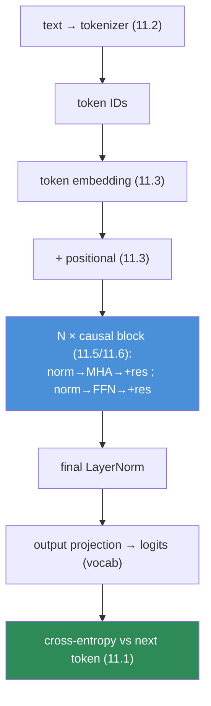

# 11.8 · Build a Mini Transformer — A Working GPT From Scratch ⭐⭐

[⬅ 11.7 Encoder / Decoder Types](11.7-encoder-decoder-types.md) · [🏠 Module 11](../README.md) · [➡ 11.9 Pretraining](11.9-pretraining.md)

> **The lesson in one line:** Assemble everything from 11.2–11.7 into a small, complete, trainable GPT in PyTorch — and once it generates text, the LLM is no longer a black box; it's ~200 lines of code you wrote.

---

## 🎯 Learning objectives

- Assemble a **complete decoder-only Transformer** in PyTorch: embeddings, positional encoding, causal multi-head attention, FFN, LayerNorm, residuals, output projection.
- Train it on a small dataset with the **[09.10 training loop](../../09-Deep-Learning/weeks/09.10-training-loop.md)** and watch loss/perplexity fall.
- **Generate text** from your own model.
- Understand every line — this is the payoff of the whole architecture arc.

## ✅ Prerequisites

- [11.2](11.2-tokenization.md)–[11.7](11.7-encoder-decoder-types.md) — every component.
- [09.8 nn.Module](../../09-Deep-Learning/weeks/09.8-building-models.md), [09.10 training loop](../../09-Deep-Learning/weeks/09.10-training-loop.md), [09.15 debugging](../../09-Deep-Learning/weeks/09.15-debugging.md).

---

## 🧠 Mental model

> [!IMPORTANT]
> **This lesson has no new ideas — it is pure assembly.** Tokenizer ([11.2](11.2-tokenization.md)) → token + positional embeddings ([11.3](11.3-embeddings-positional.md)) → N causal Transformer blocks ([11.4](11.4-attention.md)–[11.6](11.6-decoder-only.md)) → output projection → next-token loss ([11.1](11.1-what-is-a-language-model.md)) → the [09.10 loop](../../09-Deep-Learning/weeks/09.10-training-loop.md). When it generates its first coherent text, you will have proven to yourself that GPT is not magic — it's the parts you built, stacked and trained. This is the [10.7 `torch.allclose` moment](../../10-NLP/weeks/10.7-attention.md), scaled up to a whole model.

This is Karpathy's **nanoGPT / makemore** in spirit: the smallest complete GPT that actually works. We build a **character-level** model on a small text so you can train it in minutes on a laptop.



---

## 💻 The complete model (PyTorch)

Every piece maps to a prior lesson. Read it as a table of contents for the module.

```python
import torch, torch.nn as nn, torch.nn.functional as F

class Block(nn.Module):                              # 11.5 — one Transformer block
    def __init__(self, d_model, n_heads, block_size, dropout=0.1):
        super().__init__()
        self.ln1 = nn.LayerNorm(d_model)             # 11.5 Pre-LN
        self.attn = CausalSelfAttention(d_model, n_heads, block_size, dropout)  # 11.4/11.6
        self.ln2 = nn.LayerNorm(d_model)
        self.ffn = nn.Sequential(                    # 11.5 FFN, 4× hidden
            nn.Linear(d_model, 4 * d_model), nn.GELU(),
            nn.Linear(4 * d_model, d_model), nn.Dropout(dropout),
        )
    def forward(self, x):
        x = x + self.attn(self.ln1(x))               # 11.5 residual, Pre-LN
        x = x + self.ffn(self.ln2(x))                # 11.5 residual
        return x

class CausalSelfAttention(nn.Module):                # 11.4 + 11.6 causal mask
    def __init__(self, d_model, n_heads, block_size, dropout):
        super().__init__()
        self.n_heads, self.d_k = n_heads, d_model // n_heads
        self.qkv = nn.Linear(d_model, 3 * d_model)
        self.proj = nn.Linear(d_model, d_model)
        self.drop = nn.Dropout(dropout)
        # 11.6 causal mask: lower-triangular, registered as a buffer (not a parameter)
        self.register_buffer("mask", torch.tril(torch.ones(block_size, block_size)))
    def forward(self, x):
        B, T, D = x.shape
        q, k, v = self.qkv(x).chunk(3, dim=-1)
        q, k, v = [t.view(B, T, self.n_heads, self.d_k).transpose(1, 2) for t in (q, k, v)]
        att = (q @ k.transpose(-2, -1)) / self.d_k**0.5           # 11.4 QKᵀ/√d
        att = att.masked_fill(self.mask[:T, :T] == 0, float('-inf'))  # 11.6 block the future
        att = self.drop(att.softmax(-1))
        out = (att @ v).transpose(1, 2).reshape(B, T, D)          # 11.4 ×V, concat heads
        return self.proj(out)

class MiniGPT(nn.Module):                            # the whole model
    def __init__(self, vocab_size, d_model=128, n_heads=4, n_layers=4, block_size=128):
        super().__init__()
        self.block_size = block_size
        self.tok_emb = nn.Embedding(vocab_size, d_model)          # 11.3 token embeddings
        self.pos_emb = nn.Embedding(block_size, d_model)          # 11.3 learned positional
        self.blocks = nn.ModuleList([Block(d_model, n_heads, block_size)  # 11.5 — ModuleList! (09.8)
                                     for _ in range(n_layers)])
        self.ln_f = nn.LayerNorm(d_model)
        self.head = nn.Linear(d_model, vocab_size, bias=False)    # 11.3 output projection
        self.head.weight = self.tok_emb.weight                    # 11.3 weight tying

    def forward(self, idx, targets=None):
        B, T = idx.shape
        pos = torch.arange(T, device=idx.device)
        x = self.tok_emb(idx) + self.pos_emb(pos)                 # 11.3 embed + position
        for block in self.blocks:                                 # 11.5 N blocks
            x = block(x)
        logits = self.head(self.ln_f(x))                          # → vocab logits
        loss = None
        if targets is not None:                                   # 11.1 next-token loss
            loss = F.cross_entropy(logits.view(-1, logits.size(-1)),
                                   targets.view(-1))               # 09.3 CE on logits
        return logits, loss
```

> [!IMPORTANT]
> **Annotate this in your head with the lesson each line came from.** `nn.ModuleList` (not a plain list — [09.8](../../09-Deep-Learning/weeks/09.8-building-models.md)); the causal mask as a `register_buffer` ([11.6](11.6-decoder-only.md)); weight tying ([11.3](11.3-embeddings-positional.md)); `cross_entropy` on **logits** ([09.3](../../09-Deep-Learning/weeks/09.3-math-of-neural-networks.md), never pre-softmax). Nothing here is new — it's the module, made executable.

---

## Training — the loop you already own

```python
model = MiniGPT(vocab_size).to(device)
opt = torch.optim.AdamW(model.parameters(), lr=3e-4)             # 09.5 AdamW

for step in range(max_steps):                                    # 09.10 loop, verbatim
    xb, yb = get_batch("train")                                  # (B, T) contiguous chunks
    xb, yb = xb.to(device), yb.to(device)                        # 09.6 every batch
    _, loss = model(xb, yb)
    opt.zero_grad(); loss.backward()                             # 09.4 backprop
    torch.nn.utils.clip_grad_norm_(model.parameters(), 1.0)      # 09.14 stability
    opt.step()
    if step % 500 == 0:
        print(f"step {step}: loss {loss.item():.3f}  ppl {torch.exp(loss).item():.1f}")  # 10.9 perplexity
```

> [!TIP]
> **Data prep is trivially the LM objective made concrete.** Take a long token stream; a training example is a chunk of `block_size` tokens (`x`) and the *same chunk shifted by one* (`y`). Every position's target is the next token — the [11.1 objective](11.1-what-is-a-language-model.md), and the [11.6 causal mask](11.6-decoder-only.md) ensures no position sees its answer, so one forward pass produces `block_size` training signals.

```python
def get_batch(split, batch_size=32, block_size=128):
    data = train_data if split == "train" else val_data          # a long 1-D tensor of token IDs
    ix = torch.randint(len(data) - block_size, (batch_size,))
    x = torch.stack([data[i:i+block_size] for i in ix])
    y = torch.stack([data[i+1:i+block_size+1] for i in ix])       # ⭐ y = x shifted by 1
    return x, y
```

---

## Generation — sampling from your model

```python
@torch.no_grad()                                                 # 09.7 inference
def generate(model, idx, max_new_tokens, temperature=1.0, top_k=None):
    model.eval()                                                 # 09.10 eval mode
    for _ in range(max_new_tokens):
        idx_cond = idx[:, -model.block_size:]                    # crop to context window (11.2)
        logits, _ = model(idx_cond)
        logits = logits[:, -1, :] / temperature                 # 11.14 last position, temperature
        if top_k is not None:                                   # 11.14 top-k
            v, _ = torch.topk(logits, top_k)
            logits[logits < v[:, [-1]]] = float('-inf')
        probs = logits.softmax(-1)
        next_id = torch.multinomial(probs, 1)                   # 11.14 sample
        idx = torch.cat([idx, next_id], dim=1)                  # 11.6 append, repeat
    return idx
```

Run it and you'll watch your model — trained for a few minutes on a laptop — produce text that looks like the training corpus. On Shakespeare it generates Shakespeare-ish dialogue; on Python code, plausible-looking code. **That is a working GPT, and you built every line of it.**

> [!IMPORTANT]
> **This is the module's `torch.allclose` moment.** In [10.7](../../10-NLP/weeks/10.7-attention.md) you proved your hand-built attention equaled PyTorch's. Here you prove the whole architecture: a stack of your blocks, trained on next-token prediction, *generates language*. Every mysterious LLM behavior — coherence, style imitation, in-context patterns — is visible in miniature in this ~200-line model. Scale changes the *magnitude* of capability, not the *mechanism*. **You now understand what a 175B model is: this, wider and deeper, trained on more.**

---

## Debugging your mini-GPT

The [09.15 discipline](../../09-Deep-Learning/weeks/09.15-debugging.md), specialized:

| Check | Expected | If wrong |
|---|---|---|
| **Initial loss** | ≈ ln(vocab_size) ([09.3](../../09-Deep-Learning/weeks/09.3-math-of-neural-networks.md), [10.9](../../10-NLP/weeks/10.9-evaluation.md)) | bad init / wrong loss / label shift |
| **⭐ Overfit one batch** | loss → ~0 ([09.15](../../09-Deep-Learning/weeks/09.15-debugging.md)) | model/loop bug (mask? shapes? tying?) |
| **Causal mask works** | can't overfit if mask removed reveals leakage | mask misapplied |
| **Loss decreasing, ppl falling** | steady decline | LR / data / clipping |

> [!TIP]
> **Overfit one batch first** ([09.15](../../09-Deep-Learning/weeks/09.15-debugging.md)) — a correct mini-GPT memorizes a single batch to near-zero loss in seconds. If it can't, the bug is in the model or loop (a mask error, a shape mismatch, forgotten weight tying), not the data or hyperparameters. This one test catches nearly every mini-Transformer bug.

---

## ⚡ Performance & GPU considerations

- **Use `F.scaled_dot_product_attention`** for the attention (auto-FlashAttention, [11.4](11.4-attention.md)) once your hand-rolled version is verified.
- **Mixed precision** (`autocast` bf16, [09.14](../../09-Deep-Learning/weeks/09.14-performance.md)) roughly doubles training speed.
- **`block_size` drives cost** — attention is O(T²); start small (128) and grow.
- **This model has no KV cache** — generation re-runs the whole context each token (fine for a toy; [11.15](11.15-kv-cache.md) fixes it).

## 🔒 Security considerations

> [!CAUTION]
> - **Your model memorizes its training text** ([10.14](../../10-NLP/weeks/10.14-ethics-safety.md)) — a char-GPT on a small corpus will regurgitate it verbatim. Don't train toy models on sensitive data and share weights.
> - **Generation is unbounded** — always cap `max_new_tokens` ([11.6](11.6-decoder-only.md)).
> - **This is a real (tiny) LLM** — the same risks apply in miniature, which is exactly why building it clarifies the risks of large ones ([11.18](11.18-safety.md)).

## 🚫 Common mistakes

| Mistake | Consequence |
|---|---|
| **Layers in a plain list** | not registered → not trained ([09.8](../../09-Deep-Learning/weeks/09.8-building-models.md)) — use `ModuleList` |
| **Forgetting the causal mask** | model sees the future → trivially memorizes, useless |
| **`y` not shifted by one** | wrong target; loss won't make sense |
| **Softmax before cross_entropy** | double softmax ([09.3](../../09-Deep-Learning/weeks/09.3-math-of-neural-networks.md)) |
| **Not cropping to block_size in generation** | index error past the positional table |
| **Skipping overfit-one-batch** | ship a silent bug ([09.15](../../09-Deep-Learning/weeks/09.15-debugging.md)) |

## ✅ Best practices

- **Build it by hand once**, verify attention with `torch.allclose` ([10.7](../../10-NLP/weeks/10.7-attention.md)), then use library components.
- **Overfit one batch before full training** — the fastest bug filter.
- **Check initial loss ≈ ln(vocab)** and watch perplexity fall.
- **Start tiny** (4 layers, d=128, block=128) and scale once it works.
- **Tie weights, clip gradients, use AdamW + warmup** — the standard recipe ([09.5](../../09-Deep-Learning/weeks/09.5-optimization.md)).

## 🏋️ Exercises

1. **Build and train.** Implement `MiniGPT` on a small text (TinyShakespeare or any corpus). Train until it generates recognizable text. Report the loss curve and samples.
2. **Overfit one batch.** Before full training, overfit a single batch to ~0 loss. Then remove the causal mask and show it overfits *trivially* (leakage) — proving the mask matters.
3. **Ablations.** Remove, one at a time: residual connections, LayerNorm, positional embeddings. Report how each breaks training or generation.
4. **Scale sweep.** Vary n_layers ∈ {1,2,4,8} and d_model ∈ {64,128,256}. Chart validation perplexity vs parameter count — a mini scaling law ([11.10](11.10-scaling-laws.md)).
5. **Temperature.** Generate at temperature ∈ {0.5, 1.0, 1.5}. Describe how output changes ([11.14](11.14-inference-decoding.md)).
6. **Swap components.** Replace learned PE with RoPE ([11.3](11.3-embeddings-positional.md)) and GELU-FFN with SwiGLU ([11.5](11.5-transformer-architecture.md)). Measure any perplexity change.

## 🛠️ Mini project — "nano-GPT: Your Own Language Model" ⭐

**Goal:** a complete, from-scratch, trainable, generating GPT — the flagship of the module's first half and the thing that makes every later lesson concrete.

**Requirements**
- Full `MiniGPT`: tokenizer ([11.2](11.2-tokenization.md), char-level or your BPE), token+positional embeddings, N causal blocks, output projection, weight tying.
- The [09.10 training loop](../../09-Deep-Learning/weeks/09.10-training-loop.md) with AdamW, gradient clipping, mixed precision, and best-by-val checkpointing.
- **Generation** with temperature + top-k ([11.14](11.14-inference-decoding.md)).
- A **debug suite**: init-loss check, overfit-one-batch, causal-mask test.
- Verify your hand-built attention against PyTorch with `torch.allclose` ([10.7](../../10-NLP/weeks/10.7-attention.md)).

**Folder structure**
```
nano-gpt/
├── tokenizer.py       # char-level or BPE (11.2)
├── model.py           # MiniGPT: blocks, attention, FFN, tying
├── train.py           # 09.10 loop + checkpoint
├── generate.py        # temperature/top-k sampling (11.14)
├── tests/             # init-loss, overfit-one-batch, causal-mask, attention-allclose
├── data/
└── README.md
```

**Architecture diagram**


**Data pipeline:** tokenize corpus into one long ID stream; sample (x, y=x+1) chunks.
**Training pipeline:** AdamW + warmup + clip + bf16; track loss/perplexity; checkpoint best.
**Evaluation:** validation perplexity + qualitative generation samples.
**Testing:** init loss ≈ ln(vocab); overfit-one-batch → ~0; attention `torch.allclose`; generation halts at max_len.
**Performance:** `scaled_dot_product_attention`, mixed precision, tuned block_size.
**Future improvements:** add RoPE + GQA + a **KV cache** ([11.15](11.15-kv-cache.md)); scale it and observe a [scaling law (11.10)](11.10-scaling-laws.md); pretrain properly ([11.9](11.9-pretraining.md)); fine-tune it ([11.11](11.11-fine-tuning.md)). **This repo grows with the rest of the module.**

## 📄 Cheat sheet

| Component | Lesson | Line |
|---|---|---|
| **Tokenizer** | 11.2 | text → IDs |
| **Token + positional embed** | 11.3 | `tok_emb(idx) + pos_emb(pos)` |
| **Causal multi-head attention** | 11.4, 11.6 | `QKᵀ/√d`, mask future, softmax, ×V |
| **FFN (4×, GELU)** | 11.5 | `Linear→GELU→Linear` |
| **Pre-LN + residuals** | 11.5 | `x + attn(ln1(x))`, `x + ffn(ln2(x))` |
| **Output projection (tied)** | 11.3 | `head.weight = tok_emb.weight` |
| **Loss** | 11.1, 09.3 | `cross_entropy(logits, next_token)` |
| **Training** | 09.10 | zero_grad→backward→clip→step |
| **⭐ Debug** | 09.15 | init loss ≈ ln(V); **overfit one batch** |

## 🎴 Flashcards

- **⭐ What is a mini-GPT made of?** → Token+positional embeddings → N causal Transformer blocks (attention + FFN, Pre-LN, residuals) → output projection → next-token cross-entropy.
- **How do you prepare LM training data?** → Chunk a token stream into (x, y) where y is x shifted by one token; every position's target is the next token.
- **⭐ What's the first debugging step for a mini-GPT?** → Overfit one batch to ~0 loss; if it can't, the bug is in the model/loop, not the data.
- **What should the initial loss be?** → ≈ ln(vocab_size) — a uniform distribution over the vocabulary.
- **Why register the causal mask as a buffer, not a parameter?** → It's fixed (not learned); a buffer moves with the model but gets no gradient.
- **⭐ What does building a working mini-GPT prove?** → That an LLM is not magic — it's these components stacked and trained on next-token prediction; scale changes magnitude, not mechanism.
- **Why tie the embedding and output weights?** → Saves parameters and often improves quality; the same table maps token→vector and vector→token score.

## 💬 Interview questions

1. Walk through a decoder-only Transformer forward pass from token IDs to loss, naming each component.
2. How do you prepare data for language-model training? What are x and y?
3. What's your first step when a Transformer won't learn, and why?
4. Why must layers go in an `nn.ModuleList`, not a Python list?
5. Explain the generation loop, including temperature and top-k.
6. What does building a small GPT teach you about a 175B-parameter model?

## 📝 Summary

- A **mini-GPT is pure assembly** of 11.2–11.7: tokenizer → token+positional embeddings → N causal Transformer blocks → output projection → next-token cross-entropy, trained with the **[09.10 loop, unchanged](../../09-Deep-Learning/weeks/09.10-training-loop.md)**.
- **Data prep is the LM objective made literal** — chunks of tokens with targets shifted by one; the causal mask gives a loss at every position.
- **Debug with init-loss ≈ ln(vocab) and overfit-one-batch** — the fastest filters for mask/shape/tying bugs.
- **Generation is the sampling loop** — forward, sample (temperature/top-k), append, repeat.
- Building it proves the central claim of the module: **an LLM is not a black box — it's these components stacked and scaled.** Every later lesson (pretraining, fine-tuning, inference) is an operation *on this model*.

## 📚 References

1. **Karpathy — _nanoGPT_ & _Let's build GPT from scratch_ (video).** ⭐⭐ The canonical build; this lesson mirrors it.
2. **Karpathy — _makemore_.** ⭐ Character-level LM, step by step.
3. **Radford et al. (2019) — _GPT-2_.** The architecture you just built, scaled.
4. **[09.10 Training Loop](../../09-Deep-Learning/weeks/09.10-training-loop.md) & [10.7 Attention From Scratch](../../10-NLP/weeks/10.7-attention.md).** Your own foundations.
5. **Vaswani et al. (2017) — _Attention Is All You Need_.** The blueprint.

---

## 🧭 Navigation

| Direction | Link |
|---|---|
| ⬅ Previous | [11.7 · Encoder / Decoder Types](11.7-encoder-decoder-types.md) |
| ➡ Next | [11.9 · Pretraining](11.9-pretraining.md) |
| 🏠 Module | [Module 11](../README.md) |
| 📖 Lessons | [Lesson index](README.md) |
