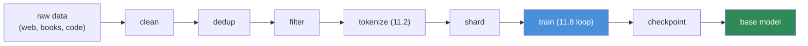
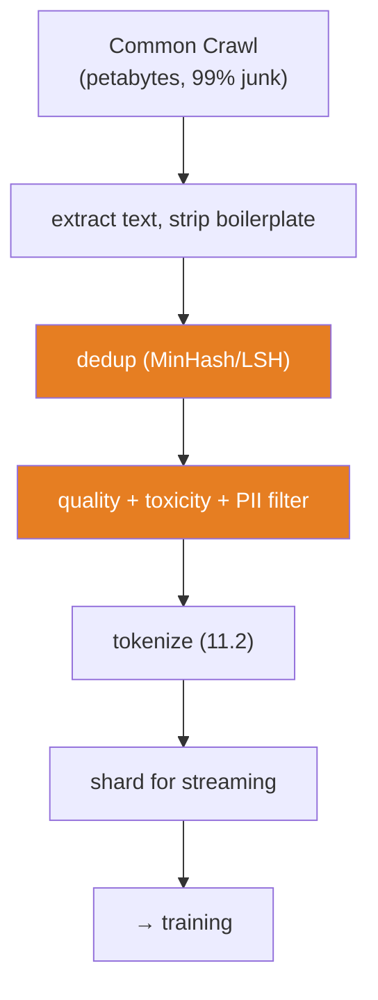
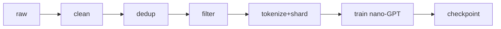

# 11.9 · Pretraining — Turning the Internet Into Weights

[⬅ 11.8 Build a Mini Transformer](11.8-build-mini-transformer.md) · [🏠 Module 11](../README.md) · [➡ 11.10 Scaling Laws](11.10-scaling-laws.md)

> **The lesson in one line:** Pretraining is your [11.8 training loop](11.8-build-mini-transformer.md) run on trillions of tokens across thousands of GPUs — and the hard part isn't the objective (still next-token prediction), it's the data pipeline and the distributed engineering.

---

## 🎯 Learning objectives

- Understand the **pretraining objective** (next-token prediction, at scale) and why it's self-supervised.
- Walk the **data pipeline**: collection → cleaning → dedup → filtering → tokenization → sharding.
- Understand the essentials of **distributed training** (data / tensor / pipeline parallelism) conceptually.
- Understand **checkpointing** and why pretraining runs are engineering marathons.

## ✅ Prerequisites

- [11.8 the mini-Transformer](11.8-build-mini-transformer.md), [11.1 the LM objective](11.1-what-is-a-language-model.md).
- [10.10 NLP data (dedup, PII, bias)](../../10-NLP/weeks/10.10-nlp-data.md), [07.x data pipelines](../../07-Data-Analysis/weeks/07.11-reusable-pipelines.md).

---

## 🧠 Mental model

> [!IMPORTANT]
> **Pretraining is exactly the [11.8](11.8-build-mini-transformer.md) loop — next-token prediction, cross-entropy, AdamW — scaled to trillions of tokens on thousands of GPUs for weeks.** The *objective* is unchanged; what's genuinely hard is (1) building a clean, deduplicated, filtered corpus of the whole public internet, and (2) the distributed-systems engineering to train a model too big for any single GPU. **The model architecture is the easy part; the data and the infrastructure are the moat.**

The result of pretraining is a **base model** (or "foundation model"): a raw next-token predictor that has absorbed grammar, facts, reasoning patterns, and code from its corpus, but is *not yet* a helpful assistant — that comes from fine-tuning and alignment ([11.11](11.11-fine-tuning.md)–[11.13](11.13-alignment.md)).



---

## The pretraining objective — self-supervision at scale

The objective is the [self-supervised trick from 08.1](../../08-Machine-Learning/weeks/08.1-what-is-ml.md)/[10.4](../../10-NLP/weeks/10.4-word-embeddings.md), maximized: **the text labels itself.** For every position, the label is simply the next token — no human annotation required. This is why pretraining can use *all* the text on the internet: there's no labeling bottleneck. Trillions of free training examples.

> [!IMPORTANT]
> **Self-supervision is the reason LLMs exist at all.** If next-token prediction required human labels, you could never assemble trillions of examples. Because the label is *free* (it's just the next token), you can train on the entire public web. The "large" in LLM ([11.1](11.1-what-is-a-language-model.md)) is only possible because the objective needs no annotation — the single most important enabling idea in the field.

---

## The data pipeline — where the real work is

Model quality is bounded by data quality ([10.10](../../10-NLP/weeks/10.10-nlp-data.md), *"garbage in, garbage out"*). The pipeline:

### 1. Collection
Web crawls (Common Crawl), books, code (GitHub), Wikipedia, papers, curated datasets. Raw web is ~99% garbage (boilerplate, spam, SEO junk).

### 2. Cleaning
Strip HTML, boilerplate, navigation, ads; fix encoding (mojibake, [10.2](../../10-NLP/weeks/10.2-text-processing.md)); remove non-text. Extract the actual content from web noise.

### 3. Deduplication ⭐
Remove exact and near-duplicate documents ([10.10](../../10-NLP/weeks/10.10-nlp-data.md)). This is not optional cleanup — it materially improves models:

> [!IMPORTANT]
> **Deduplication makes models better, not just smaller.** Web data is full of the same text repeated thousands of times (reposts, mirrors, templates). Training on duplicates wastes compute, encourages **memorization** (verbatim regurgitation of repeated text — a [privacy risk, 10.14](../../10-NLP/weeks/10.14-ethics-safety.md)), and can degrade quality. MinHash/LSH near-duplicate removal at web scale is a core pretraining step ([10.10 Lee et al.](../../10-NLP/weeks/10.10-nlp-data.md)). Dedup is also how you keep **test benchmarks out of training** ([contamination, 10.9](../../10-NLP/weeks/10.9-evaluation.md)).

### 4. Filtering
Quality filtering (keep text that "looks like" high-quality prose/code — often a classifier trained on known-good text), language filtering, toxicity/PII filtering ([10.14](../../10-NLP/weeks/10.14-ethics-safety.md)), and removing personal data. The **data mixture** (how much web vs code vs books vs math) is a critical, heavily-tuned recipe that shapes the model's abilities.

### 5. Tokenization
Apply the trained BPE/SentencePiece tokenizer ([11.2](11.2-tokenization.md)) to convert the cleaned corpus into token IDs.

### 6. Sharding
Split the tokenized corpus into shards (files) for efficient parallel streaming — you cannot hold trillions of tokens in RAM ([09.9 out-of-core](../../09-Deep-Learning/weeks/09.9-data-loading.md)). Data is streamed from disk/network during training.



---

## Distributed training — one model, thousands of GPUs

A 70B+ model and its optimizer states don't fit on one GPU ([Adam's 3× memory, 09.5](../../09-Deep-Learning/weeks/09.5-optimization.md)). Training is split across many GPUs three ways, usually combined ("3D parallelism"):

| Strategy | Splits | Idea |
|---|---|---|
| **Data parallel** | the *batch* | each GPU has a full model copy, processes different data, gradients averaged ([09.x](../../09-Deep-Learning/weeks/09.14-performance.md)) |
| **Tensor parallel** | each *layer's matmuls* | one layer's weight matrix split across GPUs (they cooperate on one forward pass) |
| **Pipeline parallel** | the *layers* | GPU 1 holds layers 1–10, GPU 2 holds 11–20, etc.; activations flow between them |

Plus **ZeRO / FSDP** (shard the optimizer states, gradients, and parameters across data-parallel workers to fit huge models) and **gradient accumulation** ([09.14](../../09-Deep-Learning/weeks/09.14-performance.md)) to reach effective batch sizes of millions of tokens.

> [!IMPORTANT]
> **Memory, not compute, is usually the binding constraint** ([the recurring theme: 09.5 Adam 3×, 09.14, 11.4 KV cache](../../09-Deep-Learning/weeks/09.14-performance.md)). The full training footprint = weights + gradients + optimizer states + activations, often **16+ bytes per parameter** in mixed precision with Adam. A 70B model needs ~1TB+ of aggregate GPU memory just for training state — which is *why* you shard across dozens of GPUs. Distributed training is fundamentally a memory-management problem.

---

## Checkpointing — the marathon

Pretraining runs for **weeks to months**. Hardware fails, jobs crash, loss spikes. You **checkpoint** frequently ([09.16 state_dict + optimizer state](../../09-Deep-Learning/weeks/09.16-saving-loading.md)) so a failure costs hours, not the whole run.

> [!TIP]
> **Save the optimizer state, not just the weights** ([09.16](../../09-Deep-Learning/weeks/09.16-saving-loading.md)) — Adam's moments are built over hundreds of thousands of steps; resuming from weights alone restarts Adam cold and spikes the loss. Pretraining teams monitor loss curves obsessively for **loss spikes** (often from bad data batches or numerical instability), sometimes rolling back to an earlier checkpoint and skipping the offending data. The [09.15 debugging discipline](../../09-Deep-Learning/weeks/09.15-debugging.md) at industrial scale.

---

## 🏭 Production examples

| Aspect | Reality |
|---|---|
| **GPT-3** | ~300B tokens, ~175B params, thousands of GPU-days |
| **Llama-2/3** | 2T+ tokens; open weights, published data recipe details |
| **Compute cost** | millions of dollars per frontier pretraining run |
| **Data** | FineWeb, RedPajama, The Pile — open pretraining corpora to study |

## ⚡ Performance & GPU considerations

- **Model FLOPs utilization (MFU)** — the fraction of theoretical GPU compute actually used — is the key efficiency metric; 40–55% is good. Data loading, communication, and memory stalls eat the rest.
- **Communication is a bottleneck** — gradient all-reduce across thousands of GPUs needs fast interconnect (NVLink/InfiniBand); overlapping compute and communication is essential.
- **bf16 mixed precision** is standard ([09.14](../../09-Deep-Learning/weeks/09.14-performance.md)) — the range of bf16 (not fp16) matters at scale.
- **Checkpoint I/O** of terabyte-scale states is itself an engineering problem (async, sharded saves).

## 🔒 Security considerations

> [!CAUTION]
> - **The corpus determines everything the model can leak.** PII, secrets, copyrighted text, and toxic content in the training data become memorized model capabilities ([10.14](../../10-NLP/weeks/10.14-ethics-safety.md)). **Filtering and dedup at ingestion are the primary defense** — you cannot un-train a leak.
> - **Data poisoning is a real threat** — an adversary who gets malicious text into a web-scraped corpus can implant backdoors or biases. Provenance and filtering matter for security, not just quality.
> - **Copyright and consent** — web text was written by people who didn't consent to training; legal exposure is significant ([10.10](../../10-NLP/weeks/10.10-nlp-data.md)).
> - **Benchmark contamination** ([10.9](../../10-NLP/weeks/10.9-evaluation.md)) — test sets leaking into training inflate every reported metric; aggressive dedup against known benchmarks is required.

## 🚫 Common mistakes

| Mistake | Consequence |
|---|---|
| **Skipping deduplication** | wasted compute, memorization, contamination |
| **Poor quality filtering** | garbage in → garbage out ([10.10](../../10-NLP/weeks/10.10-nlp-data.md)) |
| **Not filtering PII/toxicity** | the model memorizes and emits them |
| **Checkpointing weights only** | can't resume Adam cleanly → loss spike ([09.16](../../09-Deep-Learning/weeks/09.16-saving-loading.md)) |
| **Ignoring the data mixture** | wrong balance → weak at code/math/reasoning |
| **Assuming architecture is the hard part** | data + infra are the real work |

## ✅ Best practices

- **Invest in the data pipeline** — dedup, quality-filter, remove PII/toxicity; the data mixture is a first-class design decision.
- **Dedup against benchmarks** to prevent contamination ([10.9](../../10-NLP/weeks/10.9-evaluation.md)).
- **Checkpoint frequently, with optimizer state**; monitor for loss spikes; be ready to roll back.
- **Maximize MFU**; overlap compute and communication; use bf16 and 3D parallelism.
- **Track data provenance** for legal and security reasons.

## 🏋️ Exercises

1. **Pretraining in miniature.** Take your [11.8 nano-GPT](11.8-build-mini-transformer.md) and "pretrain" it on a larger corpus (e.g., all of TinyStories or a book collection). Plot loss vs tokens seen — a mini pretraining curve.
2. **Dedup impact.** Duplicate 20% of your training corpus. Train with and without dedup. Compare validation perplexity and check for verbatim memorization of the duplicated passages.
3. **Data mixture.** Train two nano-GPTs, one on prose only, one on 50% prose + 50% code. Compare their ability to continue code vs prose. Show the mixture shapes capability.
4. **Quality filter.** Build a simple quality classifier (length, punctuation ratio, language). Filter a noisy corpus and measure the effect on your model.
5. **Checkpoint resume.** Checkpoint mid-training with and without optimizer state; resume each; show the weights-only resume spikes the loss ([09.16](../../09-Deep-Learning/weeks/09.16-saving-loading.md)).

## 🛠️ Mini project — "A Miniature Pretraining Pipeline"

**Goal:** build the *whole* pipeline (clean → dedup → filter → tokenize → shard → train) at small scale, so the industrial version is demystified.

**Requirements**
- Ingest a raw text corpus; **clean** (strip boilerplate/fix encoding), **dedup** (MinHash/exact), **filter** (quality + basic PII), **tokenize** ([11.2](11.2-tokenization.md)), **shard**.
- Train the [11.8 nano-GPT](11.8-build-mini-transformer.md) on the sharded stream with checkpointing (+ optimizer state).
- **Ablations:** measure the effect of dedup and filtering on validation perplexity and memorization.

**Folder structure**
```
mini-pretrain/
├── clean.py           # boilerplate/encoding
├── dedup.py           # MinHash/LSH + exact
├── filter.py          # quality + PII
├── tokenize_shard.py  # 11.2 tokenizer → shards
├── train.py           # 11.8 loop, streaming, checkpoint+optimizer
├── ablate.py          # dedup/filter on/off vs perplexity & memorization
└── README.md
```

**Architecture diagram**


**Data pipeline:** each stage is a pure, testable step ([07.11](../../07-Data-Analysis/weeks/07.11-reusable-pipelines.md)); persist intermediate artifacts.
**Testing:** dedup removes known duplicates; PII filter catches planted PII; resume-from-checkpoint continues loss smoothly.
**Evaluation:** validation perplexity + a memorization probe (does the model regurgitate a duplicated canary?).
**Future improvements:** add a learned quality classifier; tune the data mixture; scale to more shards and study the [scaling curve (11.10)](11.10-scaling-laws.md).

## 📄 Cheat sheet

| Stage | Key point |
|---|---|
| **Objective** | next-token prediction (self-supervised → free labels) |
| **⭐ Dedup** | improves quality, cuts memorization & contamination — not optional |
| **Filter** | quality + toxicity + PII; the **data mixture** shapes abilities |
| **Tokenize/shard** | BPE ([11.2](11.2-tokenization.md)); stream shards (can't fit in RAM) |
| **⭐ Distributed** | data / tensor / pipeline parallel + ZeRO/FSDP |
| **⭐ The constraint** | **memory** (weights+grads+optimizer+activations), not compute |
| **Checkpoint** | frequent, **with optimizer state** ([09.16](../../09-Deep-Learning/weeks/09.16-saving-loading.md)); watch for loss spikes |
| **Output** | a **base model** (not yet an assistant → 11.11–11.13) |

## 🎴 Flashcards

- **What is the pretraining objective?** → Next-token prediction (cross-entropy) — self-supervised, so labels are free (the next token).
- **⭐ Why can LLMs train on trillions of tokens?** → Self-supervision needs no human labels; the entire public web becomes training data.
- **⭐ Why is deduplication essential?** → It improves quality, reduces memorization of repeated text (a privacy risk), saves compute, and prevents benchmark contamination.
- **What are the three axes of distributed training?** → Data parallel (split batch), tensor parallel (split each layer's matmuls), pipeline parallel (split layers).
- **⭐ What's the binding constraint in pretraining?** → Memory — weights + gradients + optimizer states + activations exceed a single GPU, forcing sharding.
- **What is a base model?** → A raw next-token predictor from pretraining; not yet a helpful assistant (needs fine-tuning + alignment).
- **Why checkpoint with optimizer state?** → Adam's moments take hundreds of thousands of steps to build; resuming from weights alone spikes the loss.
- **What is the data mixture?** → The proportion of web/code/books/math in the corpus — a tuned recipe that shapes the model's abilities.

## 💬 Interview questions

1. What is the pretraining objective, and why is self-supervision the key enabler of LLMs?
2. Walk through the pretraining data pipeline. Why is deduplication so important?
3. Explain data, tensor, and pipeline parallelism. Why are they needed?
4. Why is memory (not compute) usually the binding constraint in large-scale training?
5. What is a base model, and how does it differ from a chat model?
6. How does the training corpus create downstream privacy and copyright risks?

## 📝 Summary

- **Pretraining is the [11.8](11.8-build-mini-transformer.md) loop at scale** — next-token prediction on trillions of tokens across thousands of GPUs; the objective is unchanged, the **data and infrastructure** are the hard part.
- **Self-supervision** (the label is the next token) is what makes training on the whole internet possible.
- The **data pipeline** — clean → **dedup** → filter → tokenize → shard — determines model quality, memorization, and contamination; the **data mixture** shapes abilities.
- **Distributed training** (data/tensor/pipeline parallel + ZeRO/FSDP) exists because **memory**, not compute, is the binding constraint.
- **Checkpoint frequently with optimizer state**; the output is a **base model** that still needs [fine-tuning](11.11-fine-tuning.md) and [alignment](11.13-alignment.md) to become an assistant.

## 📚 References

1. **Brown et al. (2020) — _GPT-3_** & **Touvron et al. (2023) — _Llama / Llama-2_.** ⭐ Pretraining at scale, with data details.
2. **Lee et al. (2022) — _Deduplicating Training Data Makes Language Models Better_.** ⭐⭐ Why dedup matters.
3. **Rajbhandari et al. (2020) — _ZeRO_** & **_Megatron-LM_ (Shoeybi et al., 2019).** ⭐ Distributed training.
4. **Penedo et al. (2023/2024) — _RefinedWeb / FineWeb_.** ⭐ Open, documented pretraining data pipelines.
5. **Gao et al. (2020) — _The Pile_.** An open, diverse pretraining corpus.

---

## 🧭 Navigation

| Direction | Link |
|---|---|
| ⬅ Previous | [11.8 · Build a Mini Transformer](11.8-build-mini-transformer.md) |
| ➡ Next | [11.10 · Scaling Laws](11.10-scaling-laws.md) |
| 🏠 Module | [Module 11](../README.md) |
| 📖 Lessons | [Lesson index](README.md) |
