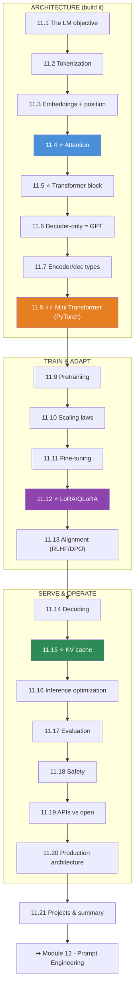

# Module 11 · Large Language Models & Transformers — Lessons

[⬅ Module home](../README.md) · [🗺 Roadmap](../../../ROADMAP.md) · [📚 Curriculum](../../../CURRICULUM.md)

> This is the map of Module 11 — the capstone of the foundations track. **An LLM is not a black box; it is a stack of the self-attention blocks you already built in [10.7](../../10-NLP/weeks/10.7-attention.md), trained to predict the next token, scaled up, and aligned to be useful.** By the end you will have built a working Transformer from scratch, and you will be able to read a modern LLM paper and recognize every component.

---

## The rule of this module

> [!IMPORTANT]
> **Everything an LLM does reduces to one objective: predict the next token.** Pretraining is next-token prediction on the internet. Generation is next-token prediction in a loop. Fine-tuning is next-token prediction on curated data. Alignment nudges *which* next token. Inference optimization makes next-token prediction cheaper. **Hold that single fact and the whole module organizes itself** — every lesson is a different angle on "predict the next token, well and efficiently, at scale."
>
> **The plan:** define the LM objective → tokenize → embed + position → attention → assemble the Transformer → build a mini-GPT in PyTorch → pretrain it → scale it → fine-tune it → align it → serve it → evaluate and secure it. You will **build the architecture by hand** before you rely on any library.

This module **cashes in everything before it.** [Attention (10.7)](../../10-NLP/weeks/10.7-attention.md) — you built it. The [feed-forward block](../../09-Deep-Learning/weeks/09.8-building-models.md), [LayerNorm and residuals](../../09-Deep-Learning/weeks/09.13-regularization.md), [the training loop (09.10)](../../09-Deep-Learning/weeks/09.10-training-loop.md), [AdamW (09.5)](../../09-Deep-Learning/weeks/09.5-optimization.md), [cross-entropy and perplexity (06.8/10.9)](../../06-Mathematics/weeks/06.8-information-theory.md), [subword tokenization (10.2/10.12)](../../10-NLP/weeks/10.12-modern-libraries.md), [sampling (10.8)](../../10-NLP/weeks/10.8-seq2seq.md), and the [safety/evaluation discipline (10.9/10.14)](../../10-NLP/weeks/10.14-ethics-safety.md). **There is almost nothing genuinely new here — there is assembly, scale, and engineering.**

---

## The 21 lessons

| # | Lesson | The one thing | Build? |
|---|---|---|---|
| 11.1 | [What Is a Language Model?](11.1-what-is-a-language-model.md) | **Everything is next-token prediction** — `P(next \| context)` | — |
| 11.2 | [Tokenization](11.2-tokenization.md) | BPE/WordPiece/Unigram; the token is the atom of an LLM | ✅ |
| 11.3 | [Embeddings & Positional Encoding](11.3-embeddings-positional.md) | tokens → vectors; **RoPE** tells attention *where* | ✅ |
| 11.4 | [Attention](11.4-attention.md) ⭐ | `softmax(QKᵀ/√d)·V` — single & multi-head, from scratch | ✅ |
| 11.5 | [Transformer Architecture](11.5-transformer-architecture.md) ⭐ | every component of a block, assembled | — |
| 11.6 | [Decoder-Only Transformers](11.6-decoder-only.md) | **causal masking** + autoregression = GPT | ✅ |
| 11.7 | [Encoder / Decoder / Enc-Dec](11.7-encoder-decoder-types.md) | BERT vs GPT vs T5 — pick by task | — |
| 11.8 | [Build a Mini Transformer](11.8-build-mini-transformer.md) ⭐⭐ | a working GPT in PyTorch, trained | ✅ |
| 11.9 | [Pretraining](11.9-pretraining.md) | data → clean → dedup → tokenize → shard → train | — |
| 11.10 | [Scaling Laws](11.10-scaling-laws.md) | compute, data, params — and **Chinchilla** | — |
| 11.11 | [Fine-Tuning](11.11-fine-tuning.md) | SFT, instruction tuning, **loss masking** | ✅ |
| 11.12 | [Parameter-Efficient Fine-Tuning](11.12-peft-lora.md) ⭐ | **LoRA / QLoRA** — fine-tune a 70B on one GPU | ✅ |
| 11.13 | [Alignment](11.13-alignment.md) | RLHF, reward models, **DPO** | — |
| 11.14 | [Inference & Decoding](11.14-inference-decoding.md) | temperature, top-k/p, greedy, beam | ✅ |
| 11.15 | [KV Cache](11.15-kv-cache.md) ⭐ | **prefill vs decode**; why generation is memory-bound | ✅ |
| 11.16 | [Inference Optimization](11.16-inference-optimization.md) | quantization, continuous batching, speculative decoding | — |
| 11.17 | [LLM Evaluation](11.17-evaluation.md) | perplexity → benchmarks → human/LLM-judge | — |
| 11.18 | [LLM Safety](11.18-safety.md) | prompt injection, jailbreaks, PII — **defensive** | — |
| 11.19 | [APIs vs Open Models](11.19-apis-vs-open-models.md) | hosted vs open-weight vs self-hosted | — |
| 11.20 | [Production LLM Architecture](11.20-production-architecture.md) | API → model → cache → monitor → rate-limit | — |
| 11.21 | [Projects & Summary](11.21-projects-summary.md) | 8 projects; the whole stack, connected | ✅ |

⭐ marks the load-bearing lessons. **11.4 (attention)** and **11.8 (mini Transformer)** make the architecture concrete; **11.12 (LoRA)** and **11.15 (KV cache)** are the two ideas that make LLMs practically trainable and servable.

---

## The dependency graph

---

## The through-lines (watch these recur)

| Idea | Where it reappears |
|---|---|
| **⭐ Everything is next-token prediction** | 11.1 → pretraining (11.9), generation (11.14), fine-tuning (11.11) |
| **⭐ Attention = softmax(QKᵀ/√d)·V** | 11.4 (built) → block (11.5) → causal (11.6) → KV cache (11.15) |
| **The O(n²) / context-length wall** | 11.4, 11.5, 11.15 (KV cache), 11.16 |
| **⭐ The training loop never changes** | 11.8, 11.9, 11.11 — still [09.10](../../09-Deep-Learning/weeks/09.10-training-loop.md) |
| **Memory is the constraint** | Adam 3× (11.9), LoRA (11.12), quantization (11.16), KV cache (11.15) |
| **Prefill (compute-bound) vs decode (memory-bound)** | 11.15 → 11.16 → 11.20 |
| **⭐ Evaluation & safety don't get easier at scale** | 11.17, 11.18 inherit [10.9/10.14](../../10-NLP/weeks/10.14-ethics-safety.md) |
| **Probable ≠ true (hallucination)** | 11.1, 11.13, 11.17, 11.18 |

---

## Companion artifacts

| Artifact | Purpose |
|---|---|
| [Exercises](../exercises/README.md) | Conceptual, NumPy, PyTorch, fine-tuning, inference, debugging |
| [Quiz](../quizzes/quiz-01.md) + [Answers](../quizzes/answers-01.md) | 45 questions across all 21 lessons |
| [Flashcards](../flashcards/deck.md) | ~110-card spaced-repetition deck |
| [Cheat sheet](../cheat-sheets/llm-cheatsheet.md) | One-page quick reference |

---

## 🧭 Navigation

| Direction | Link |
|---|---|
| ⬆ Module home | [Module 11](../README.md) |
| ⬅ Previous module | [10 · NLP](../../10-NLP/README.md) |
| ➡ Next module | [12 · Prompt Engineering](../../12-Prompt-Engineering/README.md) |
| 🗺 Roadmap | [ROADMAP.md](../../../ROADMAP.md) |
