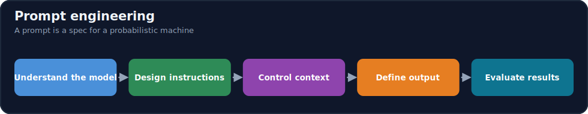
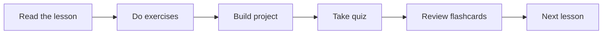

# Module 12 · Prompt Engineering

[⬅ 11 · LLMs](../11-LLMs/README.md) · [🏠 docs](../README.md) · [🗺 Roadmap](../../ROADMAP.md) · [13 · RAG ➡](../13-RAG/README.md)

> Prompt engineering as a technical discipline — designing reliable interactions between humans, LLMs, tools, and systems.

---

## Purpose

This module covers **Prompt Engineering** — not as a bag of tricks, but as the engineering discipline of **designing reliable interactions** with language models. It teaches the principles beneath the prompts: how LLMs interpret input, how to structure instructions and context, how to force structured outputs, how to drive reasoning and tool use, and how to **evaluate, test, secure, and operate** prompts in production. It builds directly on [Module 11 · LLMs](../11-LLMs/README.md) and lays the foundation for [Module 13 · RAG](../13-RAG/README.md) and [Module 14 · AI Agents](../14-AI-Agents/README.md).

## What you'll learn

- **How LLMs interpret prompts** — tokens, context windows, message roles, and probabilistic generation — so prompt design is grounded in mechanism, not superstition.
- The **anatomy of a reliable prompt** and the core patterns: zero/one/few-shot, role, instruction, and contextual prompting; structure with delimiters and tags.
- **Structured outputs** (JSON/JSON Schema/XML/tables) with **programmatic validation** — the backbone of production LLM systems.
- **Reasoning workflows, prompt chaining, and templates**; task-specific strategies (classification, extraction, summarization, QA, code, analysis).
- **Context engineering** (the bridge to RAG), **tool/function calling** (the bridge to agents), and the full operational loop: **evaluation, testing, debugging, security, optimization, and production management**.

## 📖 Lessons (start here)

> ✅ **This module's content is written.** Work through the lessons in order via the [lesson index](weeks/README.md).

| # | Lesson | Build? |
|---|---|---|
| 12.1 | [How LLMs Interpret Prompts](weeks/12.1-how-llms-interpret-prompts.md) ⭐ | — |
| 12.2 | [Anatomy of a Good Prompt](weeks/12.2-anatomy-of-a-prompt.md) ⭐ | — |
| 12.3 | [Basic Prompting Patterns](weeks/12.3-basic-patterns.md) | — |
| 12.4 | [Prompt Structure](weeks/12.4-prompt-structure.md) | ✅ |
| 12.5 | [Few-Shot Prompting](weeks/12.5-few-shot.md) | ✅ |
| 12.6 | [Structured Outputs](weeks/12.6-structured-outputs.md) ⭐ | ✅ |
| 12.7 | [Prompting for Reasoning](weeks/12.7-reasoning.md) | — |
| 12.8 | [Prompt Chaining](weeks/12.8-prompt-chaining.md) | ✅ |
| 12.9 | [Prompt Templates](weeks/12.9-templates.md) | ✅ |
| 12.10 | [Prompt Engineering for Different Tasks](weeks/12.10-task-strategies.md) | ✅ |
| 12.11 | [Context Engineering](weeks/12.11-context-engineering.md) ⭐ | — |
| 12.12 | [Tool & Function Calling](weeks/12.12-tool-calling.md) ⭐ | ✅ |
| 12.13 | [Prompt Evaluation](weeks/12.13-evaluation.md) ⭐ | ✅ |
| 12.14 | [Prompt Testing](weeks/12.14-testing.md) | ✅ |
| 12.15 | [Debugging Prompts](weeks/12.15-debugging.md) | — |
| 12.16 | [Prompt Security](weeks/12.16-security.md) | — |
| 12.17 | [Prompt Optimization](weeks/12.17-optimization.md) | — |
| 12.18 | [Production Prompt Engineering](weeks/12.18-production.md) | — |
| 12.19 | [Prompt Engineering with Python](weeks/12.19-python.md) | ✅ |
| 12.20 | [Mini Projects & Summary](weeks/12.20-projects-summary.md) | ✅ |

**Companion artifacts:** [Exercises](exercises/README.md) · [Quiz](quizzes/quiz-01.md) · [Flashcards](flashcards/deck.md) · [Cheat sheet](cheat-sheets/prompt-cheatsheet.md)

> [!IMPORTANT]
> **⭐ The rule of this module: a prompt is a specification, not a wish.** The model is a probabilistic next-token predictor ([11.1](../11-LLMs/weeks/11.1-what-is-a-language-model.md)) — it does exactly what its input makes most probable, not what you *meant*. So prompt engineering is **removing ambiguity until the desired output is the most probable one**: precise instructions, clear structure, concrete examples, explicit output format, and constraints the model can't misread.
>
> And because the model is probabilistic, **one good response is not reliability** — reliability is measured over a dataset. This module treats prompts like code: they are **specified, structured, versioned, tested, evaluated, secured, and monitored.** Prompt engineering = **understanding the model + designing instructions + controlling context + defining output structure + evaluating results.**

## How this module is organized

Content is delivered week by week. Each module uses the same subfolders:

| Folder | Contents |
|---|---|
| [`weeks/`](weeks/) | Weekly lesson content, one file per lesson (`12.1-…`, `12.2-…`). |
| [`diagrams/`](diagrams/) | Mermaid sources and exported diagram assets for this module. |
| [`exercises/`](exercises/) | Hands-on practice problems with solutions. |
| [`projects/`](projects/) | Buildable projects that apply this module's skills. |
| [`quizzes/`](quizzes/) | Self-assessment question banks with answer keys. |
| [`flashcards/`](flashcards/) | Spaced-repetition Q/A decks for active recall. |
| [`cheat-sheets/`](cheat-sheets/) | One-page quick references for this module. |
| [`references/`](references/) | Paper summaries and deep-dive notes. |

## Suggested study flow

## Related modules

- [Module 11 · LLMs](../11-LLMs/README.md) — tokens, context windows, decoding, safety.
- [Module 13 · RAG](../13-RAG/README.md) — context engineering scaled to a retrieval system.
- [Module 14 · AI Agents](../14-AI-Agents/README.md) — tool calling scaled to autonomous loops.

---

## Navigation

| Direction | Link |
|---|---|
| ⬆ Parent | [docs/](../README.md) |
| ⬅ Previous | [⬅ 11 · LLMs](../11-LLMs/README.md) |
| ➡ Next | [13 · RAG ➡](../13-RAG/README.md) |
| 🗺 Roadmap | [ROADMAP.md](../../ROADMAP.md) |
| 📚 Curriculum | [CURRICULUM.md](../../CURRICULUM.md) |
| 🏠 Repo root | [README.md](../../README.md) |
