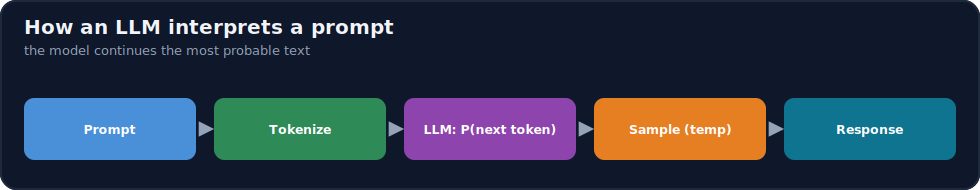
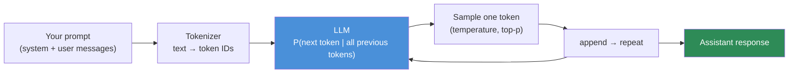
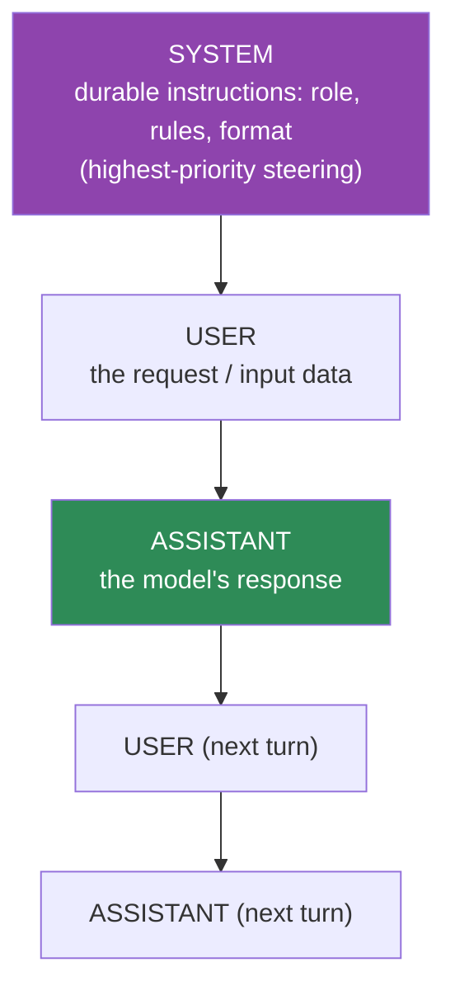
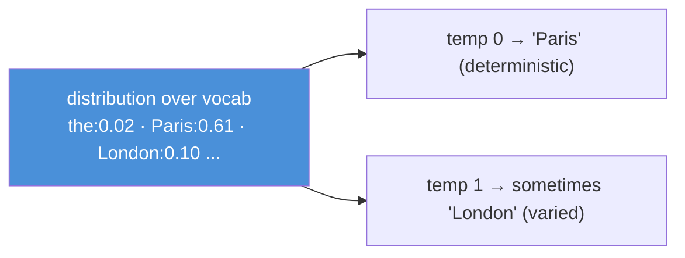
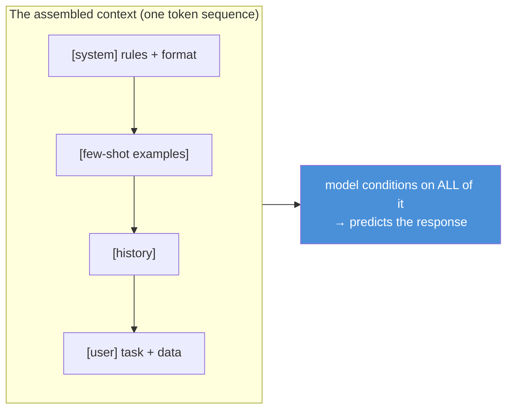

# 12.1 · How LLMs Interpret Prompts ⭐

[🏠 Module 12](../README.md) · [📖 Lessons](README.md) · [➡ 12.2 Anatomy of a Prompt](12.2-anatomy-of-a-prompt.md)

> **The lesson in one line:** A prompt is not a command you give an obedient assistant — it is the **conditioning context for a probabilistic next-token predictor**, so the model produces whatever continuation your exact tokens make most likely; prompt engineering is the craft of making the *desired* output the *most probable* one.



---

## 🎯 Learning objectives

- Explain how an LLM turns a prompt into **tokens** and predicts the next token probabilistically.
- Understand the **context window** and the **message roles** (system, user, assistant) and how they're assembled.
- Internalize that the model **continues the most probable text**, not "understands your intent" — the foundation of every later lesson.
- Reason about why the *same* request, worded differently, yields different reliability.

## ✅ Prerequisites

- [11.1 what a language model is](../../11-LLMs/weeks/11.1-what-is-a-language-model.md) — next-token prediction, "probable ≠ true".
- [11.2 tokenization](../../11-LLMs/weeks/11.2-tokenization.md), [11.15 context window](../../11-LLMs/weeks/11.15-kv-cache.md).

---

## 🧠 Mental model

> [!IMPORTANT]
> **The model does not read your prompt and decide how to help you. It reads your prompt as *text so far* and computes "what tokens most probably come next?"** Everything the model appears to "do" — answer, summarize, reason, refuse — is that one operation: extend the sequence with likely tokens ([11.1](../../11-LLMs/weeks/11.1-what-is-a-language-model.md)). Your prompt is the **conditioning context** that shifts those probabilities. A vague prompt leaves many probable continuations (some wrong); a precise, well-structured prompt concentrates probability on the output you want. **Prompt engineering = sculpting the probability distribution over continuations until the desired answer wins.**



---

## From prompt to tokens

The model never sees characters or words — it sees **tokens** (subword units, [11.2](../../11-LLMs/weeks/11.2-tokenization.md)). Your entire prompt, including formatting and whitespace, is converted to token IDs before the model runs. Consequences that matter for prompting:

- **Everything counts as tokens** — instructions, examples, delimiters, and the input data all consume the context budget and cost money ([12.17](12.17-optimization.md)).
- **Token boundaries are not word boundaries** — which is why models miscount letters and struggle with exact string manipulation ([11.2](../../11-LLMs/weeks/11.2-tokenization.md)).
- **Format is signal** — a newline, a `###`, or an XML tag is tokens the model attends to; structure literally changes the input ([12.4](12.4-prompt-structure.md)).

## The context window

The model can only condition on a finite number of tokens — the **context window** ([11.15](../../11-LLMs/weeks/11.15-kv-cache.md)). Prompt + conversation history + the response being generated must all fit. Two implications:

- **The window is a budget.** Long prompts, long histories, and big documents compete for space — the discipline of choosing what goes in is [context engineering (12.11)](12.11-context-engineering.md).
- **Position matters.** Models attend unevenly across the window — content at the start and end is used more reliably than the middle ("lost in the middle", [12.11](12.11-context-engineering.md)).

## Message roles: system, user, assistant

Chat models are trained on a **structured conversation** with roles, assembled into one token sequence via a chat template:



| Role | Purpose | Prompt-engineering use |
|---|---|---|
| **System** | durable, high-level instructions the model should follow throughout | role, tone, rules, output format, safety boundaries |
| **User** | the request and any input/data for this turn | the task and the (often untrusted) input |
| **Assistant** | the model's generated replies (and prior ones in history) | few-shot examples can be seeded here; prior turns are context |

> [!IMPORTANT]
> **The system message is your strongest, most stable steering lever — but it is not a hard boundary.** Instructions there tend to be followed more reliably and persist across turns, so put role, rules, and output contracts there. But the model still just predicts tokens: a strong enough conflicting signal in the user/data can override system instructions ([12.16 injection](12.16-security.md)). **System = high priority, not a security wall.**

## Probabilistic generation

Each step, the model outputs a probability distribution over the whole vocabulary; a **sampler** picks the next token ([11.14](../../11-LLMs/weeks/11.14-inference-decoding.md)):

- **Temperature** — flattens (high, more varied/creative) or sharpens (low, more deterministic) the distribution.
- **Top-p / top-k** — restrict sampling to the most probable tokens.



> [!IMPORTANT]
> **Because generation is probabilistic, the same prompt can produce different outputs — so a single good response is not evidence of a good prompt.** This is the central fact of the module: **reliability must be measured over many runs / a dataset** ([12.13](12.13-evaluation.md)), not judged from one lucky answer. For tasks that need determinism (extraction, classification), use **low temperature**; for creative tasks, higher. But even at temperature 0, changing the prompt wording changes the distribution — which is why precise prompting matters.

---

## How the model processes the full input context



The model conditions on the **entire assembled sequence** at once — system rules, any examples, prior turns, and the current request — with no memory beyond it. There is no hidden state between calls: **if it's not in the context (or the weights), the model doesn't know it.** This is why context engineering ([12.11](12.11-context-engineering.md)) and, later, retrieval ([13](../../13-RAG/README.md)) exist.

---

## ⚖️ Weak vs strong prompt

| | Prompt | Why |
|---|---|---|
| **Weak** | `"Tell me about this."` | Many probable continuations; no role, task, input, or format — the model guesses. |
| **Strong** | `System: You extract data. Output only JSON.`<br/>`User: Extract {name, date} from: "<text>"` | Role + task + delimited input + format concentrate probability on one output shape. |

Same model, same weights — the strong prompt *removes ambiguity*, so the desired output becomes the most probable one.

---

## 🏭 Production examples

| Practice | Rooted in |
|---|---|
| Put format/role/rules in the **system** message | it steers most reliably and persists |
| Use **low temperature** for extraction/classification | determinism from a probabilistic model |
| **Delimit** input data from instructions | format is tokens the model attends to ([12.4](12.4-prompt-structure.md)) |
| Budget the **context window** deliberately | it's finite; position matters ([12.11](12.11-context-engineering.md)) |
| Never trust a prompt on one example | generation is probabilistic — evaluate ([12.13](12.13-evaluation.md)) |

## ⚡ Performance & 💲 cost considerations

- **Every token is latency and money** — input tokens (prompt) and output tokens are both billed; prompt length directly drives cost ([12.17](12.17-optimization.md)).
- **Prefill vs decode** ([11.15](../../11-LLMs/weeks/11.15-kv-cache.md)): a long prompt inflates prefill (time-to-first-token); long outputs inflate decode.
- **Stable prompt prefixes** (fixed system text) can be **prompt-cached** to cut latency/cost on repeated calls.

## 🔒 Security considerations

> [!CAUTION]
> - **Instructions and data share one channel of tokens** — the model can't inherently tell "your rules" from "text a user pasted." This is the root of **prompt injection** ([12.16](12.16-security.md)); it starts here, in how prompts are interpreted.
> - **The system message is high-priority, not a hard boundary** — don't rely on it alone to enforce safety.
> - **Everything in the context can appear in the output** — secrets placed in a prompt can be echoed/leaked ([12.16](12.16-security.md)).

## 🚫 Common mistakes

| Mistake | Consequence |
|---|---|
| Treating the model as an intent-reader | Vague prompts → unpredictable output |
| Judging a prompt from one response | Probabilistic variance hidden ([12.13](12.13-evaluation.md)) |
| Ignoring that format is tokens | Missed a cheap reliability lever ([12.4](12.4-prompt-structure.md)) |
| Putting the task only in user text, no system role | Weaker, less stable steering |
| High temperature for extraction | Non-deterministic, inconsistent results |
| Assuming the model remembers past calls | It only sees the current context |

## 🐛 Debugging workflow

Unexpected output? Ask, in order: (1) **What exact tokens did the model receive?** Print the fully assembled prompt (system + history + user). (2) **Is the desired output actually the most probable one given that text**, or is it under-specified? (3) **Is temperature causing variance** — does it fail every time or intermittently? (4) **Is the relevant info even in the context?** Most "the model is dumb" bugs are "the prompt was ambiguous" or "the info wasn't there." Full method in [12.15](12.15-debugging.md).

## 🏋️ Exercises

1. **Token reality.** Tokenize a prompt with a tokenizer; count tokens for instructions vs data. Show whitespace/formatting changes the count.
2. **Ambiguity → variance.** Run a vague prompt 10× at temperature 1; catalog the different outputs. Then tighten it and rerun; measure the variance drop.
3. **Role placement.** Move the same instruction from the user message to the system message; compare adherence over 10 runs.
4. **Temperature sweep.** Run an extraction task at temp {0, 0.7, 1.0} × 5; show low temp is consistent.
5. **Lost context.** Ask about a fact you never provided; confirm the model can't know it, then provide it and rerun.

## 🛠️ Mini project — "Prompt inspector"

**Goal:** a small tool that shows exactly what the model receives and how variable its output is.

**Requirements:** assemble system+history+user into the final token sequence; report token counts per section; run a prompt N times at a chosen temperature and report output diversity (unique responses, agreement rate).

**Folder structure**
```
prompt-inspector/
├── assemble.py     # build the full context; role tagging
├── tokens.py       # token counts per section
├── sample.py       # run N times; diversity metrics
└── report.py       # human-readable breakdown
```

**Testing:** token counts match the tokenizer; diversity drops as the prompt is tightened.
**Evaluation:** agreement rate across N runs as a proxy for prompt determinism.
**Security:** flag if untrusted input is concatenated into instruction sections.
**Future improvements:** prompt-cache hit reporting; cost estimate per call.

## 📄 Cheat sheet

| Concept | One line |
|---|---|
| **⭐ Core truth** | the model continues the most probable text, not your intent |
| **Tokens** | input is subword tokens; format/whitespace count |
| **Context window** | finite budget; position matters (edges > middle) |
| **System role** | durable, high-priority steering (not a hard wall) |
| **User role** | request + (untrusted) data |
| **Assistant role** | model output; can seed few-shot |
| **⭐ Probabilistic** | same prompt → varied output → evaluate over a dataset |
| **Temperature** | low = deterministic (extraction); high = varied (creative) |
| **⭐ Prompt eng.** | shape the input so the desired output is most probable |

## 🎴 Flashcards

- **⭐ What does an LLM actually do with a prompt?** → Treats it as text-so-far and predicts the most probable next tokens — it doesn't infer intent.
- **What is prompt engineering, mechanistically?** → Shaping the conditioning context so the desired output becomes the most probable continuation.
- **What are the three message roles?** → System (durable high-priority rules/format), user (request + data), assistant (model responses; can seed examples).
- **Is the system message a security boundary?** → No — it's high-priority steering, but the model still just predicts tokens and can be overridden (injection).
- **⭐ Why can't you judge a prompt from one response?** → Generation is probabilistic; reliability must be measured over many runs / a dataset.
- **Why does prompt format matter?** → Format is tokens the model attends to; delimiters/tags/structure change the actual input.
- **Why does the model "forget" between API calls?** → It has no state beyond the context window; only what's in the context (or weights) is available.

## 💬 Interview questions

1. Explain what an LLM is really doing when it "follows" a prompt.
2. What are the message roles, and how does the system message differ from the user message in practice?
3. Why is the same prompt capable of producing different outputs, and what follows for evaluation?
4. How does tokenization affect prompt design and cost?
5. Why is "instructions and data share one channel" the root of prompt injection?
6. What is the context window, and why does position within it matter?

## 📝 Summary

- An LLM interprets a prompt as **text-so-far** and generates the **most probable continuation** — it doesn't read intent. Prompt engineering is **making the desired output the most probable one**.
- Prompts become **tokens** (format included), fill a **finite context window** (position matters), and are structured into **system/user/assistant** roles — the system role steers most reliably but isn't a hard boundary.
- Generation is **probabilistic**, so **one good answer ≠ a good prompt** — reliability is measured over a dataset ([12.13](12.13-evaluation.md)), and temperature trades determinism for variety.
- Because **instructions and data share one token channel**, ambiguity and injection both start here — motivating structure ([12.4](12.4-prompt-structure.md)), context engineering ([12.11](12.11-context-engineering.md)), and security ([12.16](12.16-security.md)).

## 📚 References

1. **[11.1 What Is a Language Model](../../11-LLMs/weeks/11.1-what-is-a-language-model.md).** ⭐ Next-token prediction, probable ≠ true.
2. **[11.2 Tokenization](../../11-LLMs/weeks/11.2-tokenization.md) & [11.14 Decoding](../../11-LLMs/weeks/11.14-inference-decoding.md).** Tokens, temperature, sampling.
3. **[11.15 Context Window / KV Cache](../../11-LLMs/weeks/11.15-kv-cache.md).** The finite budget.
4. **OpenAI / Anthropic prompting guides.** Message roles and system prompts in practice.

---

## 🧭 Navigation

| Direction | Link |
|---|---|
| ⬅ Previous | [Module home](../README.md) |
| ➡ Next | [12.2 · Anatomy of a Good Prompt](12.2-anatomy-of-a-prompt.md) |
| 🏠 Module | [Module 12](../README.md) |
| 📖 Lessons | [Lesson index](README.md) |
