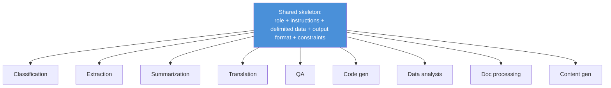
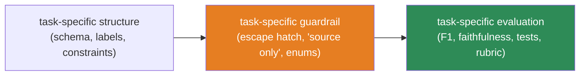

# 12.10 · Prompt Engineering for Different Tasks

[⬅ 12.9 Prompt Templates](12.9-templates.md) · [🏠 Module 12](../README.md) · [➡ 12.11 Context Engineering](12.11-context-engineering.md)

> **The lesson in one line:** Different task types have different failure modes and different definitions of "good," so each deserves a **tailored prompt structure and a matching evaluation** — classification needs fixed labels and confidence; extraction needs a schema and an "absent" convention; summarization needs grounding; generation needs constraints.

---

## 🎯 Learning objectives

- Apply task-specific **prompt structure, failure modes, and evaluation** for the nine core task types.
- Reuse the [template](12.9-templates.md) + [structured-output](12.6-structured-outputs.md) + [evaluation](12.13-evaluation.md) foundations per task.
- Recognize each task's characteristic hallucination/format risk and guard against it.

## ✅ Prerequisites

- [12.6 structured outputs](12.6-structured-outputs.md), [12.9 templates](12.9-templates.md).

---

## 🧠 Mental model

> [!IMPORTANT]
> **"Prompt engineering" is not one skill — it's a family of task-shaped specializations that share the same foundations.** Every task uses role + instructions + delimited data + output format + constraints ([12.2](12.2-anatomy-of-a-prompt.md)), but *which* constraints and *which* evaluation matter changes completely: a classifier must never invent a label; an extractor must mark missing fields "unknown"; a summarizer must not add facts; a generator must obey length/style. **Learn the shared skeleton, then the per-task guardrails and metrics.**



---

## The nine task types

### Classification
- **Structure:** fixed label set (enum), delimited input, JSON `{label, confidence, rationale}`; few-shot for boundaries ([12.5](12.5-few-shot.md)).
- **Failure modes:** inventing labels, over-using a default class, order/label bias, low-confidence guessing.
- **Evaluation:** accuracy, per-class precision/recall, confusion matrix, calibration of confidence.

### Information Extraction
- **Structure:** explicit **schema** ([12.6](12.6-structured-outputs.md)), delimited document, "return `null`/`unknown` if a field is absent — **never guess**."
- **Failure modes:** hallucinating absent values, wrong types, missing/merged entities, format drift.
- **Evaluation:** field-level precision/recall/F1, schema-validity rate, hallucinated-field rate.

### Summarization
- **Structure:** length/style constraint, "**use only the source; add nothing**," optional focus ("summarize the risks").
- **Failure modes:** adding facts not in source (hallucination), missing key points, wrong length, editorializing.
- **Evaluation:** faithfulness (no unsupported claims), coverage of key points, length adherence.

### Translation
- **Structure:** source/target language, register/formality, "preserve meaning, names, formatting," glossary for terms.
- **Failure modes:** dropped/added content, wrong register, mistranslated named entities/idioms, format loss.
- **Evaluation:** adequacy + fluency (human or LLM-judge), term-glossary adherence, length ratio sanity.

### Question Answering
- **Structure:** delimited **context**, "answer **only** from the context; if not present, say 'unknown'" (escape hatch), require a citation/quote.
- **Failure modes:** answering from parametric memory instead of context, hallucination, ignoring "unknown."
- **Evaluation:** answer correctness, groundedness/faithfulness, correct abstention on unanswerable ([13.12](../../13-RAG/weeks/13.12-evaluation.md)).

### Code Generation
- **Structure:** language + spec + constraints (libs, style), "return code only, then a brief note," request tests.
- **Failure modes:** non-compiling code, invented APIs, subtle logic bugs, ignoring constraints, insecure patterns.
- **Evaluation:** does it run/compile, unit tests pass, static analysis, spec adherence.

### Data Analysis
- **Structure:** the data (or a tool to query it, [12.12](12.12-tool-calling.md)), the question, "show the computation / return numbers with units," structured result.
- **Failure modes:** arithmetic errors, fabricated statistics, misreading columns, unstated assumptions.
- **Evaluation:** numeric correctness (verify with code/tools), assumption transparency.

### Document Processing
- **Structure:** parsing/normalization instructions, schema for the extracted structure, chunking for long docs ([12.11](12.11-context-engineering.md)).
- **Failure modes:** losing structure (tables/sections), context-window overflow, inconsistent handling across sections.
- **Evaluation:** structural fidelity, field accuracy, coverage across the whole document.

### Content Generation
- **Structure:** role/voice, audience, length, format, **must/must-not** constraints, an on-brand example ([12.5](12.5-few-shot.md)).
- **Failure modes:** off-brand tone, wrong length, generic filler, factual claims that need grounding, policy violations.
- **Evaluation:** rubric scoring (relevance, tone, correctness), constraint adherence, safety checks.

---

## Cross-task pattern



> [!IMPORTANT]
> **The characteristic risk of most tasks is hallucination in a task-specific disguise** — an invented label (classification), a guessed field (extraction), an added fact (summarization/QA), a fabricated statistic (analysis), an imaginary API (code). The universal guard is the same in each costume: **constrain the output space (enums/schema) and give an escape hatch ("unknown"/"not in source")**, then **evaluate the specific failure** (hallucinated-field rate, faithfulness, tests-pass).

---

## ⚖️ Weak vs strong (extraction example)

**Weak:** "Pull out the important info from this invoice." → free-form, invents a missing PO number, inconsistent fields.

**Strong:**
```
Extract into this schema; use null for any field not present in the document. Do not guess.
Schema: {invoice_no, date, total, currency, po_number|null, line_items:[{desc, qty, price}]}
<invoice>{doc}</invoice>
```
→ Schema-bounded, "null if absent" kills the hallucinated PO number, validatable ([12.6](12.6-structured-outputs.md)).

---

## 🏭 Production examples

| Task | Guardrail that matters most |
|---|---|
| Classification | enum labels + confidence threshold → route low-confidence to human |
| Extraction | "null if absent" + schema validation |
| Summarization/QA | "source only" + faithfulness eval |
| Code | run tests / static analysis before use |
| Analysis | verify numbers with a tool ([12.12](12.12-tool-calling.md)) |

## ⚡ Performance & 💲 cost considerations

- **Right-size per task**: classification/extraction often work with a small, cheap model at low temperature; open-ended generation may need a stronger one ([12.17](12.17-optimization.md)).
- **Long-document tasks** dominate cost via context — chunk and/or retrieve ([12.11](12.11-context-engineering.md), [13](../../13-RAG/README.md)).
- **Verification steps** (tests, tool checks) add cost but prevent expensive downstream errors.

## 🔒 Security considerations

> [!CAUTION]
> - **All task inputs are untrusted** — delimit data and keep the data-as-data rule per task ([12.16](12.16-security.md)).
> - **Code generation is a distinct risk** — never execute generated code unsandboxed; review for insecure/malicious patterns.
> - **Extraction/analysis over sensitive data** can surface PII into outputs and logs — apply output checks ([12.16](12.16-security.md)).

## 🚫 Common mistakes

| Mistake | Consequence |
|---|---|
| One generic prompt for all tasks | Misses per-task guardrails/metrics |
| No enum for classification | Invented labels |
| No "absent → null" for extraction | Hallucinated fields |
| No "source only" for summarization/QA | Added, ungrounded facts |
| Trusting generated code/stats unverified | Bugs, fabricated numbers |
| Wrong metric for the task | "Looks fine" but unmeasured failure |

## 🐛 Debugging workflow

Task output bad? (1) **Identify the task's characteristic failure** (invented label? guessed field? added fact? bad number?). (2) **Apply the matching guard** (enum, "null if absent", "source only", tool-verify). (3) **Use the task-appropriate metric** to confirm the fix ([12.13](12.13-evaluation.md)) — accuracy for classification, F1 for extraction, faithfulness for summary/QA, tests for code. Full method in [12.15](12.15-debugging.md).

## 🏋️ Exercises

1. **Nine skeletons.** Write a template for each task type with its guardrail and a matching metric.
2. **Hallucination hunt.** For extraction, summarization, and QA, craft an input that induces the task's signature hallucination; add the guard; confirm it's fixed.
3. **Metric match.** For three tasks, pick and justify the right evaluation metric; show why a generic "looks good" misses failures.
4. **Right-size.** Run classification on a small vs large model; compare accuracy/cost.
5. **Verify code/stats.** Add test-execution (code) and tool-verification (analysis) steps; measure error reduction.

## 🛠️ Mini project — "Task strategy pack"

**Goal:** a pack of task-specific prompt templates, guardrails, and evaluators.

**Requirements:** templates for all nine tasks ([12.9](12.9-templates.md)); per-task guardrail (enum/schema/escape-hatch/verify); per-task evaluator (accuracy/F1/faithfulness/tests/rubric); a small labeled set per task.

**Folder structure**
```
task-pack/
├── templates/      # one per task type
├── guards/         # enum, null-if-absent, source-only, verify
├── evaluators/     # metric per task
└── datasets/       # small labeled sets
```

**Testing:** each guard prevents its task's signature failure; each evaluator computes the right metric.
**Evaluation:** per-task quality dashboard.
**Security:** data-as-data; code sandboxing; PII output checks.
**Future improvements:** auto-pick task type; per-task model routing.

## 📄 Cheat sheet

| Task | Guard | Metric |
|---|---|---|
| **Classification** | enum labels + confidence | accuracy, per-class P/R |
| **Extraction** | schema + "null if absent" | field F1, hallucinated-field rate |
| **Summarization** | "source only" | faithfulness, coverage, length |
| **Translation** | glossary + register | adequacy/fluency, term adherence |
| **QA** | "context only" + escape hatch | correctness, groundedness, abstention |
| **Code** | constraints + tests | compiles, tests pass |
| **Analysis** | tool-verify numbers | numeric correctness |
| **Doc processing** | schema + chunking | structural fidelity, coverage |
| **Content** | voice/length/must-not + example | rubric, constraint adherence |

## 🎴 Flashcards

- **⭐ What do all tasks share, and what differs?** → A common skeleton (role + instructions + delimited data + format + constraints); the *guardrails* and *evaluation metrics* differ per task.
- **What's the universal hallucination guard, in task-specific costumes?** → Constrain the output space (enums/schema) and give an escape hatch ("unknown"/"null"/"not in source").
- **Extraction: how do you stop hallucinated fields?** → Require a schema and instruct "null/unknown if the field is absent; do not guess."
- **QA/summarization: the key constraint?** → "Answer/summarize using only the provided source" + faithfulness evaluation.
- **Code generation: how do you evaluate?** → Run/compile it and pass unit tests / static analysis — never trust unverified generated code.
- **Why is one generic prompt insufficient across tasks?** → Each task has a distinct failure mode and definition of "good" needing its own guard and metric.

## 💬 Interview questions

1. How does prompt structure differ between classification and extraction?
2. What is the characteristic failure mode of each of the nine tasks, and its guard?
3. Why does each task need a different evaluation metric?
4. How do you prevent hallucinated fields in extraction and added facts in summarization?
5. How would you safely evaluate LLM-generated code and LLM-computed statistics?

## 📝 Summary

- Task types share a **common prompt skeleton** but differ in their **guardrails and evaluation** — classification (enums + confidence), extraction (schema + "null if absent"), summarization/QA (source-only + faithfulness), code (tests), analysis (tool-verified numbers), and so on.
- The dominant risk across tasks is **hallucination in a task-specific disguise**; the universal guard is **constraining the output space plus an escape hatch**, verified by the **task-appropriate metric**.
- **Right-size the model per task** and **verify** code/statistics before use; long-document tasks push you toward **context engineering** ([12.11](12.11-context-engineering.md)) and **RAG** ([13](../../13-RAG/README.md)).

## 📚 References

1. **[12.6 Structured Outputs](12.6-structured-outputs.md), [12.9 Templates](12.9-templates.md).** Per-task structure.
2. **[12.13 Evaluation](12.13-evaluation.md).** Task-appropriate metrics.
3. **[13.12 RAG Evaluation](../../13-RAG/weeks/13.12-evaluation.md).** Faithfulness/abstention for QA.
4. **Provider task-specific prompting guides.** Per-task best practices.

---

## 🧭 Navigation

| Direction | Link |
|---|---|
| ⬅ Previous | [12.9 · Prompt Templates](12.9-templates.md) |
| ➡ Next | [12.11 · Context Engineering](12.11-context-engineering.md) |
| 🏠 Module | [Module 12](../README.md) |
| 📖 Lessons | [Lesson index](README.md) |
