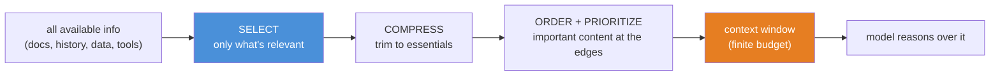
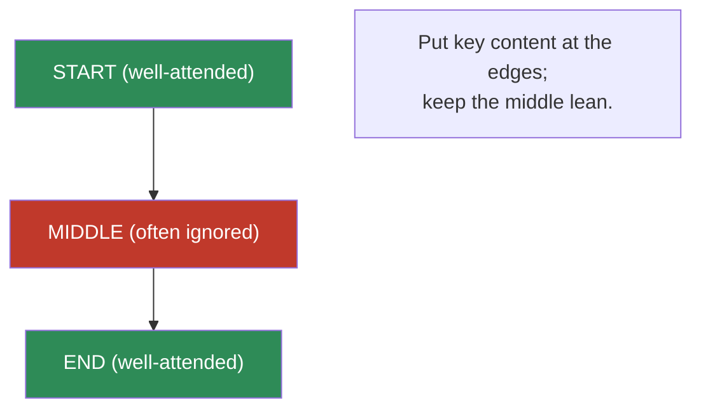
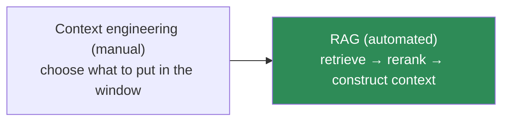

# 12.11 · Context Engineering ⭐

[⬅ 12.10 Task Strategies](12.10-task-strategies.md) · [🏠 Module 12](../README.md) · [➡ 12.12 Tool & Function Calling](12.12-tool-calling.md)

> **The lesson in one line:** Prompt engineering is *how you ask*; context engineering is *what information you put in front of the model* — and since the context window is finite and attention is uneven, deciding **what to include, in what order, compressed how, and prioritized how** is a distinct discipline that directly determines answer quality and is the foundation of RAG.

---

## 🎯 Learning objectives

- Distinguish **prompt engineering** from **context engineering**.
- Apply the levers: **selection, ordering, compression, prioritization, noise reduction** within the **context window**.
- Understand **lost-in-the-middle** and how position affects usage.
- See how context engineering scales into **RAG** ([13](../../13-RAG/README.md)).

## ✅ Prerequisites

- [12.1 context window](12.1-how-llms-interpret-prompts.md), [12.3 contextual prompting](12.3-basic-patterns.md), [12.6 structured outputs](12.6-structured-outputs.md).

---

## 🧠 Mental model

> [!IMPORTANT]
> **The model can only reason over what's in its context window — so the question "what goes in the window?" is often more important than "how do I phrase the instruction?"** Prompt engineering shapes the *instruction*; context engineering curates the *information*. Because the window is a **finite budget** and attention is **uneven** (edges > middle, [12.1](12.1-how-llms-interpret-prompts.md)), you can't just dump everything in — more context frequently *lowers* quality by adding distractors and burying the signal. Context engineering is the discipline of **getting the right information, in the right amount, in the right place.**



---

## Prompt engineering vs context engineering

| | Prompt engineering | Context engineering |
|---|---|---|
| **Question** | *How do I ask?* | *What do I put in the window?* |
| **Levers** | role, instructions, examples, format | selection, ordering, compression, prioritization |
| **Failure** | ambiguous instruction | wrong/missing/buried information |
| **Scales into** | reasoning, templates | **RAG** ([13](../../13-RAG/README.md)), long-context systems |

They're complementary: a perfect instruction over the wrong context fails; perfect context with a vague instruction fails. **Production LLM quality is a product of both.**

---

## The levers

### Context selection
Include only information **relevant to this request**. Irrelevant text is a distractor that dilutes attention and wastes budget. For dynamic apps, select per-query (retrieve relevant chunks — the essence of [RAG](../../13-RAG/README.md)); for chat, select which history turns matter.

### Context ordering
Place the **most important content at the beginning or end**, not the middle — models exhibit **lost-in-the-middle** ([12.1](12.1-how-llms-interpret-prompts.md)). A common pattern: instructions first, supporting context in the middle, the key question/data last (recency).

### Context compression
Fit more signal per token: **summarize** long history, **extract** only relevant passages, drop boilerplate. In chat, replace old turns with a running summary. Compression trades a little fidelity for a lot of budget.

### Context prioritization
When everything won't fit, **rank and keep the highest-value** content; drop or summarize the rest. Prioritize by relevance, recency, authority, and task-criticality.

### Noise reduction
Strip anything that doesn't help: navigation/boilerplate, duplicates, irrelevant tangents. **Signal-to-noise ratio in the window predicts output quality** — a clean, focused context beats a large, noisy one.



---

## The context window as a budget

Everything competes for the same finite tokens: system prompt + instructions + examples + retrieved/context data + conversation history + room for the output.

> [!IMPORTANT]
> **More context is not better context.** Beyond a point, adding material *reduces* accuracy: distractors compete with the answer, attention spreads thin, and key facts drift into the ignored middle. The skill is **curation, not accumulation** — the fewest, most relevant, best-ordered tokens that let the model answer. This is exactly why RAG **retrieves and reranks a small set** rather than stuffing the whole corpus ([13.9](../../13-RAG/weeks/13.9-context-construction.md)).

---

## ⚖️ Weak vs strong

**Weak** (dump everything):
```
<entire 40-page manual>
Question: How do I reset the device?
```
→ The reset steps are on page 30 (the "middle"); the model buries them under 39 irrelevant pages and answers vaguely.

**Strong** (select + order + compress):
```
Relevant excerpt (from "Reset" section):
<the 2 paragraphs about resetting>
Question: How do I reset the device?
```
→ Only the relevant, compressed context, placed right by the question — precise answer. *This selection step, automated, is RAG.*

---

## The bridge to RAG



> [!IMPORTANT]
> **RAG is context engineering, automated and scaled.** When the relevant information is too large to hand-pick or changes constantly, you *retrieve* it per query, *rerank* to the most relevant, and *construct* the context programmatically — the entire subject of [Module 13](../../13-RAG/README.md). Everything you learn here about selection, ordering, compression, and noise reduction is exactly what a RAG pipeline does at each stage. **Context engineering is the manual craft; RAG is the system.**

---

## 🏭 Production examples

| Scenario | Context tactic |
|---|---|
| Long chat sessions | summarize old turns; keep recent + a running summary |
| Doc QA | retrieve relevant chunks, not the whole doc ([13](../../13-RAG/README.md)) |
| Many candidate facts | rank + keep top-k; edges placement |
| Tool results in context | include only the fields needed downstream ([12.12](12.12-tool-calling.md)) |
| Token-budget pressure | compress + prioritize by relevance/recency |

## ⚡ Performance & 💲 cost considerations

- **Context tokens are the dominant cost driver** in most LLM apps — selection/compression directly cut cost and latency ([12.17](12.17-optimization.md)).
- **Long contexts inflate prefill latency** ([11.15](../../11-LLMs/weeks/11.15-kv-cache.md)) — smaller, curated context improves time-to-first-token.
- **Compression may add an LLM call** (summarize) — worth it when the context is large or reused.

## 🔒 Security considerations

> [!CAUTION]
> - **Injected content can ride in on context** — retrieved/history text is untrusted; keep the data-as-data discipline ([12.16](12.16-security.md)).
> - **Context can carry data across trust boundaries** — don't place another user's/tenant's data in the window without access control ([13.14](../../13-RAG/weeks/13.14-security.md)).
> - **Compression via LLM sends context to a model** — mind data flow for sensitive content.

## 🚫 Common mistakes

| Mistake | Consequence |
|---|---|
| Dumping everything into the window | Distractors, lost-in-the-middle, high cost |
| Key info in the middle | Model ignores it |
| No compression of long history | Window overflow; truncated task |
| Ignoring signal-to-noise | Large but low-quality context |
| Treating context as free | Runaway cost/latency |
| Selecting once, never per-query | Irrelevant context for many queries |

## 🐛 Debugging workflow

Answer wrong despite the info "being there"? (1) **Is the relevant info actually in the assembled context** (not truncated by budget)? (2) **Where is it positioned** — buried in the middle? Move to an edge. (3) **Is it drowning in noise/distractors?** Select and compress. (4) **Should selection be per-query** (→ retrieval)? This is the same trace as [RAG debugging](../../13-RAG/weeks/13.13-debugging.md). Full method in [12.15](12.15-debugging.md).

## 🏋️ Exercises

1. **Lost-in-the-middle.** Put the answer at start/middle/end of a long context; measure accuracy at each position.
2. **Less is more.** Answer a question with the full doc vs a selected excerpt; compare accuracy and cost.
3. **History compression.** Summarize old chat turns; show the task still succeeds at a fraction of the tokens.
4. **Noise test.** Add irrelevant paragraphs around the answer; measure quality degradation; then denoise.
5. **Manual → retrieval.** Replace hand-picked context with a simple similarity retrieval; compare (bridge to [13](../../13-RAG/README.md)).

## 🛠️ Mini project — "Context assembler"

**Goal:** a component that builds an optimal context from candidate pieces within a token budget.

**Requirements:** selection (relevance scoring), compression (summarize/extract), prioritization (rank + keep top-k), ordering (edges placement), budget enforcement, noise stripping; a metric comparing curated vs dump-everything.

**Folder structure**
```
context-assembler/
├── select.py      # relevance scoring
├── compress.py    # summarize/extract
├── order.py       # edges placement, priority
├── budget.py      # token fitting
└── eval.py        # curated vs dump quality/cost
```

**Testing:** context ≤ budget; key content at an edge; noise removed; per-query selection works.
**Evaluation:** answer quality and cost, curated vs full-dump.
**Security:** data-as-data; access-scoped context.
**Future improvements:** swap relevance scoring for real retrieval + reranking ([13](../../13-RAG/README.md)).

## 📄 Cheat sheet

| Concept | One line |
|---|---|
| **⭐ Prompt vs context eng.** | how you ask vs what you put in the window |
| **Selection** | include only relevant info (per-query for dynamic apps) |
| **Ordering** | key content at the edges (lost-in-the-middle) |
| **Compression** | summarize/extract to fit more signal per token |
| **Prioritization** | rank + keep highest-value when it won't all fit |
| **Noise reduction** | strip boilerplate/duplicates; S/N predicts quality |
| **⭐ More ≠ better** | curation, not accumulation |
| **⭐ Bridge** | RAG = context engineering, automated & scaled |

## 🎴 Flashcards

- **⭐ Prompt engineering vs context engineering?** → How you ask (instructions/format) vs what information you place in the finite window (selection/ordering/compression/prioritization).
- **⭐ Why is "more context" often worse?** → Distractors dilute attention, cost rises, and key facts drift into the ignored middle — curate, don't accumulate.
- **What is lost-in-the-middle and its fix?** → Models attend to context edges more than the middle; put key content at the start/end and keep the middle lean.
- **What are the context-engineering levers?** → Selection, ordering, compression, prioritization, noise reduction — within the context-window budget.
- **⭐ How does context engineering relate to RAG?** → RAG is context engineering automated and scaled: retrieve → rerank → construct context per query.
- **Why compress conversation history?** → To fit the running task within the window; replace old turns with a summary.

## 💬 Interview questions

1. Distinguish prompt engineering from context engineering with an example of each failing.
2. What are the levers of context engineering, and why is the window a budget?
3. Explain lost-in-the-middle and how you design around it.
4. Why does adding more context often reduce quality?
5. How is RAG a scaled form of context engineering?
6. How do you manage context in a long multi-turn conversation?

## 📝 Summary

- **Context engineering** — deciding *what information* goes in the finite window and *how* (selection, ordering, compression, prioritization, noise reduction) — is a distinct discipline from prompt engineering and often matters more for quality.
- Because the window is a **budget** and attention favors the **edges**, **more context is frequently worse**: curate the fewest, most relevant, best-ordered tokens.
- Everything here — select, order, compress, denoise — is exactly what a **RAG** pipeline automates; **RAG is context engineering, scaled** ([13](../../13-RAG/README.md)).
- It's also the top **cost lever**: curated context cuts tokens, latency, and price ([12.17](12.17-optimization.md)).

## 📚 References

1. **Liu et al. (2023) — _Lost in the Middle_.** ⭐ Position and long-context usage.
2. **[13 · RAG](../../13-RAG/README.md).** Context engineering as a system.
3. **[13.9 Context Construction](../../13-RAG/weeks/13.9-context-construction.md).** Ordering, compression, dedup at scale.
4. **[12.1 How LLMs Interpret Prompts](12.1-how-llms-interpret-prompts.md).** The context window.

---

## 🧭 Navigation

| Direction | Link |
|---|---|
| ⬅ Previous | [12.10 · Task Strategies](12.10-task-strategies.md) |
| ➡ Next | [12.12 · Tool & Function Calling](12.12-tool-calling.md) |
| 🏠 Module | [Module 12](../README.md) |
| 📖 Lessons | [Lesson index](README.md) |
