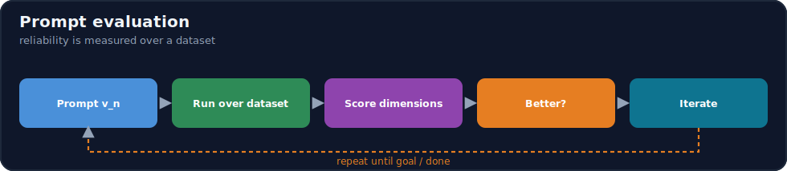
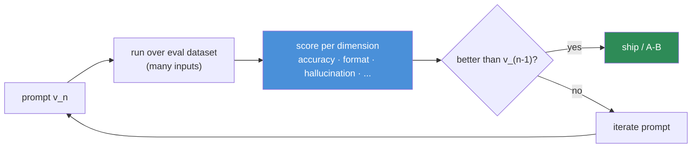
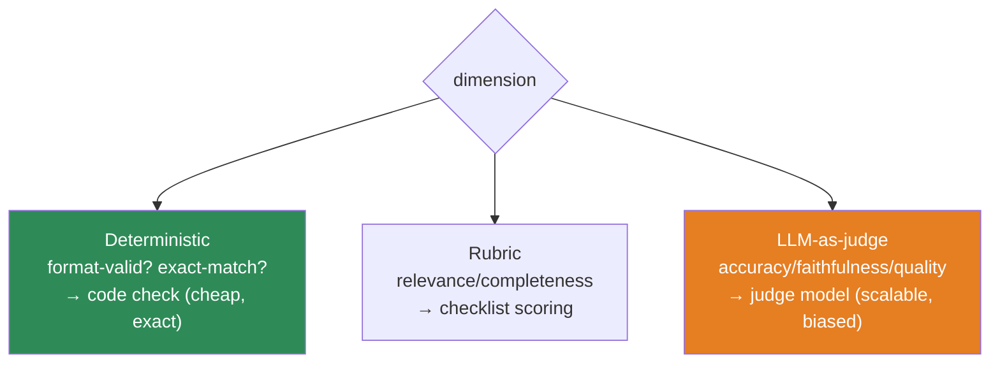

# 12.13 · Prompt Evaluation ⭐

[⬅ 12.12 Tool & Function Calling](12.12-tool-calling.md) · [🏠 Module 12](../README.md) · [➡ 12.14 Prompt Testing](12.14-testing.md)

> **The lesson in one line:** Because generation is probabilistic, you cannot know if a prompt is good by looking at one output — you must **measure it over a dataset** across multiple dimensions (accuracy, consistency, relevance, completeness, hallucination rate, format correctness), which is what turns prompt engineering from vibes into engineering.



---

## 🎯 Learning objectives

- Evaluate prompts on **accuracy, consistency, relevance, completeness, hallucination rate, format correctness**.
- Build **evaluation datasets** for prompts.
- Choose evaluation methods (exact-match, rubric, **LLM-as-judge**) per dimension.
- Make evaluation the driver of every prompt change.

## ✅ Prerequisites

- [12.1 probabilistic generation](12.1-how-llms-interpret-prompts.md), [12.6 structured outputs](12.6-structured-outputs.md).

---

## 🧠 Mental model

> [!IMPORTANT]
> **A prompt that gave a great answer once is a prompt you know nothing about.** The model is probabilistic ([12.1](12.1-how-llms-interpret-prompts.md)) and real inputs vary wildly — so "it worked when I tried it" is not evidence of reliability, it's a sample size of one. **Prompt quality is a statistical property measured over a representative dataset**, along several axes that can move independently (an answer can be accurate but wrong-format, or well-formatted but hallucinated). Evaluation is the instrument that lets you see those axes, compare prompt versions objectively, and catch regressions before users do. **You can't improve what you don't measure.**



---

## The evaluation dimensions

| Dimension | Question | How to measure |
|---|---|---|
| **Accuracy** | Is the answer correct? | exact-match / ground-truth compare / LLM-judge |
| **Consistency** | Same input → same output? | run N times; measure agreement (esp. at temp>0) |
| **Relevance** | Does it address the request? | rubric / LLM-judge |
| **Completeness** | Are all required parts present? | checklist of required elements |
| **Hallucination rate** | Does it invent unsupported content? | faithfulness check vs source ([13.12](../../13-RAG/weeks/13.12-evaluation.md)) |
| **Format correctness** | Is the output shape valid? | schema validation ([12.6](12.6-structured-outputs.md)) — deterministic |

> [!IMPORTANT]
> **These dimensions move independently, so a single score hides failures.** A prompt can be 95% accurate but only 70% format-valid (unparseable in prod), or perfectly formatted but hallucinate 20% of the time. **Track them separately.** Format correctness and consistency are cheap and deterministic — measure them always. Accuracy and hallucination need ground truth or a judge — invest in those where correctness matters.

---

## Building an evaluation dataset

You cannot evaluate without a dataset of `(input, expected)` cases. Sources:

| Source | How |
|---|---|
| **Hand-curated** | write representative inputs + expected outputs/criteria (best quality) |
| **Production logs** | real user inputs (+ labeled outcomes) — most representative |
| **Synthetic/LLM-generated** | generate diverse cases, then verify (fast coverage) |
| **Edge cases** | deliberately include hard, adversarial, and **unanswerable** cases |

> [!IMPORTANT]
> **Deliberately include the cases you're afraid of.** An eval set of easy, typical inputs will say every prompt is great. Add the ambiguous inputs, the edge cases, the adversarial/injection inputs ([12.16](12.16-security.md)), and the **unanswerable** ones (to test whether the model correctly abstains). The value of an eval set is proportional to how much it *stresses* the prompt.

---

## Evaluation methods



- **Deterministic checks** — format validity, exact/normalized match, contains-required-fields. Cheap, exact; prefer where possible.
- **Rubric scoring** — a checklist of required elements/criteria (from your prompt's success criteria, [12.2](12.2-anatomy-of-a-prompt.md)).
- **LLM-as-judge** — a model grades the output against the input/reference ([11.17](../../11-LLMs/weeks/11.17-evaluation.md)). Scalable but imperfect (position/verbosity/self-preference bias) — **calibrate against human labels** on a sample.

---

## 💻 An evaluation harness

```python
def evaluate(prompt_fn, dataset, judge=None):
    results = []
    for case in dataset:
        outputs = [prompt_fn(case.input) for _ in range(case.runs)]   # N runs for consistency
        results.append({
            "format_ok":     all(is_valid_schema(o) for o in outputs),          # deterministic
            "consistency":   agreement(outputs),                                # N-run agreement
            "accuracy":      score_accuracy(outputs[0], case.expected),         # match / judge
            "hallucination": judged_unsupported(outputs[0], case.source, judge),# faithfulness
            "complete":      has_required_elements(outputs[0], case.required),  # rubric
        })
    return aggregate(results)   # per-dimension averages + failures
```

Run this on **every prompt change** — a new version is "better" only if the numbers say so ([12.14](12.14-testing.md)).

---

## ⚖️ Weak vs strong evaluation

| | Approach |
|---|---|
| **Weak** | "I tried three prompts and this one looked best." → one-off, biased, no coverage, no regression safety |
| **Strong** | A 100-case eval set (incl. edge/unanswerable) scored per dimension; prompt v2 ships only if it beats v1 on accuracy without regressing format/hallucination. |

---

## 🏭 Production examples

| Practice | Payoff |
|---|---|
| Per-dimension dashboards | see which axis a change moved |
| Eval set from prod logs | representative of real inputs |
| LLM-judge calibrated vs humans | scalable accuracy scoring |
| Format/consistency always-on | catch parse breakage cheaply |
| Unanswerable/adversarial cases | catch hallucination + injection |

## ⚡ Performance & 💲 cost considerations

- **Evaluation costs LLM calls** (N runs × dataset × judge) — sample, cache, and use cheaper judges for routine runs, stronger for releases ([12.17](12.17-optimization.md)).
- **Deterministic checks are free** — lean on them; reserve judges for what needs them.
- **Bigger eval sets cost more but catch more** — balance coverage vs budget; grow the set from real failures.

## 🔒 Security considerations

> [!CAUTION]
> - **Eval datasets contain real inputs → possibly PII** — govern them like production data.
> - **Include a security suite** — adversarial/injection cases scored for whether the prompt resists them ([12.16](12.16-security.md)) as a tracked metric.
> - **LLM-judge sees outputs + references** — mind data flow for sensitive content.

## 🚫 Common mistakes

| Mistake | Consequence |
|---|---|
| Judging a prompt from one output | No idea of real reliability |
| A single blended score | Independent failures hidden |
| Easy-only eval set | Every prompt looks great; fails in prod |
| No unanswerable/adversarial cases | Hallucination + injection invisible |
| Uncalibrated LLM-judge | Biased scores drive wrong decisions |
| Changing prompts without re-evaluating | Silent regressions |

## 🐛 Debugging workflow

Prompt underperforming? (1) **Run the eval set and read per-dimension scores** — which axis is low? (2) **Format low** → schema/prompt fixes ([12.6](12.6-structured-outputs.md)); **accuracy low** → instructions/examples/context; **hallucination high** → grounding + escape hatch ([12.10](12.10-task-strategies.md)); **consistency low** → lower temperature. (3) **Inspect the failing cases** specifically. (4) Change one thing, re-evaluate, keep only if numbers improve. Metrics point at the fix. Full method in [12.15](12.15-debugging.md).

## 🏋️ Exercises

1. **Build an eval set.** Create 30 cases (incl. edge + unanswerable) with expected outputs/criteria for one task.
2. **Six dimensions.** Score a prompt on all six; find a case where accuracy is fine but format or hallucination fails.
3. **Consistency.** Run a prompt 10× at temp 0.7; measure agreement; lower temp and re-measure.
4. **Judge calibration.** Hand-label 20 outputs; compare to an LLM-judge; report agreement.
5. **A/B by numbers.** Evaluate two prompt versions; decide the winner purely from per-dimension scores.

## 🛠️ Mini project — "Prompt evaluation framework"

**Goal:** a reusable framework that scores prompts on all six dimensions over a dataset.

**Requirements:** dataset format (`input, expected, source, required, runs`); deterministic checks (format, match), rubric scoring, LLM-judge (calibrated); per-dimension aggregation + failure listing; a security sub-suite (adversarial/unanswerable).

**Folder structure**
```
prompt-eval/
├── dataset.py     # cases incl. edge/adversarial/unanswerable
├── metrics/       # format, accuracy, consistency, hallucination, completeness
├── judge.py       # LLM-as-judge + calibration
├── run.py         # evaluate a prompt version
└── report.py      # per-dimension dashboard + failures
```

**Testing:** deterministic metrics match hand-computed; judge calibrated vs human sample; unanswerable cases scored on abstention.
**Evaluation:** per-dimension scores + regression detection between versions.
**Security:** eval data governed; adversarial suite tracked.
**Future improvements:** online eval on prod traffic; per-segment slicing ([12.18](12.18-production.md)).

## 📄 Cheat sheet

| Concept | One line |
|---|---|
| **⭐ Core rule** | measure over a dataset, not one output |
| **Accuracy** | correct? (match / judge) |
| **Consistency** | same input → same output (N runs) |
| **Relevance** | addresses the request (rubric/judge) |
| **Completeness** | all required parts present (checklist) |
| **Hallucination** | invents unsupported content (faithfulness) |
| **⭐ Format** | valid shape (schema check — deterministic) |
| **Dataset** | curated + logs + synthetic; **include edge/unanswerable/adversarial** |
| **Methods** | deterministic > rubric > LLM-judge (calibrate) |

## 🎴 Flashcards

- **⭐ Why can't you judge a prompt from one output?** → Generation is probabilistic and inputs vary; quality is a statistical property measured over a representative dataset.
- **What are the six evaluation dimensions?** → Accuracy, consistency, relevance, completeness, hallucination rate, format correctness.
- **⭐ Why track dimensions separately?** → They move independently — a prompt can be accurate but wrong-format, or well-formatted but hallucinating; a blended score hides that.
- **What must a good eval set include?** → Edge cases, adversarial/injection cases, and unanswerable cases — not just easy typical inputs.
- **What are the evaluation methods, cheapest first?** → Deterministic checks (format/match), rubric scoring, LLM-as-judge (scalable but biased — calibrate).
- **How does evaluation drive prompt changes?** → A new version ships only if it improves the target metric without regressing others.

## 💬 Interview questions

1. Why is prompt evaluation fundamentally a dataset problem?
2. Name the evaluation dimensions and why they must be tracked separately.
3. How do you build a good evaluation dataset, and why include unanswerable cases?
4. Compare deterministic checks, rubric scoring, and LLM-as-judge.
5. What are the pitfalls of LLM-as-judge and how do you mitigate them?
6. How does evaluation connect to prompt versioning and A/B testing?

## 📝 Summary

- Because generation is **probabilistic**, prompt quality is a **statistical property measured over a dataset** — one good output tells you nothing.
- Evaluate on **six independent dimensions** (accuracy, consistency, relevance, completeness, hallucination rate, format correctness) — a blended score hides real failures.
- Build a dataset that **stresses** the prompt (edge, adversarial, unanswerable); use **deterministic checks where possible** and **calibrated LLM-judges** where needed.
- **Evaluation drives every change** — a new prompt version ships only if the numbers improve — which is the foundation of **testing and versioning** ([12.14](12.14-testing.md)).

## 📚 References

1. **[11.17 LLM Evaluation](../../11-LLMs/weeks/11.17-evaluation.md).** ⭐ LLM-as-judge, bias, contamination.
2. **[13.12 RAG Evaluation](../../13-RAG/weeks/13.12-evaluation.md).** Faithfulness/abstention metrics.
3. **OpenAI Evals / promptfoo / DeepEval.** Prompt evaluation tooling.
4. **[12.14 Prompt Testing](12.14-testing.md).** Evaluation in CI.

---

## 🧭 Navigation

| Direction | Link |
|---|---|
| ⬅ Previous | [12.12 · Tool & Function Calling](12.12-tool-calling.md) |
| ➡ Next | [12.14 · Prompt Testing](12.14-testing.md) |
| 🏠 Module | [Module 12](../README.md) |
| 📖 Lessons | [Lesson index](README.md) |
