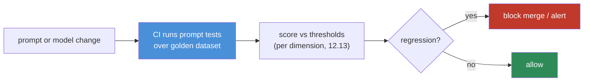
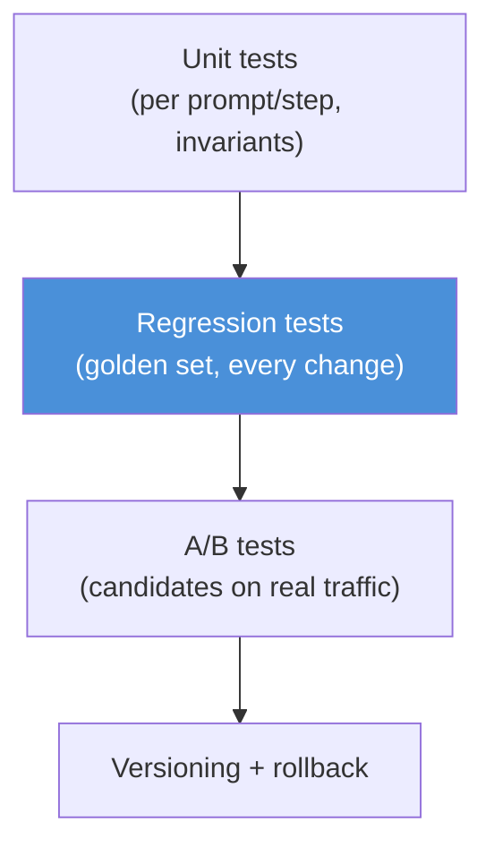

# 12.14 · Prompt Testing

[⬅ 12.13 Prompt Evaluation](12.13-evaluation.md) · [🏠 Module 12](../README.md) · [➡ 12.15 Debugging Prompts](12.15-debugging.md)

> **The lesson in one line:** If prompts are code ([12.9](12.9-templates.md)), they need the same safety net code has — **unit tests, golden datasets, regression tests, A/B tests, and versioning** — so that changing a prompt (or a model version silently changing under you) can't break production without a test catching it first.

---

## 🎯 Learning objectives

- Apply **unit testing, regression testing, golden datasets, evaluation datasets, A/B testing, and versioning** to prompts.
- Design a **prompt evaluation/testing workflow** (CI for prompts).
- Catch regressions from prompt *and* model changes.
- Decide winners between prompt versions objectively.

## ✅ Prerequisites

- [12.13 evaluation](12.13-evaluation.md) (the metrics), [12.9 templates](12.9-templates.md) (versioned prompts).

---

## 🧠 Mental model

> [!IMPORTANT]
> **Prompts are the one part of an LLM app that's both critical and silently fragile: a one-word edit, or a provider updating the model beneath you, can degrade quality with zero code changes and zero errors.** The only defense is treating prompts like tested code — a **regression suite** that runs the prompt over a **golden dataset** and fails when quality drops. Testing here isn't checking "does it return *something*" (it always does); it's checking "does it return something *good enough*, still, over our known cases." **Evaluation ([12.13](12.13-evaluation.md)) is the measurement; testing is the automation and gate.**



---

## The testing toolkit

### Unit testing prompts
Test a single prompt (or chain step, [12.8](12.8-prompt-chaining.md)) against specific `(input → expected)` cases with assertions: format valid, contains/equals expected, no forbidden content. Because output is probabilistic, assert on **invariants** (schema validity, required fields, "never outputs X") and use **thresholds** for fuzzy dimensions rather than exact equality.

### Golden datasets
A curated, version-controlled set of representative `(input, known-good output/criteria)` cases — the **reference** the prompt must keep satisfying. Golden sets are the backbone of regression testing; grow them from real production failures.

### Regression testing
Run the prompt over the golden set on **every change** (prompt edit, model upgrade, parameter tweak) and compare scores to the previous version. **A regression = any tracked metric dropping below threshold.** This is what catches "the new prompt fixed X but broke Y" and "the model provider changed something."

### Evaluation datasets
Broader than golden sets — larger, stress-testing sets ([12.13](12.13-evaluation.md)) used to measure overall quality and compare versions, including edge/adversarial/unanswerable cases.

### A/B testing
Run two prompt versions on **live traffic** (or a large offline set) and compare real outcomes (quality scores, user signals). Use it to choose between candidates when offline eval is close, and to validate a change on real distributions.

### Versioning
Every prompt is a named, semver'd artifact ([12.9](12.9-templates.md)); tests are tied to versions; you can **roll back** to the last version that passed. No version = no safe testing or rollback.



---

## The prompt testing workflow (CI for prompts)

1. **Author/edit** a prompt as a new version ([12.9](12.9-templates.md)).
2. **Run unit tests** (format, invariants, key cases).
3. **Run regression** over the golden set; **compare per-dimension scores** to the last-good version ([12.13](12.13-evaluation.md)).
4. **Gate:** block if any tracked metric regresses past threshold.
5. **A/B** the candidate vs current on a larger/live set if warranted.
6. **Promote** the winner; **pin** per environment; keep the ability to **roll back**.

> [!IMPORTANT]
> **Pin your model version in tests, and re-run the suite when the provider changes it.** A huge class of production incidents is "nothing in our code changed, but quality dropped" — because a hosted model was updated. Treat model version as an input to your tests; when it moves, your regression suite tells you if your prompts still hold.

---

## ⚖️ Weak vs strong

| | Approach |
|---|---|
| **Weak** | Edit the prompt in prod, eyeball a couple of outputs, ship. → silent regressions; no rollback. |
| **Strong** | New version → unit + regression tests over the golden set in CI → gated on no regression → A/B → promote/rollback by metrics. → changes are safe and reversible. |

---

## 🏭 Production examples

| Practice | Payoff |
|---|---|
| Golden set in CI, gated | no prompt change ships that regresses quality |
| Model-version pinning + scheduled re-eval | catch provider-side drift |
| A/B on live traffic | validate on real distribution |
| Versioned prompts + rollback | instant recovery from a bad change |
| Grow golden set from incidents | tests get stronger over time |

## ⚡ Performance & 💲 cost considerations

- **Test suites cost LLM calls** — keep golden sets focused; run the full eval set on releases, a smaller smoke set on every commit ([12.13](12.13-evaluation.md)).
- **Cache deterministic results**; use cheaper judge models for routine regression, stronger for release gates.
- **A/B testing spends on live traffic** — size the experiment for significance without overspending.

## 🔒 Security considerations

> [!CAUTION]
> - **Include a security regression suite** — adversarial/injection cases ([12.16](12.16-security.md)) that must keep failing to be exploited; a prompt change that weakens injection resistance should fail CI.
> - **Golden/eval data may contain PII** — govern and access-control it like production data.
> - **A/B on live traffic exposes real users to the candidate** — cap blast radius; monitor for safety regressions.

## 🚫 Common mistakes

| Mistake | Consequence |
|---|---|
| No regression suite | Silent quality drops on every edit |
| Not pinning/monitoring model version | Provider drift goes unnoticed |
| Exact-match asserts on fuzzy output | Flaky tests; false failures |
| Editing prompts in prod, no version | No rollback, no gate |
| Golden set never grows | Tests miss new failure modes |
| A/B without significance | Choosing noise as a "winner" |

## 🐛 Debugging workflow

A regression fired: (1) **Which dimension/cases dropped?** The suite localizes it ([12.13](12.13-evaluation.md)). (2) **What changed** — prompt edit or model version? Diff the prompt version ([12.9](12.9-templates.md)); check the model. (3) **Reproduce on the failing golden cases**; fix forward or **roll back** to the last passing version. (4) **Add the missed case** to the golden set so it can't recur. Full method in [12.15](12.15-debugging.md).

## 🏋️ Exercises

1. **Golden set + regression.** Build a 20-case golden set; write a regression check; make a "bad" prompt edit and watch it fail.
2. **Invariant unit tests.** Assert schema validity and "never outputs a refusal" for a classifier over 15 inputs.
3. **Model drift sim.** Run the suite against two model versions; detect a quality difference.
4. **A/B.** Compare two prompt versions on 100 cases; decide the winner with a significance check.
5. **Rollback drill.** Ship a regressing version, detect it, roll back to the last passing version.

## 🛠️ Mini project — "Prompt regression testing system"

**Goal:** CI-style testing that gates prompt/model changes on quality.

**Requirements:** golden dataset (versioned); unit tests (invariants); regression runner comparing per-dimension scores to last-good ([12.13](12.13-evaluation.md)); model-version pinning; A/B harness; version pinning + rollback; a security regression suite.

**Folder structure**
```
prompt-testing/
├── golden/         # versioned golden cases
├── unit.py         # invariant assertions
├── regress.py      # compare vs last-good, gate on thresholds
├── ab.py           # A/B on a larger/live set
├── security.py     # adversarial regression suite
└── versions.py     # pin/rollback
```

**Testing:** a regressing prompt is blocked; model-version change triggers re-eval; security cases stay non-exploitable; rollback restores last-good.
**Evaluation:** regression detection rate; false-failure rate.
**Security:** adversarial suite gated; governed test data.
**Monitoring:** track pass rates over time; alert on drift ([12.18](12.18-production.md)).
**Future improvements:** auto-add failing prod cases to golden set; canary A/B on live traffic.

## 📄 Cheat sheet

| Concept | One line |
|---|---|
| **⭐ Prompts are code** | test them: unit + regression + A/B + versioning |
| **Unit test** | assert invariants (schema, required, never-X) + key cases |
| **Golden dataset** | versioned reference cases the prompt must keep passing |
| **⭐ Regression** | run golden set on every change; fail if a metric drops |
| **Eval dataset** | broader stress set for overall quality/comparison |
| **A/B** | compare versions on real/large traffic; significance |
| **⭐ Pin model version** | detect silent provider-side drift |
| **Versioning** | semver + rollback to last-good |

## 🎴 Flashcards

- **⭐ Why do prompts need regression testing?** → A tiny prompt edit or a silent model update can degrade quality with no code change and no error; a golden-set regression suite is the only safety net.
- **What is a golden dataset?** → A versioned set of representative (input, known-good) cases the prompt must keep satisfying — the backbone of regression testing.
- **How do you unit-test a probabilistic prompt?** → Assert invariants (schema validity, required fields, "never outputs X") and use thresholds, not exact equality.
- **⭐ Why pin the model version in tests?** → So provider-side changes ("nothing changed but quality dropped") are caught by re-running the suite.
- **When do you A/B test prompts?** → To choose between candidates on real/large traffic when offline eval is close, and to validate on the real distribution.
- **What does versioning enable for testing?** → Tying tests to versions and rolling back to the last version that passed.

## 💬 Interview questions

1. How do you test something as non-deterministic as a prompt?
2. What is a golden dataset and how does regression testing use it?
3. Why must you pin and monitor the model version?
4. How do you write unit tests for probabilistic outputs?
5. When and how do you A/B test prompts?
6. How do versioning and testing combine to make prompt changes safe?

## 📝 Summary

- Prompts are **critical and silently fragile** — a small edit or a provider-side model update can degrade quality invisibly, so prompts need the same safety net as code.
- The toolkit: **unit tests** (invariants), **golden datasets** + **regression testing** (gate every change), **evaluation datasets** (stress/compare), **A/B testing** (real traffic), and **versioning** (rollback).
- **Pin the model version** and re-run the suite when it changes — a major source of "nothing changed but quality dropped" incidents.
- Testing operationalizes **evaluation** ([12.13](12.13-evaluation.md)) into a gate, and versioning ([12.9](12.9-templates.md)) makes changes safe and reversible — the foundation of **production prompt management** ([12.18](12.18-production.md)).

## 📚 References

1. **promptfoo / OpenAI Evals / DeepEval.** ⭐ Prompt testing in CI.
2. **[12.13 Prompt Evaluation](12.13-evaluation.md).** The metrics tests gate on.
3. **[12.9 Templates](12.9-templates.md).** Versioning and rollback.
4. **[12.18 Production](12.18-production.md).** Registries, monitoring, drift.

---

## 🧭 Navigation

| Direction | Link |
|---|---|
| ⬅ Previous | [12.13 · Prompt Evaluation](12.13-evaluation.md) |
| ➡ Next | [12.15 · Debugging Prompts](12.15-debugging.md) |
| 🏠 Module | [Module 12](../README.md) |
| 📖 Lessons | [Lesson index](README.md) |
