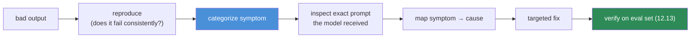
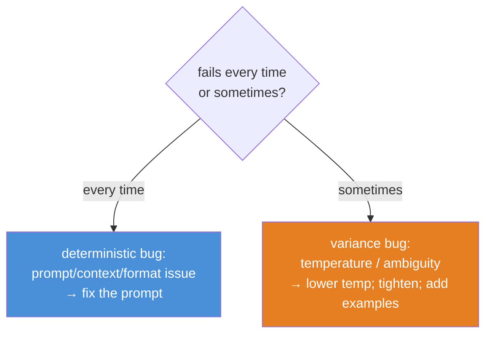

# 12.15 · Debugging Prompts

[⬅ 12.14 Prompt Testing](12.14-testing.md) · [🏠 Module 12](../README.md) · [➡ 12.16 Prompt Security](12.16-security.md)

> **The lesson in one line:** Debugging a bad LLM output is not "reword it and pray" — it's a **systematic diagnosis**: identify the *symptom category* (wrong, missing, hallucinated, mis-formatted, too verbose, inconsistent, constraint-ignored), map it to its likely *cause* (usually a missing prompt component or ambiguity), apply the targeted fix, and confirm with evaluation.

---

## 🎯 Learning objectives

- Diagnose the seven common failure symptoms and map each to root causes and fixes.
- Apply a **systematic debugging framework** instead of random rewording.
- Use inspection (the exact prompt the model saw) and evaluation to confirm fixes.

## ✅ Prerequisites

- [12.2 prompt anatomy](12.2-anatomy-of-a-prompt.md), [12.6 structured outputs](12.6-structured-outputs.md), [12.13 evaluation](12.13-evaluation.md).

---

## 🧠 Mental model

> [!IMPORTANT]
> **Random rewording is not debugging — it's superstition.** A bad output has a cause, and the cause is almost always one of a small set: the prompt was ambiguous, a component was missing ([12.2](12.2-anatomy-of-a-prompt.md)), the needed information wasn't in the context ([12.11](12.11-context-engineering.md)), the format wasn't specified/validated ([12.6](12.6-structured-outputs.md)), or the temperature was too high. **Debugging is: reproduce → categorize the symptom → inspect the exact input the model received → map to the likely cause → apply the targeted fix → verify with evaluation.** The symptom tells you which lever to pull.



---

## The symptom → cause → fix table

| Symptom | Likely cause | Targeted fix |
|---|---|---|
| **Incorrect output** | ambiguous task; missing context; weak instructions | clarify objective; add context; add examples ([12.5](12.5-few-shot.md)) |
| **Missing information** | info not in context; not asked for explicitly | supply it ([12.11](12.11-context-engineering.md)); require each field |
| **Hallucination** | no grounding; no escape hatch; over-broad task | "use only provided info" + "say unknown if absent" ([12.10](12.10-task-strategies.md)) |
| **Wrong format** | format unspecified/unvalidated; temp too high | give schema + example; validate; structured mode ([12.6](12.6-structured-outputs.md)); low temp |
| **Overly verbose** | no length/format constraint | constrain length; request structured/concise output |
| **Inconsistent behavior** | high temperature; under-specified prompt | lower temperature; add examples; tighten instructions |
| **Ignoring constraints** | constraint buried/weak; conflicts with examples | move constraint to system + end; align examples; validate ([12.6](12.6-structured-outputs.md)) |

> [!IMPORTANT]
> **Most fixes are adding or clarifying a component, not rephrasing.** Hallucination → add a grounding constraint and escape hatch. Wrong format → add a schema/example and *validate*. Inconsistency → lower temperature and add examples. Constraint ignored → move it to the system message and the end (recency), and make sure no example contradicts it ([12.5](12.5-few-shot.md)). Reach for structural fixes before creative rewording.

---

## The first move: inspect the exact input

Before changing anything, **print the fully assembled prompt the model actually received** — system + history + rendered variables + data ([12.1](12.1-how-llms-interpret-prompts.md), [12.9](12.9-templates.md)). A huge share of "the model is wrong" bugs are visible here:
- a variable rendered empty or malformed,
- data landing in the instruction region ([12.4](12.4-prompt-structure.md)),
- the relevant info absent or truncated by the token budget ([12.11](12.11-context-engineering.md)),
- an example contradicting an instruction.

**You can't debug what you can't see.** Log the concrete prompt for every failing case.

---

## Consistent vs intermittent failures



- **Fails every time** → a deterministic prompt problem (missing component, bad context, unspecified format). Fix the prompt.
- **Fails sometimes** → variance: high temperature or genuine ambiguity leaving multiple probable outputs. Lower temperature and remove the ambiguity ([12.1](12.1-how-llms-interpret-prompts.md), [12.13 consistency](12.13-evaluation.md)).

---

## ⚖️ Weak vs strong debugging

| | Approach |
|---|---|
| **Weak** | "It's wrong — let me try adding 'please be accurate' and rephrasing." → random walk, no diagnosis. |
| **Strong** | Reproduce → symptom = hallucination → inspect prompt (no grounding rule, info present) → add "use only the source + say unknown" → verify hallucination rate drops on the eval set. → targeted, confirmed. |

---

## 🏭 Production examples

| Practice | Payoff |
|---|---|
| Log full assembled prompt per request | root-cause any complaint fast |
| Symptom-categorized triage | consistent, fast fixes |
| Fix → re-run eval set | confirm the fix, catch regressions ([12.13](12.13-evaluation.md)) |
| Add fixed case to golden set | prevent recurrence ([12.14](12.14-testing.md)) |
| Chain/step tracing | localize which step failed ([12.8](12.8-prompt-chaining.md)) |

## ⚡ Performance & 💲 cost considerations

- **Debugging by evaluation costs calls** — reproduce on a *small* failing subset first, then confirm on the full set ([12.13](12.13-evaluation.md)).
- **Prompt logging has storage/PII cost** — sample in high volume; always log flagged failures.

## 🔒 Security considerations

> [!CAUTION]
> - **"Ignoring constraints" or "did something weird" can be injection** — inspect the input data for embedded instructions ([12.16](12.16-security.md)), not just your own prompt.
> - **Prompt logs contain user input/outputs → PII** — govern them; a debug view that shows raw context must respect access controls.
> - **Don't ship debug verbosity** (raw reasoning/system prompt) to end users while diagnosing.

## 🚫 Common mistakes

| Mistake | Consequence |
|---|---|
| Rewording without diagnosis | Random walk; no learning |
| Not inspecting the actual prompt | Miss empty vars, misplaced data, missing info |
| Ignoring consistent-vs-intermittent | Wrong fix (prompt vs temperature) |
| Fixing without re-evaluating | Unconfirmed fix; hidden regressions |
| Not adding the case to the golden set | Same bug returns ([12.14](12.14-testing.md)) |
| Assuming misbehavior is a model flaw | Usually a prompt/context/injection issue |

## 🐛 Debugging workflow (the framework)

1. **Reproduce** — confirm it fails; every time or sometimes?
2. **Categorize** the symptom (the seven above).
3. **Inspect** the exact assembled prompt the model received.
4. **Map** symptom → likely cause (usually a missing component / ambiguity / bad context / format / temperature / injection).
5. **Fix** with the targeted structural change.
6. **Verify** on the eval set ([12.13](12.13-evaluation.md)); ensure no regression.
7. **Lock it in** — add the case to the golden set ([12.14](12.14-testing.md)).

## 🏋️ Exercises

1. **Symptom drill.** Reproduce each of the seven symptoms deliberately; apply the mapped fix; confirm resolution.
2. **Inspect-first.** Find a bug that's obvious only after printing the assembled prompt (e.g., empty variable, misplaced data).
3. **Consistent vs intermittent.** Diagnose one deterministic and one temperature-driven failure; apply the right fix to each.
4. **Verify + lock.** Fix a hallucination, confirm the rate drop on the eval set, add the case to the golden set.
5. **Injection masquerade.** Create a "constraint-ignored" bug that's actually injection; show inspection reveals it.

## 🛠️ Mini project — "Prompt debugger"

**Goal:** a tool that categorizes a failure, shows the assembled prompt, suggests a cause/fix, and verifies.

**Requirements:** capture the exact prompt per request; symptom classifier (from output + expected); a symptom→cause→fix knowledge base; consistent/intermittent detection (re-run N times); re-eval hook to confirm a fix.

**Folder structure**
```
prompt-debugger/
├── capture.py     # assembled prompt + output logging
├── classify.py    # symptom category
├── diagnose.py    # symptom → cause → suggested fix
├── variance.py    # consistent vs intermittent
└── verify.py      # re-run eval after fix
```

**Testing:** each planted symptom is categorized correctly; inspection surfaces misplaced/empty data; verify confirms fixes.
**Evaluation:** time-to-fix on a set of seeded bugs.
**Security:** injection detection in inputs; access-controlled prompt logs.
**Future improvements:** auto-suggest the specific component to add; link to the golden-set updater ([12.14](12.14-testing.md)).

## 📄 Cheat sheet

| Symptom | Fix |
|---|---|
| Incorrect | clarify task; add context/examples |
| Missing info | supply it; require each field |
| **Hallucination** | "use only source" + escape hatch |
| **Wrong format** | schema + example + validate + low temp |
| Verbose | length/format constraint |
| Inconsistent | lower temperature; add examples |
| Constraint ignored | move to system + end; align examples; validate |
| **⭐ First move** | inspect the exact assembled prompt |
| **⭐ Rule** | fix the missing component, don't just reword |

## 🎴 Flashcards

- **⭐ What's the systematic prompt-debugging framework?** → Reproduce → categorize symptom → inspect the exact prompt → map to cause → targeted fix → verify on eval set → add to golden set.
- **What's the first debugging move?** → Print the fully assembled prompt the model actually received — many bugs (empty vars, misplaced data, missing info) are visible there.
- **⭐ Most prompt fixes are…?** → Adding or clarifying a missing component (grounding, format, example, constraint), not creative rewording.
- **Fails every time vs sometimes — what does it tell you?** → Every time = deterministic prompt/context/format bug; sometimes = variance (lower temperature, remove ambiguity).
- **How do you fix hallucination?** → Add a grounding constraint ("use only the provided info") and an escape hatch ("say unknown if absent").
- **When is "constraint ignored" actually a security issue?** → When injected instructions in the input data override your constraints — inspect the data.

## 💬 Interview questions

1. Describe a systematic approach to debugging a bad LLM output.
2. Map three symptoms to their likely causes and fixes.
3. Why is inspecting the assembled prompt the essential first step?
4. How does consistent-vs-intermittent failure change your fix?
5. Why is "add a component" usually better than "reword the prompt"?
6. How do you confirm a fix and prevent the bug from recurring?

## 📝 Summary

- Debugging prompts is **systematic diagnosis**, not rewording: **reproduce → categorize symptom → inspect the exact input → map to cause → targeted fix → verify → lock in**.
- The **first move is inspecting the assembled prompt** the model actually received — empty variables, misplaced data, missing info, and contradicting examples are visible there.
- **Symptoms map to causes and fixes**, and **most fixes add a missing component** (grounding, format, example, constraint) rather than rephrasing; **consistent vs intermittent** tells you prompt-bug vs temperature/ambiguity.
- Always **verify on the eval set** ([12.13](12.13-evaluation.md)) and **add the case to the golden set** ([12.14](12.14-testing.md)); some "misbehavior" is actually **injection** ([12.16](12.16-security.md)).

## 📚 References

1. **[12.2 Anatomy of a Prompt](12.2-anatomy-of-a-prompt.md).** Missing-component debugging.
2. **[12.13 Evaluation](12.13-evaluation.md) & [12.14 Testing](12.14-testing.md).** Verifying and locking in fixes.
3. **[13.13 RAG Debugging](../../13-RAG/weeks/13.13-debugging.md).** Trace-the-pipeline analog.
4. **[12.16 Prompt Security](12.16-security.md).** When misbehavior is injection.

---

## 🧭 Navigation

| Direction | Link |
|---|---|
| ⬅ Previous | [12.14 · Prompt Testing](12.14-testing.md) |
| ➡ Next | [12.16 · Prompt Security](12.16-security.md) |
| 🏠 Module | [Module 12](../README.md) |
| 📖 Lessons | [Lesson index](README.md) |
