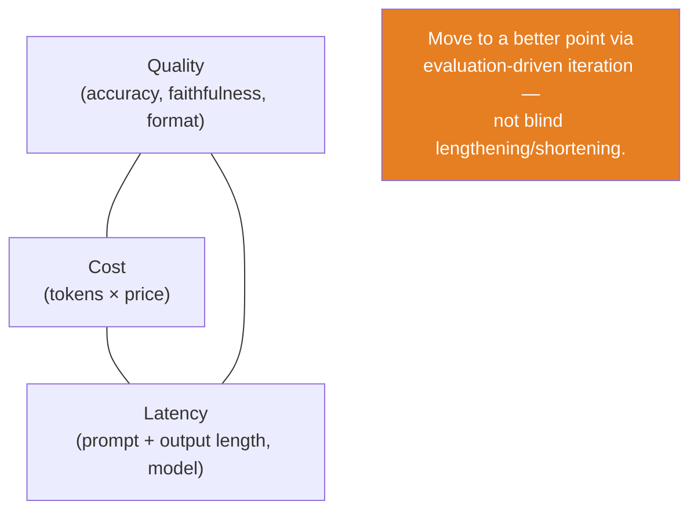
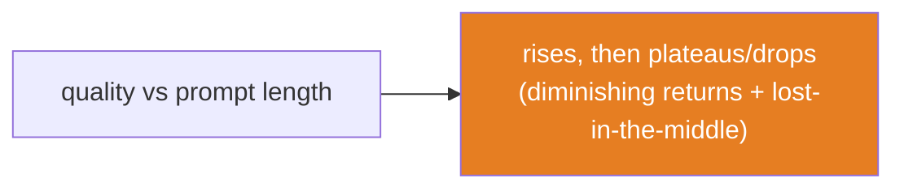
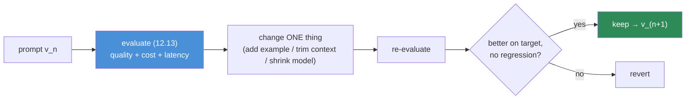

# 12.17 · Prompt Optimization

[⬅ 12.16 Prompt Security](12.16-security.md) · [🏠 Module 12](../README.md) · [➡ 12.18 Production Prompt Engineering](12.18-production.md)

> **The lesson in one line:** Optimizing a prompt means improving it along whichever axis is failing — quality (clarity, examples, constraints, context), or **cost/latency** (fewer tokens, smaller model) — but these trade off against each other, so optimization is **evaluation-driven iteration** toward the best point on the quality–cost–latency surface, not blind shortening or lengthening.

---

## 🎯 Learning objectives

- Improve prompts via **clearer instructions, better examples, reduced ambiguity, better context, output constraints, and evaluation-driven iteration**.
- Reason about the **prompt length ↔ cost ↔ latency ↔ quality** trade-offs.
- Optimize the *right* axis for the situation, verified by evaluation.

## ✅ Prerequisites

- [12.13 evaluation](12.13-evaluation.md) (the optimization signal), [12.11 context](12.11-context-engineering.md), [12.6 structured outputs](12.6-structured-outputs.md).

---

## 🧠 Mental model

> [!IMPORTANT]
> **Optimization is not "make the prompt shorter" or "make it longer" — it's moving to a better point on a trade-off surface, and you can only see that surface with evaluation ([12.13](12.13-evaluation.md)).** Every prompt has a quality (accuracy, faithfulness, format) and a cost/latency (tokens, model size). Adding examples and context usually *raises quality but raises cost*; trimming tokens and shrinking the model usually *cuts cost but risks quality*. **The optimized prompt is the one that hits your quality bar at acceptable cost/latency — found by changing one thing, measuring, and keeping what wins.**



---

## Quality levers

| Lever | Improves | How |
|---|---|---|
| **Clearer instructions** | accuracy, consistency | remove ambiguity; state the objective precisely ([12.2](12.2-anatomy-of-a-prompt.md)) |
| **Better examples** | format, edge cases | correct, diverse, boundary-covering ([12.5](12.5-few-shot.md)) |
| **Reduced ambiguity** | consistency | one interpretation; explicit conventions |
| **Better context** | correctness, grounding | the right info, well-placed ([12.11](12.11-context-engineering.md)) |
| **Output constraints** | format, verbosity | schema, length limits, "JSON only" ([12.6](12.6-structured-outputs.md)) |
| **Evaluation-driven iteration** | everything | change one thing → measure → keep if better |

## Cost/latency levers

| Lever | Cuts | Trade-off |
|---|---|---|
| **Fewer/shorter examples** | tokens | may lose edge-case reliability ([12.5](12.5-few-shot.md)) |
| **Compress context** | tokens | may drop needed info ([12.11](12.11-context-engineering.md)) |
| **Trim boilerplate** | tokens | usually free (keep only load-bearing text) |
| **Shorter outputs** | output tokens, latency | may lose detail — constrain length |
| **Smaller/cheaper model** | price, latency | may lose quality — verify on eval set |
| **Prompt caching** | latency, cost | needs a stable prefix ([12.9](12.9-templates.md)) |

> [!IMPORTANT]
> **Output tokens usually cost more than input tokens and dominate latency (decode is sequential, [11.15](../../11-LLMs/weeks/11.15-kv-cache.md)) — so constraining output length is often the highest-leverage cost/latency win.** After that: trim boilerplate (free), compress context (biggest input-token lever, [12.11](12.11-context-engineering.md)), reduce examples to the fewest that hold quality, and consider a smaller model — always re-checking quality on the eval set.

---

## The trade-offs, quantified

- **Prompt length ↔ cost:** cost ≈ (input tokens + output tokens) × price. Longer prompts and outputs cost linearly more, on **every call**.
- **Prompt length ↔ latency:** input length drives prefill (time-to-first-token); output length drives decode (time-per-token). Both grow with length.
- **Length ↔ quality:** more examples/context can raise quality — up to a point, then diminishing returns and lost-in-the-middle ([12.11](12.11-context-engineering.md)) *reduce* it. There's an optimum, not "more is better."
- **Model size ↔ everything:** a bigger model may raise quality but costs more and is slower; sometimes a smaller model + better prompt/context beats a bigger model + lazy prompt.



---

## Evaluation-driven iteration



> [!IMPORTANT]
> **Change one variable at a time and measure — never optimize by intuition on a single example.** "This shorter version seems fine" is how silent quality regressions ship. Define your target (e.g., "cut cost 30% without dropping accuracy below 90%"), then iterate: trim, measure, keep or revert. The eval set is the arbiter.

---

## ⚖️ Weak vs strong

| | Approach |
|---|---|
| **Weak** | "This prompt feels long, let me delete half of it." → quality silently drops; discovered in prod. |
| **Strong** | Measure baseline (quality/cost/latency). Trim boilerplate → re-eval (quality held, cost −15%). Reduce examples 5→3 → re-eval (quality held, cost −10%). Try smaller model → re-eval (accuracy −4%, revert). Ship the cheaper-but-equal version. |

---

## 🏭 Production examples

| Goal | Optimization |
|---|---|
| Cut cost at scale | compress context + fewer examples + smaller model (verified) |
| Cut latency | constrain output length; prompt-cache the prefix; smaller model |
| Raise quality | clearer instructions + boundary examples + better context |
| Balance | evaluation-driven iteration to a target point |

## ⚡ Performance & 💲 cost considerations

- This lesson *is* the cost/performance lesson — the levers above are the toolkit.
- **Prompt caching** ([12.9](12.9-templates.md)) cuts latency/cost when a stable prefix is reused — structure prompts as fixed-prefix + variable-suffix.
- **Batch** where the workload allows; **cache** repeated calls (exact or semantic, [13.16](../../13-RAG/weeks/13.16-performance.md)).

## 🔒 Security considerations

> [!CAUTION]
> - **Don't optimize away safety** — trimming the "treat input as data" directive or output validation to save tokens re-opens injection ([12.16](12.16-security.md)). Keep security controls out of the "trim" pile.
> - **Smaller models may be less robust** to injection/instruction-following — re-run the security suite when downsizing ([12.14](12.14-testing.md)).

## 🚫 Common mistakes

| Mistake | Consequence |
|---|---|
| Optimizing by intuition on one example | Silent quality regression |
| Changing multiple things at once | Can't attribute the effect |
| Shortening = deleting load-bearing text | Quality drop |
| Ignoring output length | Missed the biggest latency/cost lever |
| Downsizing model without re-eval | Unmeasured quality/security loss |
| Trimming safety directives for tokens | Re-opened vulnerabilities |

## 🐛 Debugging workflow

Prompt too costly/slow or under-quality? (1) **Measure the baseline** on the eval set (quality + tokens + latency). (2) **Identify the failing axis** — cost/latency or quality. (3) **Apply the matching lever** (output constraint / context compression / smaller model for cost; clarity / examples / context for quality). (4) **Change one thing, re-evaluate**, keep or revert. (5) **Re-run the security suite** if you downsized or trimmed. Optimization *is* the debugging loop with a cost/latency target. Full method in [12.15](12.15-debugging.md).

## 🏋️ Exercises

1. **Baseline + trim.** Measure quality/cost/latency; trim boilerplate; confirm quality held and cost dropped.
2. **Example count knee.** Sweep examples {1,3,5,8}; plot quality vs cost; pick the knee.
3. **Output length.** Constrain output length; measure latency/cost reduction and any quality loss.
4. **Model downsizing.** Move to a smaller model; re-eval quality + security; decide keep/revert.
5. **One-variable discipline.** Attempt a two-change optimization, then redo it one change at a time; compare what you learned.

## 🛠️ Mini project — "Prompt optimizer"

**Goal:** a harness that iterates a prompt toward a quality/cost/latency target, one change at a time.

**Requirements:** baseline measurement (quality via [12.13](12.13-evaluation.md), tokens, latency); a set of candidate transforms (trim boilerplate, compress context, reduce examples, constrain output, swap model); apply-one → re-evaluate → keep/revert loop; a security re-check gate; a Pareto report (quality vs cost).

**Folder structure**
```
prompt-optimizer/
├── measure.py     # quality + tokens + latency baseline
├── transforms.py  # one-change candidate edits
├── iterate.py     # apply → eval → keep/revert
├── security.py    # re-run adversarial suite on downsizing
└── pareto.py      # quality-vs-cost frontier
```

**Testing:** each accepted change holds quality and cuts cost/latency; security suite still passes; changes are one-at-a-time.
**Evaluation:** the quality–cost frontier before/after.
**Security:** safety directives protected from trimming; re-eval on downsizing.
**Future improvements:** automated prompt search; per-segment optimization; semantic caching ([13.16](../../13-RAG/weeks/13.16-performance.md)).

## 📄 Cheat sheet

| Concept | One line |
|---|---|
| **⭐ Optimization** | move to a better point on quality↔cost↔latency, via eval |
| **Quality levers** | clearer instructions · better examples · reduce ambiguity · better context · output constraints |
| **Cost/latency levers** | fewer examples · compress context · trim boilerplate · shorter output · smaller model · caching |
| **⭐ Output length** | usually the biggest latency/cost lever (decode) |
| **Length↔quality** | rises then plateaus/drops — an optimum, not "more" |
| **⭐ Method** | change one thing → measure → keep/revert |
| **⚠️ Don't trim** | safety directives / output validation |

## 🎴 Flashcards

- **⭐ What does prompt optimization actually optimize?** → A point on the quality↔cost↔latency trade-off surface — found via evaluation-driven iteration, not blind shortening/lengthening.
- **What are the main quality levers?** → Clearer instructions, better examples, reduced ambiguity, better context, and output constraints.
- **What are the main cost/latency levers?** → Fewer/shorter examples, compressed context, trimmed boilerplate, shorter outputs, a smaller model, and prompt caching.
- **⭐ Which lever is often the biggest latency/cost win?** → Constraining output length — decode is sequential and output tokens usually cost more.
- **Why change one variable at a time?** → To attribute effects and avoid shipping silent regressions; the eval set is the arbiter.
- **What must you never optimize away?** → Safety directives (data-as-data) and output validation — trimming them re-opens injection.

## 💬 Interview questions

1. What does it mean to "optimize" a prompt, and why is evaluation essential?
2. Explain the length↔cost↔latency↔quality trade-offs.
3. Why is output length often the biggest cost/latency lever?
4. Why does more context/examples eventually reduce quality?
5. How do you optimize without introducing silent regressions?
6. What are the security risks of aggressive prompt optimization?

## 📝 Summary

- Prompt optimization is **evaluation-driven iteration to a better point on the quality↔cost↔latency surface** — not blind shortening or lengthening.
- **Quality levers**: clearer instructions, better/boundary examples, reduced ambiguity, better context, output constraints. **Cost/latency levers**: fewer examples, compressed context, trimmed boilerplate, shorter outputs, smaller model, caching — with **output length often the biggest lever**.
- **More is not better** — quality vs length rises then plateaus/drops; find the optimum by **changing one thing and measuring** ([12.13](12.13-evaluation.md)).
- **Never optimize away safety** (data-as-data, validation) — and **re-run the security suite** when downsizing models ([12.14](12.14-testing.md), [12.16](12.16-security.md)).

## 📚 References

1. **[12.13 Evaluation](12.13-evaluation.md).** The optimization signal.
2. **[12.11 Context Engineering](12.11-context-engineering.md).** Compression as a cost lever.
3. **[11.15 KV Cache](../../11-LLMs/weeks/11.15-kv-cache.md).** Prefill/decode and why output length dominates.
4. **[13.16 RAG Performance](../../13-RAG/weeks/13.16-performance.md).** Caching and cost at the system level.

---

## 🧭 Navigation

| Direction | Link |
|---|---|
| ⬅ Previous | [12.16 · Prompt Security](12.16-security.md) |
| ➡ Next | [12.18 · Production Prompt Engineering](12.18-production.md) |
| 🏠 Module | [Module 12](../README.md) |
| 📖 Lessons | [Lesson index](README.md) |
