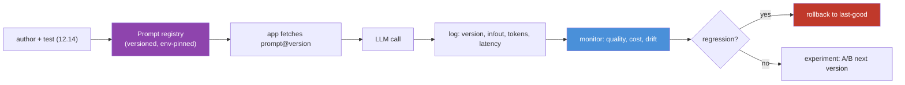
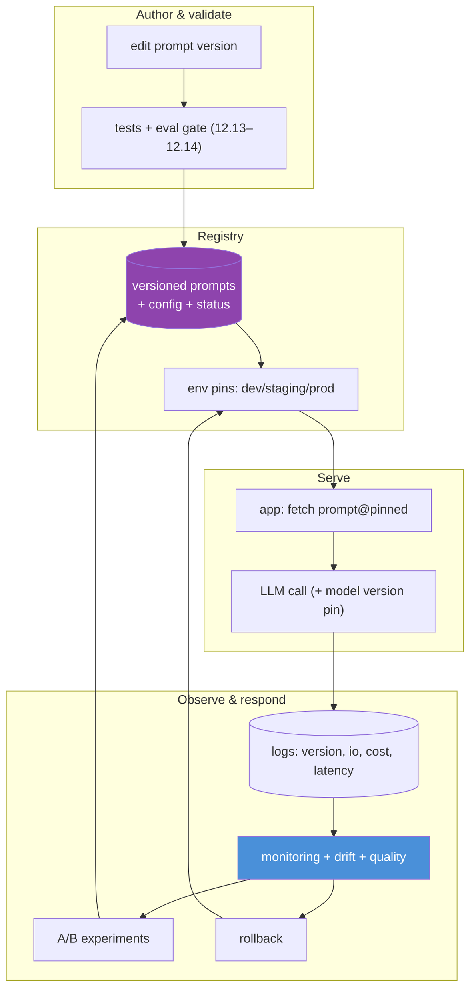

# 12.18 · Production Prompt Engineering

[⬅ 12.17 Prompt Optimization](12.17-optimization.md) · [🏠 Module 12](../README.md) · [➡ 12.19 Prompt Engineering with Python](12.19-python.md)

> **The lesson in one line:** In production, a prompt is a **deployed artifact with a lifecycle** — it lives in a versioned registry, is pinned per environment, is logged and monitored in the wild, can be rolled back instantly when it regresses, and is improved through controlled experimentation, exactly like any other piece of production software.

---

## 🎯 Learning objectives

- Manage prompts as production artifacts: **version control, registries, environment-specific prompts, logging, monitoring, rollback, experimentation**.
- Design a **production prompt management architecture**.
- Detect and respond to quality drift (prompt- or model-driven).

## ✅ Prerequisites

- [12.9 templates/versioning](12.9-templates.md), [12.13 evaluation](12.13-evaluation.md), [12.14 testing](12.14-testing.md).

---

## 🧠 Mental model

> [!IMPORTANT]
> **Once a prompt serves real users, "editing a string" is a production deployment — treat it like one.** That means: the prompt is **versioned** (know exactly what's live), stored in a **registry** (not hardcoded), **pinned per environment** (dev/staging/prod can differ), **logged** (every call's prompt version, input, output, cost), **monitored** (quality/latency/cost/drift), **rollback-able** (revert a bad change in seconds), and changed via **controlled experiments** (A/B), not hot edits. Prompts are the most-changed, least-guarded part of many LLM apps — production discipline is what closes that gap.



---

## The production capabilities

### Prompt version control
Prompts live in **version control** (or a registry backed by it) with history, review, and diffs — never edited live in a database or hardcoded string ([12.9](12.9-templates.md)). Every change is a reviewable, revertible commit.

### Prompt registry
A central store to **publish, fetch, and pin** prompts by `name@version`, with metadata (owner, model/config, description, status). The app requests `classify_ticket@2.3.0`; the registry serves it. Decouples prompt changes from app deploys.

### Environment-specific prompts
Dev, staging, and prod can pin **different versions** — test v3 in staging while prod runs v2. Promotion moves a version through environments after it passes tests ([12.14](12.14-testing.md)).

### Logging
Log every call: **prompt version, inputs, outputs, token counts, latency, cost, model version**. This is the raw material for debugging ([12.15](12.15-debugging.md)), evaluation from real traffic ([12.13](12.13-evaluation.md)), and incident forensics — governed for PII ([12.16](12.16-security.md)).

### Monitoring
Track in production: **quality signals** (user feedback, refusal/error rates, sampled faithfulness), **operational** (latency, cost/call, throughput), and **drift** (output distribution changes, model-version changes). Alert on regressions.

### Rollback
Because prompts are versioned and env-pinned, a bad change is reverted by **re-pinning the last-good version** — no code deploy. Fast rollback is the safety net that makes frequent prompt iteration safe.

### Experimentation
Roll out changes via **A/B or canary** ([12.14](12.14-testing.md)): a fraction of traffic gets the new version, compared on live metrics, promoted only if it wins. Controlled experiments replace risky hot edits.

---

## Production prompt management architecture



> [!IMPORTANT]
> **Monitor quality, not just uptime — and pin the model version.** An LLM app can be fully "up" while quality quietly degrades because a prompt regressed or the **provider updated the model** under you ([12.14](12.14-testing.md)). Track quality signals online (feedback, refusal rate, sampled evaluation) and record the model version with every call so drift is attributable. Healthy-but-wrong is the characteristic production failure.

---

## ⚖️ Weak vs strong

| | Approach |
|---|---|
| **Weak** | Prompt hardcoded in the app; changed by editing the string and redeploying; no version logged; a regression is discovered via user complaints with no way to roll back except another deploy. |
| **Strong** | Prompt in a registry, `@version` pinned per env, every call logs version + cost; a canary A/B validates changes; monitoring alerts on drift; a bad version is rolled back in seconds by re-pinning. |

---

## 🏭 Production examples

| Capability | Payoff |
|---|---|
| Registry + env pins | change prompts without app deploys; staged rollout |
| Per-call version logging | attribute any regression to a prompt/model change |
| Online quality monitoring | catch drift before users churn |
| Canary A/B | validate on real traffic, limited blast radius |
| Instant rollback | recover from a bad prompt in seconds |

## ⚡ Performance & 💲 cost considerations

- **Log token/cost per call** to attribute spend to prompt versions and catch cost regressions ([12.17](12.17-optimization.md)).
- **Registry fetch adds a tiny lookup** — cache the active prompt in the app.
- **Monitoring/eval sampling costs** — sample proportionally; full eval on release.

## 🔒 Security considerations

> [!CAUTION]
> - **Access-control the registry** — prompts are application logic; unauthorized edits are a code-injection-equivalent risk ([12.16](12.16-security.md)).
> - **Logs contain inputs/outputs → PII/secrets** — govern, redact, and access-control them.
> - **Run the security regression suite in the promotion gate** ([12.14](12.14-testing.md)) — a change must not weaken injection resistance.
> - **Audit prompt changes** — who changed what, when (change history).

## 🚫 Common mistakes

| Mistake | Consequence |
|---|---|
| Hardcoded prompts | Every change is a code deploy; no rollback |
| No per-call version logging | Can't attribute regressions |
| Monitoring uptime only | Silent quality drift |
| No model-version pin/record | Provider drift undetected |
| Hot edits, no A/B | Untested changes hit all users |
| Ungoverned logs | PII/secret exposure |
| No rollback path | Slow recovery from bad changes |

## 🐛 Debugging workflow

Production quality dropped: (1) **What changed?** Check recent prompt-version and model-version changes from logs. (2) **Attribute** — did metrics drop after a specific prompt version or a model update? (3) **Roll back** to the last-good version immediately (re-pin) while fixing forward. (4) **Reproduce** on logged failing cases; fix; **A/B** the fix. (5) **Add cases to the golden set** ([12.14](12.14-testing.md)). Versioning + logging turn "mystery regression" into "diff, attribute, roll back." Full method in [12.15](12.15-debugging.md).

## 🏋️ Exercises

1. **Registry.** Build a minimal prompt registry (publish/fetch by name@version, env pins); make the app fetch instead of hardcode.
2. **Version logging.** Log prompt+model version, tokens, latency per call; query "which version served this bad output?"
3. **Rollback drill.** Deploy a regressing version; detect via monitoring; roll back by re-pinning; measure recovery time.
4. **Canary.** Route 10% of traffic to a new version; compare live metrics; promote or abort.
5. **Drift alarm.** Simulate a model-version change; show monitoring flags the quality shift.

## 🛠️ Mini project — "Production prompt management system"

**Goal:** an end-to-end system to version, serve, observe, experiment, and roll back prompts.

**Requirements:** registry (versioned prompts + config + status, env pins); promotion gate (tests + eval + security, [12.14](12.14-testing.md)); app-side fetch/cache; per-call logging (version, io, cost, latency, model version); monitoring (quality/cost/drift + alerts); canary A/B; one-click rollback; change audit.

**Folder structure**
```
prompt-ops/
├── registry.py     # publish/fetch/pin by name@version
├── promote.py      # gate: tests + eval + security
├── serve.py        # app fetch + cache
├── logging.py      # per-call version/io/cost/latency/model
├── monitor.py      # quality/cost/drift + alerts
├── experiment.py   # canary A/B
└── rollback.py     # re-pin last-good
```

**Testing:** rollback restores last-good; regressions blocked at promotion; canary limits blast radius; version attributable per call.
**Evaluation:** MTTR for a bad prompt; drift-detection latency.
**Security:** registry access control; governed/redacted logs; security gate in promotion.
**Monitoring:** online quality + cost dashboards; drift + model-change alerts.
**Future improvements:** auto-promote on winning A/B; auto-add prod failures to golden set; multi-region registry.

## 📄 Cheat sheet

| Capability | One line |
|---|---|
| **Version control** | prompts in VCS; reviewable, revertible changes |
| **⭐ Registry** | publish/fetch/pin by name@version; decouple from deploys |
| **Env-specific** | dev/staging/prod pin different versions |
| **Logging** | per-call version, io, tokens, latency, **model version** |
| **⭐ Monitoring** | quality (not just uptime), cost, drift + alerts |
| **⭐ Rollback** | re-pin last-good — seconds, no code deploy |
| **Experimentation** | canary/A/B on live traffic; promote winners |
| **⚠️ Secure** | access-control registry; govern logs; security gate |

## 🎴 Flashcards

- **⭐ Why treat a prompt edit as a production deployment?** → It changes live behavior for real users; it needs versioning, testing, staged rollout, monitoring, and rollback like any deploy.
- **What is a prompt registry?** → A central store to publish/fetch/pin prompts by name@version with config and status, decoupling prompt changes from app deploys.
- **Why log the model version per call?** → To attribute quality drift to provider-side model updates ("nothing changed but quality dropped").
- **⭐ Why monitor quality, not just uptime?** → An app can be fully up while quality silently degrades from a prompt regression or model change.
- **How does rollback work for prompts?** → Re-pin the last-good version in the registry — seconds, no code deploy.
- **How should prompt changes reach production?** → Through a promotion gate (tests + eval + security) and canary/A/B experiments, not hot edits.

## 💬 Interview questions

1. What does it take to run prompts in production responsibly?
2. What is a prompt registry, and why decouple prompts from app deploys?
3. Why log per-call prompt and model versions?
4. Why is monitoring quality (not uptime) essential, and what signals do you track?
5. How do rollback and canary/A/B make prompt changes safe?
6. What are the security considerations for a prompt management system?

## 📝 Summary

- In production a prompt is a **deployed artifact with a lifecycle**: **versioned**, stored in a **registry**, **pinned per environment**, **logged**, **monitored**, **rollback-able**, and changed via **experimentation** — not hardcoded and hot-edited.
- **Monitor quality, cost, and drift — not just uptime — and pin/record the model version**, because "healthy but wrong" (from a prompt regression or a provider model update) is the characteristic production failure.
- **Rollback (re-pin last-good) and canary/A/B** make frequent prompt iteration safe; **logging + versioning** turn regressions into "diff, attribute, revert."
- **Secure the registry and logs** and gate promotions on the **security suite** ([12.14](12.14-testing.md), [12.16](12.16-security.md)) — this is the operational home of everything the module taught.

## 📚 References

1. **[12.9 Templates](12.9-templates.md) & [12.14 Testing](12.14-testing.md).** Versioning, gates, rollback.
2. **[11.20 Production LLM Architecture](../../11-LLMs/weeks/11.20-production-architecture.md).** The system around the model.
3. **LangSmith / PromptLayer / Humanloop.** Prompt registries and observability.
4. **[13.15 Production RAG Architecture](../../13-RAG/weeks/13.15-production-architecture.md).** Productionizing LLM pipelines.

---

## 🧭 Navigation

| Direction | Link |
|---|---|
| ⬅ Previous | [12.17 · Prompt Optimization](12.17-optimization.md) |
| ➡ Next | [12.19 · Prompt Engineering with Python](12.19-python.md) |
| 🏠 Module | [Module 12](../README.md) |
| 📖 Lessons | [Lesson index](README.md) |
