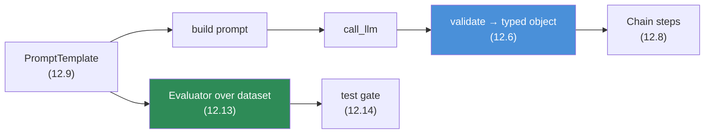
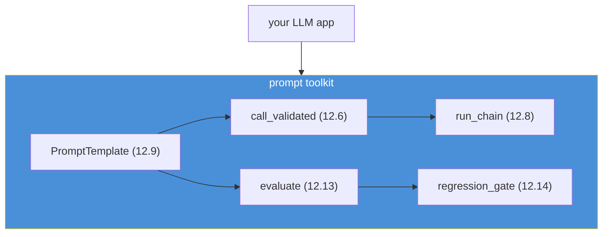

# 12.19 · Prompt Engineering with Python

[⬅ 12.18 Production Prompt Engineering](12.18-production.md) · [🏠 Module 12](../README.md) · [➡ 12.20 Projects & Summary](12.20-projects-summary.md)

> **The lesson in one line:** Everything the module taught — templates, structured-output validation, chaining, evaluation, testing — becomes real as a small set of **clean, reusable Python components**, so this lesson assembles them into a coherent toolkit you can drop into any LLM application.

---

## 🎯 Learning objectives

- Build reusable Python components for **prompt templates, prompt construction, structured-output validation, prompt testing, and evaluation**.
- Assemble them into a coherent, production-quality toolkit.
- Connect each component to the lesson that motivates it.

## ✅ Prerequisites

- You know Python. [12.6 structured outputs](12.6-structured-outputs.md), [12.9 templates](12.9-templates.md), [12.13 evaluation](12.13-evaluation.md), [12.14 testing](12.14-testing.md).

---

## 🧠 Mental model

> [!IMPORTANT]
> **The concepts in this module are not abstractions — they're a handful of small, composable Python objects.** A `PromptTemplate` renders text safely; a validated schema turns model output into a typed object; a `Chain` runs steps with validated seams; an `Evaluator` scores a prompt over a dataset; a test harness gates changes. Put together, they're a **prompt engineering toolkit**: the same building blocks a framework ([13.17](../../13-RAG/weeks/13.17-frameworks.md)) provides, but transparent and yours. This lesson is the code spine that the mini-projects ([12.20](12.20-projects-summary.md)) extend.



---

## Component 1 — Prompt template

A versioned template with safe, typed rendering ([12.9](12.9-templates.md), [12.4](12.4-prompt-structure.md)):

```python
from dataclasses import dataclass, field

@dataclass(frozen=True)
class PromptTemplate:
    name: str
    version: str
    system: str
    user_template: str                     # uses {slots}
    config: dict = field(default_factory=lambda: {"temperature": 0, "max_tokens": 512})

    def render(self, **vars) -> dict:
        # Untrusted vars belong in delimited data regions inside user_template (12.4/12.16).
        return {
            "system": self.system,
            "user": self.user_template.format(**{k: _fence(v) for k, v in vars.items()}),
            "config": self.config,
        }

def _fence(v):                              # neutralize delimiter collisions in untrusted input
    return str(v).replace("</data>", "<\\/data>")
```

## Component 2 — Structured output validation

Turn raw output into a typed object or fail explicitly ([12.6](12.6-structured-outputs.md)):

```python
from pydantic import BaseModel
import json, re

def parse_structured(raw: str, model: type[BaseModel]):
    raw = re.sub(r"^```(?:json)?|```$", "", raw.strip(), flags=re.M).strip()  # strip fences
    return model.model_validate_json(raw)   # raises on invalid → caller repairs/rejects

def call_validated(template, model_cls, call_llm, retries=1, **vars):
    msg = template.render(**vars)
    for attempt in range(retries + 1):
        raw = call_llm(**msg)
        try:
            return parse_structured(raw, model_cls)
        except Exception as e:
            msg["user"] += f"\n\nPrevious output invalid ({e}). Return ONLY valid JSON."
    raise ValueError(f"{template.name}@{template.version} failed to produce valid output")
```

## Component 3 — Prompt construction / chaining

Run steps with validated seams ([12.8](12.8-prompt-chaining.md)):

```python
@dataclass
class Step:
    template: PromptTemplate
    schema: type[BaseModel]

def run_chain(steps: list[Step], call_llm, **initial):
    ctx = dict(initial)
    trace = []
    for step in steps:
        out = call_validated(step.template, step.schema, call_llm, **ctx)  # validated per step
        trace.append((step.template.name, out))
        ctx.update(out.model_dump())            # typed output → next step's input
    return ctx, trace                            # trace enables step-level debugging (12.15)
```

## Component 4 — Evaluation

Score a prompt over a dataset on multiple dimensions ([12.13](12.13-evaluation.md)):

```python
@dataclass
class Case:
    input: dict
    expected: dict | None = None
    runs: int = 1

def evaluate(template, schema, call_llm, dataset: list[Case], accuracy_fn):
    rows = []
    for case in dataset:
        outs, fmt_ok = [], True
        for _ in range(case.runs):
            try:
                outs.append(call_validated(template, schema, call_llm, retries=0, **case.input))
            except Exception:
                fmt_ok = False
        rows.append({
            "format_ok":   fmt_ok,
            "consistency": _agreement(outs),
            "accuracy":    accuracy_fn(outs[0], case.expected) if outs and case.expected else None,
        })
    return _aggregate(rows)                       # per-dimension summary
```

## Component 5 — Testing / regression gate

Gate changes on the golden set ([12.14](12.14-testing.md)):

```python
def regression_gate(new_tpl, schema, call_llm, golden, accuracy_fn, thresholds):
    scores = evaluate(new_tpl, schema, call_llm, golden, accuracy_fn)
    failures = {k: v for k, v in scores.items()
                if k in thresholds and v is not None and v < thresholds[k]}
    if failures:
        raise AssertionError(f"regression in {new_tpl.name}@{new_tpl.version}: {failures}")
    return scores
```

---

## The toolkit, assembled



> [!IMPORTANT]
> **These five components — template, validated call, chain, evaluator, gate — are the reusable core of any LLM application.** They keep prompts safe (fenced data), reliable (validated output), composable (chains), and honest (evaluation + gates). A framework bundles equivalents; building them yourself once means you understand exactly what every LLM app is doing under the hood ([13.17](../../13-RAG/weeks/13.17-frameworks.md)).

---

## 🏭 Production examples

| Component | Production role |
|---|---|
| `PromptTemplate` + registry | versioned, safe prompts ([12.18](12.18-production.md)) |
| `call_validated` | typed outputs into services ([12.6](12.6-structured-outputs.md)) |
| `run_chain` | multi-step pipelines with traces ([12.8](12.8-prompt-chaining.md)) |
| `evaluate` / `regression_gate` | CI quality gates ([12.13](12.13-evaluation.md)–[12.14](12.14-testing.md)) |

## ⚡ Performance & 💲 cost considerations

- **Cache** rendered prompts and repeated calls; instrument token/latency per call ([12.17](12.17-optimization.md)).
- **Batch** evaluation runs; parallelize independent chain steps.
- Keep the **stable system prompt** first for prompt caching ([12.9](12.9-templates.md)).

## 🔒 Security considerations

> [!CAUTION]
> - **`_fence`/validation are load-bearing** — untrusted variables must be fenced and outputs validated before use; never `eval`/exec model output ([12.6](12.6-structured-outputs.md), [12.16](12.16-security.md)).
> - **Don't log secrets/PII** from rendered prompts and outputs without redaction ([12.18](12.18-production.md)).
> - **Config carries safety** (low temperature, max tokens) — keep it with the template.

## 🚫 Common mistakes

| Mistake | Consequence |
|---|---|
| Inline prompt strings, no template object | Untestable, unsafe ([12.9](12.9-templates.md)) |
| Using raw output without validation | Crashes/injection ([12.6](12.6-structured-outputs.md)) |
| Chain without per-step validation | Errors propagate ([12.8](12.8-prompt-chaining.md)) |
| No evaluation/gate in code | Silent regressions ([12.14](12.14-testing.md)) |
| Unfenced untrusted variables | Injection ([12.16](12.16-security.md)) |

## 🏋️ Exercises

1. **Build the toolkit.** Implement all five components; wire them for a classification task end-to-end.
2. **Validated call.** Add a repair-retry and confirm the valid-output rate rises.
3. **Chain + trace.** Build a 3-step chain; use the trace to localize a planted step failure.
4. **Evaluator.** Score a prompt on format/consistency/accuracy over a 20-case dataset.
5. **Gate.** Add a regression gate; make a bad edit and watch it fail.

## 🛠️ Mini project — "Prompt engineering toolkit"

**Goal:** a small, clean library packaging the five components for reuse across projects.

**Requirements:** `PromptTemplate` (safe render + config + version); `call_validated` (parse + validate + repair); `run_chain` (validated seams + trace); `evaluate` (multi-dimension); `regression_gate`; provider-agnostic `call_llm` adapter; tests.

**Folder structure**
```
prompt-kit/
├── template.py     # PromptTemplate + safe render
├── validate.py     # parse_structured + call_validated
├── chain.py        # Step + run_chain + trace
├── evaluate.py     # Case + evaluate
├── gate.py         # regression_gate
├── llm.py          # provider-agnostic adapter
└── tests/
```

**Testing:** fenced vars resist injection; invalid output triggers repair/reject; chain trace localizes failures; gate blocks regressions.
**Evaluation:** per-dimension scores wired into the gate.
**Security:** fencing + validation + no exec; redacted logging.
**Monitoring:** hooks for token/latency/version logging ([12.18](12.18-production.md)).
**Future improvements:** async/batch; registry backend; streaming validation.

## 📄 Cheat sheet

| Component | One line |
|---|---|
| **PromptTemplate** | versioned, safe-render text + config ([12.9](12.9-templates.md)) |
| **call_validated** | render → call → parse → validate → repair/reject ([12.6](12.6-structured-outputs.md)) |
| **run_chain** | steps with validated seams + trace ([12.8](12.8-prompt-chaining.md)) |
| **evaluate** | multi-dimension scoring over a dataset ([12.13](12.13-evaluation.md)) |
| **regression_gate** | block changes that drop metrics ([12.14](12.14-testing.md)) |
| **⭐ Together** | the transparent core of any LLM app |

## 🎴 Flashcards

- **⭐ What five components form a prompt toolkit?** → PromptTemplate, validated call, chain runner, evaluator, and regression gate.
- **Why wrap the LLM call in `call_validated`?** → To parse, schema-validate, and repair/reject output so downstream code only ever sees typed, valid data.
- **What makes a chain runner reliable?** → Validating each step's structured output before it becomes the next step's input, plus a trace for debugging.
- **Why fence untrusted template variables?** → To prevent delimiter-collision and keep injected instructions inside the data region ([12.16](12.16-security.md)).
- **What does the regression gate do?** → Runs the evaluator over the golden set and blocks a change if any tracked metric drops below threshold.
- **How does this relate to frameworks?** → Frameworks bundle equivalents; building them yourself makes every LLM app's internals transparent.

## 💬 Interview questions

1. What reusable components make up a prompt-engineering toolkit, and what does each do?
2. Why wrap every LLM call in a validate-and-repair function?
3. How do you pass data safely between chain steps in code?
4. How would you implement an evaluation-and-gate loop in Python?
5. Where do security controls (fencing, validation) live in the toolkit?
6. What do you gain by building these components instead of using a framework?

## 📝 Summary

- The module's concepts materialize as **five clean Python components**: a safe `PromptTemplate`, a `call_validated` wrapper (parse→validate→repair), a `run_chain` runner with validated seams and a trace, an `evaluate` function over a dataset, and a `regression_gate`.
- Together they are the **transparent core of any LLM application** — safe prompts, typed outputs, composable steps, and evaluation-gated changes.
- **Fencing and validation are load-bearing security controls**; keep **config with the template** and instrument for **cost/latency/version logging** ([12.18](12.18-production.md)).
- These components are the code spine the **mini-projects** ([12.20](12.20-projects-summary.md)) build on, and the same building blocks a framework provides ([13.17](../../13-RAG/weeks/13.17-frameworks.md)).

## 📚 References

1. **Pydantic docs.** ⭐ Typed validation of model output.
2. **[12.9 Templates](12.9-templates.md), [12.6 Structured Outputs](12.6-structured-outputs.md), [12.8 Chaining](12.8-prompt-chaining.md).** The components' concepts.
3. **[12.13 Evaluation](12.13-evaluation.md), [12.14 Testing](12.14-testing.md).** Evaluator and gate.
4. **Instructor / Outlines / Guidance libraries.** Structured-output tooling in Python.

---

## 🧭 Navigation

| Direction | Link |
|---|---|
| ⬅ Previous | [12.18 · Production Prompt Engineering](12.18-production.md) |
| ➡ Next | [12.20 · Mini Projects & Summary](12.20-projects-summary.md) |
| 🏠 Module | [Module 12](../README.md) |
| 📖 Lessons | [Lesson index](README.md) |
