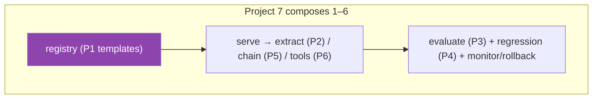
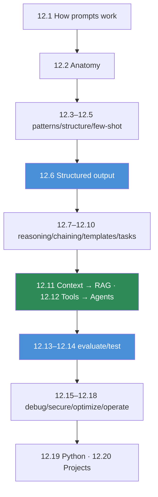

# 12.20 · Mini Projects & Summary

[⬅ 12.19 Prompt Engineering with Python](12.19-python.md) · [🏠 Module 12](../README.md) · [➡ Module 13 · RAG](../../13-RAG/README.md)

> **The lesson in one line:** Seven projects — template library → extraction system → evaluation framework → regression testing → multi-step pipeline → tool-calling workflow → production prompt management — assemble every lesson into working software, and together they turn prompt engineering from a skill into a discipline you can ship.

---

## 🎯 Learning objectives

- Consolidate the module into **seven buildable projects**.
- For each: **requirements, architecture, folder structure, prompt design, evaluation, testing, security, monitoring, future improvements**.
- See how the projects **compose** into a production prompt platform.
- Leave with the module's through-lines internalized.

## ✅ Prerequisites

- All of Module 12. The projects are the payoff.

---

## 🧠 Mental model

> [!IMPORTANT]
> **These seven projects stack from a single reusable primitive (the template) up to a production platform.** Each adds one capability you learned: templates → structured extraction → evaluation → regression testing → chaining → tools → operations. Build them in order and you assemble, piece by piece, the transparent toolkit of a serious LLM engineer — the same capabilities a framework hides ([13.17](../../13-RAG/weeks/13.17-frameworks.md)), but understood and owned.

---

## Project 1 — Prompt template library
**The primitive. Versioned, safe, reusable templates.**
- **Requirements:** typed templates for the core tasks ([12.10](12.10-task-strategies.md)); safe rendering (fenced data); bundled config; versioning.
- **Architecture:** `PromptTemplate` + registry ([12.9](12.9-templates.md), [12.19](12.19-python.md)).
- **Prompt design:** role + delimited data + output format per task ([12.2](12.2-anatomy-of-a-prompt.md), [12.4](12.4-prompt-structure.md)).
- **Evaluation:** consistency of output shape across features.
- **Testing:** render tests; injection tests on variables.
- **Security:** untrusted vars fenced; registry access control ([12.16](12.16-security.md)).
- **Monitoring:** which version served each call.
- **Future:** registry backend; template linter ([12.2](12.2-anatomy-of-a-prompt.md)).

## Project 2 — Structured information extraction system
**Templates + structured output + validation → typed records.**
- **Requirements:** extract a schema from documents; "null if absent"; validated output ([12.6](12.6-structured-outputs.md)).
- **Architecture:** template → `call_validated` → typed record → store.
- **Prompt design:** schema + example + "do not guess" ([12.10](12.10-task-strategies.md)).
- **Evaluation:** field-level precision/recall/F1; hallucinated-field rate; schema-validity rate.
- **Testing:** golden documents; edge cases (missing fields, malformed input).
- **Security:** data-as-data; PII handling in outputs ([12.16](12.16-security.md)).
- **Monitoring:** valid-rate, repair-rate, hallucination-rate.
- **Future:** provider structured mode; dynamic few-shot ([12.5](12.5-few-shot.md)).

## Project 3 — Prompt evaluation framework
**Measure prompts over a dataset on all six dimensions.**
- **Requirements:** dataset format; deterministic + rubric + LLM-judge metrics; per-dimension reporting ([12.13](12.13-evaluation.md)).
- **Architecture:** `evaluate` over cases; calibrated judge.
- **Prompt design:** N/A (measures other prompts) + judge prompt.
- **Evaluation:** the product itself; judge calibrated vs humans.
- **Testing:** metrics match hand-computed; unanswerable cases scored on abstention.
- **Security:** governed eval data; adversarial suite.
- **Monitoring:** per-dimension dashboards.
- **Future:** online eval on prod traffic; per-segment slicing.

## Project 4 — Prompt regression testing system
**Gate every prompt/model change on quality.**
- **Requirements:** golden dataset; regression runner vs last-good; model-version pinning; rollback ([12.14](12.14-testing.md)).
- **Architecture:** `regression_gate` in CI; version pinning.
- **Prompt design:** versioned candidates ([12.9](12.9-templates.md)).
- **Evaluation:** regression-detection rate; false-failure rate.
- **Testing:** a bad edit is blocked; a model change triggers re-eval.
- **Security:** security regression suite in the gate ([12.16](12.16-security.md)).
- **Monitoring:** pass rates over time; drift alerts.
- **Future:** auto-add prod failures to golden set; canary A/B.

## Project 5 — Multi-step prompt pipeline
**Chain focused steps with validated seams.**
- **Requirements:** input → extract → transform → validate → output; per-step validation + trace ([12.8](12.8-prompt-chaining.md)).
- **Architecture:** `run_chain` with `Step`s; branching/map topologies.
- **Prompt design:** one prompt per job; structured I/O between steps.
- **Evaluation:** end-to-end accuracy vs a mega-prompt; per-step failure attribution.
- **Testing:** bad intermediate caught at its seam; step swap doesn't break others.
- **Security:** data-as-data across steps; validate model-generated intermediates ([12.16](12.16-security.md)).
- **Monitoring:** per-step success/latency.
- **Future:** parallel fan-out; right-sized models per step ([12.17](12.17-optimization.md)).

## Project 6 — Tool-calling prompt workflow
**Let the model act via validated, least-privilege tools.**
- **Requirements:** tool registry (schema + permission); call loop; argument validation; approval gates on writes ([12.12](12.12-tool-calling.md)).
- **Architecture:** model ↔ tool loop; least privilege.
- **Prompt design:** precise tool descriptions + when-(not)-to-call rules.
- **Evaluation:** correct-call rate; needless-call rate; task success.
- **Testing:** invalid args rejected; injected tool results don't trigger unsafe calls.
- **Security:** least privilege; validation; approval gates; data-as-data results ([12.16](12.16-security.md)).
- **Monitoring:** per-tool call counts/latency/failures.
- **Future:** parallel calls; MCP-style servers; graduate to an agent ([14](../../14-AI-Agents/README.md)).

## Project 7 — Production prompt management system ⭐
**The flagship. Version, serve, observe, experiment, roll back.**
- **Requirements:** registry (versioned + env-pinned); promotion gate (tests + eval + security); per-call logging; monitoring (quality/cost/drift); canary A/B; rollback ([12.18](12.18-production.md)).
- **Architecture:** author → gate → registry → serve → observe → experiment/rollback (the [12.18](12.18-production.md) architecture).
- **Prompt design:** all task templates, versioned.
- **Evaluation:** golden set in CI + online quality sampling; MTTR for a bad prompt.
- **Testing:** rollback restores last-good; regressions blocked; canary limits blast radius.
- **Security:** registry access control; governed/redacted logs; security gate ([12.16](12.16-security.md)).
- **Monitoring:** online quality + cost dashboards; model-change/drift alerts.
- **Future:** auto-promote winning A/Bs; multi-region registry; auto-golden-set growth.

---

## The module, connected

> [!IMPORTANT]
> **The one thing to remember: a prompt is a specification for a probabilistic machine, and reliability is measured, not felt.** The model does what your input makes probable ([12.1](12.1-how-llms-interpret-prompts.md)) — so you remove ambiguity (anatomy, structure, examples), force and validate structure ([12.6](12.6-structured-outputs.md)), engineer context ([12.11](12.11-context-engineering.md)) and tools ([12.12](12.12-tool-calling.md)), and then **evaluate, test, secure, and operate** prompts like the production code they are. **Prompt engineering = understanding the model + designing instructions + controlling context + defining output structure + evaluating results.**

---

## The through-lines (memorize)

| # | Through-line |
|---|---|
| 1 | The model does what's **probable**, not what you meant — remove ambiguity. |
| 2 | **Reliability is measured over a dataset**, never one output. |
| 3 | **Separate instructions from data** — root of quality and security. |
| 4 | **Structure forces reliability** — delimiters, schemas, validation. |
| 5 | **Show, don't just tell** — examples are a strong spec. |
| 6 | **Context engineering is prompt engineering** — and the seed of RAG. |
| 7 | **Tool calling is prompt engineering** — and the seed of agents. |
| 8 | **Prompts are code** — version, test, monitor, roll back. |
| 9 | **Least privilege** beats clever wording for security. |
| 10 | **Optimize on the quality↔cost↔latency surface**, via evaluation. |

## 🏋️ Capstone challenge

Build **Project 7 end-to-end** wrapping a real task: a versioned template library, structured-output extraction with validation, an evaluation framework with a golden set (incl. unanswerable + adversarial), a regression gate pinned to a model version, at least one multi-step chain and one tool workflow, and a monitoring dashboard with rollback. **Success criteria:** measurable per-dimension quality on the golden set, a blocked regression on a deliberately-bad edit, an injected instruction with no privileged effect, and a demonstrated seconds-long rollback.

## 📄 Cheat sheet

| Project | Adds | Key lessons |
|---|---|---|
| **1 Template library** | reusable versioned prompts | 12.2, 12.4, 12.9 |
| **2 Extraction system** | structured output + validation | 12.6, 12.10 |
| **3 Evaluation framework** | measure over a dataset | 12.13 |
| **4 Regression testing** | gate changes | 12.14 |
| **5 Multi-step pipeline** | chaining | 12.8 |
| **6 Tool-calling workflow** | tools + least privilege | 12.12 |
| **7 Production mgmt** ⭐ | version/serve/observe/rollback | 12.16–12.18 |

## 🎴 Flashcards

- **⭐ The one thing to remember from prompt engineering?** → A prompt is a specification for a probabilistic machine; reliability is measured, not felt.
- **Why build the seven projects in order?** → Each adds one capability (template → extraction → eval → testing → chaining → tools → ops), assembling a full toolkit.
- **What's the minimal project?** → A versioned, safe prompt template library — the primitive everything else builds on.
- **What makes Project 7 "production"?** → Registry + versioning, evaluation/security gates, logging, monitoring, canary A/B, and instant rollback.
- **The five-part definition of prompt engineering?** → Understanding the model + designing instructions + controlling context + defining output structure + evaluating results.

## 💬 Interview questions

1. Design a production prompt management system end-to-end.
2. How would you incrementally build from a template library to a production platform?
3. What's the architectural difference between Project 2 (extraction) and Project 5 (pipeline)?
4. Where would you invest to make an LLM feature reliable, and why?
5. Defend the claim "a prompt is a specification for a probabilistic machine."
6. What would you evaluate, test, and monitor for a deployed prompt?

## 📝 Summary

- **Seven stacked projects** take you from a **template library** to a **production prompt management system** — each adds one capability, so building them in order assembles the whole discipline.
- The flagship, **Project 7**, composes the others into a platform with **versioning, evaluation/security gates, logging, monitoring, experimentation, and rollback**.
- The module's spine, proven: **a prompt is a specification for a probabilistic machine, and reliability is measured, not felt** — you remove ambiguity, force structure, engineer context and tools, and then evaluate, test, secure, and operate prompts like code.
- Onward: **context engineering scales into [Module 13 · RAG](../../13-RAG/README.md); tool calling scales into [Module 14 · AI Agents](../../14-AI-Agents/README.md).** Prompt engineering is the interface layer beneath both.

## 📚 References

1. **All Module 12 lessons ([12.1](12.1-how-llms-interpret-prompts.md)–[12.19](12.19-python.md)).** Each project's capabilities.
2. **[13 · RAG](../../13-RAG/README.md).** Context engineering as a system.
3. **[14 · AI Agents](../../14-AI-Agents/README.md).** Tool calling with autonomy.
4. **[12.18 Production](12.18-production.md), [12.13 Evaluation](12.13-evaluation.md), [12.16 Security](12.16-security.md).** Project 7's pillars.

---

## 🧭 Navigation

| Direction | Link |
|---|---|
| ⬅ Previous | [12.19 · Prompt Engineering with Python](12.19-python.md) |
| ➡ Next | [Module 13 · RAG](../../13-RAG/README.md) |
| 🏠 Module | [Module 12](../README.md) |
| 📖 Lessons | [Lesson index](README.md) |
