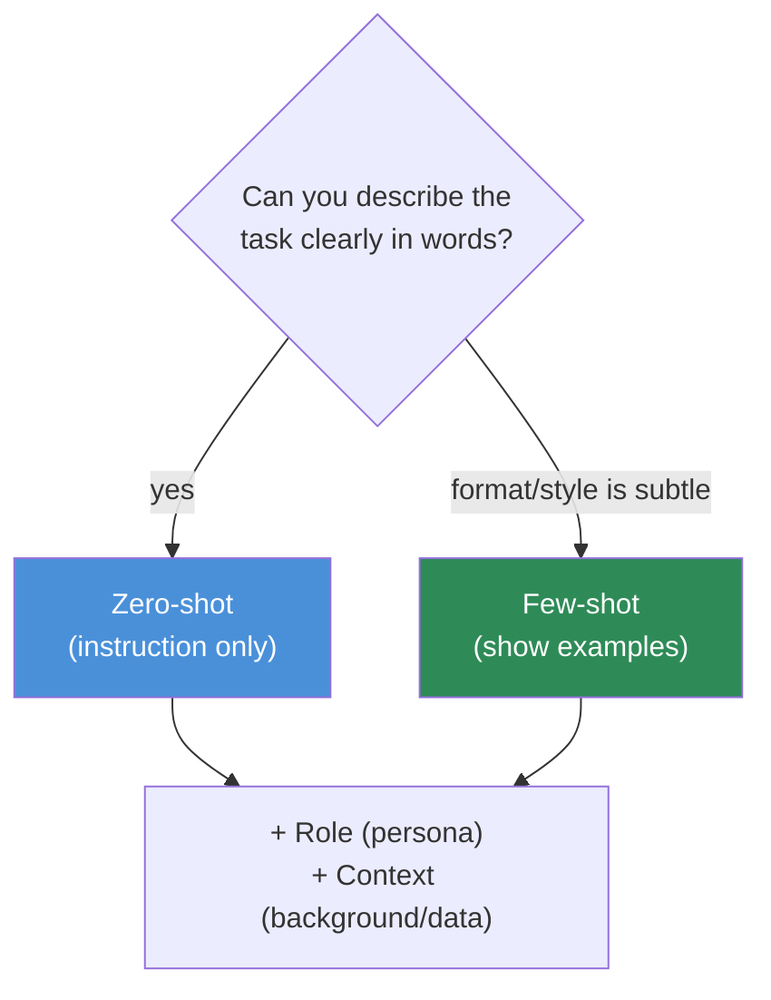

# 12.3 · Basic Prompting Patterns

[⬅ 12.2 Anatomy of a Prompt](12.2-anatomy-of-a-prompt.md) · [🏠 Module 12](../README.md) · [➡ 12.4 Prompt Structure](12.4-prompt-structure.md)

> **The lesson in one line:** There are a handful of foundational prompting patterns — zero-shot, one-shot, few-shot, role, instruction, and contextual — and choosing among them is a trade-off between **cost, reliability, and how hard it is to describe the task in words versus show it by example.**

---

## 🎯 Learning objectives

- Distinguish **zero-shot, one-shot, few-shot, role, instruction, and contextual** prompting.
- Choose the right pattern for a task based on **describability vs demonstrability** and cost.
- Combine patterns (they're not mutually exclusive).
- Recognize each pattern as a way of shaping the probability distribution ([12.1](12.1-how-llms-interpret-prompts.md)).

## ✅ Prerequisites

- [12.1 how LLMs interpret prompts](12.1-how-llms-interpret-prompts.md), [12.2 prompt anatomy](12.2-anatomy-of-a-prompt.md).

---

## 🧠 Mental model

> [!IMPORTANT]
> **The core choice is: can you *tell* the model the task clearly, or must you *show* it?** If the task is easy to describe ("translate to French"), a plain **instruction (zero-shot)** prompt works. If the task is easier to demonstrate than describe (a specific output format, a subtle labeling convention, a house style), **examples (few-shot)** are more reliable. **Role** and **context** are orthogonal modifiers you layer on top of either. Every pattern is the same underlying move — add tokens that make the desired continuation more probable — differing only in *how* they do it.



---

## The patterns

### Zero-shot
Ask directly, no examples. Relies on the model's pretrained ability to follow the instruction.
```
Classify the sentiment (positive/negative/neutral): "The food was cold but the staff were lovely."
```
**Use when:** the task is common and describable; you want minimal tokens. **Modern instruction-tuned models are strong zero-shot** — always try this first.

### One-shot
Provide **one** example to anchor format/behavior, then the real input.
```
Example → Input: "Great value!"  Output: {"sentiment": "positive"}
Now → Input: "Overpriced and slow." Output:
```
**Use when:** one demonstration resolves the ambiguity (usually **format**). Cheap and often enough.

### Few-shot
Provide **several** examples spanning the range of cases.
```
"Terrible" → negative
"It's fine" → neutral
"Absolutely loved it" → positive
"Not bad at all" → ?
```
**Use when:** the task has subtle conventions, edge cases, or a specific style that examples convey better than prose ([12.5](12.5-few-shot.md)). More reliable, more tokens.

### Role prompting
Assign a persona/expertise to steer vocabulary, depth, and priorities ([12.2](12.2-anatomy-of-a-prompt.md)).
```
System: You are a meticulous compliance officer. Flag anything ambiguous rather than assuming.
```
**Use when:** you want a consistent stance/tone or domain framing. Layers onto any other pattern.

### Instruction prompting
State the task as explicit, often step-by-step, directions.
```
1. Read the email. 2. Determine urgency (low/med/high). 3. Draft a one-line reply.
```
**Use when:** the *process* matters and can be spelled out. The backbone of most zero-shot prompts.

### Contextual prompting
Supply the background/data the task depends on, clearly delimited.
```
Context: <policy text>
Question: Does the policy allow refunds after 30 days?
```
**Use when:** the answer depends on specific information the model shouldn't guess — the seed of [context engineering (12.11)](12.11-context-engineering.md) and [RAG (13)](../../13-RAG/README.md).

---

## Comparison

| Pattern | Adds | Cost | Best for |
|---|---|---|---|
| **Zero-shot** | just the instruction | lowest | common, describable tasks |
| **One-shot** | 1 example | low | pinning format cheaply |
| **Few-shot** | N examples | higher | subtle conventions, edge cases, style |
| **Role** | a persona | ~free | stance, tone, domain framing |
| **Instruction** | explicit steps | low | process-driven tasks |
| **Contextual** | background/data | varies | answers grounded in given info |

> [!IMPORTANT]
> **Start zero-shot; escalate only as evaluation demands.** Add a role for framing, switch to few-shot when format/behavior drifts, add context when the answer requires specific data. **Don't pay for examples you don't need** — but don't withhold them when instructions clearly aren't landing. Let [evaluation (12.13)](12.13-evaluation.md), not intuition, decide when to escalate.

---

## ⚖️ Weak vs strong

**Weak** (zero-shot for a subtle format the model keeps getting wrong):
```
Extract the parts and return them nicely.
"1x M4 bolt, 2x washers"
```
→ Output shape varies every call.

**Strong** (few-shot pins the exact format):
```
"3x M3 screw" → [{"qty":3,"part":"M3 screw"}]
"1x M4 bolt, 2x washers" → 
```
→ Output shape is now locked by demonstration. *The task was more demonstrable than describable.*

---

## 🏭 Production examples

| Task | Typical pattern |
|---|---|
| Sentiment/intent classification | zero- or few-shot + fixed labels |
| Strict-format extraction | few-shot + output schema ([12.6](12.6-structured-outputs.md)) |
| Domain assistant tone | role (system) + instruction |
| Policy/doc questions | contextual (+ retrieval, [13](../../13-RAG/README.md)) |
| House-style rewriting | few-shot (style is demonstrable) |

## ⚡ Performance & 💲 cost considerations

- **Examples cost tokens on every call** — few-shot trades cost for reliability; measure whether the reliability gain is worth it ([12.17](12.17-optimization.md)).
- **Zero-shot is cheapest and lowest-latency** — prefer it when it passes evaluation.
- If few-shot examples are stable, put them in a **cacheable prefix** to amortize cost.

## 🔒 Security considerations

> [!CAUTION]
> - **Contextual prompting introduces untrusted data** — delimit it and treat it as data, not instructions ([12.4](12.4-prompt-structure.md), [12.16](12.16-security.md)).
> - **Few-shot examples can leak sensitive data** if drawn from real records — use synthetic or scrubbed examples.
> - **Role prompting is not a safety control** — a persona doesn't harden the model against injection.

## 🚫 Common mistakes

| Mistake | Consequence |
|---|---|
| Jumping to few-shot when zero-shot works | Needless cost/latency |
| Sticking with zero-shot when format drifts | Unreliable output shape |
| Examples that don't cover edge cases | Model fails exactly there ([12.5](12.5-few-shot.md)) |
| Treating role as a rule enforcer | Constraints ignored; false security |
| Context not delimited | Injection + confusion |

## 🐛 Debugging workflow

Output wrong? (1) **Is the task describable?** If instructions clearly aren't landing → add **examples** (few-shot). (2) **Wrong stance/tone?** → add/adjust **role**. (3) **Needs info it's guessing?** → add **context**. (4) **Process errors?** → make **instructions** explicit and stepwise. Escalate patterns one at a time and re-evaluate ([12.13](12.13-evaluation.md)). Full method in [12.15](12.15-debugging.md).

## 🏋️ Exercises

1. **Escalation ladder.** Take a subtle labeling task; solve it zero-shot, then one-shot, then few-shot; measure accuracy and tokens at each step.
2. **Describable vs demonstrable.** Find one task best done by instruction and one best done by example; justify each.
3. **Role sweep.** Same task, three roles; characterize tone/priority shifts.
4. **Context grounding.** Answer a policy question with and without the policy text in context; show the difference.
5. **Combine.** Build one prompt using role + instruction + few-shot + context together for a realistic task.

## 🛠️ Mini project — "Pattern picker"

**Goal:** a helper that recommends a starting pattern from a task description and builds a scaffold.

**Requirements:** classify a task as describable vs demonstrable and grounded vs self-contained; emit a starter prompt (zero-shot instruction, or few-shot scaffold, with role/context slots) accordingly.

**Folder structure**
```
pattern-picker/
├── classify.py    # describable? demonstrable? grounded?
├── scaffold.py    # emit starter prompt per pattern
└── examples/      # sample tasks + recommended patterns
```

**Testing:** describable tasks → zero-shot scaffold; format-sensitive tasks → few-shot scaffold with example slots; grounded tasks include a delimited context block.
**Evaluation:** does the recommended pattern beat the alternatives on a small task set?
**Security:** context slots are delimited; example slots warn against real PII.
**Future improvements:** auto-select few-shot examples from a labeled pool ([12.5](12.5-few-shot.md)).

## 📄 Cheat sheet

| Pattern | One line |
|---|---|
| **Zero-shot** | instruction only — try first; cheapest |
| **One-shot** | one example — pin format cheaply |
| **Few-shot** | several examples — subtle conventions/style |
| **Role** | persona — stance, tone, domain (layer on top) |
| **Instruction** | explicit steps — process-driven tasks |
| **Contextual** | background/data — grounded answers |
| **⭐ Rule** | tell if describable, **show** if demonstrable; start zero-shot, escalate on eval |

## 🎴 Flashcards

- **⭐ Zero-shot vs few-shot — how to choose?** → Zero-shot when the task is easily *described*; few-shot when it's easier to *demonstrate* (subtle format/style/edge cases).
- **What does role prompting change?** → Vocabulary, depth, tone, and priorities via a persona — it layers onto any pattern and isn't a safety control.
- **What is contextual prompting the foundation of?** → Context engineering ([12.11](12.11-context-engineering.md)) and RAG — grounding answers in supplied data.
- **Why start zero-shot?** → It's cheapest/lowest-latency and modern instruction-tuned models are strong; escalate only when evaluation shows a need.
- **Are these patterns mutually exclusive?** → No — role + instruction + few-shot + context commonly combine in one prompt.

## 💬 Interview questions

1. Compare zero-, one-, and few-shot prompting. When is each appropriate?
2. What's the "describable vs demonstrable" heuristic for choosing a pattern?
3. What does role prompting do, and what can it *not* do (security-wise)?
4. How does contextual prompting relate to RAG?
5. How do you decide when to escalate from zero-shot to few-shot?

## 📝 Summary

- The foundational patterns — **zero-shot, one-shot, few-shot, role, instruction, contextual** — are all ways of adding tokens that make the desired output more probable.
- Choose by **describability vs demonstrability**: *tell* when the task is easy to describe (zero-shot/instruction), *show* when format/style is subtle (few-shot); layer **role** for stance and **context** for grounding.
- **Start zero-shot and escalate only as evaluation demands** — examples buy reliability at the cost of tokens.
- Contextual prompting is the seed of **context engineering** ([12.11](12.11-context-engineering.md)) and **RAG** ([13](../../13-RAG/README.md)); role is steering, not security.

## 📚 References

1. **Brown et al. (2020) — _Language Models are Few-Shot Learners_ (GPT-3).** ⭐ In-context learning.
2. **[12.5 Few-Shot Prompting](12.5-few-shot.md).** Example selection in depth.
3. **[12.2 Anatomy of a Prompt](12.2-anatomy-of-a-prompt.md).** Role/context as components.
4. **Anthropic / OpenAI prompting guides.** Pattern usage.

---

## 🧭 Navigation

| Direction | Link |
|---|---|
| ⬅ Previous | [12.2 · Anatomy of a Good Prompt](12.2-anatomy-of-a-prompt.md) |
| ➡ Next | [12.4 · Prompt Structure](12.4-prompt-structure.md) |
| 🏠 Module | [Module 12](../README.md) |
| 📖 Lessons | [Lesson index](README.md) |
