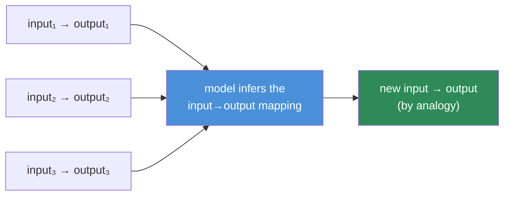
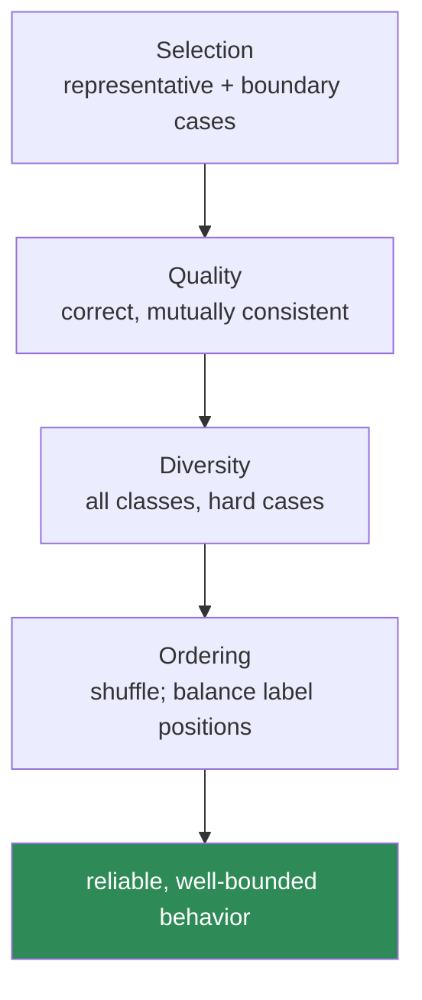

# 12.5 · Few-Shot Prompting

[⬅ 12.4 Prompt Structure](12.4-prompt-structure.md) · [🏠 Module 12](../README.md) · [➡ 12.6 Structured Outputs](12.6-structured-outputs.md)

> **The lesson in one line:** Few-shot examples are not decoration — they are **an executable specification**: the model infers the task, its format, and its edge-case conventions by pattern-matching your demonstrations, so which examples you pick, how good they are, how diverse, and in what order all directly program the model's behavior.

---

## 🎯 Learning objectives

- Understand **in-context learning** — how examples reprogram behavior without training.
- Apply the levers: **selection, quality, diversity, ordering**.
- Design input→output demonstrations that pin format *and* decision boundaries.
- Know when few-shot helps and when it wastes tokens.

## ✅ Prerequisites

- [12.3 basic patterns](12.3-basic-patterns.md), [12.4 structure](12.4-prompt-structure.md).

---

## 🧠 Mental model

> [!IMPORTANT]
> **A few-shot example is a specification the model can execute by analogy.** The model sees `input → output` pairs and continues the pattern for your new input — this is **in-context learning** ([11 GPT-3](../../11-LLMs/weeks/11.1-what-is-a-language-model.md)). So your examples *are* the task definition: they demonstrate the output format, the labeling convention, the tone, and — crucially — how to handle the tricky cases. **The model will imitate whatever your examples show, including their mistakes and biases.** Curate them like test cases, because that's effectively what they are.



---

## The four levers

### 1. Example selection
Pick examples that are **representative of the real inputs** and cover the **decision boundaries**. If your production traffic includes sarcasm, include a sarcastic example. For dynamic systems, **select examples per query** (e.g., retrieve the most similar labeled examples — the same idea as RAG, [13](../../13-RAG/README.md)) rather than a fixed set.

### 2. Example quality
Every example must be **correct and consistent** with your intended convention. **One wrong example poisons behavior** — the model imitates it. Examples must also agree with each other (same format, same labeling rules); contradictions confuse the pattern.

### 3. Example diversity
Cover the **range of cases and classes**, not five variations of the easy one. For classification, include each label (balanced) and the hard, near-boundary cases. Diversity is what teaches the model the *boundaries*, not just the center of each class.

### 4. Example ordering
Order affects behavior. Models can exhibit **recency bias** (the last example weighs more) and, in classification, **label-order bias** (e.g., always predicting the last-seen label). Mitigate by **shuffling**, balancing label positions, and — for sensitive tasks — testing multiple orderings.



---

## How examples influence behavior

Examples pin down what instructions struggle to express:
- **Format** — the exact output shape (often the #1 reason to use few-shot).
- **Convention** — subtle labeling rules ("borderline → neutral").
- **Style/tone** — house voice, brevity, formatting.
- **Boundaries** — where one class ends and another begins (via near-boundary examples).

> [!IMPORTANT]
> **When instructions and examples conflict, examples usually win** — the model trusts the demonstrated pattern over the described one. So keep them aligned: your prose rules and your examples must tell the same story. If the model ignores an instruction, an example that *shows* the rule is often the fix ([12.2](12.2-anatomy-of-a-prompt.md)).

---

## ⚖️ Weak vs strong

**Weak** (examples all easy, one inconsistent, imbalanced):
```
"Love it!" → positive
"Amazing!" → positive
"Great!" → Positive        ← inconsistent capitalization
"Terrible" → negative
"meh" → ?                  ← neutral case never demonstrated
```
→ Model mis-formats ("Positive" vs "positive") and has no idea how to handle "meh".

**Strong** (balanced, consistent, boundary-covering):
```
"Love it!" → positive
"Absolute garbage" → negative
"It's okay, nothing special" → neutral
"Not bad, actually" → positive
"Could be worse I guess" → neutral
"meh" → 
```
→ Consistent format, all classes shown, near-boundary cases ("not bad", "could be worse") teach the boundary.

---

## 💻 Dynamic few-shot selection

```python
def build_few_shot(query, labeled_pool, k=5, embed=None):
    # Pick the k most relevant labeled examples for THIS query (retrieval-style).
    scored = sorted(labeled_pool, key=lambda ex: -similarity(embed(query), embed(ex.input)))
    chosen = balance_labels(scored[: k * 3])[:k]   # keep class balance
    shuffle_stable(chosen)                          # mitigate order bias
    demos = "\n".join(f"{ex.input} → {ex.output}" for ex in chosen)
    return f"{demos}\n{query} → "
```

Selecting examples per query (semantically nearest, class-balanced, shuffled) typically beats a fixed set — it's the bridge from static few-shot to retrieval ([13](../../13-RAG/README.md)).

---

## 🏭 Production examples

| Scenario | Few-shot approach |
|---|---|
| Strict output format | 2–3 examples that lock the schema ([12.6](12.6-structured-outputs.md)) |
| Nuanced classification | balanced, boundary-covering examples per class |
| House-style writing | a few on-brand demonstrations |
| Dynamic/varied inputs | retrieve k nearest labeled examples per query |
| High-stakes labeling | test multiple orderings; measure order sensitivity |

## ⚡ Performance & 💲 cost considerations

- **Examples are usually the largest token cost** in a prompt — each is billed on every call. Use the **fewest examples that hit your reliability target** ([12.17](12.17-optimization.md)).
- **More examples ≠ monotonically better** — returns diminish and can reverse (noise, order effects). Measure ([12.13](12.13-evaluation.md)).
- **Fixed example blocks are cacheable**; per-query selection is not (but often worth it).

## 🔒 Security considerations

> [!CAUTION]
> - **Examples drawn from real data can leak PII** — use synthetic or scrubbed demonstrations.
> - **A poisoned example set is an attack surface** — if examples are pulled from a user-editable store, an attacker can bias behavior; control who can add examples ([12.16](12.16-security.md)).
> - **Examples consume the context window** — crowding out room can degrade handling of the real input.

## 🚫 Common mistakes

| Mistake | Consequence |
|---|---|
| Inconsistent example formatting | Model mirrors the inconsistency |
| One incorrect example | Poisons behavior (imitated) |
| Only easy/central examples | Fails on boundary cases |
| Imbalanced classes | Biased toward over-represented label |
| Ignoring order effects | Recency/label-order bias |
| Too many examples | Cost up, diminishing/negative returns |

## 🐛 Debugging workflow

Few-shot misbehaving? (1) **Audit examples for correctness and mutual consistency** — one bad or inconsistent demo is a common culprit. (2) **Check coverage** — is the failing case a class/boundary you never demonstrated? Add it. (3) **Check balance and order** — imbalanced or fixed-order examples bias output; balance and shuffle. (4) **Instruction–example conflict?** Align them. Full method in [12.15](12.15-debugging.md).

## 🏋️ Exercises

1. **Poison test.** Introduce one incorrect example; measure how output degrades; remove it and confirm recovery.
2. **Boundary coverage.** Add near-boundary examples to a classifier; measure accuracy gain on hard cases.
3. **Order sensitivity.** Run the same examples in 5 orders; measure output variance; find the most stable arrangement.
4. **Count sweep.** Try k ∈ {1,2,4,8} examples; plot accuracy vs tokens; find the knee.
5. **Dynamic selection.** Implement nearest-example retrieval per query; compare to a fixed set.

## 🛠️ Mini project — "Few-shot example manager"

**Goal:** manage a labeled example pool and assemble optimal few-shot blocks per query.

**Requirements:** a validated example store (schema + consistency checks); per-query selection (similarity + class balance); order shuffling; token budget cap; an eval comparing fixed vs dynamic selection.

**Folder structure**
```
few-shot/
├── store.py       # example pool + consistency validation
├── select.py      # similarity + balance + shuffle
├── budget.py      # cap examples to token budget
└── eval.py        # fixed vs dynamic accuracy/cost
```

**Testing:** inconsistent examples rejected at store time; selection stays class-balanced and within budget; order varies run-to-run.
**Evaluation:** accuracy and order-sensitivity, fixed vs dynamic.
**Security:** examples are synthetic/scrubbed; write access controlled.
**Future improvements:** active-learning to grow the pool from failures.

## 📄 Cheat sheet

| Lever | One line |
|---|---|
| **⭐ In-context learning** | examples are an executable spec; model imitates them |
| **Selection** | representative + boundary cases; consider per-query retrieval |
| **Quality** | correct + mutually consistent; one bad example poisons |
| **Diversity** | cover all classes and hard cases (teaches boundaries) |
| **Ordering** | shuffle; balance label positions (recency/label bias) |
| **⭐ Conflict** | examples usually beat instructions — keep them aligned |
| **Cost** | biggest token cost; use the fewest that hit the target |

## 🎴 Flashcards

- **⭐ What are few-shot examples, really?** → An executable specification — the model infers the task, format, and conventions by analogy (in-context learning) and imitates them.
- **What are the four few-shot levers?** → Selection, quality, diversity, ordering.
- **Why does one bad example matter so much?** → The model imitates it — a single incorrect/inconsistent demo poisons behavior.
- **What teaches decision boundaries?** → Diverse, near-boundary examples across all classes — not repeats of the easy center case.
- **Why does example order matter?** → Recency and label-order biases; mitigate by shuffling and balancing label positions.
- **⭐ Instructions vs examples conflict — which wins?** → Examples usually win; keep prose rules and demonstrations telling the same story.

## 💬 Interview questions

1. What is in-context learning, and why are examples an "executable spec"?
2. Walk through the four levers of few-shot design.
3. Why can a single bad example dominate behavior?
4. How do you choose the number and diversity of examples?
5. What are order effects in few-shot prompting, and how do you mitigate them?
6. When would you select examples dynamically per query, and how does that relate to RAG?

## 📝 Summary

- Few-shot examples are an **executable specification** — via in-context learning the model imitates the demonstrated task, format, and conventions (including any mistakes).
- The four levers are **selection** (representative + boundary), **quality** (correct + consistent), **diversity** (all classes/hard cases), and **ordering** (shuffle/balance to fight recency and label bias).
- **Examples usually beat instructions** on conflict, so keep them aligned; **examples are the biggest token cost**, so use the fewest that hit your target.
- **Dynamic per-query selection** (nearest, balanced, shuffled) is the bridge from static few-shot to **retrieval** ([13](../../13-RAG/README.md)).

## 📚 References

1. **Brown et al. (2020) — _GPT-3_.** ⭐ In-context / few-shot learning.
2. **Zhao et al. (2021) — _Calibrate Before Use_.** Order and label bias in few-shot.
3. **Liu et al. (2022) — _What Makes Good In-Context Examples?_.** Example selection.
4. **[12.6 Structured Outputs](12.6-structured-outputs.md).** Examples that lock format.

---

## 🧭 Navigation

| Direction | Link |
|---|---|
| ⬅ Previous | [12.4 · Prompt Structure](12.4-prompt-structure.md) |
| ➡ Next | [12.6 · Structured Outputs](12.6-structured-outputs.md) |
| 🏠 Module | [Module 12](../README.md) |
| 📖 Lessons | [Lesson index](README.md) |
