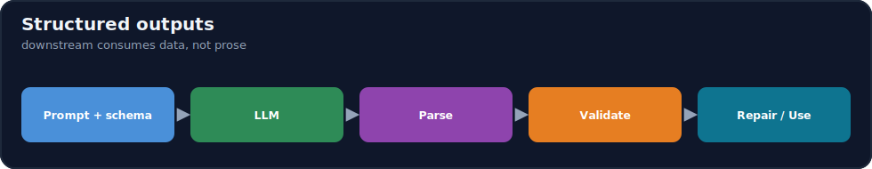
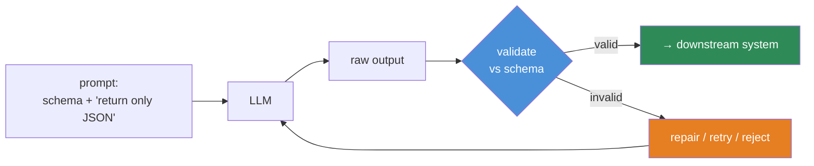
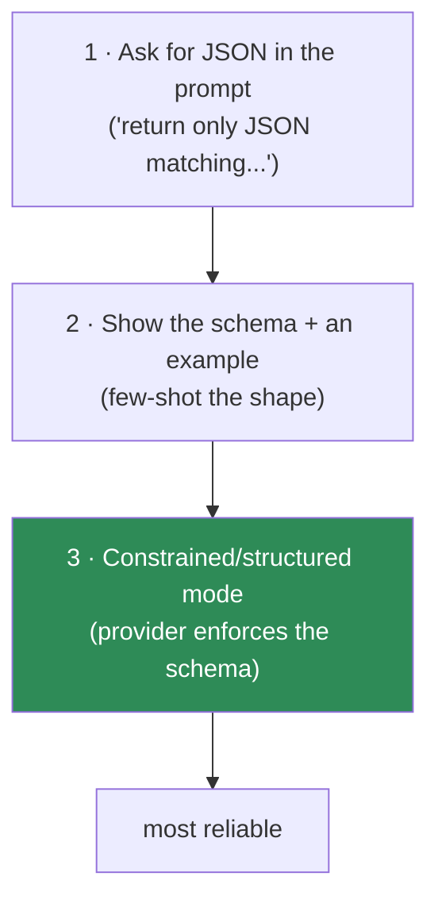

# 12.6 · Structured Outputs ⭐

[⬅ 12.5 Few-Shot Prompting](12.5-few-shot.md) · [🏠 Module 12](../README.md) · [➡ 12.7 Prompting for Reasoning](12.7-reasoning.md)

> **The lesson in one line:** Production systems consume data, not prose — so a reliable LLM component must return **machine-parseable structure (usually JSON) that you validate against a schema**, and you get there by *specifying the format, constraining generation, and programmatically checking every output* rather than hoping the model formats it right.



---

## 🎯 Learning objectives

- Request outputs as **JSON, JSON Schema, XML, tables, Markdown, or function arguments**.
- Understand **why structured output is the backbone of production LLM systems**.
- **Validate outputs programmatically** and handle failures (retry/repair).
- Use provider **structured-output / tool modes** for guaranteed shape.

## ✅ Prerequisites

- [12.2 output format component](12.2-anatomy-of-a-prompt.md), [12.4 structure](12.4-prompt-structure.md), [12.5 few-shot](12.5-few-shot.md).

---

## 🧠 Mental model

> [!IMPORTANT]
> **The moment an LLM's output feeds another program, prose is a liability and structure is a contract.** A downstream service can't reliably act on "Sure! The sentiment is mostly positive 😊" — it needs `{"sentiment": "positive"}`. Structured output turns the model from a chatbot into a **typed function**: given input, return a value of a known shape. But the model is still probabilistic ([12.1](12.1-how-llms-interpret-prompts.md)) — it *can* emit malformed JSON — so the contract isn't complete until you **validate** the output and **handle** violations. **Specify the schema, constrain generation, validate every time.**



---

## Output formats

| Format | Use for | Notes |
|---|---|---|
| **JSON** | the default for machine consumption | validate against a schema; the workhorse |
| **JSON Schema** | *specifying* the required JSON shape | many providers enforce it (constrained decoding) |
| **XML/tags** | nested or document-like output; some models prefer it | easy to delimit; parse with care |
| **Tables (Markdown/CSV)** | tabular results for humans or spreadsheets | column contract matters |
| **Markdown** | human-facing formatted text | not for machine parsing of fields |
| **Function arguments** | when the model calls a tool | the schema *is* the function signature ([12.12](12.12-tool-calling.md)) |

> [!IMPORTANT]
> **JSON validated against a schema is the default choice for production.** JSON Schema lets you declare required fields, types, enums, and nesting; validators (e.g., Pydantic, `jsonschema`) then *guarantee* the output matches before your code touches it. Enums are especially powerful — constraining a field to `"positive"|"negative"|"neutral"` eliminates a whole class of format errors.

---

## Why structured output is the backbone of production

- **Reliable integration** — downstream code reads fields, not sentences.
- **Validatable** — you can *prove* the output is well-formed and reject/repair when not.
- **Composable** — one component's structured output is the next's structured input ([12.8 chaining](12.8-prompt-chaining.md)).
- **Evaluable** — exact fields make automated evaluation straightforward ([12.13](12.13-evaluation.md)).
- **Constrainable** — enums/types close off hallucinated categories.

---

## Three levels of "getting structure"



1. **Prompt for it** — instruct "output only valid JSON, no prose," give the exact keys. Works often, fails sometimes (stray prose, trailing commas).
2. **Show the schema + example** — few-shot the exact shape ([12.5](12.5-few-shot.md)); big reliability boost.
3. **Constrained/structured-output mode** — many providers offer a **JSON-Schema / structured-output / tool-calling mode** that *guarantees* syntactically valid, schema-conforming output via constrained decoding. **Use it when available** — it eliminates format errors at the source (you still validate *semantics*).

---

## 💻 Specify → generate → validate

```python
from pydantic import BaseModel, field_validator
from typing import Literal

class Sentiment(BaseModel):
    label: Literal["positive", "negative", "neutral"]   # enum: closes off bad categories
    confidence: float
    rationale: str

    @field_validator("confidence")
    @classmethod
    def _range(cls, v):
        if not 0.0 <= v <= 1.0:
            raise ValueError("confidence must be in [0,1]")
        return v

def classify(text, call_llm):
    prompt = (
        "Classify the sentiment. Output ONLY JSON matching:\n"
        '{"label": "positive|negative|neutral", "confidence": 0.0-1.0, "rationale": "..."}\n'
        f"<text>\n{text}\n</text>"
    )
    for attempt in range(2):                      # validate + one repair retry
        raw = call_llm(prompt, temperature=0)     # low temp for determinism
        try:
            return Sentiment.model_validate_json(raw)   # ✅ guaranteed shape after this
        except Exception as e:
            prompt += f"\n\nYour previous output was invalid ({e}). Return ONLY valid JSON."
    raise ValueError("model failed to produce valid output")
```

The pattern: **schema in the prompt → low-temperature generation → parse+validate → repair-retry on failure → reject if still bad.** Never feed unvalidated model output into a downstream system.

### Robust parsing tips
- Strip markdown code fences the model may add (```json … ```).
- Prefer **provider structured mode** to avoid parsing entirely where possible.
- Validate **semantics**, not just syntax (e.g., `confidence ∈ [0,1]`, enum membership, required fields non-empty).
- On repeated failure: **fail closed** (reject) rather than passing garbage downstream.

---

## ⚖️ Weak vs strong

| | Prompt / handling | Result |
|---|---|---|
| **Weak** | "Give me the sentiment and how sure you are." + `json.loads()` | prose + emoji; parse crashes intermittently |
| **Strong** | schema + "JSON only" + example + Pydantic validation + repair-retry (or provider structured mode) | typed, validated object every time (or explicit rejection) |

---

## 🏭 Production examples

| System | Structured-output use |
|---|---|
| Extraction pipeline | JSON records validated against a schema → database |
| Classification service | enum label + confidence → routing logic |
| Tool-using assistant | function-argument schema → API call ([12.12](12.12-tool-calling.md)) |
| Multi-step pipeline | each step's JSON is the next step's input ([12.8](12.8-prompt-chaining.md)) |
| Analytics | table/CSV output → spreadsheet/BI |

## ⚡ Performance & 💲 cost considerations

- **JSON adds output tokens** (keys, braces) — trim to needed fields; verbose schemas cost more.
- **Repair-retries multiply cost/latency** — minimize by using provider structured mode and clear schemas up front.
- **Low temperature** improves format determinism at no extra cost.
- Structured mode may have provider-specific latency characteristics — measure.

## 🔒 Security considerations

> [!CAUTION]
> - **Never trust model output as safe just because it's valid JSON** — a schema-valid string field can still contain injection payloads or malicious content ([12.16](12.16-security.md)); validate *values*, not just shape.
> - **Validate before use** — feeding unvalidated output into `eval`, SQL, shell, or an API is an injection vector; treat model output as untrusted input to your system.
> - **Constrain with enums/types** to prevent the model inventing categories that downstream code doesn't handle.

## 🚫 Common mistakes

| Mistake | Consequence |
|---|---|
| Asking for JSON but not validating | Intermittent parse crashes in prod |
| No schema/enums | Invented fields/categories break downstream |
| Trusting valid JSON as safe | Injection via string fields |
| Prose leaking around the JSON | `json.loads` fails |
| High temperature for structured tasks | Format instability |
| No repair/reject path | Garbage propagates downstream |

## 🐛 Debugging workflow

Structured output failing? (1) **Log the raw output** — is it prose-wrapped, fenced, or malformed? (2) **Is there a schema + example** in the prompt, or just a vague ask? Add them. (3) **Use provider structured mode** if available. (4) **Add validation + a repair-retry**; on repeated failure, fail closed. (5) **Validate semantics** (enums, ranges), not just parse. Most "the model won't return JSON" issues are missing schema/mode or missing validation. Full method in [12.15](12.15-debugging.md).

## 🏋️ Exercises

1. **Prompt vs mode.** Get JSON three ways (prompt-only, schema+example, provider structured mode); measure valid-JSON rate over 50 runs.
2. **Schema validation.** Define a Pydantic/JSON-Schema model; add semantic validators (enum, range); reject bad outputs.
3. **Repair loop.** Implement a single repair-retry; measure how much it lifts success rate and what it costs.
4. **Fence stripping.** Handle outputs wrapped in ```json fences; make parsing robust.
5. **Injection-in-field.** Show a schema-valid output whose string field contains a malicious instruction; add value-level checks.

## 🛠️ Mini project — "Structured extraction with validation"

**Goal:** a component that returns validated structured data or an explicit failure — never unvalidated prose.

**Requirements:** schema definition (Pydantic/JSON Schema); prompt with schema + example; provider structured mode when available; parse→validate→repair-retry→reject; semantic validators; metrics (valid rate, repair rate).

**Folder structure**
```
structured-output/
├── schema.py      # Pydantic models + semantic validators
├── prompt.py      # schema + example + "JSON only"
├── extract.py     # generate → validate → repair → reject
└── metrics.py     # valid rate, repair rate, cost
```

**Testing:** valid outputs parse; malformed trigger repair then reject; enum/range violations caught; fenced JSON handled.
**Evaluation:** valid-JSON rate and semantic-correctness rate across methods.
**Security:** value-level validation; never eval/exec model output ([12.16](12.16-security.md)).
**Future improvements:** streaming validation; schema-guided decoding everywhere.

## 📄 Cheat sheet

| Concept | One line |
|---|---|
| **⭐ Why structured** | downstream systems consume data, not prose |
| **Default** | JSON validated against a schema |
| **JSON Schema / enums** | declare required fields, types, categories |
| **⭐ Provider structured mode** | constrained decoding → guaranteed shape (use it) |
| **Pattern** | specify schema → low temp → parse+validate → repair → reject |
| **Validate semantics** | enums, ranges, required — not just parseable |
| **⚠️ Valid ≠ safe** | schema-valid strings can carry injection |
| **Fail closed** | reject bad output; never pass garbage on |

## 🎴 Flashcards

- **⭐ Why are structured outputs the backbone of production LLM systems?** → Downstream code consumes data, not prose; structure makes output reliable, validatable, composable, and evaluable.
- **What's the standard structured-output pattern?** → Specify the schema in the prompt → generate at low temperature → parse+validate → repair-retry → reject if still invalid.
- **What is provider "structured mode"?** → Constrained decoding that guarantees syntactically valid, schema-conforming output; use it when available (still validate semantics).
- **⭐ Is valid JSON safe to use?** → No — a schema-valid string field can contain injection/malicious content; validate values and treat output as untrusted.
- **Why use enums in the schema?** → They stop the model inventing categories downstream code can't handle.
- **What should you do on repeated invalid output?** → Fail closed (reject) rather than passing garbage to downstream systems.

## 💬 Interview questions

1. Why do production LLM systems require structured outputs?
2. Describe the specify→generate→validate→repair pattern.
3. What does provider structured-output mode guarantee, and what does it *not*?
4. Why is "valid JSON" not the same as "safe output"?
5. How do enums and semantic validators improve reliability?
6. How do structured outputs enable prompt chaining and evaluation?

## 📝 Summary

- Once an LLM's output feeds a program, **structure is a contract and prose is a liability** — return **JSON validated against a schema** (or use a provider **structured-output mode** for guaranteed shape).
- The reliable pattern is **specify the schema → generate at low temperature → parse + validate → repair-retry → reject** — never feed unvalidated output downstream.
- **Validate semantics, not just syntax** (enums, ranges, required fields), and remember **valid JSON is not safe JSON** — string fields can carry injection ([12.16](12.16-security.md)).
- Structured output is what makes LLM components **composable** ([12.8](12.8-prompt-chaining.md)), **evaluable** ([12.13](12.13-evaluation.md)), and production-ready.

## 📚 References

1. **Pydantic / `jsonschema` docs.** ⭐ Schema definition and validation.
2. **Provider structured-output / JSON-mode / tool-use docs (OpenAI, Anthropic).** Constrained decoding.
3. **[12.12 Tool & Function Calling](12.12-tool-calling.md).** Function arguments as structured output.
4. **[12.8 Prompt Chaining](12.8-prompt-chaining.md).** Structured output as pipeline glue.

---

## 🧭 Navigation

| Direction | Link |
|---|---|
| ⬅ Previous | [12.5 · Few-Shot Prompting](12.5-few-shot.md) |
| ➡ Next | [12.7 · Prompting for Reasoning](12.7-reasoning.md) |
| 🏠 Module | [Module 12](../README.md) |
| 📖 Lessons | [Lesson index](README.md) |
