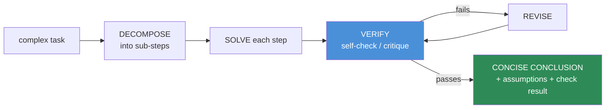
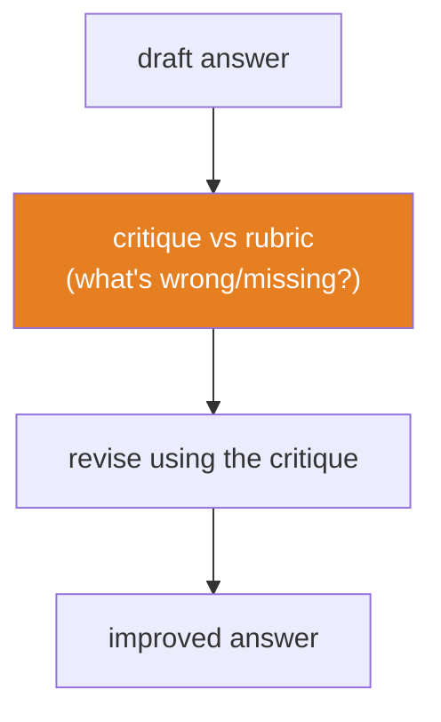

# 12.7 · Prompting for Reasoning

[⬅ 12.6 Structured Outputs](12.6-structured-outputs.md) · [🏠 Module 12](../README.md) · [➡ 12.8 Prompt Chaining](12.8-prompt-chaining.md)

> **The lesson in one line:** Hard tasks fail when the model is forced to jump straight to an answer; giving it room and structure to **decompose the problem, work through it in steps, and verify its own result** raises reliability — and the engineering skill is designing that workflow to output a *concise, checkable conclusion* (plus assumptions and verification), not a rambling monologue.

---

## 🎯 Learning objectives

- Use **decomposition, step-by-step planning, self-checking, verification, and critique-revision** to improve reliability on hard tasks.
- Design reasoning workflows that return **concise conclusions, assumptions, and verification results** — not exposed private chain-of-thought.
- Know when reasoning helps (and when it wastes tokens or invites confident-wrong rationalizations).

## ✅ Prerequisites

- [12.2 anatomy](12.2-anatomy-of-a-prompt.md), [12.6 structured outputs](12.6-structured-outputs.md).

---

## 🧠 Mental model

> [!IMPORTANT]
> **A model that must answer in its first token has no room to work; a model given space to break the problem down computes intermediate results that make the final answer more likely to be right.** For multi-step problems (math, logic, planning, multi-constraint decisions), "think before answering" measurably improves accuracy — the intermediate steps condition the model toward a correct conclusion ([11.1](../../11-LLMs/weeks/11.1-what-is-a-language-model.md)). But as an *engineer*, you don't want a wall of stream-of-consciousness; you want a **workflow** that produces a **verified, concise result** with its **assumptions** and **checks** made explicit and structured. **Reasoning is a means to reliability, not an output to display.**



---

## The techniques

### Decomposition
Break a complex task into ordered sub-problems the model solves in turn. "First identify the constraints, then evaluate each option against them, then pick." Decomposition converts one hard leap into several easy steps — the same idea that motivates [prompt chaining (12.8)](12.8-prompt-chaining.md).

### Step-by-step planning
Ask the model to **plan** before executing: outline the approach, then carry it out. Planning surfaces the structure and catches missing steps early. For structured output, request the plan as a list, then the result.

### Self-checking
Have the model **check its own answer against the requirements**: "Verify each constraint is satisfied; list any that aren't." Self-checks catch arithmetic slips, missed constraints, and format violations before the answer ships.

### Verification
Independent verification — re-derive the answer a different way, or check it against the source data — and report a **pass/fail with evidence**. Stronger than self-check because it re-computes rather than re-reads.

### Critique and revision
A two-pass loop: generate a draft, **critique** it against a rubric, then **revise**. Often more reliable than trying to get it perfect in one shot, and maps cleanly onto a [chain (12.8)](12.8-prompt-chaining.md).



---

## Designing the *output* of reasoning

> [!IMPORTANT]
> **Separate the model's working from what you return to the user or the next system.** You want the *benefit* of step-by-step computation without dumping raw internal monologue into production (it's verbose, costly, and can expose sensitive rationalizations). Design the prompt to emit a **structured result**: a concise **conclusion**, the key **assumptions** made, and a **verification result** — optionally a short justification. Ask for the *outcome* of reasoning, not a transcript of it.

**Structured reasoning output example:**
```
Output JSON:
{
  "conclusion": "<the answer, concise>",
  "assumptions": ["<any assumption you had to make>"],
  "verification": {"checked": ["constraint A", "constraint B"], "all_passed": true},
  "justification": "<= 2 sentences"
}
```
This gives you the reliability of deliberate reasoning *and* a clean, checkable, machine-usable result ([12.6](12.6-structured-outputs.md)).

> [!WARNING]
> **Reasoning can rationalize a wrong answer.** More steps aren't automatically more correct — a model can produce fluent, confident justification for an incorrect conclusion. Verification against the **source data or requirements** (not just "does the reasoning sound good?") is what actually catches errors. And modern **reasoning models** do much of this internally — for them, over-prompting explicit steps can hurt; ask for the structured *result* instead.

---

## ⚖️ Weak vs strong

**Weak** (forces a blind leap):
```
Which vendor should we pick? <three vendor specs>
```
→ One-shot guess; no visible constraint-checking; hard to trust or verify.

**Strong** (decompose → verify → concise structured result):
```
Choose a vendor for the requirement below.
1. List the hard requirements.
2. Evaluate each vendor against every requirement (met/not-met).
3. Pick the best; verify it meets ALL hard requirements.
Return JSON: {"choice": ..., "per_requirement": {...}, "all_hard_reqs_met": bool, "why": "<=2 sentences"}
<requirements + vendor specs>
```
→ Structured, verifiable, concise — the reasoning improved the answer *and* is auditable.

---

## 🏭 Production examples

| Task | Reasoning workflow |
|---|---|
| Multi-constraint decision | decompose → per-constraint check → verified choice |
| Math/quantitative | step-by-step → independent re-derivation → pass/fail |
| Data validation | check each rule → report violations (self-check) |
| Draft-then-polish content | draft → critique vs rubric → revise |
| Complex extraction | plan fields → extract → verify against source |

## ⚡ Performance & 💲 cost considerations

- **Reasoning burns output tokens** — verbose thinking is directly costly and slower ([12.17](12.17-optimization.md)). Request *structured, bounded* reasoning output.
- **Not every task needs it** — reserve for genuinely multi-step problems; simple tasks pay the cost for no gain.
- **Reasoning models** trade higher per-call cost/latency for internal deliberation — pick per task; don't stack redundant explicit steps on top.
- **Critique-revision doubles calls** — worth it for quality-critical output, wasteful otherwise.

## 🔒 Security considerations

> [!CAUTION]
> - **Don't expose raw internal reasoning to end users** — it can reveal system-prompt content, sensitive intermediate data, or exploitable rationalizations; return a concise conclusion instead.
> - **Verification steps see the same untrusted input** — an injected instruction can target the "verifier" too; keep the data-as-data discipline ([12.16](12.16-security.md)).
> - **A confident justification is not proof** — verify against ground truth before acting on high-stakes conclusions.

## 🚫 Common mistakes

| Mistake | Consequence |
|---|---|
| Forcing a straight-to-answer leap on hard tasks | Lower accuracy |
| Dumping raw chain-of-thought to users | Verbose, costly, leaky |
| Trusting fluent reasoning as correctness | Rationalized wrong answers |
| Verifying "does it sound right" not against data | Misses real errors |
| Over-prompting steps on reasoning models | Can degrade their output |
| Reasoning on trivial tasks | Wasted cost/latency |

## 🐛 Debugging workflow

Wrong on a multi-step task? (1) **Did the model skip decomposition?** Add explicit steps or a plan-first instruction. (2) **Is it rationalizing?** Add a verification step that checks against the *source data/requirements*, not self-consistency. (3) **Too verbose/leaky?** Switch to structured reasoning output (conclusion + assumptions + verification). (4) **Using a reasoning model?** Remove redundant step-prompts and ask for the structured result. Full method in [12.15](12.15-debugging.md).

## 🏋️ Exercises

1. **Decompose lift.** Take a multi-constraint decision; solve one-shot vs decomposed; measure accuracy.
2. **Verification catches errors.** Add a step that checks the answer against the requirements; count errors caught.
3. **Structured reasoning.** Convert a verbose "think out loud" prompt into one that returns `{conclusion, assumptions, verification}`; compare cost and usability.
4. **Critique-revise.** Implement draft→critique→revise for a writing task; compare to single-pass.
5. **Rationalization test.** Find a case where fluent reasoning defends a wrong answer; show source-grounded verification catches it.

## 🛠️ Mini project — "Verified reasoning component"

**Goal:** a component that solves multi-step tasks and returns a concise, verified, structured result.

**Requirements:** decomposition/plan step; solve step; a verification step that checks against the input/requirements; structured output (`conclusion, assumptions, verification, justification`); a critique-revise option for quality-critical mode.

**Folder structure**
```
reasoning/
├── plan.py         # decompose / plan
├── solve.py        # execute steps
├── verify.py       # check against source/requirements
├── revise.py       # critique + revise (optional)
└── schema.py       # structured reasoning result
```

**Testing:** verification flags known-wrong answers; output is concise + schema-valid; critique-revise improves a rubric score.
**Evaluation:** accuracy vs one-shot; error-catch rate of verification; token cost.
**Security:** no raw CoT to users; data-as-data in verify; ground-truth verification for high-stakes.
**Future improvements:** self-consistency (sample multiple, vote); tool-based verification ([12.12](12.12-tool-calling.md)).

## 📄 Cheat sheet

| Technique | One line |
|---|---|
| **Decomposition** | split a hard leap into easy ordered steps |
| **Planning** | outline approach before executing |
| **Self-check** | verify answer against the requirements |
| **⭐ Verification** | re-derive / check against source → pass/fail + evidence |
| **Critique-revise** | draft → critique vs rubric → revise |
| **⭐ Output design** | return concise conclusion + assumptions + verification, not raw CoT |
| **⚠️ Caution** | reasoning can rationalize wrong answers — verify vs ground truth |
| **Reasoning models** | do it internally — ask for the structured result |

## 🎴 Flashcards

- **Why does step-by-step reasoning improve hard-task accuracy?** → Intermediate results condition the model toward a correct conclusion instead of forcing a blind first-token leap.
- **⭐ How should reasoning output be designed for production?** → Return a concise, structured result (conclusion + assumptions + verification), not raw internal chain-of-thought.
- **What's the difference between self-check and verification?** → Self-check re-reads the answer against requirements; verification re-derives it independently or checks against source data — stronger.
- **⭐ Why can more reasoning be misleading?** → The model can produce fluent justification for a wrong answer; only verification against ground truth reliably catches errors.
- **What is critique-revision?** → Draft → critique against a rubric → revise — often more reliable than one-shot for quality-critical output.
- **How do reasoning models change your prompting?** → They deliberate internally; over-prompting explicit steps can hurt — ask for the structured result.

## 💬 Interview questions

1. Why does decomposition/step-by-step prompting improve reliability on complex tasks?
2. How do you get the benefit of reasoning without exposing raw chain-of-thought?
3. Distinguish self-checking from independent verification.
4. Why can reasoning produce confident wrong answers, and how do you defend against it?
5. When does explicit step prompting *hurt* (e.g., with reasoning models)?
6. How does critique-revision compare to single-pass generation?

## 📝 Summary

- Giving a model room to **decompose, plan, self-check, verify, and revise** raises reliability on multi-step tasks by letting intermediate results condition the answer.
- As an engineer, design the **output of reasoning**: return a **concise, structured conclusion with assumptions and verification results**, not raw chain-of-thought (verbose, costly, leaky).
- **Reasoning can rationalize wrong answers** — verify against **source data/requirements**, not self-consistency; and don't over-prompt steps on **reasoning models** that deliberate internally.
- Reasoning workflows map naturally onto **prompt chains** ([12.8](12.8-prompt-chaining.md)) and pair with **structured outputs** ([12.6](12.6-structured-outputs.md)).

## 📚 References

1. **Wei et al. (2022) — _Chain-of-Thought Prompting_.** ⭐ Step-by-step reasoning gains.
2. **Wang et al. (2022) — _Self-Consistency_.** Sample-and-vote verification.
3. **Madaan et al. (2023) — _Self-Refine_.** Critique-and-revise.
4. **[12.8 Prompt Chaining](12.8-prompt-chaining.md).** Reasoning as explicit steps.

---

## 🧭 Navigation

| Direction | Link |
|---|---|
| ⬅ Previous | [12.6 · Structured Outputs](12.6-structured-outputs.md) |
| ➡ Next | [12.8 · Prompt Chaining](12.8-prompt-chaining.md) |
| 🏠 Module | [Module 12](../README.md) |
| 📖 Lessons | [Lesson index](README.md) |
