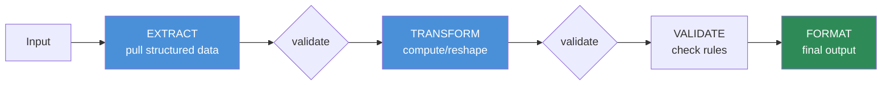
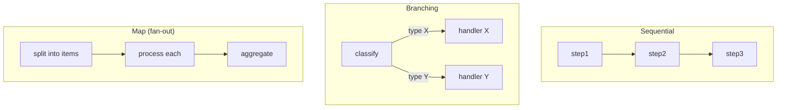

# 12.8 · Prompt Chaining

[⬅ 12.7 Prompting for Reasoning](12.7-reasoning.md) · [🏠 Module 12](../README.md) · [➡ 12.9 Prompt Templates](12.9-templates.md)

> **The lesson in one line:** When one prompt tries to do everything — extract, transform, validate, and format in a single call — it does each part worse; **splitting the task into a chain of focused steps, each with a validated structured output feeding the next**, makes every step simpler, testable, and far more reliable.

---

## 🎯 Learning objectives

- Recognize when a single prompt is **overloaded** and should be split.
- Design a **chain**: input → extraction → transformation → validation → final output.
- **Pass structured outputs between steps** and validate at each boundary.
- Weigh chaining's reliability gains against its latency/cost.

## ✅ Prerequisites

- [12.6 structured outputs](12.6-structured-outputs.md) (the glue between steps), [12.7 reasoning](12.7-reasoning.md).

---

## 🧠 Mental model

> [!IMPORTANT]
> **A prompt that does five things at once must get all five right simultaneously — the failure probabilities multiply.** Splitting the work into a **chain** of single-purpose steps means each step is simple, independently testable, and independently fixable, and you can **validate between steps** so an error is caught at the boundary instead of poisoning the final answer. It's the software principle of small, composable functions applied to prompts: **one prompt, one job.** The structured output of each step ([12.6](12.6-structured-outputs.md)) is the typed input to the next.



---

## Why chaining improves reliability

| Single mega-prompt | Chain of steps |
|---|---|
| All subtasks share one attention budget → each degrades | Each step focuses fully on one subtask |
| One malformed part corrupts everything | Errors caught at step boundaries (validation) |
| Hard to test ("why is it wrong?") | Each step unit-testable in isolation ([12.14](12.14-testing.md)) |
| One prompt to tune for everything | Tune/swap one step without touching others |
| Failure is all-or-nothing | Partial progress; targeted retries |

> [!IMPORTANT]
> **The reliability win comes from validation *between* steps, not just from splitting.** If step 1 extracts fields, validate them ([12.6](12.6-structured-outputs.md)) before step 2 transforms them — so a bad extraction is caught and retried at the boundary rather than silently propagating. A chain without inter-step validation is just a slower mega-prompt. **Split the task, then guard each seam.**

---

## When a single prompt is insufficient

Split when the task has **multiple distinct subtasks**, especially if any of these hold:
- The subtasks need **different instructions/formats** (extract vs summarize vs classify).
- An intermediate result must be **validated or corrected** before proceeding.
- Different steps warrant **different models/temperatures** (cheap extraction, careful reasoning).
- You need **branching** (route based on a classification).
- The single-prompt version keeps failing on one part while doing others fine.

Keep it a single prompt when the task is genuinely atomic — chaining adds latency and cost, so don't split what doesn't need splitting.

---

## Passing outputs between steps

The interface between steps is **validated structured data** ([12.6](12.6-structured-outputs.md)):

```python
def pipeline(document, call_llm):
    # Step 1: extract (structured, validated)
    entities = validate(Entities, call_llm(EXTRACT_PROMPT.format(doc=document), temperature=0))

    # Step 2: transform (consumes step-1 output)
    normalized = validate(Normalized, call_llm(NORMALIZE_PROMPT.format(entities=entities.json()), temperature=0))

    # Step 3: validate/business rules (may loop back or reject)
    checked = validate(Checked, call_llm(CHECK_PROMPT.format(data=normalized.json())))
    if not checked.all_rules_passed:
        return Result(status="rejected", reasons=checked.violations)

    # Step 4: format final output
    return Result(status="ok", output=call_llm(FORMAT_PROMPT.format(data=checked.json())))
```

Each step: **template + variable → generate → validate → hand off.** The chain is orchestrated in *code* (deterministic control flow), while each step is a *prompt* — the same division that later separates an [agent's controller from its tools (12.12](12.12-tool-calling.md), [14](../../14-AI-Agents/README.md)).

---

## Chain topologies



- **Sequential** — the default extract→transform→validate→format pipe.
- **Branching** — a classifier routes to specialized sub-chains.
- **Map/fan-out** — process many items in parallel, then aggregate.

---

## ⚖️ Weak vs strong

**Weak** (one prompt does it all):
```
Read this contract, extract the parties and dates, check for missing clauses,
and write a risk summary in our format.
```
→ Misses a date *and* mangles the format *and* the risk check is shallow — all at once, hard to debug.

**Strong** (chain, validated seams):
```
1. Extract {parties, dates, clauses} → validate schema
2. Check required clauses present → structured pass/fail
3. Assess risk from the checked data → structured findings
4. Render the summary in our format
```
→ Each step is simple and testable; a bad extraction is caught at step 1's validation, not discovered in the final summary.

---

## 🏭 Production examples

| Pipeline | Chain |
|---|---|
| Document intake | extract → normalize → validate rules → store/format |
| Support automation | classify intent → route → draft reply → safety-check |
| Data enrichment | parse → look up (tool) → merge → validate |
| Content pipeline | outline → draft → critique → revise ([12.7](12.7-reasoning.md)) |
| Moderation | detect → categorize → decide → explain |

## ⚡ Performance & 💲 cost considerations

- **Each step is an extra LLM call** — more latency and cost than one prompt. Justify the split by a reliability gain ([12.17](12.17-optimization.md)).
- **Use cheaper models/low temp for simple steps** (extraction) and stronger models only where needed — chains let you right-size per step.
- **Parallelize independent steps** (map/fan-out) to cut wall-clock time.
- **Cache** deterministic step outputs; **short-circuit** on early rejection to save downstream calls.

## 🔒 Security considerations

> [!CAUTION]
> - **Untrusted input flows through every step** — validate and keep data-as-data at each stage ([12.16](12.16-security.md)); an injection can target any step, including a "validator."
> - **Inter-step data is model-generated → untrusted** — validate it before your code acts on it (don't eval/SQL/exec it, [12.6](12.6-structured-outputs.md)).
> - **Failures should fail closed** — a rejected/invalid step halts the chain rather than passing bad data forward.

## 🚫 Common mistakes

| Mistake | Consequence |
|---|---|
| Overloaded mega-prompt | Every subtask degrades; undebuggable |
| Chaining without inter-step validation | Errors propagate silently (just a slow mega-prompt) |
| Passing prose between steps | Fragile parsing; use structured output |
| Splitting an atomic task | Needless latency/cost |
| Same model/temp for every step | Missed cost/right-sizing opportunity |
| No early rejection | Wasted downstream calls on bad data |

## 🐛 Debugging workflow

Chain output wrong? (1) **Log each step's input and validated output** — find the **first step** that produced bad data (same trace-the-pipeline idea as [RAG debugging](../../13-RAG/weeks/13.13-debugging.md)). (2) **Was that step's output validated?** Add a schema check at the seam. (3) **Fix/tune just that step** — the rest are fine. (4) Consider whether the step should branch or retry. Chains are *easier* to debug precisely because you can isolate the failing step. Full method in [12.15](12.15-debugging.md).

## 🏋️ Exercises

1. **Split and measure.** Take a mega-prompt task; split it into a validated chain; compare end-to-end accuracy and debuggability.
2. **Seam validation.** Add schema validation between steps; inject a bad intermediate; show it's caught at the boundary.
3. **Right-size steps.** Use a cheap model for extraction and a stronger one for reasoning; compare cost/quality to all-strong.
4. **Branching.** Build a classify→route chain with two handlers; verify correct routing.
5. **Fan-out.** Process a list of items in parallel and aggregate; measure the wall-clock speedup.

## 🛠️ Mini project — "Multi-step prompt pipeline"

**Goal:** a reusable pipeline framework: steps with validated structured I/O, orchestrated in code.

**Requirements:** a `Step` abstraction (prompt + schema + model/temp); sequential + branching + map topologies; validation at every seam; early rejection; per-step logging; retries on invalid output.

**Folder structure**
```
prompt-pipeline/
├── step.py         # prompt + schema + config
├── run.py          # orchestrate: sequential/branch/map
├── validate.py     # seam validation + retry
├── trace.py        # per-step input/output logging
└── pipelines/      # example chains
```

**Testing:** bad intermediate caught at its seam; step swap doesn't break others; branching routes correctly; rejection short-circuits.
**Evaluation:** end-to-end accuracy vs mega-prompt; per-step failure attribution; cost/latency.
**Security:** data-as-data across steps; validate model-generated intermediates; fail closed.
**Monitoring:** per-step success/latency ([12.18](12.18-production.md)).
**Future improvements:** parallel fan-out; conditional retries; swap steps for tools ([12.12](12.12-tool-calling.md)).

## 📄 Cheat sheet

| Concept | One line |
|---|---|
| **⭐ One prompt, one job** | split overloaded prompts into focused steps |
| **Chain shape** | input → extract → transform → validate → format |
| **⭐ Glue** | validated structured output between steps ([12.6](12.6-structured-outputs.md)) |
| **Why reliable** | simpler steps + validation at seams catch errors early |
| **Split when** | multiple subtasks, needed validation, branching, right-sizing |
| **Topologies** | sequential · branching · map/fan-out |
| **Right-size** | cheap model/low temp per simple step |
| **⚠️ Cost** | each step is a call — justify the split |

## 🎴 Flashcards

- **⭐ Why does prompt chaining improve reliability?** → Each step does one job well and you validate between steps, so errors are caught at the seam instead of multiplying in one overloaded prompt.
- **What glues chain steps together?** → Validated structured output — each step's typed output is the next step's input.
- **When should you split a prompt into a chain?** → When the task has multiple distinct subtasks, needs intermediate validation, benefits from branching, or lets you right-size models per step.
- **What makes a chain "just a slow mega-prompt"?** → Skipping inter-step validation — the reliability win comes from guarding each seam.
- **How do chains help debugging?** → You log each step's I/O and isolate the first step that produced bad data, then fix only that step.
- **What's the cost of chaining?** → Extra LLM calls (latency + money) — justify the split with a measured reliability gain.

## 💬 Interview questions

1. When is a single prompt insufficient, and how do you decide to chain?
2. Why does chaining improve reliability — and what makes it fail to?
3. How do you pass data between chain steps safely?
4. Describe sequential, branching, and map topologies with examples.
5. How does chaining enable right-sizing models and easier debugging?
6. What are the security considerations for data flowing through a chain?

## 📝 Summary

- Overloaded single prompts degrade every subtask and are hard to debug; a **chain of focused steps** — input → extract → transform → validate → format — makes each step simple, testable, and fixable.
- The reliability win depends on **validating the structured output at each seam** ([12.6](12.6-structured-outputs.md)); without inter-step validation a chain is just a slower mega-prompt.
- Chains enable **right-sizing** (cheap model per simple step), **branching/fan-out**, and **easy debugging** (isolate the first bad step) — at the cost of extra calls, so split only when it buys reliability.
- Orchestrate the chain in **code** while each step stays a **prompt** — the same controller/step split that underlies **agents** ([12.12](12.12-tool-calling.md), [14](../../14-AI-Agents/README.md)).

## 📚 References

1. **Wu et al. (2022) — _AI Chains_.** ⭐ Chaining LLM steps for complex tasks.
2. **[12.6 Structured Outputs](12.6-structured-outputs.md).** The glue between steps.
3. **[12.14 Prompt Testing](12.14-testing.md).** Unit-testing individual steps.
4. **[13.13 RAG Debugging](../../13-RAG/weeks/13.13-debugging.md).** Trace-the-pipeline debugging.

---

## 🧭 Navigation

| Direction | Link |
|---|---|
| ⬅ Previous | [12.7 · Prompting for Reasoning](12.7-reasoning.md) |
| ➡ Next | [12.9 · Prompt Templates](12.9-templates.md) |
| 🏠 Module | [Module 12](../README.md) |
| 📖 Lessons | [Lesson index](README.md) |
