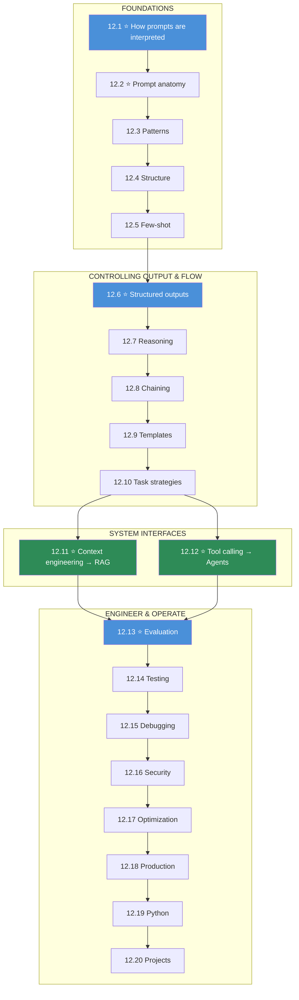

# Module 12 · Prompt Engineering — Lessons

[⬅ Module home](../README.md) · [🗺 Roadmap](../../../ROADMAP.md) · [📚 Curriculum](../../../CURRICULUM.md)

> This is the map of Module 12. **A prompt is a specification for a probabilistic machine.** By the end you will design reliable prompts, force and validate structured outputs, drive reasoning and tool use, and evaluate, test, debug, secure, and operate prompts like production code.

---

## The rule of this module

> [!IMPORTANT]
> **The model does what your input makes most probable, not what you meant.** An LLM is a next-token predictor ([11.1](../../11-LLMs/weeks/11.1-what-is-a-language-model.md)); prompt engineering is the discipline of **shaping the input so the desired output is the most probable one** — via precise instructions, clear structure, concrete examples, explicit output format, and unambiguous constraints. Because generation is probabilistic, **reliability is a property of the prompt over a dataset**, not of a single lucky response.
>
> **The plan:** understand how prompts are interpreted → structure a good prompt → learn the core patterns → force structured output → drive reasoning and chaining → build reusable templates → engineer context and tools → then **evaluate, test, debug, secure, optimize, and operate** prompts in production.

This module sits between [Module 11 · LLMs](../../11-LLMs/README.md) (which explains *why* the model behaves probabilistically) and [Module 13 · RAG](../../13-RAG/README.md) / [Module 14 · Agents](../../14-AI-Agents/README.md) (which scale **context** and **tools** into full systems). **Prompt engineering is the interface layer of every LLM application.**

---

## The 20 lessons

| # | Lesson | The one thing | Build? |
|---|---|---|---|
| 12.1 | [How LLMs Interpret Prompts](12.1-how-llms-interpret-prompts.md) ⭐ | tokens · roles · context window · **probabilistic generation** | — |
| 12.2 | [Anatomy of a Good Prompt](12.2-anatomy-of-a-prompt.md) ⭐ | role · objective · context · instructions · constraints · examples · format | — |
| 12.3 | [Basic Prompting Patterns](12.3-basic-patterns.md) | zero/one/few-shot · role · instruction · contextual | — |
| 12.4 | [Prompt Structure](12.4-prompt-structure.md) | delimiters, tags, sections — **separate data from instructions** | ✅ |
| 12.5 | [Few-Shot Prompting](12.5-few-shot.md) | examples *are* the spec: selection, quality, diversity, order | ✅ |
| 12.6 | [Structured Outputs](12.6-structured-outputs.md) ⭐ | JSON/Schema/XML + **programmatic validation** | ✅ |
| 12.7 | [Prompting for Reasoning](12.7-reasoning.md) | decompose · plan · self-check · critique-revise | — |
| 12.8 | [Prompt Chaining](12.8-prompt-chaining.md) | split into steps; pass outputs; reliability via decomposition | ✅ |
| 12.9 | [Prompt Templates](12.9-templates.md) | variables · versioning · reusable, configurable prompts | ✅ |
| 12.10 | [Task Strategies](12.10-task-strategies.md) | per-task structure, failure modes, evaluation | ✅ |
| 12.11 | [Context Engineering](12.11-context-engineering.md) ⭐ | select · order · compress · prioritize — **the bridge to RAG** | — |
| 12.12 | [Tool & Function Calling](12.12-tool-calling.md) ⭐ | schemas · arguments · results — **the bridge to agents** | ✅ |
| 12.13 | [Prompt Evaluation](12.13-evaluation.md) ⭐ | accuracy, consistency, hallucination, format — over a **dataset** | ✅ |
| 12.14 | [Prompt Testing](12.14-testing.md) | unit · regression · golden sets · A/B · versioning | ✅ |
| 12.15 | [Debugging Prompts](12.15-debugging.md) | a systematic framework for bad outputs | — |
| 12.16 | [Prompt Security](12.16-security.md) | injection · untrusted input · leakage — **defensive** | — |
| 12.17 | [Prompt Optimization](12.17-optimization.md) | clarity · constraints · the length↔cost↔latency↔quality trade-off | — |
| 12.18 | [Production Prompt Engineering](12.18-production.md) | registry · versioning · logging · monitoring · rollback | — |
| 12.19 | [Prompt Engineering with Python](12.19-python.md) | reusable template/validation/eval components | ✅ |
| 12.20 | [Mini Projects & Summary](12.20-projects-summary.md) | 7 projects; the whole discipline, connected | ✅ |

⭐ marks the load-bearing lessons. **12.1 (how prompts are interpreted)** and **12.6 (structured outputs)** make prompting concrete and reliable; **12.11 (context)** and **12.12 (tools)** are the bridges to the rest of the program; **12.13 (evaluation)** is what turns prompting from art into engineering.

---

## The dependency graph

**Read it as four phases:** *foundations* (how prompts work + anatomy + patterns), *controlling output & flow* (structure, structured output, reasoning, chaining, templates), *system interfaces* (context → RAG, tools → agents), and *engineer & operate* (evaluate, test, debug, secure, optimize, deploy).

---

## The recurring through-lines

- **The model does what's probable, not what you meant** — remove ambiguity until the right answer is the likely one.
- **Reliability is measured over a dataset**, never one response — prompts are tested and evaluated like code.
- **Separate instructions from data** — the root of both quality and security.
- **Structure forces reliability** — delimiters, schemas, and validation beat prose.
- **Show, don't just tell** — examples are often a stronger spec than instructions.
- **Context engineering and tool calling are prompt engineering** — and the foundations of RAG ([13](../../13-RAG/README.md)) and agents ([14](../../14-AI-Agents/README.md)).

---

## Navigation

| Direction | Link |
|---|---|
| 🏠 Module home | [Module 12](../README.md) |
| ➡ First lesson | [12.1 · How LLMs Interpret Prompts](12.1-how-llms-interpret-prompts.md) |
| 🗺 Roadmap | [ROADMAP.md](../../../ROADMAP.md) |
| 📚 Curriculum | [CURRICULUM.md](../../../CURRICULUM.md) |
