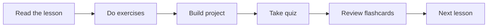

# Module 13 · RAG

[⬅ 12 · Prompt Engineering](../12-Prompt-Engineering/README.md) · [🏠 docs](../README.md) · [🗺 Roadmap](../../ROADMAP.md) · [14 · AI Agents ➡](../14-AI-Agents/README.md)

> Grounding LLMs with retrieval-augmented generation — from first principles to production.

---

## Purpose

This module covers **Retrieval-Augmented Generation (RAG)**: how to give an LLM access to knowledge it was never trained on — private, fresh, or too large to fit in a prompt — by **retrieving the right text at query time and grounding generation in it.** It builds on the [embeddings](../10-NLP/weeks/10.4-word-embeddings.md), [context-window](../11-LLMs/weeks/11.15-kv-cache.md), and [LLM serving](../11-LLMs/weeks/11.20-production-architecture.md) foundations from Modules 10–11.

## What you'll learn

- **Why RAG exists** — knowledge cutoff, private data, freshness, and hallucination — and when to choose RAG over fine-tuning or plain prompting.
- The **complete RAG pipeline**: data → ingest → parse → clean → chunk → embed → index → retrieve → filter → rerank → construct context → generate → evaluate → monitor. *Not* "docs → vectors → LLM."
- **Embeddings and similarity search from scratch**, then real **vector databases** (HNSW, IVF, PQ).
- **Retrieval quality**: dense vs sparse (BM25) vs hybrid, metadata filtering, query expansion, and **reranking**.
- **Evaluation** as two separate problems — retrieval (Precision@K, Recall@K, MRR, NDCG) and generation (faithfulness, answer/context relevance, citations).
- **Debugging hallucinations**, **securing** RAG (prompt injection through documents, multi-tenant isolation, PII), and **deploying** production-grade RAG services.

## 📖 Lessons (start here)

> ✅ **This module's content is written.** Work through the lessons in order via the [lesson index](weeks/README.md).

| # | Lesson | Build? |
|---|---|---|
| 13.1 | [Why RAG Exists](weeks/13.1-why-rag-exists.md) ⭐ | — |
| 13.2 | [RAG Architecture](weeks/13.2-rag-architecture.md) ⭐ | — |
| 13.3 | [Document Ingestion & Parsing](weeks/13.3-ingestion-parsing.md) | ✅ |
| 13.4 | [Chunking](weeks/13.4-chunking.md) ⭐ | ✅ |
| 13.5 | [Embeddings & Similarity Search](weeks/13.5-embeddings-similarity.md) ⭐ | ✅ |
| 13.6 | [Vector Databases (HNSW, IVF, PQ)](weeks/13.6-vector-databases.md) | ✅ |
| 13.7 | [Retrieval — Dense, Sparse, Hybrid](weeks/13.7-retrieval.md) ⭐ | ✅ |
| 13.8 | [Reranking](weeks/13.8-reranking.md) | ✅ |
| 13.9 | [Context Construction](weeks/13.9-context-construction.md) | — |
| 13.10 | [Generation](weeks/13.10-generation.md) | ✅ |
| 13.11 | [Advanced RAG](weeks/13.11-advanced-rag.md) | — |
| 13.12 | [RAG Evaluation](weeks/13.12-evaluation.md) ⭐ | ✅ |
| 13.13 | [RAG Debugging](weeks/13.13-debugging.md) | — |
| 13.14 | [RAG Security](weeks/13.14-security.md) | — |
| 13.15 | [Production RAG Architecture](weeks/13.15-production-architecture.md) | — |
| 13.16 | [RAG Performance](weeks/13.16-performance.md) | — |
| 13.17 | [RAG with Frameworks](weeks/13.17-frameworks.md) | ✅ |
| 13.18 | [Mini Projects & Summary](weeks/13.18-projects-summary.md) | ✅ |

**Companion artifacts:** [Exercises](exercises/README.md) · [Quiz](quizzes/quiz-01.md) · [Flashcards](flashcards/deck.md) · [Cheat sheet](cheat-sheets/rag-cheatsheet.md)

> [!IMPORTANT]
> **⭐ The rule of this module: RAG is a retrieval problem with a language model attached, not a language problem with a database attached.** The LLM is the *last* and *least* controllable stage. Everything that determines whether the answer is correct — parsing, chunking, embedding, indexing, retrieval, filtering, reranking, context assembly — happens **before the model ever sees a token.** If retrieval hands the model the wrong context, no prompt engineering or bigger model can save the answer: **garbage in, confident garbage out.**
>
> So this module spends most of its time on the pipeline *before* generation. You will **build a semantic search engine from scratch** ([13.5](weeks/13.5-embeddings-similarity.md)) before touching a vector DB, understand **why approximate search works** ([13.6](weeks/13.6-vector-databases.md)), learn that **hybrid retrieval + reranking** ([13.7](weeks/13.7-retrieval.md)–[13.8](weeks/13.8-reranking.md)) beats any single method, and treat **evaluation** ([13.12](weeks/13.12-evaluation.md)) as two problems, not one. **Retrieval quality is the ceiling on generation quality.**

## How this module is organized

Content is delivered week by week. Each module uses the same subfolders:

| Folder | Contents |
|---|---|
| [`weeks/`](weeks/) | Weekly lesson content, one file per lesson (`13.1-…`, `13.2-…`). |
| [`diagrams/`](diagrams/) | Mermaid sources and exported diagram assets for this module. |
| [`exercises/`](exercises/) | Hands-on practice problems with solutions. |
| [`projects/`](projects/) | Buildable projects that apply this module's skills. |
| [`quizzes/`](quizzes/) | Self-assessment question banks with answer keys. |
| [`flashcards/`](flashcards/) | Spaced-repetition Q/A decks for active recall. |
| [`cheat-sheets/`](cheat-sheets/) | One-page quick references for this module. |
| [`references/`](references/) | Paper summaries and deep-dive notes. |

## Suggested study flow

## Related modules

- [Module 10 · NLP](../10-NLP/README.md) — embeddings, tokenization, evaluation.
- [Module 11 · LLMs](../11-LLMs/README.md) — context windows, generation, serving, safety.
- [Module 12 · Prompt Engineering](../12-Prompt-Engineering/README.md) — the generation stage's prompts.
- [Module 14 · AI Agents](../14-AI-Agents/README.md) — agentic RAG and tool-use retrieval.

---

## Navigation

| Direction | Link |
|---|---|
| ⬆ Parent | [docs/](../README.md) |
| ⬅ Previous | [⬅ 12 · Prompt Engineering](../12-Prompt-Engineering/README.md) |
| ➡ Next | [14 · AI Agents ➡](../14-AI-Agents/README.md) |
| 🗺 Roadmap | [ROADMAP.md](../../ROADMAP.md) |
| 📚 Curriculum | [CURRICULUM.md](../../CURRICULUM.md) |
| 🏠 Repo root | [README.md](../../README.md) |
