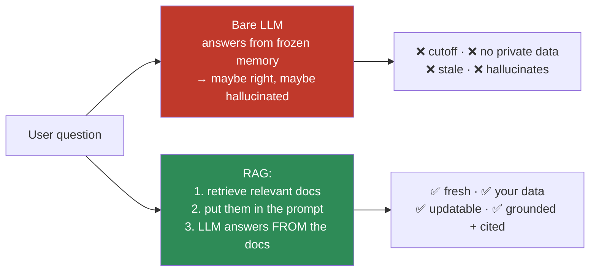
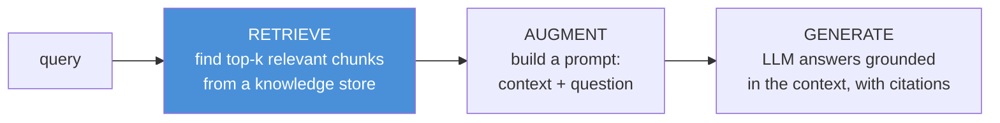
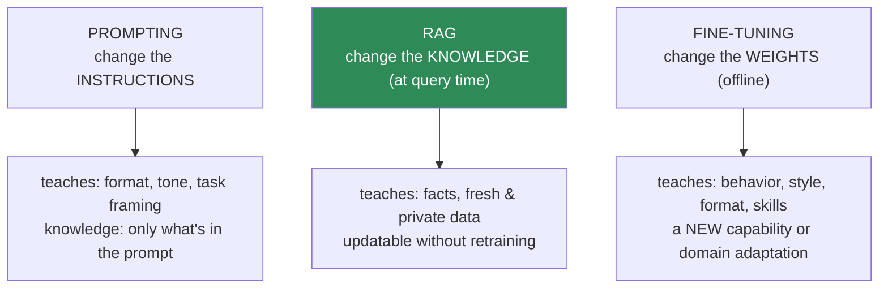

# 13.1 · Why RAG Exists ⭐

[🏠 Module 13](../README.md) · [📖 Lessons](README.md) · [➡ 13.2 RAG Architecture](13.2-rag-architecture.md)

> **The lesson in one line:** An LLM's knowledge is frozen at its training cutoff, blind to your private data, stale the moment the world changes, and prone to confidently inventing facts — RAG fixes all four by **retrieving relevant text at query time and putting it in the prompt**, so the model reasons over *given* facts instead of *remembered* ones.

---

## 🎯 Learning objectives

- Explain the four failure modes of a bare LLM: **knowledge cutoff, private data, changing data, hallucination**.
- Understand what RAG is at its core: **grounding generation in retrieved evidence**.
- Compare **prompting, RAG, and fine-tuning** and choose the right tool per problem.
- Internalize the module's spine: **retrieval quality is the ceiling on generation quality.**

## ✅ Prerequisites

- [11.1 what a language model is](../../11-LLMs/weeks/11.1-what-is-a-language-model.md) — next-token prediction, why "probable ≠ true".
- [11.9 pretraining](../../11-LLMs/weeks/11.9-pretraining.md) — where an LLM's knowledge comes from (and freezes).
- [11.18 LLM safety](../../11-LLMs/weeks/11.18-safety.md) — hallucination framed as a safety issue.

---

## 🧠 Mental model

> [!IMPORTANT]
> **A bare LLM is a brilliant, well-read consultant with no internet, no access to your files, a memory that stopped updating months ago, and a compulsion to never say "I don't know."** It will answer anything — fluently and often wrongly. **RAG is handing that consultant the exact page of the exact document that answers the question, right before they answer.** The model stops recalling and starts *reading*. That is the entire idea: move the burden of *knowing* from the frozen weights to a fresh, searchable, auditable external store.

---

## The four reasons a bare LLM fails

### 1. Knowledge cutoff
An LLM's parameters are frozen at the end of pretraining ([11.9](../../11-LLMs/weeks/11.9-pretraining.md)). Anything that happened after the **cutoff date** — a product launched last week, a law passed yesterday, a game's final score — simply isn't in the weights. The model can't know it, so it either refuses or, worse, invents a plausible answer.

### 2. Private data
No public model was trained on your company's wiki, your customer's support tickets, your codebase, or last quarter's board deck. This data is **private and unseen** — the most valuable knowledge in most organizations is exactly the knowledge no foundation model has ever read.

### 3. Frequently changing data
Even data that *was* in training goes stale: pricing, inventory, org charts, documentation, API references, policies. Retraining or fine-tuning a model every time a fact changes is absurdly expensive and slow. **The knowledge changes faster than the weights can.**

### 4. Hallucination
Because an LLM is a next-token predictor optimized for *plausibility*, not *truth* ([11.1](../../11-LLMs/weeks/11.1-what-is-a-language-model.md)), when it lacks a fact it generates the most *likely-sounding* continuation — a **hallucination**. It fills gaps confidently and fluently. This is not a bug to be patched; it is intrinsic to the objective.

> [!IMPORTANT]
> **RAG attacks all four at once with one move: put the answer in the context window.** A retrieved, cited passage is (1) as fresh as your index, (2) drawn from your private store, (3) updatable by re-indexing one document, and (4) a concrete grounding that dramatically reduces hallucination — the model can *quote* instead of *guess*. RAG converts an open-book-from-memory exam into an open-book-with-the-right-page exam.

---

## What RAG actually is

**Retrieval-Augmented Generation** = *retrieve* relevant text for a query, then *generate* an answer conditioned on that text.

The name is the algorithm: **Retrieve → Augment → Generate.** The augmentation is just prompt construction — the retrieved text becomes part of the input. The LLM's job shifts from *recall* to *reading comprehension over supplied evidence*, which is what LLMs are best at.

---

## Prompting vs RAG vs Fine-tuning

These three are often posed as rivals. They solve **different** problems and compose freely.

| Dimension | **Prompting** | **RAG** | **Fine-tuning** |
|---|---|---|---|
| **What it changes** | the instructions/context | the retrieved knowledge | the model weights |
| **Best for** | task framing, format, tone | injecting facts, fresh/private data | new behavior, style, format adherence, a skill |
| **Freshness** | live (whatever you paste) | **live — re-index to update** | frozen at fine-tune time |
| **Cost to update a fact** | trivial (edit prompt) | **cheap (re-embed one doc)** | expensive (retrain) |
| **Handles private data** | only what fits in prompt | **yes, at scale** | yes, but baked in & leakable |
| **Attribution / citations** | no | **yes — you know the source** | no |
| **Reduces hallucination** | slightly | **strongly (grounding)** | no (can *increase* confident errors) |
| **Latency added** | none | retrieval step (tens of ms) | none at inference |
| **Data needed** | none | a document corpus | a labeled/curated dataset |

> [!IMPORTANT]
> **The decision rule:** Is the problem *"the model doesn't KNOW something"* → **RAG**. Is the problem *"the model doesn't BEHAVE the way I want"* (wrong format, wrong style, wrong task) → **fine-tuning** (or better prompting). Is it *"I just need to steer this one call"* → **prompting**. **Facts → RAG. Behavior → fine-tune. Framing → prompt.** Most production systems use all three: a fine-tuned/instruction-tuned model, prompted with a good template, filled by RAG.

### Common myths

| Myth | Reality |
|---|---|
| "Fine-tune to teach the model our docs" | Fine-tuning teaches *behavior*, not reliable *facts*; it hallucinates your docs and can't cite them. Use RAG. |
| "RAG will fix a model that formats badly" | RAG adds knowledge, not behavior. Format problems → prompt or fine-tune. |
| "Bigger context windows kill RAG" | Long context helps but doesn't replace retrieval — you still must *find* and *rank* the right text, and stuffing everything is slow, costly, and hurts accuracy ([13.9 lost-in-the-middle](13.9-context-construction.md)). |
| "RAG eliminates hallucination" | It *reduces* it. The model can still ignore or misread context ([13.13 debugging](13.13-debugging.md)). |

---

## 🏭 Production examples

| System | Why RAG (not fine-tune / not bare) |
|---|---|
| **Customer-support bot** | Answers must reflect *current* policies/prices, cite the source article, and cover private KB — re-index on doc change. |
| **Internal "chat with our wiki"** | Private data no public model saw; employees need attributable answers. |
| **Legal / medical assistant** | Must ground every claim in a retrievable source; hallucination is unacceptable and citations are mandatory. |
| **Coding assistant over a private repo** | The codebase changes hourly; retrieval keeps answers current without retraining. |
| **News / research QA** | Freshness is the product; the cutoff makes a bare LLM useless. |

## ⚡ Performance considerations

- RAG adds a **retrieval step** (typically tens of milliseconds) before generation — cheap relative to LLM latency, and cacheable ([13.16](13.16-performance.md)).
- RAG lets you use a **smaller/cheaper model** for many tasks, because the hard part (knowing the fact) is handled by retrieval, not the model's parameters.
- Re-indexing one changed document is **orders of magnitude cheaper** than any fine-tune.

## 🔒 Security considerations

> [!CAUTION]
> - **Retrieved documents are untrusted input.** Text pulled from your store can contain **prompt injection** ([11.18](../../11-LLMs/weeks/11.18-safety.md), [13.14](13.14-security.md)) — treat retrieved content as data, never as trusted instructions.
> - **RAG can leak data across users** if access control isn't enforced *at retrieval time* — the index must respect who is allowed to see each document ([13.14](13.14-security.md)).
> - **RAG makes private data queryable**, which is the point *and* the risk: an over-broad index is a data-exfiltration surface.

## 🚫 Common mistakes

| Mistake | Consequence |
|---|---|
| Fine-tuning to inject facts | Hallucinated, un-citable, un-updatable "knowledge" |
| Reaching for RAG to fix formatting/tone | Wrong tool — that's a prompt/fine-tune problem |
| Assuming RAG removes hallucination | It reduces it; the model can still misread context |
| Treating "docs → vectors → LLM" as the whole system | Ignores parsing, chunking, filtering, reranking, eval — where quality is actually won ([13.2](13.2-rag-architecture.md)) |
| Trusting retrieved text as instructions | Opens document-borne prompt injection |

## 🐛 Debugging workflow (preview)

When a RAG answer is wrong, ask **in order**: (1) *Was the answer even in the corpus?* (2) *Was the right chunk retrieved?* (3) *Did the model use it?* Most failures are stage 1 or 2 — **retrieval**, not generation. The full workflow is [13.13](13.13-debugging.md).

## 🏋️ Exercises

1. **Cutoff demo.** Ask a bare LLM about an event after its cutoff. Then paste a relevant paragraph and ask again. Contrast the answers — this *is* RAG, done by hand.
2. **Decision table.** For 8 real scenarios (e.g., "make the bot reply in JSON", "answer from our 2024 pricing", "adopt our brand voice"), decide prompt vs RAG vs fine-tune and justify each.
3. **Hallucination hunt.** Find three questions where a bare LLM confidently invents an answer. Predict which RAG would fix and which it wouldn't (e.g., reasoning errors vs missing facts).
4. **Cost estimate.** Estimate the cost/latency of updating one fact via RAG (re-embed one doc) vs fine-tuning (retrain). Quantify the gap.

## 🛠️ Mini exploration — "Same question, three tools"

Take one question about a private/fresh fact. Answer it three ways: (a) bare LLM, (b) LLM + pasted context (manual RAG), (c) note what fine-tuning would require. Write one paragraph on why (b) is the right default for *knowledge* problems. This frames the entire module.

## 📄 Cheat sheet

| Concept | One line |
|---|---|
| **Knowledge cutoff** | weights frozen at train time → no recent facts |
| **Private data** | no public model saw your docs |
| **Changing data** | facts move faster than weights can |
| **⭐ Hallucination** | plausibility ≠ truth → confident invention |
| **⭐ RAG** | retrieve relevant text → put in prompt → generate grounded |
| **Prompting** | change instructions (framing) |
| **RAG** | change knowledge (facts, fresh/private, updatable) |
| **Fine-tuning** | change weights (behavior, style, skill) |
| **⭐ Decision rule** | facts → RAG · behavior → fine-tune · framing → prompt |

## 🎴 Flashcards

- **⭐ Why does RAG exist?** → LLM knowledge is cut off, private-blind, stale, and hallucination-prone; RAG injects fresh, private, citable facts at query time.
- **What is RAG in one sentence?** → Retrieve relevant text for a query and generate an answer conditioned on it.
- **⭐ RAG vs fine-tuning — when each?** → RAG for *facts/knowledge* (fresh, private, updatable, citable); fine-tuning for *behavior/style/skill*.
- **Does RAG eliminate hallucination?** → No — it strongly reduces it by grounding, but the model can still ignore or misread context.
- **Does a bigger context window kill RAG?** → No — you still must find and rank the right text; stuffing everything is slow, costly, and less accurate.
- **Why not fine-tune to teach facts?** → It's expensive, un-updatable, un-citable, and still hallucinates the "learned" facts.

## 💬 Interview questions

1. Why does a bare LLM fail on private, fresh knowledge? Name the four failure modes.
2. Define RAG. What are the three steps in its name?
3. Compare prompting, RAG, and fine-tuning — what does each change, and when do you pick each?
4. Why is fine-tuning a poor way to inject factual knowledge?
5. Does RAG eliminate hallucination? Explain.
6. Someone says "GPT has a 1M-token context now, so RAG is dead." Respond.

## 📝 Summary

- A bare LLM fails on **knowledge cutoff, private data, changing data, and hallucination** — all four are intrinsic to a model whose knowledge lives in frozen weights.
- **RAG** fixes all four by **retrieving relevant text at query time and grounding generation in it** — recall becomes reading comprehension.
- **Facts → RAG. Behavior → fine-tune. Framing → prompt.** They compose; production systems use all three.
- The module's spine starts here: **retrieval quality is the ceiling on generation quality** — the rest of the module is about making retrieval good.

## 📚 References

1. **Lewis et al. (2020) — _Retrieval-Augmented Generation for Knowledge-Intensive NLP Tasks_.** ⭐ The paper that named RAG.
2. **Gao et al. (2023) — _Retrieval-Augmented Generation for Large Language Models: A Survey_.** ⭐ Broad map of the field.
3. **[11.1 What is a Language Model](../../11-LLMs/weeks/11.1-what-is-a-language-model.md).** Why "probable ≠ true".
4. **[11.18 LLM Safety](../../11-LLMs/weeks/11.18-safety.md).** Hallucination and prompt injection.

---

## 🧭 Navigation

| Direction | Link |
|---|---|
| ⬅ Previous | [Module home](../README.md) |
| ➡ Next | [13.2 · RAG Architecture](13.2-rag-architecture.md) |
| 🏠 Module | [Module 13](../README.md) |
| 📖 Lessons | [Lesson index](README.md) |
