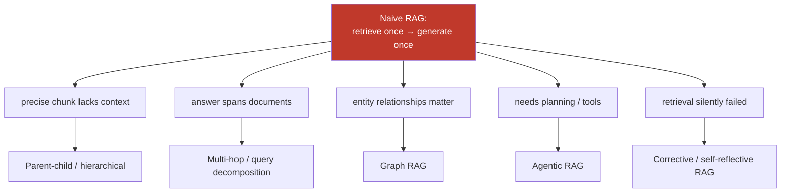
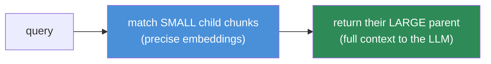
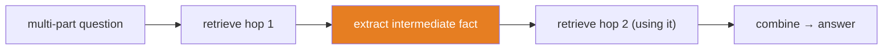
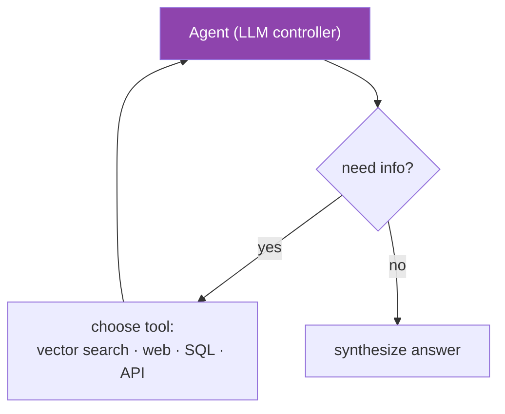
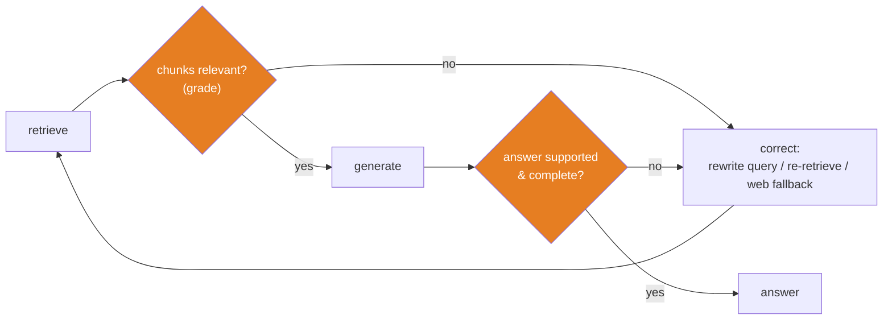

# 13.11 · Advanced RAG

[⬅ 13.10 Generation](13.10-generation.md) · [🏠 Module 13](../README.md) · [➡ 13.12 RAG Evaluation](13.12-evaluation.md)

> **The lesson in one line:** Naive "retrieve once, generate once" RAG breaks on questions that need context beyond a chunk, evidence spread across documents, or a check that retrieval actually worked — so advanced patterns add **hierarchy** (small-to-big), **iteration** (multi-hop, agentic), **structure** (graph), and **self-correction** (corrective, self-reflective) to the loop.

---

## 🎯 Learning objectives

- Know the major advanced patterns and the naive-RAG failure each one fixes.
- Understand **parent-child / hierarchical**, **multi-hop**, **graph**, **agentic**, **corrective**, and **self-reflective** RAG.
- Reason about the **quality vs latency/cost/complexity** trade-offs.
- Choose the simplest pattern that solves the problem.

## ✅ Prerequisites

- [13.7 retrieval](13.7-retrieval.md)–[13.10 generation](13.10-generation.md) — the naive loop these extend.
- [14 AI Agents](../../14-AI-Agents/README.md) (preview) — agentic RAG uses tool-use loops.

---

## 🧠 Mental model

> [!IMPORTANT]
> **Every advanced RAG pattern is a fix for a specific naive-RAG failure — not a general upgrade.** Naive RAG assumes the answer lives in a few independently-retrievable chunks, found in one shot. That assumption breaks when: the *precise* chunk lacks surrounding context (→ parent-child), the answer requires *combining* facts from different places (→ multi-hop), relationships between entities matter (→ graph), the query needs *planning or tools* (→ agentic), or retrieval *silently failed* and you want the system to notice (→ corrective/self-reflective). **Add a pattern only when you've measured the failure it addresses — each one buys accuracy with latency, cost, and complexity.**



---

## Parent-child (small-to-big) & hierarchical retrieval

**Problem:** small chunks retrieve precisely ([13.4](13.4-chunking.md)) but lack context to answer; big chunks have context but retrieve poorly (blurred embeddings).
**Fix:** embed and match on **small** chunks, but return their **larger parent** (the section/document) as context.



**Hierarchical retrieval** generalizes this: index summaries at multiple levels (document → section → chunk), retrieve top-down (find the right document, then the right section, then the chunk). Great for large, structured corpora.

## Multi-hop retrieval

**Problem:** "Which cloud provider does the vendor of our CRM use?" needs two facts (CRM → vendor, vendor → cloud) that no single chunk contains.
**Fix:** **iterate** — retrieve, read, form a follow-up query from what you learned, retrieve again, until you can answer. Often paired with **query decomposition** ([13.7](13.7-retrieval.md)): split the question into sub-questions, retrieve for each.



## Graph RAG

**Problem:** questions about **relationships** and **aggregation** across an entity network ("how are these three teams connected?") that flat chunk retrieval can't assemble.
**Fix:** build a **knowledge graph** (entities as nodes, relationships as edges) from the corpus (often LLM-extracted), then retrieve by traversing the graph and/or over graph-community summaries. Strong for global/"connect-the-dots" questions; costly to build and maintain.

## Agentic RAG

**Problem:** the query needs **planning, tool use, or multiple retrieval strategies** — e.g., decide *whether* to retrieve, *which* source to query, call an API, then synthesize.
**Fix:** an **agent** ([14](../../14-AI-Agents/README.md)) treats retrieval as one **tool** among many, deciding in a loop what to fetch next, from where, and when it has enough to answer.



## Corrective RAG (CRAG) & self-reflective RAG

**Problem:** retrieval sometimes returns **irrelevant** chunks and naive RAG generates anyway (garbage in, garbage out).
**Fix:** add a **check**.
- **Corrective RAG:** grade retrieved chunks for relevance; if they're poor, **take corrective action** — rewrite the query, retrieve again, or fall back to web search — before generating.
- **Self-reflective RAG (Self-RAG):** the model decides *whether* to retrieve, then **critiques its own answer** against the sources (is it supported? is it complete?) and retrieves more or revises if not.



---

## The trade-off table

| Pattern | Fixes | Cost added |
|---|---|---|
| **Parent-child / hierarchical** | precision vs context tension | modest (store parents; extra fetch) |
| **Multi-hop** | answers spanning chunks/docs | multiple retrieval rounds + LLM calls |
| **Graph RAG** | relationship/aggregation questions | expensive graph build & maintenance |
| **Agentic RAG** | planning, multi-source, tools | many LLM calls; latency; harder to debug |
| **Corrective/Self-reflective** | silent retrieval failures | extra grading/critique LLM calls |

> [!IMPORTANT]
> **Complexity is a cost, not a feature.** Each pattern adds latency, dollars, failure modes, and debugging surface. **The default should be naive RAG done *well*** — good parsing, chunking, hybrid retrieval, reranking, and context construction beat a fancy pattern bolted onto a weak pipeline. Reach for advanced patterns only when evaluation ([13.12](13.12-evaluation.md)) shows a failure that the pattern specifically addresses. *Fix the pipeline before adding a pattern.*

---

## 🏭 Production examples

| Need | Pattern |
|---|---|
| Precise match but answers need section context | parent-child (small-to-big) |
| "Compare X and Y across our docs" | multi-hop / decomposition |
| "How are these entities related?" / global summary | graph RAG |
| Assistant that queries docs + DB + web + APIs | agentic RAG |
| High-stakes QA that must not answer from bad context | corrective / self-reflective |
| Huge structured corpus | hierarchical (summaries per level) |

## ⚡ Performance considerations

- **Iterative patterns multiply latency and cost** by the number of rounds/tool calls — cap iterations; set a budget.
- **Graph RAG shifts cost offline** (build) but the graph can be large and stale — plan re-extraction.
- **Agentic loops need timeouts and step limits** or they wander ([14](../../14-AI-Agents/README.md)).
- **Cache** intermediate retrievals in multi-hop; **stream** partial progress for UX.

## 🔒 Security considerations

> [!CAUTION]
> - **More autonomy = more injection surface.** Agentic RAG lets retrieved (untrusted) content influence *which tools run next* — a document could steer the agent to exfiltrate data or call a dangerous tool. Constrain tools, require least privilege, and treat all retrieved text as untrusted ([13.14](13.14-security.md), [11.18](../../11-LLMs/weeks/11.18-safety.md)).
> - **Multi-hop/web fallback can pull in untrusted external content** — apply the same injection defenses to fetched web text.
> - **Graph extraction may surface/relate PII** across documents in new ways — re-check access control on graph traversals.

## 🚫 Common mistakes

| Mistake | Consequence |
|---|---|
| Adding advanced patterns before fixing the basics | Complexity without the payoff |
| Unbounded agentic/multi-hop loops | Runaway latency and cost |
| Graph RAG for simple factual QA | Huge build cost, no benefit |
| No relevance grading in high-stakes RAG | Generates confidently from irrelevant chunks |
| Ignoring the injection surface of agentic loops | Tool-hijacking via documents |
| Choosing a pattern by hype, not by measured failure | Wrong tool, wasted effort |

## 🐛 Debugging workflow

Deciding whether to go advanced: (1) **Diagnose the failure with eval** ([13.12](13.12-evaluation.md)) — is it *retrieval* (wrong/missing chunks) or *reasoning* (right chunks, bad synthesis)? (2) Map the failure to a pattern (missing context → parent-child; spans docs → multi-hop; relationships → graph; needs tools → agentic; irrelevant retrieval → corrective). (3) **A/B the pattern vs the well-tuned baseline** — measure the quality gain against the latency/cost hit. If the gain isn't clear, don't ship the complexity.

## 🏋️ Exercises

1. **Parent-child.** Index small chunks that map to larger parents; show retrieval precision (small) + answer quality (parent context) beats either alone.
2. **Multi-hop.** Build a 2-hop question set; implement iterative retrieve→extract→retrieve; compare to single-shot RAG.
3. **Corrective RAG.** Add an LLM relevance grader; on irrelevant retrieval, rewrite the query and re-retrieve. Measure the reduction in wrong answers.
4. **Self-reflection.** Add a post-generation "is this supported by the sources?" critique that triggers re-retrieval; measure faithfulness gain and cost.
5. **Graph mini.** Extract entities/relations from 20 docs; answer a relationship question by traversal vs flat retrieval.

## 🛠️ Mini project — "Corrective + multi-hop assistant"

**Goal:** an assistant that decomposes multi-part questions, retrieves per sub-question, grades relevance, self-corrects on poor retrieval, and synthesizes a cited answer.

**Requirements:** query decomposition; per-hop hybrid retrieval + rerank; an LLM relevance grader (corrective loop with a max-iterations cap); a self-critique of the final answer vs sources; cited structured output.

**Folder structure**
```
advanced-rag/
├── decompose.py    # split multi-part questions
├── hop.py          # iterative retrieve + extract
├── grade.py        # relevance grading (corrective)
├── reflect.py      # answer self-critique
└── synthesize.py   # combine hops → cited answer
```

**Testing:** multi-hop question answered correctly where single-shot fails; corrective loop triggers on injected irrelevant retrieval; iteration cap enforced.
**Evaluation:** accuracy on multi-hop set; faithfulness; cost/latency vs baseline.
**Security:** bounded tools; untrusted retrieved/web text; ACL on every hop.
**Future improvements:** graph RAG for relationship questions; agentic tool selection; adaptive pattern choice per query.

## 📄 Cheat sheet

| Pattern | One line |
|---|---|
| **Parent-child** | match small chunks, return large parents (precision + context) |
| **Hierarchical** | index summaries per level; retrieve top-down |
| **Multi-hop** | iterate retrieve→extract→retrieve for spanning answers |
| **Graph RAG** | knowledge graph traversal for relationships/aggregation |
| **Agentic RAG** | agent uses retrieval as one tool; plans multi-source |
| **Corrective (CRAG)** | grade chunks; rewrite/re-retrieve/web-fallback if poor |
| **Self-reflective** | model decides to retrieve & critiques its own answer |
| **⭐ Rule** | fix naive RAG first; add a pattern only for a measured failure |

## 🎴 Flashcards

- **⭐ What is parent-child / small-to-big retrieval?** → Embed and match on small chunks (precise) but return their larger parent for context — resolving the precision-vs-context tension.
- **What problem does multi-hop RAG solve?** → Questions whose answer requires combining facts from different chunks/documents, via iterative retrieve→extract→retrieve.
- **What is Graph RAG for?** → Relationship and aggregation questions, answered by traversing an entity-relationship graph rather than flat chunks.
- **What is agentic RAG?** → An agent treats retrieval as one tool among many, planning which sources to query and when it has enough to answer.
- **⭐ Corrective vs self-reflective RAG?** → Corrective grades retrieved chunks and re-retrieves if poor; self-reflective also decides whether to retrieve and critiques its own answer's support/completeness.
- **⭐ When should you adopt an advanced pattern?** → Only when evaluation shows a specific failure the pattern fixes — complexity costs latency, money, and debuggability.

## 💬 Interview questions

1. Name three naive-RAG failure modes and the advanced pattern that addresses each.
2. Explain parent-child retrieval and the tension it resolves.
3. How does multi-hop retrieval work, and when is it necessary?
4. What is Graph RAG, and what questions does it uniquely handle?
5. Contrast corrective and self-reflective RAG.
6. What are the risks of agentic RAG, especially around security?
7. How do you decide whether the added complexity of an advanced pattern is justified?

## 📝 Summary

- Advanced RAG patterns each **fix a specific naive-RAG failure**: parent-child (context vs precision), multi-hop (spanning answers), graph (relationships), agentic (planning/tools), corrective & self-reflective (silent retrieval failure).
- **Complexity is a cost** — latency, money, failure modes, debugging — so **fix the basic pipeline first** and adopt a pattern only when evaluation shows the failure it targets.
- **Iterative and agentic patterns multiply cost and expand the injection surface** — bound iterations, constrain tools, and keep treating retrieved content as untrusted.
- Diagnose failures as **retrieval vs reasoning**, map to the right pattern, and **A/B against a well-tuned baseline** before shipping the complexity.

## 📚 References

1. **Sarthi et al. (2024) — _RAPTOR_.** ⭐ Hierarchical/tree retrieval with summaries.
2. **Asai et al. (2023) — _Self-RAG_.** ⭐ Retrieve-and-critique.
3. **Yan et al. (2024) — _Corrective RAG (CRAG)_.** Relevance grading + correction.
4. **Edge et al. (2024) — _GraphRAG_ (Microsoft).** Graph-based global summarization.
5. **[14 · AI Agents](../../14-AI-Agents/README.md).** Agentic loops and tool use.

---

## 🧭 Navigation

| Direction | Link |
|---|---|
| ⬅ Previous | [13.10 · Generation](13.10-generation.md) |
| ➡ Next | [13.12 · RAG Evaluation](13.12-evaluation.md) |
| 🏠 Module | [Module 13](../README.md) |
| 📖 Lessons | [Lesson index](README.md) |
