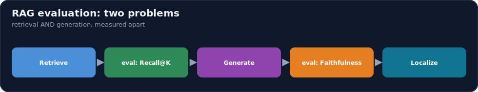
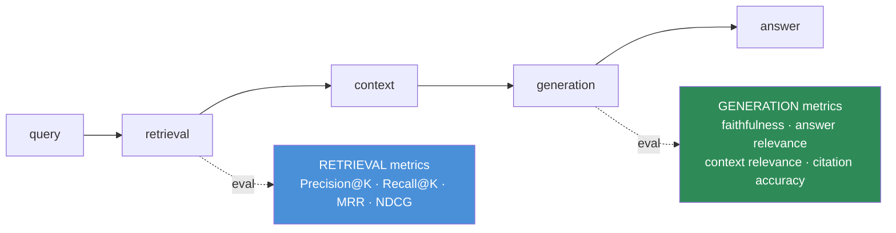
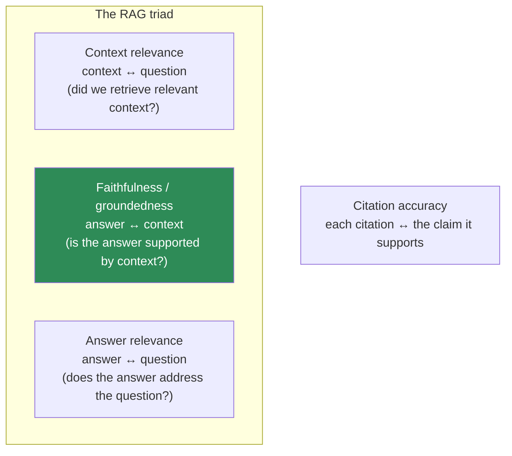
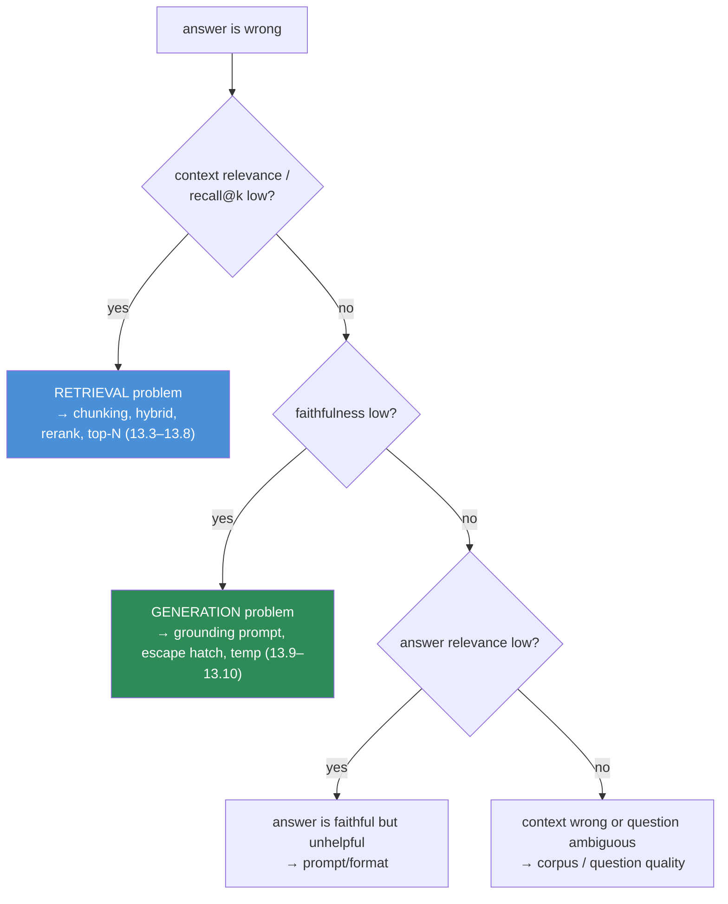

# 13.12 · RAG Evaluation ⭐

[⬅ 13.11 Advanced RAG](13.11-advanced-rag.md) · [🏠 Module 13](../README.md) · [➡ 13.13 RAG Debugging](13.13-debugging.md)

> **The lesson in one line:** RAG has two failure surfaces, so it needs two evaluations — **retrieval** (did we fetch the right chunks? measured by Precision@K, Recall@K, MRR, NDCG) and **generation** (did the answer faithfully use them? measured by faithfulness, answer relevance, context relevance, citation accuracy) — because a single end-to-end score can't tell you *which half* is broken.



---

## 🎯 Learning objectives

- Evaluate **retrieval** with Precision@K, Recall@K, MRR, and NDCG.
- Evaluate **generation** with faithfulness, answer relevance, context relevance, and citation accuracy.
- Understand **why RAG needs both** — and how to localize a failure to a stage.
- Build an evaluation set and use LLM-as-judge responsibly.

## ✅ Prerequisites

- [13.7 retrieval](13.7-retrieval.md), [13.10 generation](13.10-generation.md).
- [11.17 LLM evaluation](../../11-LLMs/weeks/11.17-evaluation.md) — benchmarks, LLM-as-judge, contamination.

---

## 🧠 Mental model

> [!IMPORTANT]
> **A RAG answer can be wrong for two completely different reasons, and a single accuracy number can't distinguish them.** Either retrieval failed (the right chunk never arrived → the model had no chance) or generation failed (the right chunk arrived but the model ignored, misread, or embellished it). These demand different fixes — better chunking/hybrid/reranking vs better prompts/grounding — so you must **measure them separately.** Retrieval evaluation asks "did we find the right stuff?"; generation evaluation asks "given what we found, did we answer well?" **Two problems, two metric families, two debugging paths.**



---

## Part 1 — Retrieval evaluation

Retrieval is ranking: given a query, return the relevant chunks near the top. Needs **ground-truth relevance labels** (which chunks are relevant for each query).

### Precision@K and Recall@K
$$\text{Precision@K} = \frac{\text{relevant in top-K}}{K} \qquad \text{Recall@K} = \frac{\text{relevant in top-K}}{\text{total relevant}}$$

- **Precision@K** — of the K you returned, how many are relevant? (Are you returning junk?)
- **Recall@K** — of all relevant chunks, how many made the top-K? (Are you missing answers?)

> [!IMPORTANT]
> **For RAG, Recall@K is usually the metric that matters most.** If the answer's chunk isn't in the top-K you pass to the LLM, the answer *cannot* be correct — a recall miss is fatal. Precision matters too (junk becomes distractors, [13.9](13.9-context-construction.md)), but reranking ([13.8](13.8-reranking.md)) can fix precision within a high-recall set, whereas nothing downstream can recover a recall miss. **Optimize retrieval for recall; optimize reranking for precision.**

### MRR — Mean Reciprocal Rank
$$\text{MRR} = \frac{1}{N}\sum_{i=1}^{N} \frac{1}{\text{rank}_i}$$

The reciprocal of the rank of the **first** relevant result, averaged over queries. Rewards putting *a* correct answer high. Great when there's essentially one right chunk (first relevant at rank 1 → 1.0; rank 5 → 0.2).

### NDCG — Normalized Discounted Cumulative Gain
Accounts for **graded relevance** (some chunks more relevant than others) and **position** (higher is better, with a logarithmic discount), normalized to `[0,1]` against the ideal ordering.

$$\text{DCG@K} = \sum_{i=1}^{K} \frac{2^{rel_i}-1}{\log_2(i+1)}, \qquad \text{NDCG@K} = \frac{\text{DCG@K}}{\text{IDCG@K}}$$

The most complete ranking metric — use it when relevance has degrees and order matters.

| Metric | Question it answers | Use when |
|---|---|---|
| **Precision@K** | how much of top-K is relevant? | junk/distractor concern |
| **Recall@K** | did we retrieve all the relevant? | **RAG default — misses are fatal** |
| **MRR** | how high is the first relevant? | one right answer per query |
| **NDCG@K** | is the whole ranking well-ordered by graded relevance? | graded relevance, order matters |

---

## Part 2 — Generation evaluation

Given the retrieved context, is the *answer* good? Four complementary metrics (the "RAG triad" plus citations).



| Metric | Compares | Catches |
|---|---|---|
| **Faithfulness (groundedness)** | answer vs **context** | **hallucination** — claims not supported by the retrieved text |
| **Answer relevance** | answer vs **question** | evasive/off-topic answers, even if faithful |
| **Context relevance** | context vs **question** | retrieval returning irrelevant chunks (a retrieval problem seen from generation) |
| **Citation accuracy** | citation vs **the claim** | mis-attribution / citation hallucination ([13.10](13.10-generation.md)) |

> [!IMPORTANT]
> **Faithfulness is the anti-hallucination metric and the heart of RAG evaluation.** An answer is faithful if *every* claim traces to the context. A faithful answer can still be wrong (the context was wrong) or unhelpful (evasive) — which is why you also need answer relevance and context relevance. The three form a triangle: **context relevance** grades retrieval, **faithfulness** grades grounding, **answer relevance** grades helpfulness. A drop in one localizes the problem.

### How generation metrics are measured
Mostly via **LLM-as-judge** ([11.17](../../11-LLMs/weeks/11.17-evaluation.md)): decompose the answer into claims and ask a judge model whether each is supported by the context (faithfulness), whether the answer addresses the question (relevance), etc. Frameworks like **RAGAS**, **TruLens**, and **DeepEval** automate this. Judges are imperfect (bias, cost) — calibrate against human labels on a sample.

---

## Building an evaluation set

You cannot improve what you don't measure. Build a **golden set** of `(question, ground-truth answer, relevant chunk IDs)`:

| Source | How |
|---|---|
| **Human-curated** | experts write Q + mark relevant chunks (best quality, slow) |
| **LLM-generated** | prompt an LLM to generate Q&A from your chunks (fast; verify) |
| **Production logs** | real user queries + labeled outcomes (most representative) |

Aim for coverage: easy/hard, single-hop/multi-hop, in-corpus/out-of-corpus (to test the escape hatch, [13.10](13.10-generation.md)), and keyword-heavy/paraphrase-heavy (to test hybrid, [13.7](13.7-retrieval.md)).

> [!WARNING]
> **Include unanswerable questions in your eval set.** A RAG system that never says "I don't know" is hallucinating; the only way to catch it is to test questions whose answers *aren't* in the corpus and score whether the system correctly declines. Faithfulness/accuracy on answerable questions alone hides this failure.

---

## 💻 Evaluation harness (shape)

```python
def evaluate(rag, eval_set):
    retrieval, generation = [], []
    for ex in eval_set:
        hits = rag.retrieve(ex.question)                 # ranked chunk ids
        retrieval.append({
            "recall@5":    recall_at_k(hits, ex.relevant_ids, 5),
            "precision@5": precision_at_k(hits, ex.relevant_ids, 5),
            "mrr":         mrr(hits, ex.relevant_ids),
            "ndcg@5":      ndcg_at_k(hits, ex.relevant_ids, 5),
        })
        ans = rag.answer(ex.question)
        generation.append({
            "faithfulness":      judge_faithful(ans.text, ans.context),      # LLM-judge
            "answer_relevance":  judge_relevance(ans.text, ex.question),
            "context_relevance": judge_context(ans.context, ex.question),
            "citation_accuracy": verify_citations(ans),                       # deterministic
            "correct":           judge_correct(ans.text, ex.answer),
            "declined_ok":       (not ex.answerable) and ans.declined,        # escape hatch
        })
    return aggregate(retrieval), aggregate(generation)
```

**Run this on every change** — new chunk size, new embedding model, new reranker, new prompt. Without it, every "improvement" is a guess ([13.2](13.2-rag-architecture.md)).

---

## Localizing failures with the two families



**This is why two metric families exist:** low context-relevance/recall → fix retrieval; low faithfulness → fix generation; low answer-relevance with high faithfulness → the answer is grounded but unhelpful (prompt/format). The metrics *route* the fix ([13.13](13.13-debugging.md)).

---

## 🏭 Production examples

| Practice | Why |
|---|---|
| Golden set in CI; block merges on regression | Prevents silent quality loss |
| Track retrieval and generation metrics separately in dashboards | Localize regressions fast |
| Online metrics: thumbs up/down, refusal rate, citation click-through | Real-world signal beyond the golden set |
| Refusal-rate monitoring | Spikes = retrieval regression; drops = creeping hallucination |
| Human review of a sample of LLM-judge scores | Keep the judge honest |

## ⚡ Performance considerations

- **Retrieval metrics are cheap** (set comparisons) — run on large query sets frequently.
- **LLM-as-judge is expensive** (an LLM call per metric per example) — sample, batch, and cache; use a cheaper judge for routine runs, a stronger one for releases.
- **Deterministic checks** (citation quote-in-source, exact-match recall) need no LLM — prefer them where possible.

## 🔒 Security considerations

> [!CAUTION]
> - **Eval sets and logs contain real queries/answers** — often PII; store and share them under the same controls as production data ([13.14](13.14-security.md)).
> - **LLM-as-judge sends answers + context to a model** — mind data flow for a sensitive corpus.
> - **Adversarial/injection test cases** belong in the eval set — measure whether document-borne injection ([13.14](13.14-security.md)) succeeds, as a tracked metric.

## 🚫 Common mistakes

| Mistake | Consequence |
|---|---|
| One end-to-end accuracy number | Can't tell if retrieval or generation is broken |
| No retrieval ground truth | Can't compute recall — flying blind on the fatal metric |
| Only answerable questions in eval | Hidden hallucination on out-of-corpus queries |
| Trusting LLM-judge without calibration | Biased/miscalibrated scores drive wrong decisions |
| Changing pipeline without re-evaluating | "Improvements" that are actually regressions |
| Ignoring citation accuracy | Mis-attributed claims look authoritative |

## 🐛 Debugging workflow

Wrong answer → **read the two metric families** for that query: (1) **Recall@K / context relevance low?** The chunk wasn't retrieved — retrieval bug ([13.3](13.3-ingestion-parsing.md)–[13.8](13.8-reranking.md)). (2) **Recall fine but faithfulness low?** The model hallucinated despite good context — generation bug ([13.9](13.9-context-construction.md)–[13.10](13.10-generation.md)). (3) **Faithful but answer relevance low?** Grounded but unhelpful — prompt/format. The metrics point straight at the stage; full trace-based method in [13.13](13.13-debugging.md).

## 🏋️ Exercises

1. **Implement the metrics.** Code Precision@K, Recall@K, MRR, NDCG@K from scratch; validate on a tiny labeled example by hand.
2. **Recall is fatal.** Construct a query where the answer chunk sits at rank 8 with K=5. Show the answer is impossible, and that raising K or reranking fixes it.
3. **RAG triad.** Score 20 answers for faithfulness, answer relevance, and context relevance (LLM-judge). Find a faithful-but-irrelevant answer and a relevant-but-unfaithful one.
4. **Unanswerable set.** Add 10 out-of-corpus questions; measure how often the system correctly declines.
5. **Judge calibration.** Hand-label 30 answers for faithfulness; compare to LLM-judge; report agreement.

## 🛠️ Mini project — "RAG evaluation harness"

**Goal:** an evaluation suite that scores retrieval and generation separately and gates changes.

**Requirements:** a golden set builder (human + LLM-generated + logs) including unanswerable and adversarial cases; retrieval metrics (P@K, R@K, MRR, NDCG); generation metrics (faithfulness, answer/context relevance, citation accuracy) via LLM-judge + deterministic checks; a failure-localizer that labels each miss retrieval vs generation; a CI gate on regressions.

**Folder structure**
```
rag-eval/
├── goldenset.py    # build/verify Q + relevant_ids + answers
├── retrieval.py    # P@K, R@K, MRR, NDCG
├── generation.py   # faithfulness, relevance, citation (judge + deterministic)
├── localize.py     # retrieval-vs-generation attribution
└── ci.py           # regression gate
```

**Testing:** metrics match hand-computed values; unanswerable cases scored on decline; judge calibrated vs human sample.
**Evaluation:** dashboards per family; regression thresholds.
**Security:** eval data controls; injection cases tracked.
**Future improvements:** online metrics (feedback, refusal rate); per-segment slicing; continuous eval on prod traffic.

## 📄 Cheat sheet

| Concept | One line |
|---|---|
| **⭐ Two evaluations** | retrieval (found it?) + generation (used it well?) |
| **Precision@K** | fraction of top-K that's relevant |
| **⭐ Recall@K** | fraction of relevant in top-K — **fatal if low** for RAG |
| **MRR** | 1/rank of first relevant (one-answer queries) |
| **NDCG@K** | graded-relevance, position-aware ranking quality |
| **⭐ Faithfulness** | answer ↔ context — the anti-hallucination metric |
| **Answer relevance** | answer ↔ question — helpfulness |
| **Context relevance** | context ↔ question — retrieval quality from generation's view |
| **Citation accuracy** | citation ↔ claim — mis-attribution |
| **⭐ Escape-hatch test** | include unanswerable questions; score correct declines |
| **Localize** | low context-rel → retrieval; low faithfulness → generation |

## 🎴 Flashcards

- **⭐ Why does RAG need two evaluations?** → An answer can fail from bad retrieval or bad generation; a single score can't tell which, and they need different fixes.
- **⭐ Precision@K vs Recall@K — which matters most for RAG?** → Recall@K — if the answer chunk isn't in the top-K, the answer can't be correct; reranking fixes precision within a high-recall set.
- **What is MRR?** → Mean of 1/(rank of the first relevant result) — rewards ranking a correct chunk high; best when there's one right answer.
- **What does NDCG add over MRR?** → Graded relevance and position discounting, normalized against the ideal ranking.
- **⭐ What is faithfulness?** → Whether every claim in the answer is supported by the retrieved context — the anti-hallucination metric.
- **What are the RAG triad metrics?** → Context relevance (context↔question), faithfulness (answer↔context), answer relevance (answer↔question).
- **Why include unanswerable questions in the eval set?** → To measure whether the system correctly declines instead of hallucinating — otherwise that failure is invisible.

## 💬 Interview questions

1. Why must RAG evaluation separate retrieval from generation?
2. Define Precision@K, Recall@K, MRR, and NDCG. Which is most important for RAG and why?
3. Explain the RAG triad. What does each metric localize?
4. What is faithfulness, and how is it typically measured?
5. How do you build a good RAG evaluation set, and why include unanswerable questions?
6. What are the pitfalls of LLM-as-judge, and how do you mitigate them?
7. A RAG answer is wrong — how do the two metric families help you find the cause?

## 📝 Summary

- RAG needs **two evaluations** because answers fail for two different reasons: **retrieval** (Precision@K, **Recall@K**, MRR, NDCG) and **generation** (**faithfulness**, answer relevance, context relevance, citation accuracy).
- **Recall@K is the fatal retrieval metric** (a miss is unrecoverable) and **faithfulness is the anti-hallucination generation metric**; the **RAG triad** localizes failures to a stage.
- Build a **golden set** with answerable, unanswerable, and adversarial cases; measure generation mostly via **LLM-as-judge** (calibrated) plus deterministic citation checks.
- **Evaluate on every change and gate regressions** — without measurement, every RAG "improvement" is a guess.

## 📚 References

1. **Es et al. (2023) — _RAGAS: Automated Evaluation of RAG_.** ⭐ Faithfulness, relevance metrics.
2. **Saad-Falcon et al. (2023) — _ARES_.** Automated RAG evaluation.
3. **Järvelin & Kekäläinen (2002) — _NDCG_.** The ranking metric.
4. **[11.17 LLM Evaluation](../../11-LLMs/weeks/11.17-evaluation.md).** LLM-as-judge, contamination, bias.
5. **TruLens / DeepEval documentation.** RAG-triad tooling.

---

## 🧭 Navigation

| Direction | Link |
|---|---|
| ⬅ Previous | [13.11 · Advanced RAG](13.11-advanced-rag.md) |
| ➡ Next | [13.13 · RAG Debugging](13.13-debugging.md) |
| 🏠 Module | [Module 13](../README.md) |
| 📖 Lessons | [Lesson index](README.md) |
