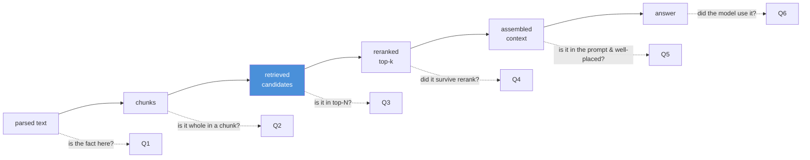
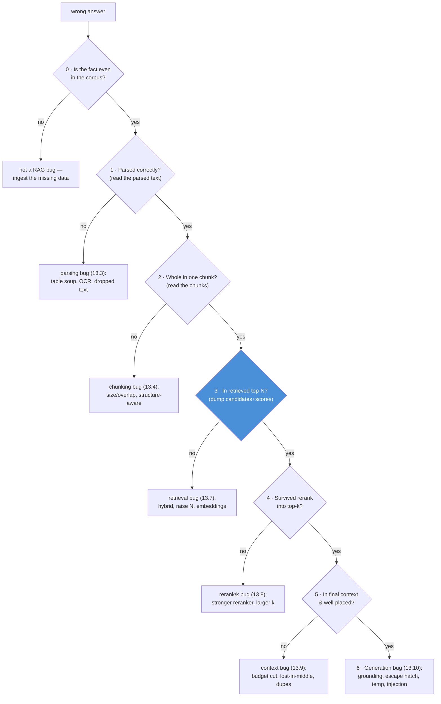

# 13.13 · RAG Debugging

[⬅ 13.12 RAG Evaluation](13.12-evaluation.md) · [🏠 Module 13](../README.md) · [➡ 13.14 RAG Security](13.14-security.md)

> **The lesson in one line:** When a RAG answer is wrong, resist the urge to tweak the prompt — instead **trace one query through every stage** (parsed text → chunks → retrieved candidates → reranked top-k → assembled context → answer) and find the **first stage where the right information disappears**; that stage, not the last one, is your bug.

---

## 🎯 Learning objectives

- Apply a **systematic, stage-by-stage** debugging workflow instead of guessing.
- Diagnose the common failures: **wrong chunks, missing info, duplicates, irrelevant context, overflow, hallucination**.
- Map each symptom to its root-cause stage and fix.
- Instrument a RAG pipeline for traceability.

## ✅ Prerequisites

- All of [13.2](13.2-rag-architecture.md)–[13.12](13.12-evaluation.md) — you debug across every stage.

---

## 🧠 Mental model

> [!IMPORTANT]
> **The symptom (a bad answer) always appears at the last stage, but the cause is almost never there.** RAG is a pipeline; information can be lost at any stage, and once lost it stays lost. So debugging is **binary search over the pipeline**: dump the intermediate output of every stage for one failing query, walk it from the start, and find the **first stage where the answer's information is missing or corrupted**. Everything after that is a downstream *effect*, not the cause. Ninety percent of "the LLM gave a wrong answer" bugs are actually parsing, chunking, or retrieval bugs — the LLM was doomed before it ran.



---

## The systematic workflow

**For one failing query, dump and inspect each stage in order. Stop at the first break.**



> [!IMPORTANT]
> **Always start at stage 0: is the answer even in the corpus?** A shocking share of "RAG bugs" are missing data — the system can't retrieve what was never ingested. Confirm the fact exists in your store *before* debugging retrieval, or you'll chase a phantom. Then walk stages 1→6 and stop at the first break.

---

## Symptom → root cause → fix

| Symptom | Likely stage | Root cause | Fix |
|---|---|---|---|
| **Wrong chunks retrieved** | retrieval ([13.7](13.7-retrieval.md)) | dense-only misses exact terms; weak embeddings; metric mismatch | add hybrid/BM25; check normalization/metric ([13.5](13.5-embeddings-similarity.md)); domain model |
| **Missing information** | ingest/chunk/retrieval | not ingested; fact split across chunks; not in top-N | ingest it; fix chunking ([13.4](13.4-chunking.md)); raise N + rerank |
| **Duplicate chunks** | context ([13.9](13.9-context-construction.md)) | overlap/multi-query surface same passage | dedup before prompt |
| **Irrelevant context** | retrieval/rerank | low precision; no reranking | add reranking ([13.8](13.8-reranking.md)); filter; smaller k |
| **Context overflow / truncation** | context ([13.9](13.9-context-construction.md)) | too many/too-large chunks | smaller k, compression, budget fitting |
| **Hallucination despite good context** | generation ([13.10](13.10-generation.md)) | weak grounding; no escape hatch; high temp | "only from sources" + "say I don't know"; low temp |
| **Confident wrong answer, nothing retrieved** | generation | model answered from memory | escape hatch; enforce grounding |
| **Right answer, wrong/false citation** | generation ([13.10](13.10-generation.md)) | citation hallucination | verify citations against chunks |
| **Answer follows a weird instruction** | security ([13.14](13.14-security.md)) | prompt injection through a document | treat sources as data; injection defenses |

---

## 💻 Instrument for traceability

```python
def answer_traced(query, rag):
    trace = {"query": query}
    trace["candidates"] = rag.retrieve(query, top_n=50)       # ids, text, dense+sparse scores
    trace["reranked"]   = rag.rerank(query, trace["candidates"])  # + rerank scores
    trace["top_k"]      = trace["reranked"][:rag.k]
    trace["context"]    = rag.build_context(query, trace["top_k"])  # exact prompt string
    trace["answer"]     = rag.generate(trace["context"])
    log_trace(trace)     # persist every stage for inspection
    return trace
```

> [!IMPORTANT]
> **You cannot debug what you cannot see.** The single most valuable RAG investment is **logging the full trace** — retrieved candidates *with scores*, the reranked order, and the **exact context string sent to the model** — for every query (or at least every flagged one). Most teams log only the final answer and are then blind. With the trace, most bugs are obvious in seconds; without it, they're guesswork.

---

## Aggregate debugging — beyond one query

Single-query tracing finds *a* bug; **evaluation** ([13.12](13.12-evaluation.md)) finds *systematic* bugs. Slice metrics by query type:

- **Recall@K low across a query segment** (e.g., all code/ID queries) → systematic retrieval gap (add BM25).
- **Faithfulness low broadly** → generation/grounding issue (fix prompt).
- **Refusal rate spiking** → retrieval regression (right chunks stopped arriving).
- **Refusal rate near zero on unanswerable questions** → hallucination (escape hatch not working).

Use per-query tracing to find *why*, and aggregate metrics to find *what and how often*.

---

## 🏭 Production examples

| Practice | Payoff |
|---|---|
| Full trace logged per request (with scores) | Root-cause any complaint in minutes |
| "Debug this answer" UI showing retrieved chunks | Support/QA self-serve triage |
| Metric slicing by query type | Catch systematic gaps (e.g., ID queries) |
| Replay harness (re-run past queries after a change) | Confirm a fix helps and nothing regresses |
| Refusal-rate + citation-accuracy alarms | Early warning of retrieval/generation drift |

## ⚡ Performance considerations

- **Trace logging has cost** (storage, PII) — sample in high-QPS systems; always trace flagged/failed queries.
- **Replaying the eval set** on each change is the fastest way to localize a regression ([13.12](13.12-evaluation.md)).
- Store traces so you can debug **without re-running** the expensive pipeline.

## 🔒 Security considerations

> [!CAUTION]
> - **Traces contain queries, retrieved documents, and answers — often PII and sensitive corpus text.** Secure trace logs like production data; restrict access; redact where required ([13.14](13.14-security.md)).
> - **A "show retrieved chunks" debug UI can leak content across access boundaries** — enforce the *viewer's* ACLs on debug views, not just the query-time ones.
> - **Injection-caused misbehavior looks like a generation bug** — when an answer follows a strange instruction, check the retrieved sources for an injected payload ([13.14](13.14-security.md)).

## 🚫 Common mistakes

| Mistake | Consequence |
|---|---|
| Tweaking the prompt first | Treats a symptom; the cause is usually upstream |
| Only logging the final answer | Blind to every intermediate stage |
| Skipping stage 0 (is it in the corpus?) | Chasing a retrieval phantom for missing data |
| Debugging one query, ignoring aggregates | Fixes an anecdote, misses the systematic bug |
| Not inspecting the exact context string | Miss dedup/ordering/truncation problems |
| Assuming hallucination is always generation | Sometimes it's a recall miss or injection |

## 🐛 Debugging workflow (the checklist)

1. **In the corpus?** Grep the store for the fact. Absent → ingest it.
2. **Parsed?** Read the parsed text — is the fact present and readable ([13.3](13.3-ingestion-parsing.md))?
3. **Chunked whole?** Read the chunks — is the fact intact in one chunk ([13.4](13.4-chunking.md))?
4. **Retrieved?** Dump top-N with dense+sparse scores — is the chunk there ([13.7](13.7-retrieval.md))?
5. **Reranked in?** Check the reranked top-k — did it survive ([13.8](13.8-reranking.md))?
6. **In context, well-placed?** Read the exact prompt — present, not duplicated, not lost-in-the-middle ([13.9](13.9-context-construction.md))?
7. **Used?** If it's all there and the answer's still wrong → generation ([13.10](13.10-generation.md)) or injection ([13.14](13.14-security.md)).

**Stop at the first "no." That's the bug.**

## 🏋️ Exercises

1. **Build the tracer.** Instrument your pipeline to log all six stages. Feed a known-failing query and identify the break.
2. **Plant bugs.** Deliberately break each stage (bad parse, huge chunks, dense-only, no rerank, no dedup, high temp). Show the trace localizes each.
3. **Symptom drill.** For each row in the symptom table, reproduce it and confirm the mapped fix resolves it.
4. **Aggregate slice.** Slice Recall@5 by query type on your eval set; find a segment with a systematic gap and fix it.
5. **Injection vs bug.** Create an answer that follows an injected instruction; show it presents as a "generation bug" until you inspect the sources.

## 🛠️ Mini project — "RAG trace explorer"

**Goal:** a tool that logs and visualizes the full per-query trace for fast root-causing.

**Requirements:** capture parsed text, chunks, retrieved candidates (dense+sparse scores), reranked order, exact context string, and answer; a viewer that walks the stages and highlights where the "gold" chunk (if known) drops out; symptom→stage hints; ACL-aware debug views.

**Folder structure**
```
trace-explorer/
├── trace.py        # capture all stages
├── locate.py       # find first stage the gold chunk disappears
├── viewer.py       # stage-by-stage UI/CLI
└── slice.py        # aggregate metric slicing by query type
```

**Testing:** planted bugs are localized to the correct stage; gold-chunk drop-out detected; debug view enforces viewer ACLs.
**Evaluation:** time-to-root-cause on a set of seeded failures.
**Security:** trace logs access-controlled + redacted; injection detection surfaced.
**Future improvements:** auto-suggest fixes; regression replay; anomaly alerts on refusal rate/citation accuracy.

## 📄 Cheat sheet

| Concept | One line |
|---|---|
| **⭐ Golden rule** | trace the query; find the FIRST stage info disappears |
| **Stage 0** | is the fact even in the corpus? (often the real bug) |
| **Symptom is last stage** | cause is almost never there |
| **Wrong chunks** | retrieval → hybrid, metric, embeddings |
| **Missing info** | ingest/chunk/recall → ingest, chunk, raise N |
| **Duplicates** | context → dedup |
| **Irrelevant context** | rerank/precision → add reranking, smaller k |
| **Overflow** | context → smaller k, compress |
| **Hallucination w/ good context** | generation → grounding + escape hatch + low temp |
| **Weird instruction followed** | security → injection ([13.14](13.14-security.md)) |
| **⭐ Must-have** | full trace logging (candidates+scores, exact context) |

## 🎴 Flashcards

- **⭐ What's the core RAG debugging method?** → Trace one query through every stage and find the first stage where the answer's information disappears — that's the cause, not the final stage.
- **Why start at "is it in the corpus?"** → Many "RAG bugs" are missing data; you can't retrieve what was never ingested.
- **The answer is wrong but the right chunk is in the context — where's the bug?** → Generation (weak grounding, no escape hatch, high temp) or prompt injection — not retrieval.
- **Retrieved chunks are duplicated — which stage?** → Context construction; dedup before building the prompt (overlap/multi-query cause it).
- **⭐ What's the single most valuable RAG debugging investment?** → Logging the full trace: retrieved candidates with scores, reranked order, and the exact context string sent to the model.
- **How do single-query traces and aggregate metrics differ in debugging?** → Traces find why one query failed; sliced metrics find systematic failures and how often they happen.

## 💬 Interview questions

1. Describe your systematic approach to debugging a wrong RAG answer.
2. Why is the cause of a bad answer rarely at the generation stage?
3. Map three symptoms (wrong chunks, duplicates, hallucination-with-good-context) to their root-cause stages and fixes.
4. What must you log to debug RAG effectively, and why is logging only the answer insufficient?
5. How do you tell a hallucination caused by a recall miss from one caused by weak grounding?
6. How do per-query traces and aggregate evaluation complement each other?

## 📝 Summary

- The **symptom is always the final answer, but the cause is upstream** — debug by **tracing one query through every stage** and stopping at the first place the right information is missing or corrupted.
- **Start at stage 0** (is the fact in the corpus?), then parse → chunk → retrieve → rerank → context → generate.
- **Map symptoms to stages**: wrong chunks/missing → retrieval/ingest; duplicates/overflow/lost-in-middle → context; hallucination-with-good-context → generation; weird instructions → injection.
- **Log the full trace** (candidates with scores + exact context string) — it's the highest-leverage debugging investment; use **aggregate metric slicing** to catch systematic bugs.

## 📚 References

1. **[13.12 RAG Evaluation](13.12-evaluation.md).** Metrics that localize failures.
2. **[13.2 RAG Architecture](13.2-rag-architecture.md).** The stages you trace.
3. **RAGAS / TruLens tracing docs.** Instrumentation in practice.
4. **[11.18 LLM Safety](../../11-LLMs/weeks/11.18-safety.md).** When misbehavior is injection.

---

## 🧭 Navigation

| Direction | Link |
|---|---|
| ⬅ Previous | [13.12 · RAG Evaluation](13.12-evaluation.md) |
| ➡ Next | [13.14 · RAG Security](13.14-security.md) |
| 🏠 Module | [Module 13](../README.md) |
| 📖 Lessons | [Lesson index](README.md) |
