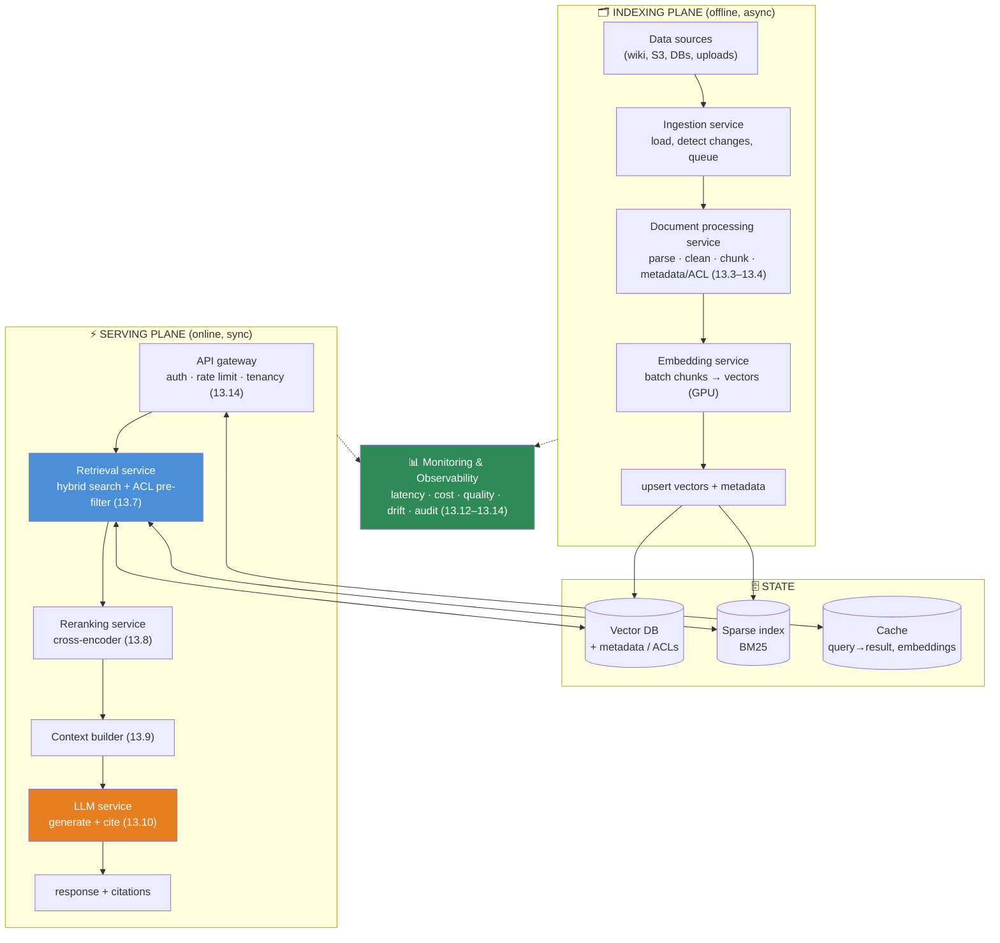
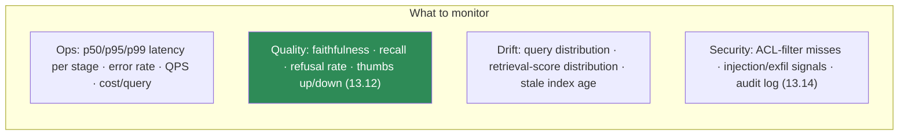

# 13.15 · Production RAG Architecture

[⬅ 13.14 RAG Security](13.14-security.md) · [🏠 Module 13](../README.md) · [➡ 13.16 RAG Performance](13.16-performance.md)

> **The lesson in one line:** A production RAG system isn't a script — it's a set of **decoupled services** (ingestion, processing, embedding, vector store, retrieval, reranking, LLM) split cleanly into an **offline indexing plane** and an **online serving plane**, each scaled, monitored, and secured independently, so you can update the index without touching serving and scale retrieval without re-embedding.

---

## 🎯 Learning objectives

- Decompose RAG into **independently deployable services** and know each one's job.
- Separate the **offline indexing pipeline** from the **online serving path**.
- Add **monitoring, scaling, and reliability** across the system.
- Reason about the operational trade-offs of the architecture.

## ✅ Prerequisites

- [13.2 RAG architecture](13.2-rag-architecture.md) — the pipeline this operationalizes.
- [11.20 production LLM architecture](../../11-LLMs/weeks/11.20-production-architecture.md), [16 MLOps](../../16-MLOps/README.md).

---

## 🧠 Mental model

> [!IMPORTANT]
> **The notebook that does `parse→chunk→embed→retrieve→generate` in one function is a prototype; production splits it into services because the stages have wildly different scaling, latency, and failure profiles.** Ingestion is bursty and offline; embedding is GPU-bound and batchable; the vector store is stateful and memory-hungry; retrieval and reranking are latency-critical and online; the LLM is the slowest, most expensive call. Bundling them means you can't scale or fix one without the others. **Decouple along the offline/online seam, connect with queues and APIs, and each part becomes independently scalable, deployable, and observable.**

---

## The two planes



---

## The services

| Service | Job | Scaling profile |
|---|---|---|
| **Ingestion** | pull from sources; detect changes; enqueue docs | bursty; queue-buffered; offline |
| **Document processing** | parse, clean, chunk, tag metadata/ACL ([13.3](13.3-ingestion-parsing.md)–[13.4](13.4-chunking.md)) | CPU-bound; horizontally scalable workers |
| **Embedding** | batch chunks → vectors; also embeds queries online | GPU-bound; batch offline, low-latency online |
| **Vector DB** | store + ANN search + metadata filter ([13.6](13.6-vector-databases.md)) | stateful; memory-heavy; sharded/replicated |
| **Sparse index** | BM25 keyword search ([13.7](13.7-retrieval.md)) | stateful; inverted index |
| **Retrieval** | hybrid search + ACL/tenant pre-filter ([13.7](13.7-retrieval.md), [13.14](13.14-security.md)) | online; latency-critical; stateless |
| **Reranking** | cross-encoder re-score ([13.8](13.8-reranking.md)) | online; GPU/CPU; batchable |
| **LLM** | generate grounded, cited answer ([13.10](13.10-generation.md)) | online; slowest & priciest; often external API |
| **Monitoring** | latency, cost, quality, drift, audit ([13.12](13.12-evaluation.md)–[13.14](13.14-security.md)) | cross-cutting |

> [!IMPORTANT]
> **The offline/online split is the single most important architectural decision.** Offline (ingest→process→embed→write) is **asynchronous, batched, retryable**, and can be slow — it runs when documents change. Online (retrieve→rerank→context→generate) is **synchronous, latency-bound**, and runs on every request. They share only the **state** (vector DB, sparse index, cache). This lets you **re-index without redeploying serving**, scale the GPU embedding fleet separately from the retrieval fleet, and keep an outage in ingestion from taking down query answering.

---

## Indexing plane details

- **Incremental & idempotent:** detect changed documents (hash/mtime/webhook), reprocess only those, and make upserts idempotent so retries are safe.
- **Queue-driven:** a message queue between ingestion and processing absorbs bursts and enables horizontal workers.
- **Versioning:** version the index/embedding model so you can **re-embed on a model change** and **roll back**. Changing the embedding model requires re-embedding the *whole* corpus ([13.5](13.5-embeddings-similarity.md)) — plan blue/green index swaps.
- **Backfill vs live:** initial bulk index (backfill) vs ongoing updates (live) — same code path, different scale.

## Serving plane details

- **API gateway** ([11.20](../../11-LLMs/weeks/11.20-production-architecture.md)): authentication, **rate limiting**, tenant routing, request validation, and the entry point for ACLs ([13.14](13.14-security.md)).
- **Stateless online services** (retrieval, rerank, context) scale horizontally behind load balancers.
- **Timeouts & fallbacks** at every hop: if reranking times out, fall back to retrieval order; if the LLM fails, return retrieved snippets or a graceful error. **Never let one slow stage hang the whole request.**
- **Streaming** the LLM response for perceived latency.

---

## Monitoring — the fourth pillar



> [!IMPORTANT]
> **Monitor quality, not just uptime.** A RAG system can be 100% "up" — every service healthy, latency green — while silently returning wrong answers because the index went stale or an embedding-model change degraded retrieval. Track **quality metrics online** (refusal rate, faithfulness on sampled traffic, user feedback) and **freshness** (how old is the index?), or you'll ship a system that's healthy and useless.

---

## 🏭 Production examples

| Requirement | Architectural choice |
|---|---|
| Docs change constantly | webhook-driven incremental ingestion; live upserts |
| Embedding-model upgrade | versioned index; re-embed offline; blue/green swap |
| Latency SLA | stateless online tier autoscaled; rerank timeout → retrieval order fallback |
| Multi-tenant | tenant-namespaced vector DB; ACL at gateway + retrieval ([13.14](13.14-security.md)) |
| Cost control | semantic cache; smaller model; cap rerank N ([13.16](13.16-performance.md)) |
| Reliability | queue-buffered ingestion; circuit breakers around the LLM |

## ⚡ Performance considerations

- **Generation and reranking dominate online latency**; retrieval is small — optimize accordingly ([13.16](13.16-performance.md)).
- **Cache aggressively** (query→result, query embeddings, rerank scores) — see [13.16](13.16-performance.md).
- **Batch offline embedding** on GPUs; keep the ANN index warm in memory.
- **Autoscale online services on latency/QPS**; scale offline workers on queue depth.

## 🔒 Security considerations

> [!CAUTION]
> - **ACL/tenant enforcement lives at the gateway *and* the retrieval service** — defense-in-depth ([13.14](13.14-security.md)); a pre-filter in the retrieval service is the last guaranteed checkpoint before the LLM.
> - **The vector DB and caches hold sensitive corpus text** — encrypt at rest, restrict network access, audit access.
> - **Audit logging of retrieval** (who queried what, what was returned) is both a security control and a debugging aid ([13.13](13.13-debugging.md)) — but the logs themselves contain sensitive data.
> - **Least privilege between services** — the LLM service shouldn't have direct DB write access, etc.

## 🚫 Common mistakes

| Mistake | Consequence |
|---|---|
| Monolithic pipeline in one process | Can't scale/deploy/fix stages independently |
| Coupling ingestion to serving | An ingestion failure takes down query answering |
| No index versioning | Can't safely upgrade the embedding model or roll back |
| Synchronous ingestion on the query path | Slow, fragile serving |
| No timeouts/fallbacks between stages | One slow hop hangs the whole request |
| Monitoring uptime but not quality | Healthy system, wrong answers |
| Full re-index with downtime | Outage on every model change (use blue/green) |

## 🐛 Debugging workflow

Production issue triage: (1) **Latency spike?** Check per-stage p95 — which service? (rerank/LLM usually). (2) **Quality drop?** Check index freshness and retrieval-score distribution (drift), and recent embedding/prompt changes; slice eval metrics ([13.12](13.12-evaluation.md)). (3) **Errors?** Per-service error rates + fallbacks firing. (4) **Leak/anomaly?** Audit logs + ACL-miss alarms ([13.14](13.14-security.md)). The service decomposition makes each of these a localized question rather than a whole-system mystery.

## 🏋️ Exercises

1. **Decompose.** Take the [13.2](13.2-rag-architecture.md) skeleton and split it into ingestion, processing, embedding, retrieval, rerank, and LLM services with clear interfaces.
2. **Queue-buffered ingestion.** Put a queue between ingestion and processing; show bursts are absorbed and workers scale on queue depth.
3. **Blue/green re-index.** Simulate an embedding-model upgrade: build a new versioned index, swap traffic, roll back. No serving downtime.
4. **Fallbacks.** Add timeouts so a rerank timeout falls back to retrieval order and an LLM failure returns snippets. Prove requests never hang.
5. **Quality dashboard.** Emit per-stage latency + online refusal rate + index age; build a dashboard and trigger an alert on stale index.

## 🛠️ Mini project — "Production RAG platform"

**Goal:** a service-oriented RAG deployment with separate indexing and serving planes, monitoring, and safe re-indexing.

**Requirements:** ingestion (incremental, queue-driven) → processing → embedding (batch) → versioned vector + sparse indexes; serving: gateway (auth/rate-limit/tenancy) → retrieval (hybrid + ACL pre-filter) → rerank → context → LLM, with timeouts/fallbacks; monitoring (ops + quality + drift + audit); blue/green index swap.

**Folder structure**
```
rag-platform/
├── indexing/       # ingest.py, process.py, embed.py, writer.py, versioning.py
├── serving/        # gateway.py, retrieval.py, rerank.py, context.py, llm.py
├── state/          # vector_db, sparse_index, cache adapters
├── monitoring/     # metrics, quality sampling, drift, audit
└── deploy/         # queues, autoscaling, blue/green
```

**Testing:** ingestion failure doesn't affect serving; blue/green swap has zero downtime; fallbacks fire on stage timeout; ACL enforced at gateway + retrieval.
**Evaluation:** per-stage p95; online quality (refusal rate, sampled faithfulness); index freshness.
**Security:** encryption at rest; audit logs; least privilege between services.
**Future improvements:** semantic caching ([13.16](13.16-performance.md)); multi-region; canary evals on prod traffic.

## 📄 Cheat sheet

| Concept | One line |
|---|---|
| **⭐ Two planes** | offline indexing (async, batched) + online serving (sync, latency-bound) |
| **Shared state** | vector DB + sparse index + cache |
| **Ingestion** | incremental, idempotent, queue-driven |
| **Processing** | parse/clean/chunk/tag — scalable CPU workers |
| **Embedding** | GPU batch offline; low-latency online query embed |
| **Retrieval/rerank** | stateless online tier; ACL pre-filter; timeouts + fallbacks |
| **LLM** | slowest/priciest; stream; circuit-break |
| **⭐ Versioned index** | re-embed + blue/green swap on model change; rollback |
| **⭐ Monitor quality** | not just uptime — freshness, refusal rate, faithfulness |

## 🎴 Flashcards

- **⭐ Why decompose RAG into services?** → Stages have different scaling/latency/failure profiles; decoupling lets you scale, deploy, and fix each independently.
- **⭐ What are the two planes and what do they share?** → Offline indexing (async, batched) and online serving (sync, latency-bound); they share only the state (vector DB, sparse index, cache).
- **Why version the index?** → Changing the embedding model requires re-embedding the whole corpus; versioning enables blue/green swaps and rollback with no downtime.
- **Why queue-buffer ingestion?** → To absorb bursts, enable horizontal workers, and keep ingestion failures from affecting serving.
- **What must timeouts/fallbacks guarantee?** → No single slow stage hangs a request — e.g., rerank timeout → retrieval order; LLM failure → snippets.
- **⭐ Why monitor quality, not just uptime?** → A fully "healthy" system can return wrong answers from a stale index or degraded retrieval; track freshness, refusal rate, and faithfulness online.

## 💬 Interview questions

1. How would you decompose a RAG prototype into production services, and why?
2. Explain the offline/online split. What do the planes share, and what does the separation buy you?
3. How do you safely upgrade the embedding model in production?
4. Where do you put timeouts and fallbacks, and what are sensible defaults per stage?
5. What do you monitor in a production RAG system beyond uptime?
6. How does the service architecture make debugging and security enforcement easier?

## 📝 Summary

- Production RAG is a set of **decoupled services** split into an **offline indexing plane** (ingest → process → embed → write; async, batched, retryable) and an **online serving plane** (gateway → retrieve → rerank → context → LLM; sync, latency-bound), sharing only **state**.
- This separation lets you **re-index without redeploying serving, scale GPU embedding apart from retrieval, and contain failures** — with **versioned indexes** enabling blue/green model upgrades and rollback.
- Add **timeouts/fallbacks at every hop**, enforce **ACLs at gateway and retrieval**, and **monitor quality and freshness**, not just uptime.
- The service decomposition also makes **debugging and security** localized, tractable problems.

## 📚 References

1. **[11.20 Production LLM Architecture](../../11-LLMs/weeks/11.20-production-architecture.md).** ⭐ Gateway, caching, monitoring, rate limiting.
2. **[16 · MLOps](../../16-MLOps/README.md).** Pipelines, versioning, deployment.
3. **Gao et al. (2023) — _RAG Survey_.** Modular RAG architectures.
4. **[13.16 RAG Performance](13.16-performance.md).** Latency, caching, cost.

---

## 🧭 Navigation

| Direction | Link |
|---|---|
| ⬅ Previous | [13.14 · RAG Security](13.14-security.md) |
| ➡ Next | [13.16 · RAG Performance](13.16-performance.md) |
| 🏠 Module | [Module 13](../README.md) |
| 📖 Lessons | [Lesson index](README.md) |
