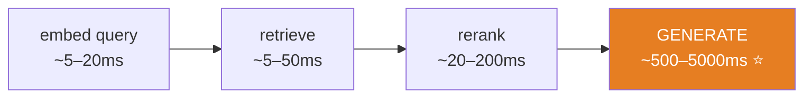
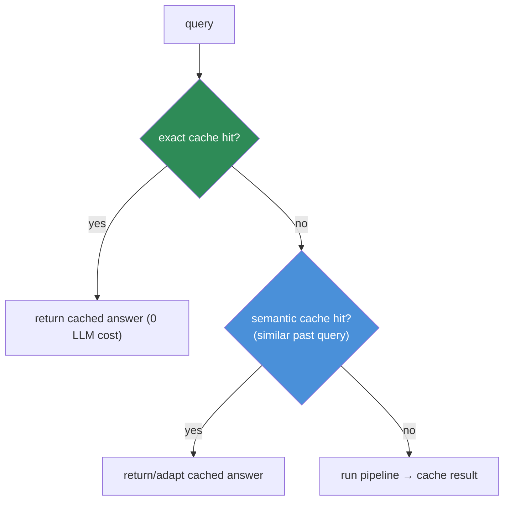
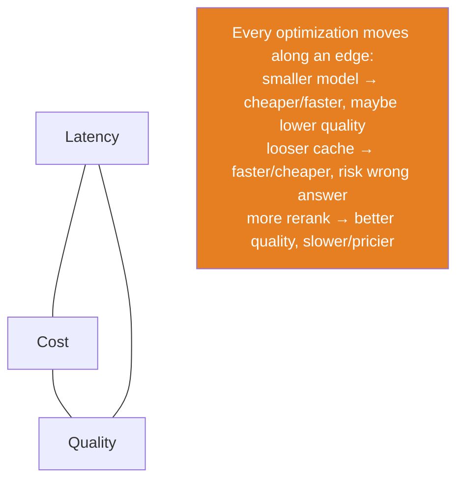

# 13.16 · RAG Performance

[⬅ 13.15 Production Architecture](13.15-production-architecture.md) · [🏠 Module 13](../README.md) · [➡ 13.17 Frameworks](13.17-frameworks.md)

> **The lesson in one line:** RAG latency and cost are dominated by the **LLM generation call**, not retrieval — so the highest-leverage optimizations are **caching** (semantic + exact), **shrinking the context**, and **choosing a right-sized model**, while retrieval/index tuning buys headroom; every optimization trades latency, cost, or quality against another.

---

## 🎯 Learning objectives

- Break down where RAG **latency and cost** actually go.
- Apply **caching** (exact, semantic, embedding, rerank), **batch embedding**, and **index/retrieval optimization**.
- Optimize **cost** (model choice, context size, cache hit rate).
- Reason about the **latency ↔ cost ↔ quality** trade-offs.

## ✅ Prerequisites

- [13.15 production architecture](13.15-production-architecture.md), [11.16 inference optimization](../../11-LLMs/weeks/11.16-inference-optimization.md), [11.15 KV cache](../../11-LLMs/weeks/11.15-kv-cache.md).

---

## 🧠 Mental model

> [!IMPORTANT]
> **Measure before you optimize, because RAG intuitions are usually wrong about where the time goes.** People optimize the vector search (milliseconds) while the LLM call (hundreds of ms to seconds) and reranking (tens–hundreds of ms) eat the budget. A typical online request: **embed query (~5–20 ms) → retrieve (~5–50 ms) → rerank (~20–200 ms) → generate (~500–5000 ms)**. Generation is 80–95% of the latency *and* most of the cost. So the biggest wins are **not generating at all** (caching), **generating fewer tokens** (smaller context, shorter output), and **generating with a cheaper model** — retrieval optimizations mostly buy headroom and recall, not the main latency.



---

## Caching — the biggest lever



| Cache | What it stores | Hit condition |
|---|---|---|
| **Exact-match** | query → full answer | identical query |
| **⭐ Semantic** | query embedding → answer | a *similar* past query (cosine > threshold) |
| **Embedding** | text → its vector | repeated query/chunk text (skip re-embed) |
| **Rerank** | (query, chunk) → score | repeated pair |
| **Retrieval** | query → candidate ids | repeated query |
| **Prompt/prefix (KV)** | fixed system prompt's KV | stable prefix reused ([11.15](../../11-LLMs/weeks/11.15-kv-cache.md)) |

> [!IMPORTANT]
> **Semantic caching is RAG's superpower for latency and cost.** Real query traffic is *repetitive* — many users ask the same thing differently. A semantic cache returns a stored answer when a new query is *close enough* to a past one (embedding similarity above a threshold), skipping retrieval **and** the expensive LLM call entirely. Hit rates of 20–40% are common on real traffic, directly cutting cost and p95 latency. **Tune the threshold carefully** — too loose and you serve the wrong cached answer (a correctness bug); too tight and you rarely hit. Invalidate on index updates so cached answers don't go stale.

---

## Shrink the context

Fewer input tokens = lower latency **and** lower cost (you pay per token, and prefill scales with input length, [11.15](../../11-LLMs/weeks/11.15-kv-cache.md)):

- **Rerank to a small k** ([13.8](13.8-reranking.md)) — fewer, better chunks beat many ([13.9](13.9-context-construction.md)).
- **Compress chunks** to query-relevant sentences ([13.9](13.9-context-construction.md)).
- **Dedup** to remove repeated passages.
- **Cap output length** — shorter answers generate faster.
- **Stable prompt prefix** → prompt/prefix caching reuses the system prompt's compute.

## Batch embedding

Offline, embed the corpus in **batches** on a GPU — hundreds of chunks per forward pass vs one-at-a-time ([13.5](13.5-embeddings-similarity.md)). Online, batch concurrent query embeddings where latency allows. Batching amortizes the fixed per-call overhead and maximizes GPU utilization.

## Index & retrieval optimization

- **Tune ANN to a recall target** ([13.6](13.6-vector-databases.md)) — don't over-search past the target (wasted latency); `efSearch`/`nprobe` set the knob.
- **Quantize vectors** (PQ/int8) to fit memory and speed search; re-rank exactly on top candidates to recover recall.
- **Keep the index in memory / warm**; shard for scale.
- **Cap retrieved N and reranked candidates** — reranking cost is linear in N ([13.8](13.8-reranking.md)).
- **Pre-filter by metadata** to shrink the search space (and enforce ACLs, [13.14](13.14-security.md)).

## Cost optimization

| Lever | Effect |
|---|---|
| **Semantic/exact cache** | avoid the LLM call entirely on hits — the biggest saver |
| **Right-size the model** | RAG supplies the knowledge, so a smaller/cheaper model often suffices ([13.1](13.1-why-rag-exists.md)) |
| **Smaller context (rerank k, compress)** | fewer input tokens billed |
| **Shorter outputs** | fewer output tokens billed |
| **Cheaper embedding/rerank models** | lower per-op cost at scale |
| **Batching** | better hardware utilization |
| **Cascades** | cheap model first; escalate to a strong model only when needed ([11.16](../../11-LLMs/weeks/11.16-inference-optimization.md)) |

> [!IMPORTANT]
> **RAG's structural cost win: it lets you use a smaller model.** Because retrieval provides the facts, the LLM only needs to *read and synthesize*, not *know* ([13.1](13.1-why-rag-exists.md)) — a task smaller models do well. Pairing good retrieval with a right-sized model (plus caching) is usually far cheaper than a giant model with no retrieval, *and* more accurate on private/fresh data.

---

## The trade-off triangle



> [!WARNING]
> **The dangerous optimizations are the ones that silently trade *quality*.** A looser semantic-cache threshold serves stale/wrong answers; an over-aggressive compression drops the key sentence; a too-small model hallucinates more. **Gate every performance change through evaluation** ([13.12](13.12-evaluation.md)) — a faster, cheaper system that's less accurate is usually a regression, not an optimization.

---

## 🏭 Production examples

| Goal | Tactics |
|---|---|
| Cut p95 latency | semantic cache; smaller k; rerank timeout fallback; stream output |
| Cut cost 50%+ | semantic cache (high hit rate) + right-sized model + shorter context |
| High QPS | cache + batch embeddings + stateless autoscaled online tier ([13.15](13.15-production-architecture.md)) |
| Huge index, tight RAM | PQ quantization + exact re-rank |
| Freshness + cache | invalidate cache on index update; short TTLs on volatile topics |

## ⚡ Performance considerations (measurement discipline)

- **Profile per stage** (p50/p95/p99) before optimizing — fix the actual bottleneck ([13.15](13.15-production-architecture.md)).
- **Track cache hit rate** as a first-class metric — it drives both latency and cost.
- **Load-test** at target QPS; watch tail latency (p99), not just the mean.
- **Prefill vs decode** ([11.15](../../11-LLMs/weeks/11.15-kv-cache.md)): long contexts inflate prefill; shrinking context helps time-to-first-token.

## 🔒 Security considerations

> [!CAUTION]
> - **Caches can leak across users/tenants** — a semantic/answer cache keyed only by query text can serve one user's answer (built from their ACL-filtered context) to another. **Key caches by tenant/ACL scope**, not just the query ([13.14](13.14-security.md)).
> - **Cached answers can go stale after an index update or document deletion** — invalidate on change so you don't serve deleted/outdated (or since-restricted) content.
> - **Embedding/rerank caches store query text** — often PII; secure them.

## 🚫 Common mistakes

| Mistake | Consequence |
|---|---|
| Optimizing retrieval while generation dominates | Effort on the wrong bottleneck |
| No caching | Paying full LLM cost/latency on repeat traffic |
| Semantic cache keyed only by query (not tenant/ACL) | Cross-user answer leakage |
| Loose cache threshold | Serving wrong/stale cached answers |
| Never invalidating cache on index update | Stale answers after content changes |
| Over-compressing context | Dropping the key sentence → wrong answers |
| Optimizing without re-evaluating quality | Silent quality regressions |
| One-at-a-time embedding | Wasted GPU; slow indexing |

## 🐛 Debugging workflow

Latency/cost problem: (1) **Profile per stage** — is it generation (usual), rerank, or retrieval? Optimize the real culprit. (2) **Check cache hit rate** — low? Tune the semantic threshold (and verify it's not causing wrong answers). (3) **Check context size** — bloated? Rerank to smaller k, compress, dedup. (4) **Check model/output size** — right-size the model, cap output. After each change, **re-run evaluation** ([13.12](13.12-evaluation.md)) to confirm quality held.

## 🏋️ Exercises

1. **Profile it.** Instrument per-stage latency on a real query mix; confirm generation dominates. Plot the breakdown.
2. **Semantic cache.** Add an embedding-similarity cache; measure hit rate and latency/cost reduction on a realistic (repetitive) query stream. Sweep the threshold; find where wrong answers start.
3. **Context shrink.** Measure latency/cost vs k ∈ {3,5,10,20}; confirm smaller k is faster/cheaper and (with rerank) not less accurate.
4. **Batch embedding.** Compare per-chunk vs batched embedding throughput for indexing.
5. **Model right-sizing.** Answer a RAG eval set with a large and a small model; compare quality, latency, and cost — show retrieval narrows the gap.
6. **Cache safety.** Show a query-only-keyed cache leaks across two users with different ACLs; fix by keying on ACL scope.

## 🛠️ Mini project — "RAG performance & cost harness"

**Goal:** a benchmarking + optimization harness that reports latency, cost, and quality across configurations.

**Requirements:** per-stage latency profiling; exact + semantic caching (tenant/ACL-scoped, with invalidation); batch embedding; configurable k/compression/model; a load test at target QPS (p95/p99); and an evaluation gate ([13.12](13.12-evaluation.md)) so every optimization is checked for quality.

**Folder structure**
```
rag-perf/
├── profile.py      # per-stage latency
├── cache.py        # exact + semantic (ACL-scoped) + invalidation
├── batch_embed.py  # batched embedding throughput
├── loadtest.py     # QPS, p95/p99
└── tradeoff.py     # latency/cost/quality sweep + eval gate
```

**Testing:** cache is ACL-scoped (no cross-user leak) and invalidates on update; smaller k faster without quality loss; profiler attributes latency correctly.
**Evaluation:** latency (p95/p99), cost/query, cache hit rate — plotted against quality (faithfulness/recall).
**Security:** ACL-scoped caches; secure/redacted cache contents.
**Future improvements:** cascades; adaptive k per query; prefix/KV caching; multi-region cache.

## 📄 Cheat sheet

| Concept | One line |
|---|---|
| **⭐ Where time goes** | generation ≫ rerank > retrieval > embed |
| **⭐ Semantic cache** | serve answer for a *similar* past query — biggest latency/cost saver |
| **Exact cache** | identical query → cached answer |
| **Shrink context** | rerank small k + compress + dedup + cap output |
| **Batch embedding** | GPU batches offline; amortize overhead |
| **Index tuning** | ANN to a recall target; quantize + re-rank |
| **⭐ Right-size model** | retrieval supplies knowledge → smaller model works |
| **⭐ Trade-off** | latency ↔ cost ↔ quality; gate every change on eval |
| **Cache safety** | key by tenant/ACL; invalidate on index update |

## 🎴 Flashcards

- **⭐ Where does RAG latency and cost mostly go?** → The LLM generation call (80–95%), then reranking; retrieval and embedding are small.
- **⭐ What is semantic caching and why is it powerful?** → Returning a stored answer when a new query is embedding-similar to a past one — skipping retrieval and the LLM call; high hit rates on real traffic slash cost and latency.
- **What's the risk of a loose semantic-cache threshold?** → Serving the wrong cached answer — a correctness bug; tune carefully and evaluate.
- **How does context size affect performance?** → Fewer input tokens lower both latency (prefill) and cost; rerank to small k, compress, dedup, cap output.
- **⭐ Why does RAG let you use a smaller model?** → Retrieval supplies the facts, so the model only reads/synthesizes rather than knows — cheaper and often just as accurate.
- **Why must caches be ACL/tenant-scoped?** → A query-only-keyed cache can serve one user's ACL-filtered answer to another — a leak; and it must invalidate on index updates to avoid stale content.
- **What's the rule for any performance change?** → Gate it through evaluation — a faster/cheaper but less accurate system is a regression.

## 💬 Interview questions

1. Where does RAG latency actually go, and what does that imply for optimization priorities?
2. Explain exact vs semantic caching. What hit rates are realistic and what are the risks?
3. How does shrinking the context help both latency and cost?
4. Why does RAG let you use a smaller LLM, and how does that affect cost/quality?
5. What are the security pitfalls of caching in RAG?
6. How do you ensure a performance optimization didn't degrade quality?

## 📝 Summary

- **Generation dominates RAG latency and cost** (retrieval is small) — so **measure first**, then attack generation: cache, shrink context, right-size the model.
- **Semantic caching is the biggest lever** — serving answers for similar past queries skips retrieval and the LLM entirely; **scope caches by tenant/ACL and invalidate on index updates**.
- **Shrink the context** (rerank small k, compress, dedup, cap output), **batch embeddings** offline, and **tune ANN to a recall target** with quantization + exact re-rank.
- Every optimization trades **latency ↔ cost ↔ quality** — the dangerous ones silently hurt quality, so **gate every change through evaluation** ([13.12](13.12-evaluation.md)).

## 📚 References

1. **[11.15 KV Cache](../../11-LLMs/weeks/11.15-kv-cache.md) & [11.16 Inference Optimization](../../11-LLMs/weeks/11.16-inference-optimization.md).** ⭐ Prefill/decode, prompt caching, cascades.
2. **GPTCache / semantic caching documentation.** Semantic cache implementations.
3. **Jiang et al. (2023) — _LLMLingua_.** Prompt compression.
4. **[13.12 RAG Evaluation](13.12-evaluation.md).** Gating optimizations on quality.

---

## 🧭 Navigation

| Direction | Link |
|---|---|
| ⬅ Previous | [13.15 · Production RAG Architecture](13.15-production-architecture.md) |
| ➡ Next | [13.17 · RAG with Frameworks](13.17-frameworks.md) |
| 🏠 Module | [Module 13](../README.md) |
| 📖 Lessons | [Lesson index](README.md) |
