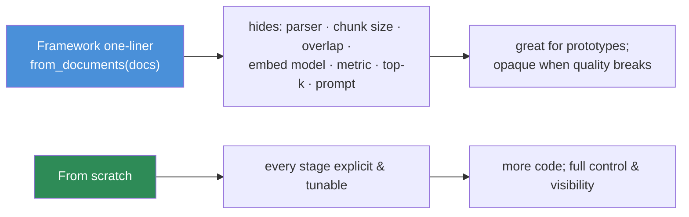

# 13.17 · RAG with Frameworks

[⬅ 13.16 RAG Performance](13.16-performance.md) · [🏠 Module 13](../README.md) · [➡ 13.18 Projects & Summary](13.18-projects-summary.md)

> **The lesson in one line:** Frameworks like LangChain, LlamaIndex, and Haystack turn the whole RAG pipeline into a few lines — a huge accelerator for prototypes and integrations — but they **hide the exact stages where quality is won or lost**, so you must understand the pipeline well enough to see through the abstraction, which is why this module made you build the core by hand first.

---

## 🎯 Learning objectives

- Know what **LangChain, LlamaIndex, and Haystack** offer and where they differ.
- Understand when frameworks **help** (speed, integrations) and when they **hide** critical details.
- Build a RAG system **without a framework** to retain full control.
- Decide framework-vs-from-scratch per project.

## ✅ Prerequisites

- The whole pipeline: [13.3](13.3-ingestion-parsing.md)–[13.16](13.16-performance.md) — you must know what a framework abstracts.

---

## 🧠 Mental model

> [!IMPORTANT]
> **A RAG framework is a set of defaults for every stage you just learned — and defaults are decisions someone else made for you.** `index = VectorStoreIndex.from_documents(docs)` silently picks a parser, a chunk size, an overlap, an embedding model, a metric, a top-k, and a prompt. When it works, that's magic. When retrieval is bad, you're debugging *someone else's choices through an abstraction* — and if you don't know the pipeline, you can't tell whether the problem is the chunker, the embedder, the retriever, or the prompt. **Frameworks make the easy 80% trivial and the hard 20% (the part that actually matters in production) harder to see.** That's why you built [13.5](13.5-embeddings-similarity.md)/[13.7](13.7-retrieval.md) by hand.



---

## The three frameworks

| Framework | Strength | Character |
|---|---|---|
| **LlamaIndex** | **data → index → query**; the most RAG-focused | rich ingestion connectors, indexing strategies (parent-child, hierarchical), query engines |
| **LangChain** | **orchestration & composition**; chains, agents, huge integration surface | general LLM-app framework; RAG is one use case; very broad, fast-moving API |
| **Haystack** | **production pipelines**; explicit, typed components | pipeline-graph model, strong on search/retrieval, deployment-oriented |

All three give you: document loaders, text splitters, embedding + vector-store integrations, retrievers (dense/sparse/hybrid), rerankers, prompt templates, and query/agent orchestration — i.e., the whole module, pre-wired.

```python
# LlamaIndex — the entire naive pipeline in ~4 lines
from llama_index.core import VectorStoreIndex, SimpleDirectoryReader
docs  = SimpleDirectoryReader("data/").load_data()   # ingest + parse (13.3)
index = VectorStoreIndex.from_documents(docs)         # chunk + embed + index (13.4–13.6)
engine = index.as_query_engine(similarity_top_k=5)    # retrieve + prompt (13.7, 13.10)
print(engine.query("What is the refund policy?"))     # retrieve → generate
```

Four lines replace the first fifteen lessons — **and hide every quality decision in them.**

---

## When frameworks help

| Situation | Why a framework wins |
|---|---|
| **Prototyping / demos** | idea → working RAG in minutes |
| **Many data-source connectors** | loaders for Notion, Slack, Drive, DBs already exist |
| **Vector-store / model swapping** | uniform interface over Pinecone/Qdrant/pgvector/… |
| **Standard patterns** | parent-child, hybrid, rerankers available out of the box |
| **Small team, broad surface** | don't reinvent loaders, splitters, retrievers |

## When frameworks hide too much

| Situation | Why hand-rolling wins |
|---|---|
| **Debugging bad retrieval** | you need to see/trace every stage ([13.13](13.13-debugging.md)) |
| **Squeezing quality** | tune chunking/metric/hybrid/rerank precisely |
| **Tight latency/cost budgets** | control caching, batching, context size ([13.16](13.16-performance.md)) |
| **Security-critical** | verify ACL enforcement at retrieval yourself ([13.14](13.14-security.md)) |
| **Non-standard pipeline** | the abstraction fights you |
| **Stability / few deps** | avoid churn from fast-moving framework APIs |

> [!IMPORTANT]
> **The pragmatic path: prototype with a framework, understand every stage, then replace the parts that matter.** Frameworks are excellent for getting to a working baseline fast and for commodity integrations (loaders, store adapters). But the stages that determine *your* quality — chunking, retrieval strategy, reranking, context construction, evaluation, security — deserve explicit control. **Use the framework for the plumbing; own the parts that differentiate.** You can mix: a framework's loaders + your own retrieval/eval.

---

## Build without a framework (why this module did)

You already have every piece — assembled, it's a complete, transparent RAG system:

```python
# Framework-free RAG — every stage explicit and traceable (13.3–13.10)
class RAG:
    def __init__(self, embed, vector_store, sparse, reranker, llm):
        self.embed, self.vs, self.sparse = embed, vector_store, sparse
        self.reranker, self.llm = reranker, llm

    def index(self, documents):                       # OFFLINE (13.3–13.6)
        for doc in documents:
            text = clean(parse(doc))                  # 13.3
            for chunk in recursive_chunk(text):       # 13.4
                meta = extract_metadata(doc, chunk)   # 13.3
                self.vs.upsert(normalize(self.embed(chunk)), chunk, meta)  # 13.5–13.6
                self.sparse.add(chunk, meta)          # 13.7 (BM25)

    def answer(self, query, user):                    # ONLINE (13.7–13.10)
        dense  = self.vs.search(normalize(self.embed(query)), 50, acl=user.roles)  # 13.6/13.14
        sparse = self.sparse.search(query, 50, acl=user.roles)                      # 13.7
        cands  = rrf_fuse(dense, sparse)              # 13.7 hybrid
        top    = self.reranker.rerank(query, cands)[:5]   # 13.8
        ctx    = build_context(query, dedup(top))     # 13.9
        return self.llm.generate(rag_prompt(query, ctx))  # 13.10
```

**Nothing is hidden.** You control the chunker, the metric, the hybrid fusion, the rerank cut, the dedup, the context order, and the prompt — and you can trace any of them ([13.13](13.13-debugging.md)). This is the same code the frameworks run; you've just seen inside the box.

---

## 🏭 Production examples

| Team | Choice |
|---|---|
| Startup MVP | LlamaIndex/LangChain end-to-end; ship fast |
| Scaling product with quality bar | framework loaders + custom retrieval/rerank/eval |
| Search-heavy enterprise | Haystack pipelines or custom over a search engine |
| Latency/cost-critical | mostly hand-rolled; framework only for connectors |
| Regulated/security-critical | own the retrieval + ACL + eval; audit everything |

## ⚡ Performance considerations

- **Framework defaults are rarely tuned for your latency/cost** — inspect chunk size, top-k, and whether caching/batching are on ([13.16](13.16-performance.md)).
- **Abstractions can add overhead** (extra passes, hidden LLM calls in some chains) — profile the real pipeline.
- **Hidden retries/agent loops** can multiply cost silently — read what the chain actually does.

## 🔒 Security considerations

> [!CAUTION]
> - **Verify ACL/tenant filtering yourself** — don't assume a framework enforces access control at retrieval ([13.14](13.14-security.md)); many don't by default.
> - **Some chains send data to more services than you expect** (hosted embeddings, rerankers, tools) — audit the data flow.
> - **Fast-moving framework code is a supply-chain surface** — pin versions, review dependencies, watch for prompt-injection-relevant defaults (do sources get treated as data?).

## 🚫 Common mistakes

| Mistake | Consequence |
|---|---|
| Framework as a black box, no pipeline knowledge | Can't debug or improve retrieval |
| Accepting default chunk size/top-k/model | Mediocre, untuned quality |
| Assuming ACLs are enforced | Data leakage ([13.14](13.14-security.md)) |
| Not profiling hidden LLM calls/loops | Surprise latency and cost |
| Over-abstracting a simple need | Complexity and dependency churn for a 100-line system |
| Never looking inside the abstraction | Blind to where quality is lost |

## 🐛 Debugging workflow

Framework RAG returns bad answers: (1) **Expose the internals** — enable verbose/callback tracing to see the chunks, retrieved candidates, and the final prompt (the same trace as [13.13](13.13-debugging.md)). (2) **Check the defaults** it chose — chunk size, top-k, metric, embedding model. (3) **If you can't see or control the failing stage**, drop to a custom implementation for *that stage* while keeping the framework for the rest. The from-scratch mental model from this module is what lets you interpret the trace.

## 🏋️ Exercises

1. **Same task, three ways.** Build the same RAG over one corpus in LlamaIndex, LangChain, and from scratch. Compare lines of code, control, and Recall@5/faithfulness ([13.12](13.12-evaluation.md)).
2. **Expose the defaults.** For a framework one-liner, discover the actual chunk size, overlap, embedding model, metric, and top-k it used. Were they good for your data?
3. **Tune through the framework.** Improve the framework version's Recall@5 by overriding chunking/retrieval/rerank. How far can you push it before dropping to custom code?
4. **Trace it.** Turn on framework tracing; reproduce the [13.13](13.13-debugging.md) stage trace. Localize a planted bug.
5. **Hybrid ownership.** Use a framework's loaders + your own retrieval/rerank/eval; show you kept speed *and* control.

## 🛠️ Mini project — "Framework vs from-scratch bake-off"

**Goal:** the *same* RAG system built with a framework and hand-rolled, compared on control, quality, latency, and cost.

**Requirements:** identical corpus, embedding model, and eval set; a framework build (LlamaIndex or LangChain) and the framework-free `RAG` class above; expose the framework's hidden defaults; evaluate both ([13.12](13.12-evaluation.md)); profile both ([13.16](13.16-performance.md)); verify ACL enforcement in both.

**Folder structure**
```
framework-bakeoff/
├── framework_rag.py   # LlamaIndex/LangChain build
├── scratch_rag.py     # the explicit RAG class
├── expose.py          # reveal framework defaults
├── eval.py            # Recall/faithfulness both ways
└── profile.py         # latency/cost both ways
```

**Testing:** both hit the same eval bar after tuning; ACL enforced in both; framework trace matches the scratch stage trace.
**Evaluation:** quality, latency, cost, and lines-of-code/control comparison.
**Security:** confirm retrieval-time ACL filtering in the framework path.
**Future improvements:** hybrid ownership (framework loaders + custom core); pin/audit framework deps.

## 📄 Cheat sheet

| Concept | One line |
|---|---|
| **LlamaIndex** | most RAG-focused: data → index → query; rich indexing strategies |
| **LangChain** | broad orchestration/agents; RAG is one use case; huge integrations |
| **Haystack** | explicit, typed, production pipelines; search-strong |
| **⭐ Frameworks help** | prototypes, connectors, store/model swapping, standard patterns |
| **⭐ Frameworks hide** | chunking, metric, retrieval, rerank, prompt — the quality knobs |
| **Pragmatic path** | prototype with a framework → own the parts that matter |
| **From scratch** | more code, full control + traceability (this module's `RAG`) |
| **Always verify** | ACL enforcement, defaults, hidden LLM calls/cost |

## 🎴 Flashcards

- **⭐ What do RAG frameworks abstract, and why is that a risk?** → Every stage's defaults (parser, chunk size, overlap, embed model, metric, top-k, prompt) — when quality breaks you're debugging someone else's choices through an opaque layer.
- **When do frameworks help most?** → Prototyping, data-source connectors, swapping vector stores/models, and standard patterns out of the box.
- **When should you build from scratch?** → When debugging/tuning retrieval, meeting tight latency/cost/security requirements, or running a non-standard pipeline.
- **⭐ What's the pragmatic strategy?** → Prototype with a framework, understand every stage, then replace the parts that determine your quality — own the differentiators, borrow the plumbing.
- **What must you always verify in a framework?** → ACL enforcement at retrieval, the actual defaults it chose, and any hidden LLM calls or agent loops that add cost.
- **Why did this module build RAG by hand first?** → So you can see through the abstraction and know which stage to fix when a framework's output is wrong.

## 💬 Interview questions

1. Compare LangChain, LlamaIndex, and Haystack. When would you pick each?
2. What do RAG frameworks hide, and why does that matter in production?
3. When do frameworks help and when do they get in the way?
4. How do you tune and debug a framework-based RAG system?
5. Why build a RAG system without a framework, and what do you gain?
6. What security and cost pitfalls do frameworks introduce, and how do you check for them?

## 📝 Summary

- **LlamaIndex** (RAG-focused indexing), **LangChain** (broad orchestration/agents), and **Haystack** (typed production pipelines) pre-wire the entire module — enormous for prototypes and integrations.
- They work by **choosing defaults for every quality-critical stage** (chunking, metric, retrieval, rerank, prompt) — which is convenient until retrieval breaks and you must debug someone else's choices through an abstraction.
- The pragmatic path: **prototype with a framework, understand each stage, own the parts that differentiate** (retrieval, rerank, context, eval, security) — and **always verify ACL enforcement, defaults, and hidden costs**.
- Building the core **from scratch** (as this module did) is what lets you see through any framework and know which stage to fix.

## 📚 References

1. **LlamaIndex documentation.** ⭐ RAG-first indexing and query engines.
2. **LangChain documentation.** Chains, retrievers, agents.
3. **Haystack (deepset) documentation.** Production pipeline components.
4. **[13.13 RAG Debugging](13.13-debugging.md).** Tracing through (or around) an abstraction.

---

## 🧭 Navigation

| Direction | Link |
|---|---|
| ⬅ Previous | [13.16 · RAG Performance](13.16-performance.md) |
| ➡ Next | [13.18 · Mini Projects & Summary](13.18-projects-summary.md) |
| 🏠 Module | [Module 13](../README.md) |
| 📖 Lessons | [Lesson index](README.md) |
