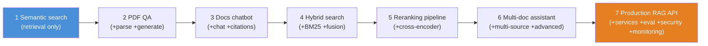
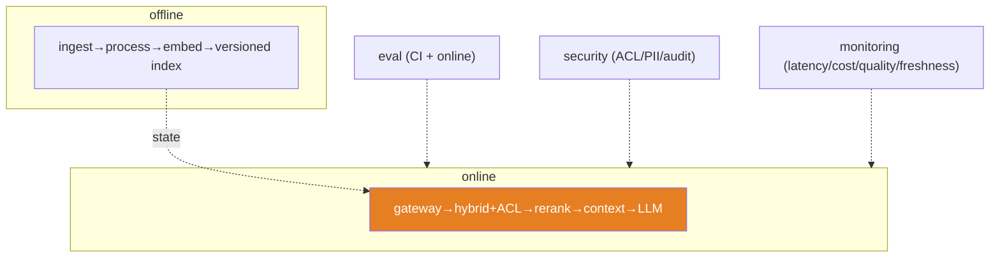
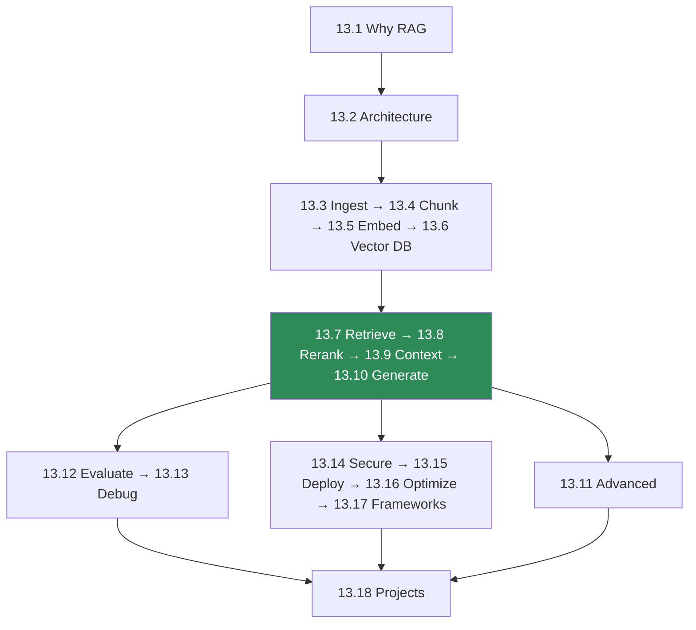

# 13.18 · Mini Projects & Summary

[⬅ 13.17 Frameworks](13.17-frameworks.md) · [🏠 Module 13](../README.md) · [➡ Module 14 · AI Agents](../../14-AI-Agents/README.md)

> **The lesson in one line:** Seven projects of increasing ambition — semantic search → PDF QA → docs chatbot → hybrid search → reranking pipeline → multi-document assistant → production RAG API — each one adds a stage of the pipeline, and together they turn every lesson in this module into a system you can design, build, evaluate, secure, and deploy.

---

## 🎯 Learning objectives

- Consolidate the module into **seven buildable projects**, from a search engine to a production API.
- For each: **requirements, architecture, folder structure, data & retrieval pipelines, evaluation, testing, security, monitoring, future improvements**.
- See how the projects **stack** — each reuses and extends the last.
- Leave with the module's **through-lines** internalized.

## ✅ Prerequisites

- All of Module 13. The projects are the payoff.

---

## 🧠 Mental model

> [!IMPORTANT]
> **These seven projects are one system, revealed one layer at a time.** Project 1 is pure retrieval (no LLM). Each subsequent project adds a stage you learned — parsing, generation, hybrid, reranking, multi-doc, then production concerns — until Project 7 is the whole pipeline as a deployable, evaluated, secured, monitored service. Build them **in order**: each is a superset of the last, so you're never starting from scratch, and by the end you've assembled the entire module into working software.

---

## Project 1 — Semantic search engine
**Retrieval only — no LLM. Prove you understand embeddings and similarity.**

- **Requirements:** index a text corpus; return the top-k most semantically similar chunks to a query; a CLI/API.
- **Architecture:** embed ([13.5](13.5-embeddings-similarity.md)) → normalize → in-memory matrix or vector DB ([13.6](13.6-vector-databases.md)) → cosine top-k.
- **Data pipeline:** load text → chunk ([13.4](13.4-chunking.md)) → embed → index.
- **Retrieval pipeline:** embed query → cosine search → top-k.
- **Evaluation:** Recall@k, MRR vs a labeled query set ([13.12](13.12-evaluation.md)).
- **Testing:** paraphrase retrieval; normalized-dot == cosine; sorted top-k.
- **Security:** note vectors are sensitive ([13.14](13.14-security.md)).
- **Monitoring:** query latency, index size.
- **Future:** swap in-memory matrix → ANN; add hybrid.

## Project 2 — PDF question-answering system
**Add parsing + generation. The canonical "chat with a PDF."**

- **Requirements:** upload a PDF; ask questions; get grounded, cited answers.
- **Architecture:** parse PDF (incl. tables/OCR, [13.3](13.3-ingestion-parsing.md)) → chunk → embed → index → retrieve → generate with citations ([13.10](13.10-generation.md)).
- **Data pipeline:** PDF → clean text + page metadata → chunks (page-tagged).
- **Retrieval pipeline:** query → retrieve top-k → context ([13.9](13.9-context-construction.md)) → LLM with escape hatch + page citations.
- **Evaluation:** faithfulness, answer relevance, citation accuracy; unanswerable-question decline rate.
- **Testing:** table facts retrievable; citations point to correct pages; declines when the PDF lacks the answer.
- **Security:** treat PDF text as untrusted (injection, [13.14](13.14-security.md)); PII check.
- **Monitoring:** refusal rate, citation accuracy.
- **Future:** multi-PDF; OCR confidence gating.

## Project 3 — Documentation chatbot
**Add conversational, multi-turn interaction over a docs corpus.**

- **Requirements:** chat over product/docs; maintain conversation; cite sources; say "I don't know" when unsupported.
- **Architecture:** structure-aware chunking on headings ([13.4](13.4-chunking.md)) → index → per-turn retrieval re-grounded on the (possibly rewritten) query → generation with citations and history.
- **Data pipeline:** Markdown/HTML docs → heading-path metadata → chunks.
- **Retrieval pipeline:** conversational query rewrite ([13.7](13.7-retrieval.md)) → retrieve → context (budget shared with history) → generate.
- **Evaluation:** multi-turn faithfulness; does follow-up context carry correctly?
- **Testing:** follow-up questions resolve pronouns; stale history doesn't poison retrieval.
- **Security:** ACL by doc visibility; injection defense.
- **Monitoring:** turn latency, refusal rate, thumbs up/down.
- **Future:** semantic caching ([13.16](13.16-performance.md)); feedback loop into eval.

## Project 4 — Hybrid search system
**Add sparse retrieval + fusion. Fix the "can't find exact codes" problem.**

- **Requirements:** retrieve well on *both* paraphrases and exact terms (codes, names).
- **Architecture:** dense index + BM25 index → RRF fusion ([13.7](13.7-retrieval.md)) → metadata filtering.
- **Data pipeline:** chunks → dense vectors + sparse (inverted) index; shared metadata/ACL.
- **Retrieval pipeline:** query → dense + sparse in parallel → RRF → filter → top-k.
- **Evaluation:** Recall@10 per query type (paraphrase vs keyword); show hybrid ≥ max(dense, sparse).
- **Testing:** RRF needs no score normalization; ACL filter airtight; keyword queries hit.
- **Security:** ACL pre-filter on both indexes; tenant partitioning.
- **Monitoring:** which retriever contributed each hit.
- **Future:** learned sparse (SPLADE); reranking.

## Project 5 — Reranking pipeline
**Add a cross-encoder. Turn good recall into high precision.**

- **Requirements:** retrieve a generous candidate set and rerank to a precise top-k.
- **Architecture:** hybrid retrieve top-50 → cross-encoder rerank ([13.8](13.8-reranking.md)) → top-k → context.
- **Data pipeline:** (reuses Project 4's indexes).
- **Retrieval pipeline:** query → hybrid top-N → rerank → dedup → top-k → generate.
- **Evaluation:** NDCG@5 / MRR retrieval-only vs reranked; latency added.
- **Testing:** reranked NDCG > retrieval-only; rerank runs only on ACL-passed candidates; caching consistent.
- **Security:** rerank after ACL filter; note hosted-reranker egress.
- **Monitoring:** rerank latency, score distribution.
- **Future:** ColBERT; LLM reranker for hard queries; adaptive N.

## Project 6 — Multi-document knowledge assistant
**Add multi-source retrieval + advanced patterns. Answer questions spanning documents.**

- **Requirements:** answer questions whose evidence spans many documents/sources; synthesize with citations.
- **Architecture:** multi-source ingestion → unified index with source metadata → query decomposition / multi-hop ([13.11](13.11-advanced-rag.md)) → hybrid + rerank per hop → synthesis with per-source citations; optional corrective grading.
- **Data pipeline:** heterogeneous sources → uniform `Document{text, metadata, source, acl}`.
- **Retrieval pipeline:** decompose → per-sub-question hybrid retrieve + rerank → aggregate → context → grounded synthesis.
- **Evaluation:** multi-hop accuracy vs single-shot; faithfulness across sources; citation accuracy.
- **Testing:** cross-document questions answered where single-shot fails; corrective loop bounded.
- **Security:** ACL per source on every hop; provenance/trust tiers ([13.14](13.14-security.md)).
- **Monitoring:** hops per query, cost, refusal rate.
- **Future:** graph RAG for relationship questions; agentic tool selection.

## Project 7 — Production-grade RAG API ⭐
**The flagship. The whole module as a deployable, evaluated, secured, monitored service.**

- **Requirements:** a scalable API serving grounded, cited answers over a large, changing, multi-tenant corpus, with SLAs on latency, quality, and security.
- **Architecture:** the **two-plane service architecture** ([13.15](13.15-production-architecture.md)) — offline indexing (ingest → process → embed → versioned index) + online serving (gateway → hybrid retrieve + ACL pre-filter → rerank → context → LLM), with caching ([13.16](13.16-performance.md)), evaluation ([13.12](13.12-evaluation.md)), security ([13.14](13.14-security.md)), and monitoring.
- **Data pipeline:** incremental, queue-driven, idempotent ingestion; versioned embeddings; blue/green re-index.
- **Retrieval pipeline:** gateway (auth/rate-limit/tenancy) → hybrid + pre-filter → rerank → context → grounded structured generation with citations + escape hatch, timeouts/fallbacks at every hop.
- **Evaluation:** golden set (answerable + unanswerable + adversarial) in CI; online refusal rate + sampled faithfulness; regression gates.
- **Testing:** cross-tenant isolation; blue/green zero-downtime; fallbacks fire; injection has no privileged effect.
- **Security:** ACL at gateway + retrieval; PII redaction + output DLP; audit logs; least privilege ([13.14](13.14-security.md)).
- **Monitoring:** per-stage p95/p99, cost/query, cache hit rate, faithfulness, index freshness, ACL-miss + exfil alarms.
- **Future:** semantic cache tuning, cascades, graph/agentic RAG, multi-region.

---

## The module, connected

> [!IMPORTANT]
> **The one thing to remember from this module: retrieval quality is the ceiling on generation quality.** Everything before the LLM — parse, chunk, embed, index, retrieve, filter, rerank, construct — decides whether the model *can* be right. The LLM only decides whether it *is* right *given* that context. So spend your effort where the leverage is: **the pipeline before generation.** Debug by tracing that pipeline, evaluate retrieval and generation separately, secure every stage, and treat every document as untrusted. **RAG is a retrieval problem with a language model attached.**

---

## The through-lines (memorize these)

| # | Through-line |
|---|---|
| 1 | **Retrieval quality is the ceiling on generation quality** — fix retrieval before prompts/models. |
| 2 | **The chunk is the atom of RAG** — boundaries decide what can be retrieved. |
| 3 | **Similar ≠ relevant ≠ correct ≠ authorized** — embeddings measure similarity, not truth. |
| 4 | **Hybrid + rerank beats any single retriever.** |
| 5 | **Evaluate retrieval and generation separately** — two problems, two metric families. |
| 6 | **The escape hatch ("say I don't know") is the top anti-hallucination lever** — and it surfaces retrieval failures. |
| 7 | **Debug by tracing the pipeline** — the symptom is last, the cause is upstream. |
| 8 | **Every document is untrusted input** — injection, poisoning, ACLs at retrieval. |
| 9 | **Generation dominates latency/cost** — cache, shrink context, right-size the model. |
| 10 | **Frameworks hide the quality knobs** — know the pipeline to see through them. |

## 🏋️ Capstone challenge

Build **Project 7 end-to-end** over a real corpus (your docs, a public dataset). Ship: incremental indexing, hybrid + rerank retrieval with ACL enforcement, grounded cited generation with an escape hatch, a golden-set eval gate (including unanswerable + adversarial cases), semantic caching, and a monitoring dashboard (latency, cost, faithfulness, freshness). **Success criteria:** measurable Recall@k and faithfulness on the golden set, zero cross-tenant leakage in isolation tests, injected instructions have no privileged effect, and a blue/green embedding-model upgrade with no downtime.

## 📄 Cheat sheet

| Project | Adds | Key lessons |
|---|---|---|
| **1 Semantic search** | retrieval only | 13.4–13.6 |
| **2 PDF QA** | parse + generate + cite | 13.3, 13.9–13.10 |
| **3 Docs chatbot** | multi-turn + structure-aware | 13.4, 13.7 |
| **4 Hybrid search** | BM25 + fusion | 13.7 |
| **5 Reranking pipeline** | cross-encoder | 13.8 |
| **6 Multi-doc assistant** | multi-source + advanced | 13.11 |
| **7 Production API** ⭐ | services + eval + security + monitoring | 13.12–13.16 |

## 🎴 Flashcards

- **⭐ What's the one thing to remember from RAG?** → Retrieval quality is the ceiling on generation quality — the pipeline before the LLM decides whether the answer can be correct.
- **Why build the seven projects in order?** → Each is a superset of the last (adds one pipeline stage), so you assemble the whole module incrementally.
- **What's the minimal RAG project?** → A semantic search engine — retrieval only, no LLM — proving you understand embeddings and similarity.
- **What makes Project 7 "production"?** → Two-plane service architecture, evaluation gates, ACL/PII security, caching, monitoring, and safe re-indexing.
- **Name three module through-lines.** → Retrieval caps generation; hybrid+rerank beats single; evaluate retrieval and generation separately (and: every document is untrusted; debug by tracing; generation dominates cost).

## 💬 Interview questions

1. Design a production RAG API end-to-end. Walk through both planes and every stage.
2. How would you incrementally build from a semantic search engine to a production RAG system?
3. What's the difference between Project 1 (search) and Project 2 (QA) architecturally?
4. Where would you invest effort to maximize RAG answer quality, and why?
5. State and defend the claim "RAG is a retrieval problem with a language model attached."
6. What would you monitor and evaluate for a deployed RAG service?

## 📝 Summary

- **Seven stacked projects** take you from a retrieval-only **semantic search engine** to a **production RAG API** — each adds one pipeline stage, so building them in order assembles the whole module.
- The flagship, **Project 7**, is the two-plane service architecture with **hybrid retrieval + reranking + ACL enforcement**, **grounded cited generation with an escape hatch**, **golden-set evaluation gates**, **semantic caching**, and **quality/freshness monitoring**.
- The module's spine, proven: **retrieval quality is the ceiling on generation quality** — invest in the pipeline before the LLM, evaluate retrieval and generation separately, secure every stage, and treat every document as untrusted.
- **RAG is a retrieval problem with a language model attached.** Onward to [Module 14 · AI Agents](../../14-AI-Agents/README.md), where retrieval becomes one tool an agent wields.

## 📚 References

1. **Lewis et al. (2020) — _RAG_** & **Gao et al. (2023) — _RAG Survey_.** ⭐ The foundations and the map.
2. **All Module 13 lessons ([13.1](13.1-why-rag-exists.md)–[13.17](13.17-frameworks.md)).** Each project's stages.
3. **[13.12 Evaluation](13.12-evaluation.md), [13.14 Security](13.14-security.md), [13.15 Production](13.15-production-architecture.md).** Project 7's pillars.
4. **[Module 14 · AI Agents](../../14-AI-Agents/README.md).** Where RAG becomes a tool.

---

## 🧭 Navigation

| Direction | Link |
|---|---|
| ⬅ Previous | [13.17 · RAG with Frameworks](13.17-frameworks.md) |
| ➡ Next | [Module 14 · AI Agents](../../14-AI-Agents/README.md) |
| 🏠 Module | [Module 13](../README.md) |
| 📖 Lessons | [Lesson index](README.md) |
