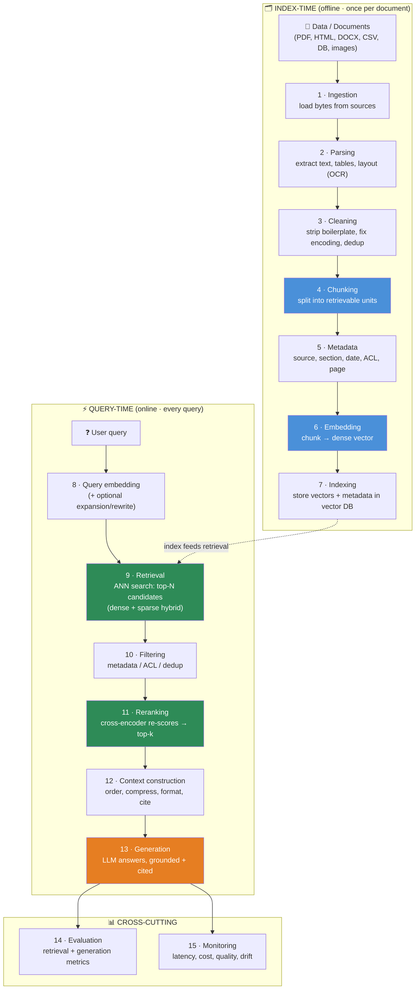
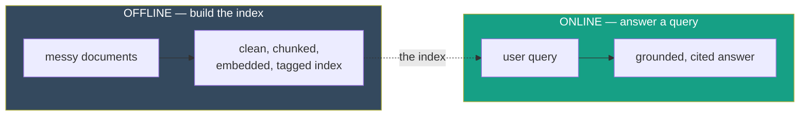

# 13.2 · RAG Architecture ⭐

[⬅ 13.1 Why RAG Exists](13.1-why-rag-exists.md) · [🏠 Module 13](../README.md) · [➡ 13.3 Ingestion & Parsing](13.3-ingestion-parsing.md)

> **The lesson in one line:** Real RAG is *not* "documents → embeddings → vector DB → LLM" — it is a **fifteen-stage pipeline** split into an offline *index-time* half (ingest → parse → clean → chunk → metadata → embed → index) and an online *query-time* half (query → retrieve → filter → rerank → construct context → generate → evaluate → monitor), and **every stage is a place quality is won or lost.**

---

## 🎯 Learning objectives

- Draw the **complete RAG pipeline** and name every stage's job.
- Separate **index-time (offline)** from **query-time (online)** and know what runs when.
- Understand why the naive four-box mental model **hides the stages that actually determine quality**.
- Map each stage to the lesson that covers it.

## ✅ Prerequisites

- [13.1 why RAG exists](13.1-why-rag-exists.md).
- [11.20 production LLM architecture](../../11-LLMs/weeks/11.20-production-architecture.md) — the system around a model.

---

## 🧠 Mental model

> [!IMPORTANT]
> **The naive picture — `Documents → Embeddings → Vector DB → LLM` — is a toy.** It's the "hello world" of RAG and it will get you a demo that works 60% of the time and fails mysteriously the rest. **Production RAG is a data pipeline (offline) feeding a retrieval-and-generation pipeline (online).** The offline half turns messy documents into a clean, chunked, embedded, metadata-tagged, searchable index. The online half turns a user query into a filtered, reranked, well-ordered context and a grounded, cited answer. **Each arrow in the naive diagram hides three or four real stages — and the hidden stages are where accuracy lives.**

---

## The complete pipeline



### The two halves



> [!IMPORTANT]
> **Offline is done once per document; online runs on every query.** This split drives every engineering decision. Offline can be slow, batched, and expensive (you pay once). Online must be fast and cheap (you pay per request). **Most quality bugs are baked in offline** (bad parsing, bad chunks) but **only surface online** — which is why RAG is hard to debug: the cause and the symptom are in different halves ([13.13](13.13-debugging.md)).

---

## Stage-by-stage: what each one does and where it's covered

| # | Stage | Job | Fails when… | Lesson |
|---|---|---|---|---|
| 1 | **Ingestion** | Load raw bytes from every source | a source is missed or partially loaded | [13.3](13.3-ingestion-parsing.md) |
| 2 | **Parsing** | Extract text/tables/layout (OCR) | tables become word soup; OCR drops text | [13.3](13.3-ingestion-parsing.md) |
| 3 | **Cleaning** | Remove boilerplate, fix encoding, dedup | headers/footers pollute chunks | [13.3](13.3-ingestion-parsing.md) |
| 4 | **Chunking** | Split into retrievable units | a fact is split across two chunks | [13.4](13.4-chunking.md) |
| 5 | **Metadata** | Attach source, section, date, **ACL** | can't filter or enforce access | [13.3](13.3-ingestion-parsing.md), [13.7](13.7-retrieval.md) |
| 6 | **Embedding** | Map chunk → dense vector | wrong model → semantically off vectors | [13.5](13.5-embeddings-similarity.md) |
| 7 | **Indexing** | Store vectors + metadata for ANN | slow or low-recall index | [13.6](13.6-vector-databases.md) |
| 8 | **Query processing** | Embed / expand / rewrite the query | vocabulary mismatch → misses | [13.7](13.7-retrieval.md) |
| 9 | **Retrieval** | Find top-N candidates (hybrid) | right chunk not in top-N | [13.7](13.7-retrieval.md) |
| 10 | **Filtering** | Apply metadata/ACL, dedup | leaks or stale/duplicate context | [13.7](13.7-retrieval.md), [13.14](13.14-security.md) |
| 11 | **Reranking** | Re-score candidates for precision | best chunk buried below the cut | [13.8](13.8-reranking.md) |
| 12 | **Context construction** | Order, compress, format, cite | lost-in-the-middle; overflow | [13.9](13.9-context-construction.md) |
| 13 | **Generation** | LLM answers from context | ignores/misreads context | [13.10](13.10-generation.md) |
| 14 | **Evaluation** | Measure retrieval + generation | can't tell if a change helped | [13.12](13.12-evaluation.md) |
| 15 | **Monitoring** | Track latency, cost, quality, drift | silent degradation in prod | [13.15](13.15-production-architecture.md), [13.16](13.16-performance.md) |

---

## Why the naive model is dangerous

> [!WARNING]
> **"Documents → Embeddings → Vector DB → LLM" silently assumes** that documents parse cleanly, that arbitrary splits make good chunks, that one embedding model fits your domain, that top-k cosine similarity returns *relevant* (not just *similar*) text, that all retrieved chunks belong in the prompt, and that the LLM will faithfully use them. **Every one of those assumptions breaks in production.** The stages the naive diagram omits — cleaning, metadata, filtering, reranking, context construction, evaluation, monitoring — are precisely the ones that separate a demo from a product.

| Naive arrow | Hidden reality |
|---|---|
| Documents → Embeddings | ingest → parse → clean → chunk → attach metadata (5 stages) |
| Embeddings → Vector DB | choose model → embed → **index** with an ANN structure |
| Vector DB → LLM | embed query → retrieve → **filter → rerank → construct context** |
| (nothing) | **evaluation and monitoring** wrap the whole thing |

---

## A minimal end-to-end skeleton

```python
# The whole pipeline in ~20 lines — every call is a full lesson later.
def build_index(documents):
    chunks = []
    for doc in documents:
        text = clean(parse(doc))            # 13.3
        for chunk in chunk_text(text):      # 13.4
            chunk.metadata = extract_meta(doc, chunk)   # 13.3/13.5
            chunk.vector = embed(chunk.text)            # 13.5
            chunks.append(chunk)
    return VectorIndex(chunks)              # 13.6

def answer(query, index, llm):
    q = expand(query)                       # 13.7 (optional)
    candidates = index.hybrid_search(embed(q), q, top_n=50)  # 13.7
    candidates = apply_filters(candidates, user_acl)          # 13.7/13.14
    top = rerank(query, candidates)[:5]     # 13.8
    context = build_context(top)            # 13.9
    return llm.generate(prompt(query, context))  # 13.10
```

**Read the arrows, not the boxes.** This skeleton *is* the module — each function is a lesson. Notice how much happens between "vector DB" and "LLM": expand, hybrid search, filter, rerank, build context. That gap is where RAG succeeds or fails.

---

## 🏭 Production examples

| Concern | How the pipeline reflects it |
|---|---|
| **Freshness** | re-run stages 1–7 for changed docs (incremental indexing) |
| **Access control** | stage 5 attaches ACLs; stage 10 enforces them ([13.14](13.14-security.md)) |
| **Latency budget** | stages 8–13 must fit an online SLA; 1–7 are offline ([13.16](13.16-performance.md)) |
| **Quality regressions** | stages 14–15 catch them before users do |
| **Multi-modal** | stage 2 handles OCR/tables/images ([13.3](13.3-ingestion-parsing.md)) |

## ⚡ Performance considerations

- **Offline** (1–7): batch and parallelize; cost is amortized over many queries. Re-index only changed documents.
- **Online** (8–13): every stage adds latency. Retrieval (tens of ms), reranking (tens–hundreds of ms), generation (hundreds of ms–seconds). **Generation dominates**, so retrieval/rerank optimizations buy latency headroom, not the whole budget ([13.16](13.16-performance.md)).
- **Caching** can short-circuit stages 8–11 for repeated queries.

## 🔒 Security considerations

> [!CAUTION]
> - **Access control belongs in the pipeline, not bolted on.** Stage 5 (metadata) records who may see a chunk; stage 10 (filtering) enforces it *before* generation — never filter after the LLM has already seen forbidden text ([13.14](13.14-security.md)).
> - **Retrieved content (stages 9–12) is untrusted** — it can carry prompt injection; the generation stage must treat it as data ([13.14](13.14-security.md)).
> - **Every stage is a logging surface** — queries and retrieved chunks may contain PII; monitor (stage 15) without leaking it.

## 🚫 Common mistakes

| Mistake | Consequence |
|---|---|
| Building only the four-box version | Works in the demo, fails in prod; no filtering/rerank/eval |
| Skipping metadata (stage 5) | Can't filter, can't enforce ACLs, can't cite |
| No reranking (stage 11) | Similar-but-irrelevant chunks reach the LLM |
| No evaluation (stage 14) | Every change is a guess; can't tell better from worse |
| Enforcing ACLs after generation | The model already saw forbidden data — too late |
| Treating offline bugs as online bugs | Debugging the wrong half ([13.13](13.13-debugging.md)) |

## 🐛 Debugging workflow

Locate the failing **stage**, not just "the answer is wrong." Trace one query: log the parsed text, the chunk boundaries, the retrieved candidates (with scores), the reranked top-k, the final context, and the answer. **The first stage where the right information disappears is your bug.** Full method in [13.13](13.13-debugging.md).

## 🏋️ Exercises

1. **Label the stages.** Take an open-source RAG repo and map its code to the 15 stages. Which stages does it *omit*? Predict the failure modes those omissions cause.
2. **Offline vs online.** For each stage, mark offline or online and give its latency budget. Which stages could you cache?
3. **Break the naive model.** Construct one document + query where "docs → embed → vector DB → LLM" returns a wrong answer that reranking (11) or filtering (10) would fix.
4. **Trace a query.** Instrument the skeleton above to log every stage's output for one query. Confirm you can see exactly where information is preserved or lost.

## 🛠️ Mini project — "The pipeline skeleton"

Implement the ~20-line skeleton above with stub functions (each returns a placeholder), plus **structured logging at every stage**. The goal isn't quality — it's a **traceable spine** you'll flesh out lesson by lesson. Deliverable: a single query flowing through all 13 online/offline stages with a readable trace. Every later lesson replaces one stub with a real implementation.

## 📄 Cheat sheet

| | |
|---|---|
| **⭐ Naive model** | docs → embeddings → vector DB → LLM (a toy) |
| **⭐ Real pipeline** | ingest → parse → clean → chunk → metadata → embed → index → retrieve → filter → rerank → context → generate → eval → monitor |
| **Offline half** | stages 1–7 (once per doc; slow/batched OK) |
| **Online half** | stages 8–13 (every query; must be fast) |
| **Cross-cutting** | evaluation (14) + monitoring (15) |
| **Key insight** | quality bugs are baked offline, surface online |
| **The gap that matters** | between "vector DB" and "LLM": filter + rerank + context |

## 🎴 Flashcards

- **⭐ What's wrong with "docs → embeddings → vector DB → LLM"?** → It hides the stages that determine quality: cleaning, metadata, filtering, reranking, context construction, evaluation, monitoring.
- **⭐ Name the offline (index-time) stages.** → Ingest → parse → clean → chunk → metadata → embed → index.
- **⭐ Name the online (query-time) stages.** → Query processing → retrieve → filter → rerank → construct context → generate.
- **Why is RAG hard to debug?** → Quality bugs are baked in offline (parsing/chunking) but only surface online (bad answers) — cause and symptom are in different halves.
- **Where do access controls live in the pipeline?** → Metadata records ACLs (stage 5); filtering enforces them before generation (stage 10).
- **Which stage usually dominates latency?** → Generation; retrieval and reranking are smaller (but optimizable) parts of the online budget.

## 💬 Interview questions

1. Draw the full RAG pipeline. Which stages does the naive four-box model omit, and why do they matter?
2. Separate index-time from query-time stages. What engineering consequences follow from that split?
3. Why is RAG hard to debug? Relate it to the offline/online divide.
4. Where in the pipeline do you enforce access control, and why not after generation?
5. Which stage typically dominates latency, and what does that imply for optimization priorities?

## 📝 Summary

- Production RAG is a **15-stage pipeline**, not four boxes: ingest → parse → clean → chunk → metadata → embed → index (offline) and query → retrieve → filter → rerank → construct context → generate (online), wrapped by **evaluation and monitoring**.
- **Offline runs once per document; online runs every query** — this split drives all engineering trade-offs.
- The naive model hides exactly the stages where quality is won: **cleaning, metadata, filtering, reranking, context construction, evaluation.**
- **Quality bugs are baked in offline but surface online**, which is why RAG debugging means tracing a query stage by stage.

## 📚 References

1. **Gao et al. (2023) — _RAG for LLMs: A Survey_.** ⭐ Naive vs advanced vs modular RAG.
2. **Lewis et al. (2020) — _RAG_.** The original architecture.
3. **[11.20 Production LLM Architecture](../../11-LLMs/weeks/11.20-production-architecture.md).** The system around the model.
4. **[13.13 RAG Debugging](13.13-debugging.md).** Tracing a query stage by stage.

---

## 🧭 Navigation

| Direction | Link |
|---|---|
| ⬅ Previous | [13.1 · Why RAG Exists](13.1-why-rag-exists.md) |
| ➡ Next | [13.3 · Document Ingestion & Parsing](13.3-ingestion-parsing.md) |
| 🏠 Module | [Module 13](../README.md) |
| 📖 Lessons | [Lesson index](README.md) |
