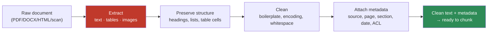

# 13.3 · Document Ingestion & Parsing

[⬅ 13.2 RAG Architecture](13.2-rag-architecture.md) · [🏠 Module 13](../README.md) · [➡ 13.4 Chunking](13.4-chunking.md)

> **The lesson in one line:** Before any embedding happens, messy real-world documents — PDFs, scans, spreadsheets, HTML — must be turned into clean text with structure and metadata preserved, and **parsing quality is a hard ceiling on retrieval quality: if a table becomes word-soup at parse time, no embedding model or reranker can ever retrieve it correctly.**

---

## 🎯 Learning objectives

- Ingest and parse the major formats: **PDF, DOCX, HTML, Markdown, CSV, JSON, images, scans**.
- Understand **text extraction, OCR, table extraction, image handling**, and **metadata capture**.
- Internalize **"garbage in, garbage out"**: parsing errors propagate to every downstream stage.
- Build a small **multi-format ingestion pipeline** that emits clean text + metadata.

## ✅ Prerequisites

- [13.2 RAG architecture](13.2-rag-architecture.md) — this is stages 1–3 and 5.
- [10.2 text processing](../../10-NLP/weeks/10.2-text-processing.md) — normalization, encoding.

---

## 🧠 Mental model

> [!IMPORTANT]
> **Parsing is where the real world meets your pipeline, and the real world is filthy.** A PDF is not text — it's a description of *where to draw glyphs on a page*, with no inherent notion of reading order, paragraphs, or tables. A scan is just pixels. HTML is text buried in navigation, ads, and scripts. **Your job is to recover clean, ordered, structured text plus the metadata that lets you filter and cite it.** Every error here — a merged table, a dropped column, a header repeated into every chunk — is an error you can *never* fix later. **Parsing quality caps retrieval quality.**



---

## Format by format

| Format | What it really is | Tooling (Python) | The hard part |
|---|---|---|---|
| **Plain text / Markdown** | already text; MD has structure | built-in; parse MD headings | preserving heading hierarchy for structure-aware chunking |
| **HTML** | text + navigation + scripts | `BeautifulSoup`, `trafilatura`, `readability` | stripping boilerplate without losing content |
| **PDF (digital)** | drawing instructions for glyphs | `pypdf`, `pdfplumber`, `PyMuPDF` | reading order, columns, tables, headers/footers |
| **PDF (scanned)** | images of pages | OCR: `pytesseract`, `docTR`, cloud OCR | accuracy on low-quality scans; layout |
| **DOCX** | zipped XML with styles | `python-docx`, `docx2txt` | tables, embedded objects, styles → structure |
| **CSV / spreadsheets** | tabular | `pandas`, `openpyxl` | how to serialize rows into retrievable text |
| **JSON** | structured/nested | `json`; flatten to text | choosing which fields become searchable text |
| **Images / diagrams** | pixels | OCR + captioning / multimodal models | extracting meaning, not just visible text |

### PDFs — the perennial pain
A digital PDF stores *glyph positions*, not paragraphs. Naive extraction can interleave columns, glue headers to body text, and turn tables into unaligned strings. Use a layout-aware library (`pdfplumber`/`PyMuPDF`), detect columns, and extract tables **as tables** (row/column structure), not as flowed text.

### OCR — for scans and images
When there's no text layer (scanned contracts, screenshots), run **OCR** (Optical Character Recognition) to recover characters from pixels. OCR is imperfect: it garbles low-contrast text, misreads similar glyphs (`0/O`, `1/l`), and loses layout. Track a **confidence score** and flag low-confidence pages for review — silently ingesting garbled OCR poisons the index.

### Tables — the retrieval killer
A table's meaning lives in the *relationship* between cells (this value is in *this* row and *this* column). Flatten it to text and that relationship vanishes: "Q3 revenue 4.2M Q4 revenue 5.1M" is retrievable; a de-aligned dump is not. **Extract tables structurally**, then serialize each row with its headers (e.g., `"Region: EMEA | Q3 Revenue: 4.2M | Q4 Revenue: 5.1M"`) or render as Markdown so relationships survive into the chunk.

### Images
Beyond OCR of embedded text, images may carry meaning (charts, diagrams). Options: **caption** them with a multimodal model and index the caption, or store the image and index a text description. At minimum, don't silently drop them.

---

## Metadata — capture it now or never

> [!IMPORTANT]
> **Metadata is not optional decoration — it powers filtering ([13.7](13.7-retrieval.md)), access control ([13.14](13.14-security.md)), and citations ([13.10](13.10-generation.md)).** Capture it at parse time, when you still know the source, because you can't reconstruct it from a bare chunk later.

| Metadata | Enables | Example |
|---|---|---|
| `source` / `doc_id` / `url` | citation, dedup, provenance | `policies/refunds.pdf` |
| `page` / `section` / `heading` | precise citation, structure-aware chunking | `p. 12, §4.2` |
| `created` / `modified` | freshness filtering, recency ranking | `2026-05-01` |
| `author` / `department` | filtering, attribution | `Legal` |
| `acl` / `tenant` / `visibility` | **access control at retrieval** | `role:finance` |
| `doc_type` / `tags` | scoping search | `contract`, `FAQ` |

---

## 💻 A minimal multi-format ingestion pipeline

```python
from dataclasses import dataclass, field

@dataclass
class Document:
    text: str
    metadata: dict = field(default_factory=dict)

def parse(path: str) -> Document:
    ext = path.lower().rsplit(".", 1)[-1]
    if ext in ("txt", "md"):
        text = open(path, encoding="utf-8").read()
    elif ext == "html":
        import trafilatura                      # strips nav/ads, keeps main content
        text = trafilatura.extract(open(path, encoding="utf-8").read()) or ""
    elif ext == "pdf":
        import pdfplumber
        pages = []
        with pdfplumber.open(path) as pdf:
            for i, page in enumerate(pdf.pages):
                body = page.extract_text() or ""
                tables = page.extract_tables()          # structural, not flowed
                for t in tables:
                    body += "\n" + table_to_markdown(t)  # preserve relationships
                pages.append((i + 1, body))
        text = "\n\n".join(b for _, b in pages)
    elif ext == "csv":
        import pandas as pd
        df = pd.read_csv(path)
        # one retrievable line per row, headers inline so relationships survive
        text = "\n".join(
            " | ".join(f"{c}: {v}" for c, v in row.items())
            for _, row in df.iterrows()
        )
    else:
        raise ValueError(f"unsupported: {ext}")

    return Document(text=clean(text), metadata=extract_metadata(path))

def clean(text: str) -> str:
    import re, unicodedata
    text = unicodedata.normalize("NFKC", text)          # fix encoding artifacts
    text = re.sub(r"[ \t]+", " ", text)                  # collapse whitespace
    text = re.sub(r"\n{3,}", "\n\n", text)               # collapse blank lines
    text = strip_repeated_headers_footers(text)          # remove boilerplate
    return text.strip()
```

**The cleaning step matters as much as extraction:** collapse whitespace, normalize Unicode, strip repeated page headers/footers (they otherwise pollute every chunk and dilute embeddings), and drop navigation/boilerplate.

---

## Why parsing quality caps everything


> [!WARNING]
> **A parsing error is a permanent error.** If page 12's table becomes de-aligned text, its embedding encodes nonsense, retrieval can't match it, and the answer is missing or wrong — and **nothing downstream can recover it.** Reranking can't rerank text that was never extracted correctly. This is why serious RAG teams spend disproportionate effort on ingestion, run parsers on a sample and *eyeball the output*, and treat "% of documents that parse cleanly" as a first-class metric.

---

## 🏭 Production examples

| Scenario | Ingestion approach |
|---|---|
| Enterprise wiki (Confluence/Notion) | API export → HTML/MD parse → preserve heading tree for structure-aware chunking |
| Contracts (scanned PDFs) | OCR with confidence thresholds; flag low-confidence pages; extract clause structure |
| Financial reports (tables) | layout-aware extraction; tables → Markdown; keep page/section metadata for citation |
| Support tickets (JSON/DB) | select fields into searchable text; keep ticket_id, product, date as metadata |
| Product docs (Markdown) | parse heading hierarchy directly → excellent structure-aware chunks |

## ⚡ Performance considerations

- Ingestion is **offline and embarrassingly parallel** — parse documents concurrently; it's a one-time cost per document.
- OCR is **expensive** (CPU/GPU) — cache results; only re-OCR changed pages.
- Store parsed output so re-chunking/re-embedding doesn't require re-parsing.
- **Incremental ingestion**: detect changed documents (hash/mtime) and reprocess only those.

## 🔒 Security considerations

> [!CAUTION]
> - **Capture ACL/tenant metadata at ingestion** — it's the only place you reliably know a document's origin and permissions; retrieval enforces it later ([13.14](13.14-security.md)).
> - **Documents can carry embedded prompt-injection payloads** (white text, hidden HTML, image text) — parsing may surface them into chunks; treat all parsed text as untrusted ([13.14](13.14-security.md)).
> - **PII detection belongs here** — scan/redact at ingestion if policy requires it, before the text is embedded and copied into an index ([13.14](13.14-security.md)).
> - **Malicious files** (zip bombs, malformed PDFs) can DoS parsers — sandbox and cap resource use.

## 🚫 Common mistakes

| Mistake | Consequence |
|---|---|
| Naive PDF text extraction | Interleaved columns, table soup, headers glued to body |
| Flattening tables to flowed text | Cell relationships lost → untrievable facts |
| Ingesting OCR without confidence checks | Garbled text silently poisons the index |
| Not stripping repeated headers/footers | Boilerplate in every chunk dilutes embeddings |
| Dropping metadata at parse time | No filtering, no ACLs, no citations later |
| No visual QA of parser output | Systematic extraction bugs go unnoticed |

## 🐛 Debugging workflow

When answers are missing for content you *know* exists: (1) **print the parsed text** for that document — is the fact even there and readable? (2) If it's a table, is the structure intact? (3) Check for OCR garbling. **Most "retrieval" failures for known content are actually parsing failures.** Read the parser output with your own eyes before blaming embeddings.

## 🏋️ Exercises

1. **PDF autopsy.** Extract text from a multi-column PDF with two libraries (`pypdf` vs `pdfplumber`/`PyMuPDF`). Diff the outputs; find where reading order breaks.
2. **Table survival.** Take a PDF/HTML table. Extract it (a) as flowed text and (b) as Markdown/row-serialized. Embed a fact from it and test which version retrieves.
3. **OCR quality.** OCR a clean scan and a noisy one. Measure character error rate; set a confidence threshold that flags the noisy one.
4. **Boilerplate strip.** Ingest 10 pages of one PDF; detect and remove the repeated header/footer. Show chunk quality improves.
5. **Metadata schema.** Design a metadata schema for a mixed corpus (PDFs, HTML, CSV) that supports filtering by date, department, and ACL.

## 🛠️ Mini project — "Multi-format ingestion service"

**Goal:** a service that ingests PDF, HTML, DOCX, CSV, and Markdown into a uniform `Document{text, metadata}`.

**Requirements:** per-format parsers; a shared cleaning stage; structural table extraction; OCR fallback for image-only PDFs (with confidence); metadata capture (source, page/section, date, ACL); a "parse quality" report (% clean, low-confidence pages).

**Folder structure**
```
ingestion/
├── parsers/          # pdf.py, html.py, docx.py, csv.py, md.py
├── clean.py          # normalize, dedup, strip boilerplate
├── ocr.py            # OCR + confidence
├── metadata.py       # extract + schema
├── quality.py        # parse-quality report
└── service.py        # dispatch by extension → Document
```

**Testing:** golden-file tests (input doc → expected clean text); table round-trip test (a known cell is retrievable); OCR confidence threshold test.
**Evaluation:** % of a sample corpus that parses cleanly; table-fact retrieval rate.
**Security:** capture ACLs; sandbox parsers; optional PII redaction.
**Monitoring:** track parse failures and low-confidence OCR rate.
**Future improvements:** multimodal image captioning; layout models (e.g., document-layout detection) for complex PDFs.

## 📄 Cheat sheet

| Concept | One line |
|---|---|
| **Ingestion** | load raw bytes from every source |
| **Parsing** | extract ordered text + tables + images |
| **⭐ PDF reality** | glyph positions, not paragraphs → reading-order/table pain |
| **OCR** | pixels → characters (imperfect; track confidence) |
| **⭐ Tables** | preserve cell relationships (row-serialize / Markdown) |
| **Cleaning** | normalize Unicode, collapse whitespace, strip boilerplate |
| **Metadata** | source/page/date/ACL — capture at parse time |
| **⭐ Key law** | parsing quality caps retrieval quality (permanent error) |

## 🎴 Flashcards

- **⭐ Why does parsing quality cap retrieval quality?** → A parsing error (e.g., a mangled table) can never be fixed downstream — the fact is gone before embedding.
- **Why are PDFs hard to parse?** → They store glyph positions, not paragraphs — no inherent reading order, columns, or table structure.
- **⭐ How should tables be extracted?** → Structurally (preserve row/column relationships), then row-serialized or as Markdown — never as flowed text.
- **What is OCR and its risk?** → Recovering text from pixels; it's imperfect, so garbled low-confidence output can silently poison the index — track confidence.
- **Why capture metadata at parse time?** → It powers filtering, access control, and citations, and can't be reconstructed from a bare chunk later.
- **Why strip repeated headers/footers?** → Otherwise boilerplate lands in every chunk, diluting embeddings and wasting context.

## 💬 Interview questions

1. Why is "parsing quality caps retrieval quality" true? Give a concrete example.
2. How do you extract tables so their meaning survives into a chunk?
3. When do you need OCR, and what quality controls do you put on it?
4. What metadata do you capture at ingestion and why? Which field enables access control?
5. How would you design incremental ingestion for a corpus that changes daily?

## 📝 Summary

- Real documents are **filthy**: PDFs are glyph positions, scans are pixels, HTML is text buried in boilerplate — parsing must recover **clean, ordered, structured text**.
- **Tables and OCR are the hard parts**: preserve cell relationships; track OCR confidence; strip repeated boilerplate; normalize encoding.
- **Capture metadata at parse time** (source, page, date, ACL) — it powers filtering, access control, and citations and can't be recovered later.
- **Parsing quality caps retrieval quality** — a parse error is permanent, so QA the parser output with your own eyes and treat "% clean parses" as a metric.

## 📚 References

1. **`pdfplumber` / `PyMuPDF` / `unstructured` docs.** ⭐ Layout-aware extraction and table handling.
2. **`trafilatura` — web text extraction.** Boilerplate removal for HTML.
3. **Smith (2007) — _An Overview of the Tesseract OCR Engine_.** OCR fundamentals.
4. **[10.2 Text Processing](../../10-NLP/weeks/10.2-text-processing.md).** Normalization and encoding.

---

## 🧭 Navigation

| Direction | Link |
|---|---|
| ⬅ Previous | [13.2 · RAG Architecture](13.2-rag-architecture.md) |
| ➡ Next | [13.4 · Chunking](13.4-chunking.md) |
| 🏠 Module | [Module 13](../README.md) |
| 📖 Lessons | [Lesson index](README.md) |
