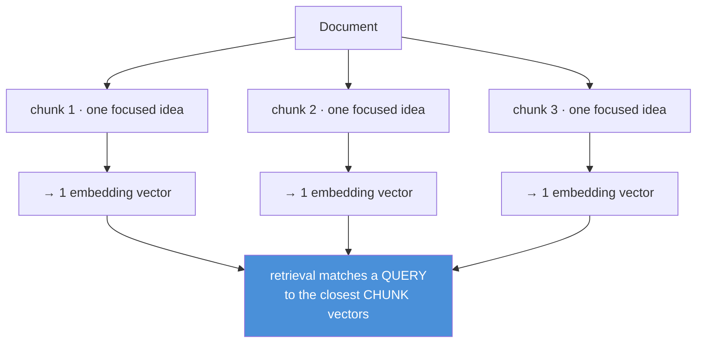
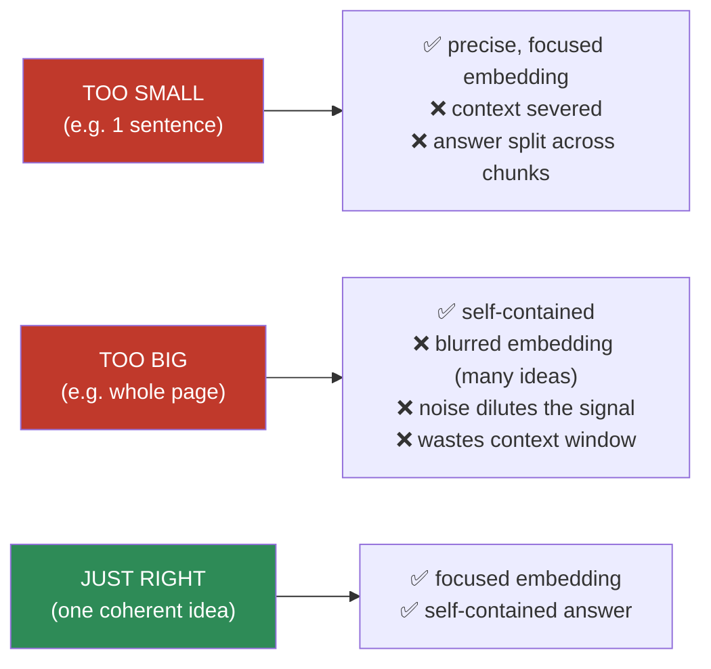
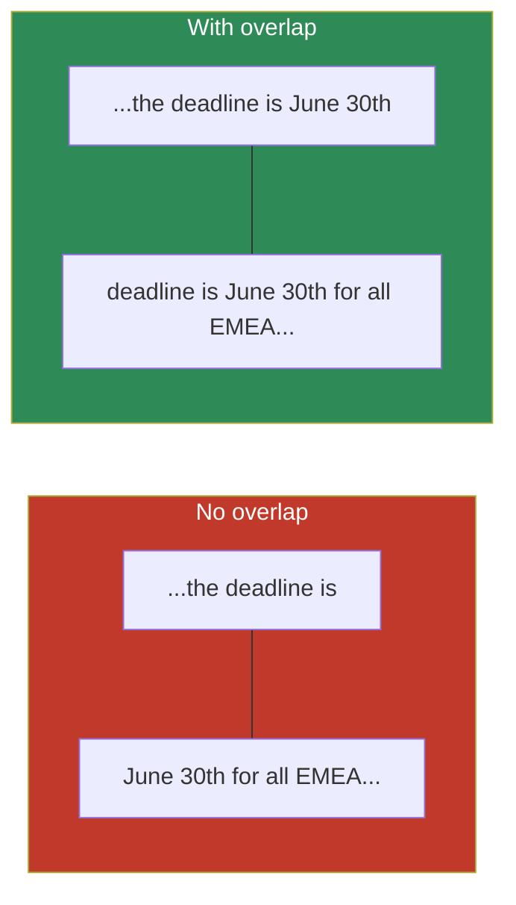

# 13.4 · Chunking ⭐

[⬅ 13.3 Ingestion & Parsing](13.3-ingestion-parsing.md) · [🏠 Module 13](../README.md) · [➡ 13.5 Embeddings & Similarity](13.5-embeddings-similarity.md)

> **The lesson in one line:** A chunk is the atomic unit of retrieval — you retrieve chunks, not documents — so **how you split text determines what can ever be retrieved**: chunks too big drown the answer in noise and blur the embedding, chunks too small sever the fact from its context, and the best strategies split along the document's *own* structure with a little overlap.


---

## 🎯 Learning objectives

- Understand why the **chunk is the atom of RAG** and why chunking dominates retrieval quality.
- Know the strategies: **fixed-size, sentence, paragraph, recursive, semantic, structure-aware**.
- Reason about **chunk size, overlap, and context preservation** as trade-offs.
- Choose and implement a chunking strategy for a given corpus.

## ✅ Prerequisites

- [13.3 ingestion & parsing](13.3-ingestion-parsing.md) — chunking operates on clean, structured text.
- [11.2 tokenization](../../11-LLMs/weeks/11.2-tokenization.md) — chunk size is measured in *tokens*.

---

## 🧠 Mental model

> [!IMPORTANT]
> **You do not retrieve documents — you retrieve chunks.** The chunk is the unit that gets embedded, indexed, retrieved, reranked, and dropped into the prompt. So a chunk must satisfy two opposing demands at once: it must be **small and focused** enough that its single embedding vector faithfully represents one idea (so it matches the right queries), yet **large and self-contained** enough that, read alone, it actually contains the answer with enough context to be useful. **Every chunk boundary is a decision about what facts can be retrieved together.** Split a definition from its example, or a pronoun from its antecedent, and you've made that information unretrievable.



---

## The core trade-off: size



> [!IMPORTANT]
> **An embedding is a single vector — the *average* meaning of everything in the chunk.** Pack many ideas in and the vector points "in between" all of them, matching everything weakly and nothing strongly (the "blurred embedding" problem). Split too finely and a query that needs two adjacent facts can only retrieve one. **The target is one coherent, self-contained idea per chunk** — typically **a few hundred tokens** (often ~200–500 for prose), but the right number depends entirely on your content and embedding model. Measure, don't guess.

---

## The strategies, weakest to strongest

| Strategy | How it splits | Pros | Cons | Use when |
|---|---|---|---|---|
| **Fixed-size** | every N characters/tokens | trivial, uniform | cuts mid-sentence/mid-word; ignores meaning | baseline only |
| **Sentence** | on sentence boundaries | respects sentences | sentences too small alone; loses cross-sentence context | short, fact-dense text |
| **Paragraph** | on blank lines / `\n\n` | natural idea units | paragraphs vary wildly in size | well-structured prose |
| **Recursive** | try paragraphs → sentences → words until size fits | respects structure *and* size | needs a separator hierarchy | **general-purpose default** |
| **Semantic** | split where meaning shifts (embedding distance) | topically coherent chunks | costly (embeds while splitting); tuning | topically dense docs |
| **Structure-aware** | along headings/sections/tables/code blocks | honors the document's own units | needs structural metadata from parsing | Markdown, docs, code, HTML |

### Fixed-size (the baseline you should beat)
Split every N tokens. Simple and uniform, but blind to meaning — it happily cuts a sentence, a word, or a table in half. Only acceptable as a baseline or for truly unstructured text.

### Recursive character/token splitting (the sensible default)
Try to split on the largest natural separator first (paragraphs), and if a piece is still too big, recurse to smaller separators (sentences, then words), until each chunk fits the size budget. This respects structure **and** enforces a max size — which is why it's the default in most frameworks.

### Semantic chunking
Embed sentences, then start a new chunk wherever adjacent sentences' embeddings diverge past a threshold — i.e., split where the **topic shifts**. Produces topically coherent chunks but pays an embedding cost at index time and needs threshold tuning.

### Structure-aware chunking (usually the best when available)
Use the document's own structure — Markdown headings, HTML sections, PDF sections, code functions, table rows — as boundaries, carrying the heading path as metadata. A chunk becomes "section 4.2, under 'Refunds', under 'Billing'." This is typically the **highest-quality** strategy because the author already organized the ideas for you.

---

## Overlap — the cheap insurance



**Overlap** repeats the last ~10–20% of one chunk at the start of the next, so a fact straddling a boundary appears *whole* in at least one chunk. It's cheap insurance against boundary-severed facts — at the cost of some index bloat and duplicate retrieval (dedup later, [13.7](13.7-retrieval.md)). Typical: **10–20% overlap**.

> [!IMPORTANT]
> **Chunk size and overlap are the two dials you tune first when retrieval underperforms** — before changing embedding models or rerankers. They're cheap to sweep and often the single biggest lever. Measure retrieval metrics ([13.12](13.12-evaluation.md)) across a grid of sizes/overlaps on your own data.

---

## 💻 Chunking in code

```python
import re

def recursive_chunk(text, max_tokens=400, overlap=60, count=len):
    """Split on the largest natural separator that keeps chunks under max_tokens."""
    separators = ["\n\n", "\n", ". ", " ", ""]  # paragraph → line → sentence → word → char

    def split(text, seps):
        if count(text.split()) <= max_tokens or not seps:
            return [text]
        sep, rest = seps[0], seps[1:]
        parts, chunks, cur = text.split(sep) if sep else list(text), [], ""
        for p in parts:
            candidate = (cur + sep + p) if cur else p
            if count(candidate.split()) <= max_tokens:
                cur = candidate
            else:
                if cur:
                    chunks.append(cur)
                cur = p if count(p.split()) <= max_tokens else None
                if cur is None:               # single part too big → recurse
                    chunks.extend(split(p, rest)); cur = ""
        if cur:
            chunks.append(cur)
        return chunks

    chunks = split(text, separators)
    return add_overlap(chunks, overlap)       # prepend tail of prev chunk

def structure_aware_chunk(markdown):
    """Split on headings; carry the heading path as metadata."""
    sections, path = [], []
    for block in split_markdown_blocks(markdown):
        if block.is_heading:
            path = path[:block.level - 1] + [block.text]
        else:
            for chunk in recursive_chunk(block.text):
                sections.append({"text": chunk, "heading_path": list(path)})
    return sections
```

**Measure chunk size in tokens, not characters** ([11.2](../../11-LLMs/weeks/11.2-tokenization.md)) — the embedding model and the LLM both count tokens, and a token ≈ 4 characters of English but varies by language and content.

---

## Context preservation tricks

| Technique | Idea |
|---|---|
| **Overlap** | repeat boundary text so straddling facts survive |
| **Heading/breadcrumb prefix** | prepend the section path to each chunk ("Billing > Refunds > …") so the embedding and the LLM know the context |
| **Contextual retrieval** | prepend a one-line, LLM-generated summary of the chunk's place in the document (Anthropic's "contextual retrieval") to disambiguate |
| **Parent-child (small-to-big)** | embed small chunks for precise matching but retrieve their larger parent for context ([13.11](13.11-advanced-rag.md)) |
| **Metadata** | keep source/page/section so a retrieved chunk is citable and filterable |

---

## 🏭 Production examples

| Corpus | Recommended chunking |
|---|---|
| Markdown docs / wikis | **structure-aware** on headings + recursive within sections; heading path as metadata |
| Legal contracts | structure-aware on clauses; never split a clause mid-sentence |
| Code repositories | split on function/class boundaries; keep signatures with bodies |
| Support tickets / FAQ | one Q&A pair per chunk (naturally atomic) |
| Long research PDFs | recursive with overlap; consider parent-child for context |
| Tables | one row (or a few) per chunk, with column headers inline ([13.3](13.3-ingestion-parsing.md)) |

## ⚡ Performance considerations

- Chunking is **offline** — its cost is amortized, so favor quality (semantic/structure-aware) over speed.
- **More/smaller chunks** → larger index, more vectors to search, more storage — but finer retrieval. **Fewer/larger chunks** → cheaper index but coarser retrieval. Tune against metrics.
- **Overlap multiplies storage** — 20% overlap ≈ 20% more chunks; budget for it.
- Re-chunking requires **re-embedding** — a costly operation; get chunking right early or version your index.

## 🔒 Security considerations

> [!CAUTION]
> - **Chunk boundaries can split or expose sensitive spans** — a chunk may contain PII that the surrounding redaction context would have caught; scan chunks, not just documents ([13.14](13.14-security.md)).
> - **Overlap duplicates content** — including any secret — into multiple index entries; ensure ACL metadata is copied to every derived chunk.
> - **Injection payloads survive chunking** — a malicious instruction in the source lands in a chunk verbatim; retrieved chunks are untrusted ([13.14](13.14-security.md)).

## 🚫 Common mistakes

| Mistake | Consequence |
|---|---|
| Fixed-size chunking on structured docs | Cuts sentences/tables; blurred, low-quality chunks |
| Chunks too large | Blurred embeddings; answer buried in noise; wasted context |
| Chunks too small | Facts severed from context; answer split across chunks |
| No overlap | Boundary-straddling facts become unretrievable |
| Measuring size in characters, not tokens | Overflows the embedding model or wastes budget |
| Never re-tuning size/overlap on your data | Leaving the biggest, cheapest lever on the table |
| Dropping heading/section context | Chunk is ambiguous alone ("it costs $5" — *what* costs $5?) |

## 🐛 Debugging workflow

If retrieval misses content you know exists: (1) **print the chunks** for that document — is the fact whole in one chunk, or split across two? (2) Is the chunk so large the fact is diluted? (3) Does the chunk make sense read alone, or does it need its heading? **Reading your actual chunks is the single most revealing RAG debugging step** — most people never do it. Fix by adjusting size/overlap or switching to structure-aware chunking.

## 🏋️ Exercises

1. **Size sweep.** Chunk one corpus at {128, 256, 512, 1024} tokens with 0/10/20% overlap. Measure Recall@5 ([13.12](13.12-evaluation.md)) for a fixed query set. Plot the surface; find the optimum for your data.
2. **Strategy bake-off.** Chunk the same Markdown doc with fixed-size, recursive, and structure-aware. Retrieve a fact that lives under a specific heading. Which strategy retrieves it?
3. **Boundary break.** Craft a fact that straddles a boundary. Show it's unretrievable at 0% overlap and retrievable at 20%.
4. **Blurred embedding.** Make one huge chunk mixing three topics. Show it matches all three queries weakly and none strongly, vs three focused chunks.
5. **Read your chunks.** For a real doc, print all chunks and manually flag any that are ambiguous read alone. Fix with heading prefixes.

## 🛠️ Mini project — "Chunking lab"

**Goal:** a configurable chunker + an evaluation harness that finds the best strategy for a corpus.

**Requirements:** implement fixed-size, recursive, and structure-aware chunkers with configurable size/overlap; a token-based size counter; heading-path metadata; an eval harness that reports Recall@k across a size/overlap grid on a labeled query set.

**Folder structure**
```
chunking-lab/
├── chunkers/         # fixed.py, recursive.py, structural.py, semantic.py
├── tokens.py         # token counting
├── metadata.py       # heading path, source, page
├── eval.py           # Recall@k over a grid
└── report.py         # best-config surface plot
```

**Testing:** every chunk ≤ max tokens; overlap present; no chunk empty; structure-aware chunks carry heading path.
**Evaluation:** Recall@5 across the grid; pick the config that maximizes it.
**Security:** copy ACL metadata to every derived chunk; PII scan per chunk.
**Future improvements:** semantic chunking; contextual-retrieval prefixes; parent-child.

## 📄 Cheat sheet

| Concept | One line |
|---|---|
| **⭐ Chunk = atom of RAG** | you retrieve chunks, not documents |
| **Fixed-size** | every N tokens; blind to meaning (baseline) |
| **Recursive** | paragraph → sentence → word until it fits (**default**) |
| **Semantic** | split where the topic shifts (embedding distance) |
| **⭐ Structure-aware** | split on headings/sections/rows (best when available) |
| **Size** | one coherent idea; ~200–500 tokens typical — **measure** |
| **Overlap** | 10–20%; cheap insurance for boundary facts |
| **⭐ First dials to tune** | chunk size + overlap, before models/rerankers |
| **Context tricks** | heading prefix, contextual retrieval, parent-child |

## 🎴 Flashcards

- **⭐ Why is the chunk "the atom of RAG"?** → You embed, index, retrieve, rerank, and prompt with chunks — boundaries decide what can be retrieved together.
- **⭐ What goes wrong with chunks that are too big?** → The single embedding averages many ideas ("blurred"), matching everything weakly; the answer is diluted in noise.
- **What goes wrong with chunks that are too small?** → Facts get severed from context; an answer needing adjacent facts can't retrieve both.
- **What is recursive chunking?** → Split on the largest natural separator (paragraph), recursing to smaller ones (sentence, word) until each chunk fits the size budget.
- **Why is structure-aware chunking usually best?** → It splits along the author's own organization (headings/sections), so chunks are coherent and citable.
- **What does overlap buy you?** → A fact straddling a boundary appears whole in at least one chunk — cheap insurance against severed facts.
- **⭐ Which dials do you tune first when retrieval underperforms?** → Chunk size and overlap, before changing embedding models or rerankers.

## 💬 Interview questions

1. Why is chunking one of the most important decisions in RAG?
2. Explain the size trade-off in terms of what a single embedding vector represents.
3. Compare fixed-size, recursive, semantic, and structure-aware chunking.
4. What is chunk overlap and what problem does it solve? What does it cost?
5. How do you decide the right chunk size for a new corpus?
6. What is parent-child / small-to-big retrieval and why does it exist?

## 📝 Summary

- The **chunk is the atomic unit of RAG** — you retrieve chunks, and every boundary decides what facts can be retrieved together.
- **Size is the core trade-off**: too big blurs the embedding and buries the answer; too small severs facts from context. Aim for **one coherent idea per chunk**, then measure.
- **Structure-aware > recursive > sentence/paragraph > fixed-size** in general; **overlap (10–20%)** is cheap insurance against boundary-severed facts.
- **Chunk size and overlap are the first, cheapest dials to tune** when retrieval underperforms — and *reading your actual chunks* is the most revealing debugging step.

## 📚 References

1. **Anthropic (2024) — _Contextual Retrieval_.** ⭐ Prepending chunk context to fix ambiguity.
2. **LangChain / LlamaIndex text-splitter docs.** Recursive and structure-aware splitters in practice.
3. **[11.2 Tokenization](../../11-LLMs/weeks/11.2-tokenization.md).** Why chunk size is measured in tokens.
4. **[13.5 Embeddings](13.5-embeddings-similarity.md).** Why a chunk becomes one vector.

---

## 🧭 Navigation

| Direction | Link |
|---|---|
| ⬅ Previous | [13.3 · Document Ingestion & Parsing](13.3-ingestion-parsing.md) |
| ➡ Next | [13.5 · Embeddings & Similarity Search](13.5-embeddings-similarity.md) |
| 🏠 Module | [Module 13](../README.md) |
| 📖 Lessons | [Lesson index](README.md) |
