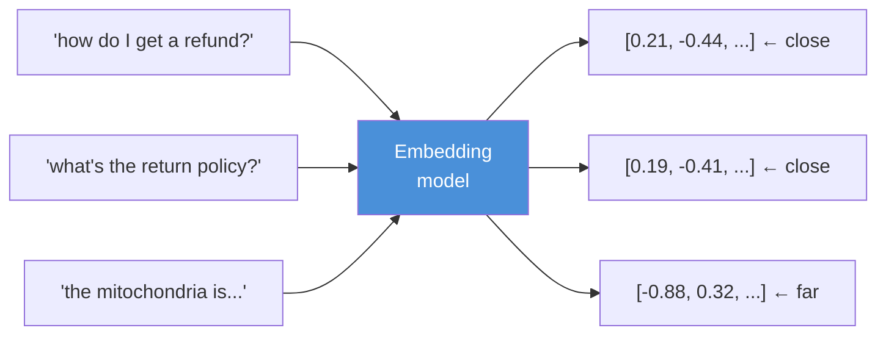
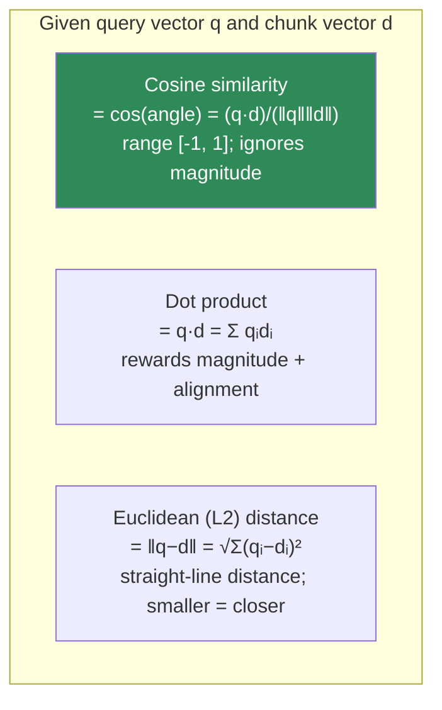
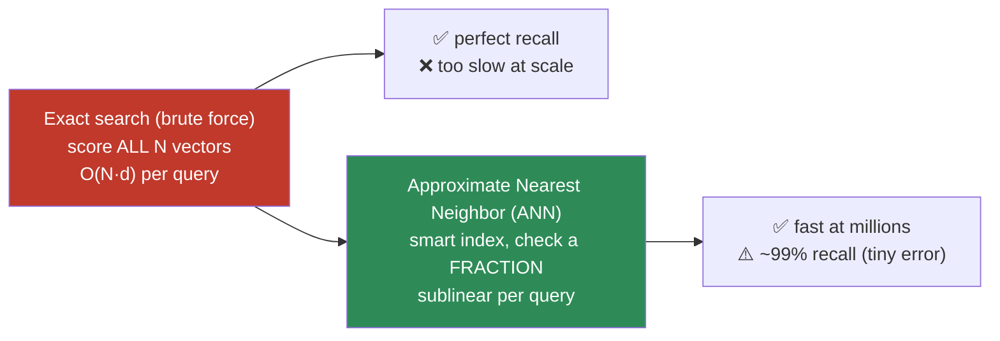

# 13.5 · Embeddings & Similarity Search ⭐

[⬅ 13.4 Chunking](13.4-chunking.md) · [🏠 Module 13](../README.md) · [➡ 13.6 Vector Databases](13.6-vector-databases.md)

> **The lesson in one line:** An embedding maps text to a point in a high-dimensional space where **semantic similarity becomes geometric closeness**, so "find relevant text" becomes "find nearby vectors" — and you can build a working semantic search engine with nothing but a matrix multiply and a sort.

---

## 🎯 Learning objectives

- Explain what an **embedding** is: a dense vector where distance encodes meaning.
- Understand **embedding models**, **dimension size**, and how a chunk becomes one vector.
- Master the three similarity metrics: **cosine, dot product, Euclidean** — and when each is right.
- **Build semantic search from scratch** — embed, score, top-k — and know why it doesn't scale ([13.6](13.6-vector-databases.md)).

## ✅ Prerequisites

- [10.4 word embeddings](../../10-NLP/weeks/10.4-word-embeddings.md), [10.7 transformer attention](../../10-NLP/weeks/10.7-attention.md).
- [06.2 linear algebra — vectors, dot products, norms](../../06-Mathematics/weeks/06.2-linear-algebra-vectors-matrices.md).

---

## 🧠 Mental model

> [!IMPORTANT]
> **An embedding model is a function that reads text and returns a list of numbers — a vector — positioned so that texts that *mean* similar things land near each other, and texts that mean different things land far apart.** "How do I return a product?" and "What's the refund process?" share almost no words but nearly the same meaning, so their vectors are close. This is the whole magic of dense retrieval: it matches on **meaning, not keywords**. Once every chunk is a point in this space, retrieval is pure geometry — embed the query, find the nearest chunk points, return them.



---

## What an embedding is

A modern text embedding is a **dense vector** of a few hundred to a few thousand floats (common dims: 384, 768, 1024, 1536, 3072). "Dense" means (nearly) every dimension carries information — unlike a **sparse** bag-of-words vector, which is mostly zeros ([13.7](13.7-retrieval.md)). The model (a transformer encoder, [10.11](../../10-NLP/weeks/10.7-attention.md)) is trained so that semantically similar inputs get similar vectors — typically via **contrastive learning**: pull matching (query, passage) pairs together, push mismatched pairs apart.

> [!IMPORTANT]
> **A whole chunk collapses to one fixed-length vector** regardless of its length — 10 words or 400 words become the same 768 numbers. That's why chunking matters ([13.4](13.4-chunking.md)): the vector is the *average-ish* meaning of the chunk, so a chunk with one idea gets a sharp vector and a chunk with five ideas gets a blurred one.

### Dimension size — the trade-off
| More dimensions (e.g., 1536, 3072) | Fewer dimensions (e.g., 384, 768) |
|---|---|
| Can encode finer distinctions | Cheaper storage & faster search |
| More storage, slower search, higher cost | May lose nuance |
| Diminishing returns past a point | Often "good enough" and much faster |

Dimension is a property of the **model** — you don't choose it freely; you choose a model, which fixes the dim. Some models (Matryoshka embeddings) let you *truncate* dimensions to trade accuracy for speed.

---

## The three similarity metrics

You need a number for "how close are these two vectors?" Three metrics dominate.



### Cosine similarity — the default for text
$$\text{cosine}(q, d) = \frac{q \cdot d}{\|q\|\,\|d\|} = \frac{\sum_i q_i d_i}{\sqrt{\sum_i q_i^2}\,\sqrt{\sum_i d_i^2}}$$

Cosine measures the **angle** between vectors, ignoring their length. This is usually what you want for text: a long document and a short query about the same topic should match on *direction* (topic), not magnitude (length). Range: `[-1, 1]`, where 1 = identical direction.

### Dot product
$$q \cdot d = \sum_i q_i d_i$$

Rewards both **alignment and magnitude**. If vectors are **normalized** (unit length), dot product **equals cosine** — which is why most vector DBs store normalized vectors and use fast dot products internally. Some models are trained for dot-product (magnitude can encode importance/confidence).

### Euclidean (L2) distance
$$\|q - d\|_2 = \sqrt{\sum_i (q_i - d_i)^2}$$

Straight-line distance; smaller = more similar. For **normalized** vectors, L2 distance and cosine are monotonically related (rank the same). For un-normalized vectors they can differ.

> [!IMPORTANT]
> **The golden rule: normalize your vectors, use cosine (or equivalently dot product), and be consistent.** The single most common RAG bug is a **metric mismatch** — embedding for cosine but querying the index with L2, or forgetting to normalize. **Use the metric the embedding model was trained with** (the model card says), and use the *same* metric at index time and query time. When in doubt: normalize + cosine.

---

## 💻 Semantic search from scratch

No library, no vector DB — just NumPy. This is the entire idea of dense retrieval.

```python
import numpy as np

def normalize(v):
    return v / (np.linalg.norm(v, axis=-1, keepdims=True) + 1e-9)

class SemanticSearch:
    def __init__(self, embed_fn):
        self.embed = embed_fn          # text -> np.ndarray[d]
        self.vectors = None            # (N, d) matrix of chunk vectors
        self.chunks = []

    def index(self, chunks):
        self.chunks = chunks
        self.vectors = normalize(np.vstack([self.embed(c) for c in chunks]))

    def search(self, query, k=5):
        q = normalize(self.embed(query))               # (d,)
        scores = self.vectors @ q                       # (N,) cosine — one matmul!
        top = np.argpartition(-scores, k)[:k]           # top-k unsorted (O(N))
        top = top[np.argsort(-scores[top])]             # sort just the k
        return [(self.chunks[i], float(scores[i])) for i in top]
```

**That's a working semantic search engine.** The heart is one line: `self.vectors @ q` — a matrix–vector product that computes the cosine similarity of the query against **every** chunk at once (because vectors are normalized). Sort, take the top-k, done.

### Verify it works
```python
ss = SemanticSearch(embed_fn=model.encode)
ss.index(["cats are mammals", "how to return a product", "refund policy details"])
ss.search("get my money back")   # → ranks "refund policy" / "return a product" top
```

Cosine matches *meaning*: "get my money back" retrieves "refund policy" despite zero shared words.

---

## Why this doesn't scale — the motivation for 13.6

The from-scratch version computes similarity against **every** vector: **O(N·d) per query**. At a few thousand chunks that's instant. At 10 million chunks × 1536 dims, every query is ~15 billion multiplies — far too slow.



The fix — **Approximate Nearest Neighbor (ANN)** search via specialized indexes (HNSW, IVF, PQ) — is the whole subject of [13.6](13.6-vector-databases.md). But the *semantics* never change: it's still "find the nearest vectors by cosine." ANN just finds them without checking all of them.

---

## Choosing an embedding model

| Factor | What to weigh |
|---|---|
| **Quality** | check a benchmark (e.g., MTEB) for *your* task (retrieval, not classification) |
| **Dimension** | higher = finer but slower/bigger; 768–1024 is a common sweet spot |
| **Max input length** | must exceed your chunk size or it truncates silently |
| **Domain** | general vs domain-tuned (legal, code, biomedical) |
| **Query/passage asymmetry** | some models need a prefix ("query:" / "passage:") — using the wrong one wrecks recall |
| **Hosted vs local** | API (easy, per-call cost, data leaves) vs self-hosted (control, GPU) |
| **Multilingual** | if your corpus/queries span languages |

> [!WARNING]
> **You must embed the corpus and the queries with the *same* model** (and the same query/passage prefixes). Mixing models, or changing models without re-embedding the whole index, produces incomparable vectors and silent garbage retrieval.

---

## 🏭 Production examples

| Choice | Rationale |
|---|---|
| Normalized vectors + cosine everywhere | Consistency; dot product == cosine, fast |
| 768–1024 dim general model | Good quality/speed/storage balance |
| Instruction-prefixed models (query:/passage:) | Big recall gains — but must apply prefixes correctly |
| Batch-embed the corpus offline | Amortize cost; embed queries online ([13.16](13.16-performance.md)) |
| Cache query embeddings | Repeated queries skip re-embedding |

## ⚡ Performance considerations

- **Batch embed** the corpus (offline) — GPUs embed hundreds of chunks per call; per-chunk calls are wasteful.
- **Normalize once at index time** so query-time scoring is a pure dot product.
- **Storage** = `N × dim × 4 bytes` (fp32); 10M × 1536 × 4 ≈ 61 GB — often quantized to int8/fp16 ([13.6](13.6-vector-databases.md)).
- **Cache** query embeddings and reuse across identical queries ([13.16](13.16-performance.md)).

## 🔒 Security considerations

> [!CAUTION]
> - **Embeddings can leak content** — they are not one-way hashes; approximate inversion can reconstruct sensitive text from vectors. Treat the vector store as sensitive data ([13.14](13.14-security.md)).
> - **Sending text to a hosted embedding API exports your data** — the corpus and queries leave your boundary; check data-handling terms or self-host.
> - **Embedding un-redacted PII** copies it into the index in a hard-to-audit form — redact before embedding if policy requires ([13.3](13.3-ingestion-parsing.md)).

## 🚫 Common mistakes

| Mistake | Consequence |
|---|---|
| Metric mismatch (embed for cosine, query with L2) | Silent garbage retrieval |
| Forgetting to normalize | Magnitude skews cosine/dot results |
| Different model for corpus vs queries | Incomparable vectors → nonsense |
| Missing query/passage prefixes | Large recall drop on instruction models |
| Chunk longer than model's max input | Silent truncation drops the tail |
| Assuming "similar" means "relevant/true" | Similar ≠ correct ≠ authorized |

## 🐛 Debugging workflow

Retrieval returns off-topic chunks? (1) **Sanity-check the metric** — are vectors normalized and scored with the model's intended metric? (2) **Same model** for index and query? Prefixes applied? (3) **Print the top-k scores** — are they all low (nothing relevant indexed) or high-but-wrong (embedding model weak for your domain)? (4) Eyeball a few (query, retrieved) pairs — does "similar" match human relevance? If not, try a better/domain embedding model or add reranking ([13.8](13.8-reranking.md)).

## 🏋️ Exercises

1. **Build it.** Implement `SemanticSearch` above with a real model. Confirm it retrieves paraphrases with zero lexical overlap.
2. **Metric matters.** Score the same query with cosine, dot (normalized and not), and L2. Show normalized dot == cosine and un-normalized dot differs.
3. **Dimension sweep.** If your model supports Matryoshka truncation, compare Recall@5 at 256/512/768 dims vs latency/storage.
4. **Prefix test.** For an instruction-tuned model, measure Recall@5 with and without the `query:`/`passage:` prefixes. Quantify the gap.
5. **Blurred vector.** Embed a single-topic chunk and a five-topic chunk; show the multi-topic vector has lower max similarity to each topic's query.

## 🛠️ Mini project — "Semantic search engine from scratch"

**Goal:** a NumPy-only semantic search engine — no vector DB, no framework — that you'll later swap for a real index.

**Requirements:** `embed → normalize → index (matrix) → cosine search → top-k`; a CLI to query a folder of text files; a small labeled query set; Recall@k measured against brute-force ground truth.

**Folder structure**
```
semantic-search/
├── embed.py       # model wrapper + batching + normalize
├── index.py       # in-memory matrix; cosine top-k
├── search.py      # CLI
├── eval.py        # Recall@k vs brute force
└── README.md
```

**Testing:** paraphrase retrieval works; normalized-dot == cosine (assert close); top-k is sorted; empty query handled.
**Evaluation:** Recall@5 on the labeled set; latency vs N (show O(N) growth → motivates [13.6](13.6-vector-databases.md)).
**Security:** note that vectors are sensitive; document hosted-API data flow.
**Future improvements:** swap the matrix for an ANN index ([13.6](13.6-vector-databases.md)); add hybrid sparse scoring ([13.7](13.7-retrieval.md)).

## 📄 Cheat sheet

| Concept | One line |
|---|---|
| **⭐ Embedding** | text → dense vector where distance = (dis)similarity of meaning |
| **Dense vs sparse** | dense = few hundred rich dims; sparse = mostly-zero word counts |
| **Dimension** | fixed by the model; higher = finer but slower/bigger |
| **⭐ Cosine** | angle only; `(q·d)/(‖q‖‖d‖)`; **default for text** |
| **Dot product** | alignment + magnitude; == cosine if normalized |
| **Euclidean (L2)** | straight-line distance; == cosine rank if normalized |
| **⭐ Golden rule** | normalize + cosine + same model/metric everywhere |
| **Search from scratch** | `normalize(V) @ normalize(q)` → sort → top-k |
| **Why it fails at scale** | O(N·d) per query → need ANN ([13.6](13.6-vector-databases.md)) |

## 🎴 Flashcards

- **⭐ What is a text embedding?** → A dense vector positioned so semantically similar texts are geometrically close.
- **Dense vs sparse vector?** → Dense = few hundred rich dimensions (learned); sparse = huge mostly-zero word-count vector.
- **⭐ Cosine vs dot vs L2 — which for text and why?** → Cosine (angle, ignores length) is the default; equals dot product if vectors are normalized; L2 ranks the same as cosine when normalized.
- **⭐ What's the #1 similarity-search bug?** → Metric mismatch / forgetting to normalize — embed for cosine but query with L2, or mix models.
- **How does search work once text is embedded?** → Embed the query, compute similarity to all chunk vectors (a matmul), return the top-k.
- **Why does brute-force search not scale?** → It's O(N·d) per query — fine for thousands, far too slow for millions → need ANN.
- **Does "similar" mean "relevant"?** → No — cosine similarity ≠ relevance ≠ truth ≠ authorization; that's why reranking and filtering exist.

## 💬 Interview questions

1. What is a text embedding, and how is a model trained so distance encodes meaning?
2. Compare cosine, dot product, and Euclidean distance. When are they equivalent?
3. Why do most vector DBs normalize and use dot product internally?
4. What's the most common bug in similarity search, and how do you avoid it?
5. Walk through implementing semantic search from scratch. Why is it O(N·d) and why doesn't that scale?
6. How do you choose an embedding model, and why must corpus and queries use the same one?

## 📝 Summary

- An **embedding** maps text to a dense vector where **semantic similarity = geometric closeness**; a whole chunk collapses to one fixed-length vector.
- **Cosine similarity is the default for text** (angle, ignores length); it **equals dot product on normalized vectors**, and L2 ranks the same when normalized. **Normalize + cosine + same model/metric everywhere** — metric mismatch is the #1 bug.
- **Semantic search from scratch** is one matmul + a sort — that *is* dense retrieval.
- Brute force is **O(N·d) per query** and doesn't scale, which motivates **ANN vector databases** ([13.6](13.6-vector-databases.md)) — same semantics, far fewer comparisons.

## 📚 References

1. **Reimers & Gurevych (2019) — _Sentence-BERT_.** ⭐ Sentence embeddings for similarity.
2. **Karpukhin et al. (2020) — _Dense Passage Retrieval_.** ⭐ Contrastively trained retrieval embeddings.
3. **Muennighoff et al. (2022) — _MTEB_.** Benchmark for picking an embedding model.
4. **[06.3 Linear Algebra](../../06-Mathematics/weeks/06.2-linear-algebra-vectors-matrices.md).** Dot products, norms, cosine.
5. **[10.4 Word Embeddings](../../10-NLP/weeks/10.4-word-embeddings.md).** The origin of the idea.

---

## 🧭 Navigation

| Direction | Link |
|---|---|
| ⬅ Previous | [13.4 · Chunking](13.4-chunking.md) |
| ➡ Next | [13.6 · Vector Databases](13.6-vector-databases.md) |
| 🏠 Module | [Module 13](../README.md) |
| 📖 Lessons | [Lesson index](README.md) |
