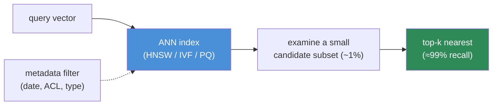
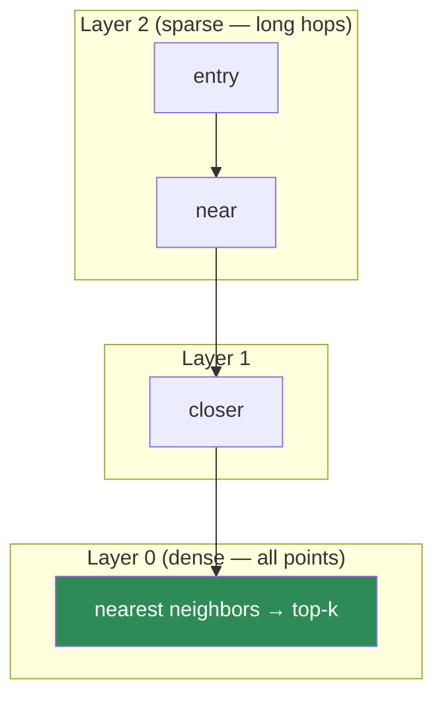
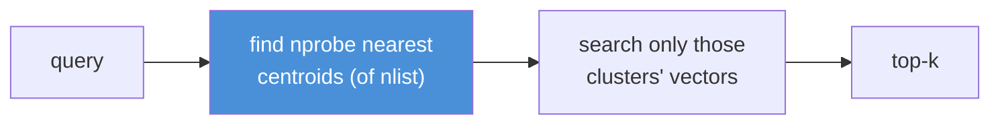
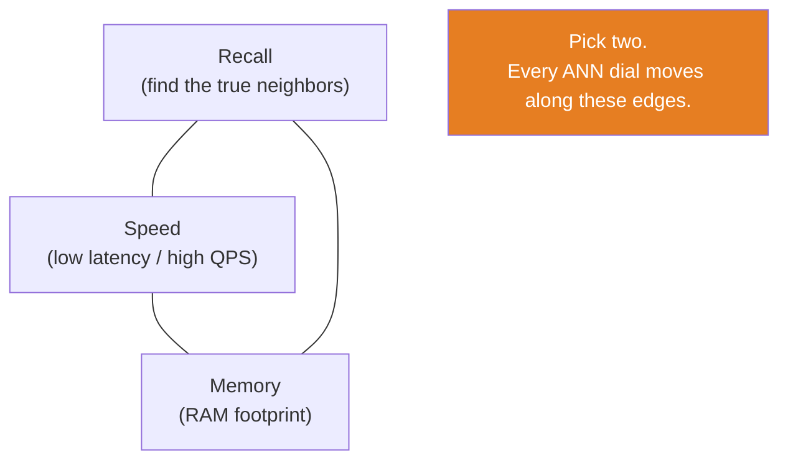

# 13.6 · Vector Databases (HNSW, IVF, PQ)

[⬅ 13.5 Embeddings & Similarity](13.5-embeddings-similarity.md) · [🏠 Module 13](../README.md) · [➡ 13.7 Retrieval](13.7-retrieval.md)

> **The lesson in one line:** A vector database stores millions of embeddings and answers "which vectors are nearest this query?" in milliseconds by **giving up exactness** — Approximate Nearest Neighbor (ANN) indexes like HNSW, IVF, and PQ trade a sliver of recall for orders-of-magnitude speed, because checking 1% of vectors that are *probably* the closest beats checking 100% exactly.

---

## 🎯 Learning objectives

- Explain what a vector database does and **why a normal database can't do it well**.
- Understand **ANN search** and the recall–speed–memory trade-off.
- Grasp **HNSW, IVF, and Product Quantization (PQ)** conceptually — how each prunes the search.
- Compare vector-DB options and pick one for a workload.

## ✅ Prerequisites

- [13.5 embeddings & similarity](13.5-embeddings-similarity.md) — cosine, the brute-force baseline.
- [05 SQL / indexing intuition](../../05-SQL/README.md) — what an index buys you.

---

## 🧠 Mental model

> [!IMPORTANT]
> **A vector database is a search engine for meaning.** You give it a query vector; it returns the *k* stored vectors closest to it — fast, at scale, with metadata filtering. The brute-force search you built in [13.5](13.5-embeddings-similarity.md) is *exact* but O(N): it compares the query to every vector. A vector DB is *approximate* but sublinear: it uses a clever **index** so it only compares against a small, promising subset. **The bet is that you can find the true nearest neighbors ~99% of the time while examining ~1% of the data** — and for retrieval, that tiny recall loss is invisible next to the massive speedup.



---

## Why not a normal database?

A relational/`B-tree` index is built for **exact and range lookups on scalar values** (`WHERE price < 100`). It has no notion of "closest point in 768-dimensional space." You *could* store vectors in a table and compute cosine to every row in SQL — but that's the brute-force O(N) scan, and it collapses at scale. And the **curse of dimensionality** breaks classic spatial indexes (k-d trees, R-trees): in high dimensions, everything is roughly equidistant and tree pruning stops working. **Vector search needs purpose-built ANN indexes.**

| Need | Relational index | Vector index (ANN) |
|---|---|---|
| Exact match / ranges | ✅ B-tree | ✗ not the job |
| "Nearest in vector space" | ✗ full scan | ✅ HNSW/IVF/PQ |
| Millions of high-dim vectors | ✗ too slow | ✅ sublinear |
| Metadata filter + vector search | partial | ✅ hybrid filtering |

---

## The three ANN families

All ANN methods do the same thing: **avoid comparing the query to every vector** by pre-organizing the space. Three dominant ideas.

### HNSW — Hierarchical Navigable Small World (graph-based)
Build a multi-layer graph where each vector links to its nearest neighbors; upper layers are sparse "express lanes," lower layers dense "local streets." Search **greedily walks the graph** toward the query: start at the top, hop to the closest neighbor, drop a layer, repeat. You reach the neighborhood of the query in a few dozen hops instead of N comparisons.



- **Pros:** excellent recall/speed; the **default** in most vector DBs; great for high-recall needs.
- **Cons:** high **memory** (stores the graph); slower/complex inserts; hard to shrink.
- **Key dials:** `M` (neighbors per node — bigger = better recall, more memory), `efConstruction` (build quality), `efSearch` (search breadth — bigger = better recall, slower).

### IVF — Inverted File Index (clustering-based)
**Cluster** all vectors into `nlist` groups (via k-means); store each vector under its nearest centroid. At query time, find the `nprobe` closest centroids and **search only those clusters** — ignoring the rest. If you probe 10 of 1000 clusters, you examine ~1% of the data.



- **Pros:** lower memory than HNSW; fast; tunable via `nprobe`.
- **Cons:** recall depends on cluster quality; a query near a cluster boundary can miss neighbors in an unprobed cluster; needs a **training** step (k-means).
- **Key dials:** `nlist` (number of clusters), `nprobe` (clusters searched — bigger = better recall, slower).

### PQ — Product Quantization (compression)
Not an index by itself but a **compression** scheme, usually combined with IVF (`IVFPQ`). Split each vector into `m` sub-vectors; replace each sub-vector with the ID of the nearest entry in a small learned codebook. A 1536-dim fp32 vector (6 KB) can shrink to a few dozen **bytes** — enabling billions of vectors in RAM and fast approximate distance via table lookups.

- **Pros:** massive **memory reduction** (10–100×); enables huge indexes.
- **Cons:** **lossy** — distances are approximate, so recall drops; often paired with a re-scoring pass on exact vectors for the final top-k.
- **Key dials:** `m` (sub-quantizers), `nbits` (codebook size per sub-vector).

---

## The universal trade-off triangle



> [!IMPORTANT]
> **Every ANN parameter trades recall against speed and/or memory — there is no free lunch.** Raise `efSearch`/`nprobe` → higher recall, slower. Use PQ → less memory, lower recall. Bigger `M` → better recall, more RAM. **Tune these against a measured recall target** (e.g., "≥95% Recall@10 at <20 ms p95") on *your* data — not by vibes. And measure **recall relative to exact brute-force**, which is your ground truth.

| Method | Strength | Weakness | Reach for it when |
|---|---|---|---|
| **HNSW** | best recall/latency | memory-hungry | default; high recall, moderate scale |
| **IVF** | low memory, fast | boundary misses; needs training | large scale, memory-limited |
| **IVFPQ** | billions in RAM | lossy, lower recall | massive scale; re-rank exactly after |
| **Flat (brute force)** | exact, no tuning | O(N) | small corpora (<~100k); ground truth |

---

## 💻 Using a vector DB (the shape is universal)

```python
# Pseudocode — every vector DB (FAISS, Qdrant, Milvus, pgvector, Pinecone, Weaviate,
# Chroma) exposes this same shape: create → upsert(vector, metadata) → search(vector, filter)
index = VectorDB(dim=768, metric="cosine", index_type="hnsw", M=32, ef_search=128)

# INDEX-TIME (offline): store normalized vectors + metadata
index.upsert([
    {"id": c.id, "vector": normalize(embed(c.text)),
     "metadata": {"source": c.source, "date": c.date, "acl": c.acl}}
    for c in chunks
])

# QUERY-TIME (online): search with a metadata pre-filter
hits = index.search(
    vector=normalize(embed(query)),
    top_k=50,
    filter={"acl": {"$in": user_roles}, "date": {"$gte": "2025-01-01"}},  # 13.7 / 13.14
)
```

**Metadata filtering is a first-class feature**, not an afterthought — it's how you scope search to a tenant, a date range, or a document type ([13.7](13.7-retrieval.md)) and enforce access control ([13.14](13.14-security.md)). Note *pre-filter* (restrict candidates before ANN — accurate but can be slow) vs *post-filter* (ANN then filter — fast but may return too few); good DBs do filtered ANN natively.

---

## Choosing a vector database

| Option | Character |
|---|---|
| **FAISS** (library) | fastest raw ANN; in-process; you manage persistence/metadata/serving |
| **pgvector** (Postgres ext) | vectors *in your existing DB*; great if you already run Postgres; simplest ops |
| **Chroma** | lightweight, local-first; great for prototyping |
| **Qdrant / Milvus / Weaviate** | production servers; filtering, sharding, replication, hybrid search |
| **Pinecone** | fully managed SaaS; no ops, per-usage cost, data leaves your boundary |

> [!IMPORTANT]
> **Decision drivers:** scale (thousands → pgvector/Chroma; billions → Milvus/IVFPQ), **do you already run Postgres** (pgvector avoids a new system), **managed vs self-hosted** (ops effort vs data residency/cost), and **hybrid/filtering needs** ([13.7](13.7-retrieval.md)). Don't add a specialized vector DB until pgvector/FAISS actually can't keep up — an extra datastore is real operational cost.

---

## 🏭 Production examples

| Scenario | Choice & config |
|---|---|
| Startup, <1M chunks, already on Postgres | **pgvector** + HNSW; one less system to run |
| 100M+ chunks, tight RAM | **IVFPQ** (Milvus/FAISS) + exact re-rank on top candidates |
| Heavy metadata filtering / multi-tenant | Qdrant/Milvus with native filtered ANN |
| Fully managed, small team | Pinecone (accept cost + data egress) |
| Prototype on a laptop | Chroma / FAISS Flat |

## ⚡ Performance considerations

- **Recall target first, then tune** `efSearch`/`nprobe` up until you hit it, then stop (further is wasted latency).
- **Quantize (PQ/int8)** to fit more vectors in RAM; **re-rank the top candidates on exact vectors** to recover recall.
- **Batch upserts** offline; **warm the index** (in memory) for low query latency.
- **Sharding/replication** for scale and availability ([13.15](13.15-production-architecture.md)).
- Storage math from [13.5](13.5-embeddings-similarity.md): PQ can turn 61 GB of fp32 vectors into <1 GB.

## 🔒 Security considerations

> [!CAUTION]
> - **The vector store holds a copy of your (possibly sensitive) corpus** — as vectors *and* usually the source text in metadata; secure it like any datastore, encrypt at rest ([13.14](13.14-security.md)).
> - **Enforce ACLs via metadata filtering at query time** — a multi-tenant index without per-tenant filters leaks across tenants ([13.14](13.14-security.md)).
> - **Managed/SaaS vector DBs export your data** — evaluate residency and data-handling terms.
> - **Post-filtering can under-return** and tempt developers to loosen filters — prefer native filtered ANN so security filters aren't bypassed for recall.

## 🚫 Common mistakes

| Mistake | Consequence |
|---|---|
| Brute force at millions of vectors | Unusable latency |
| Index metric ≠ embedding metric | Silent wrong results ([13.5](13.5-embeddings-similarity.md)) |
| Tuning ANN by feel, no recall measurement | Either slow or low-recall, unknowingly |
| Ignoring metadata filtering | Can't scope, can't enforce ACLs |
| Adding a specialized vector DB prematurely | Needless operational burden vs pgvector |
| Forgetting to re-rank after PQ | Accepting avoidable recall loss |
| Not accounting for HNSW memory | OOM at scale |

## 🐛 Debugging workflow

Recall seems low? (1) **Measure ANN recall vs FLAT brute force** on a sample — is the loss in the *index* (raise `efSearch`/`nprobe`) or upstream (embeddings/chunking)? (2) Check the **metric** matches the embedding model. (3) If using PQ, add an **exact re-rank** of top candidates. (4) If filtering, verify pre- vs post-filter isn't silently dropping the right chunks. Isolate "is retrieval finding the right vectors?" from "are the right vectors even in the index?"

## 🏋️ Exercises

1. **FLAT vs HNSW.** Index 100k vectors both ways. Measure Recall@10 (HNSW vs FLAT ground truth) and latency across `efSearch ∈ {16,64,256}`. Plot the recall–latency curve.
2. **IVF nprobe.** Build an IVF index; sweep `nprobe`; show recall rising and latency growing. Find the knee.
3. **PQ compression.** Compress with PQ; measure memory reduction and recall drop; add an exact re-rank and show recall recovers.
4. **Filtered search.** Add date/ACL metadata; run vector search with and without a filter; verify forbidden docs never return.
5. **pgvector vs FAISS.** Index the same data in both; compare setup effort, latency, and ops.

## 🛠️ Mini project — "Swap in a real index"

**Goal:** replace the in-memory matrix from [13.5](13.5-embeddings-similarity.md) with a real vector DB, preserving the same `search(query, k, filter)` interface.

**Requirements:** an adapter over one vector DB (pgvector or FAISS or Qdrant); normalized-vector upsert with metadata; filtered top-k search; a recall harness comparing ANN to FLAT ground truth; a tuning script that hits a recall target at minimum latency.

**Folder structure**
```
vector-store/
├── store.py        # adapter: upsert / search / filter
├── tune.py         # sweep efSearch/nprobe → recall vs latency
├── recall.py       # ANN vs FLAT ground truth
└── bench.py        # QPS / p95 latency
```

**Testing:** ANN Recall@10 ≥ target vs FLAT; filter never returns forbidden docs; metric matches embeddings.
**Evaluation:** recall–latency curve; memory footprint; QPS.
**Security:** ACL metadata filter enforced; encryption-at-rest noted.
**Future improvements:** sharding; quantized storage; hybrid sparse+dense ([13.7](13.7-retrieval.md)).

## 📄 Cheat sheet

| Concept | One line |
|---|---|
| **Vector DB** | store + ANN-search millions of embeddings with metadata filters |
| **Why not SQL** | B-trees do ranges, not nearest-in-vector-space; curse of dimensionality |
| **⭐ ANN** | approximate nearest neighbor — check ~1%, get ~99% recall |
| **HNSW** | navigable graph; best recall/latency; memory-hungry (default) |
| **IVF** | cluster + probe nearest clusters; low memory; boundary misses |
| **PQ** | compress vectors to bytes; huge memory savings; lossy → re-rank |
| **⭐ Trade-off** | recall ↔ speed ↔ memory — pick two; tune to a recall target |
| **Filtering** | metadata pre/post filter — scope + enforce ACLs |
| **Choose** | pgvector/Chroma (small) · Qdrant/Milvus (prod) · Pinecone (managed) |

## 🎴 Flashcards

- **What does a vector database do?** → Stores embeddings and returns the k nearest vectors to a query fast, at scale, with metadata filtering.
- **⭐ Why can't a normal SQL database do this?** → B-tree indexes do exact/range lookups, not nearest-in-high-dimensional-space; classic spatial trees break under the curse of dimensionality.
- **⭐ What is ANN and its bet?** → Approximate Nearest Neighbor — examine ~1% of vectors and still return the true neighbors ~99% of the time.
- **How does HNSW search?** → Greedily walks a multi-layer neighbor graph from sparse top layers to dense bottom, reaching the query's neighborhood in a few dozen hops.
- **How does IVF prune?** → Clusters vectors; at query time searches only the `nprobe` nearest clusters.
- **What is Product Quantization?** → Lossy compression of vectors into codebook byte-codes — huge memory savings, approximate distances, usually re-ranked exactly.
- **⭐ State the ANN trade-off.** → Recall vs speed vs memory — every dial trades among them; tune to a measured recall target.

## 💬 Interview questions

1. Why can't you use a normal relational index for vector search?
2. Explain ANN and the recall/speed/memory trade-off.
3. Contrast HNSW, IVF, and PQ — how does each avoid scanning all vectors?
4. When would you choose IVFPQ over HNSW?
5. How do you measure whether your ANN recall is good enough?
6. How does metadata filtering interact with ANN, and why does pre- vs post-filter matter?
7. When is pgvector sufficient, and when do you need a dedicated vector DB?

## 📝 Summary

- A **vector database** answers "nearest vectors to this query" in milliseconds at scale — something SQL indexes can't do (they do ranges, not high-dimensional nearest-neighbor).
- **ANN trades exactness for speed**: examine ~1% of vectors, recover ~99% of true neighbors. The three families — **HNSW** (graph), **IVF** (clusters), **PQ** (compression) — all prune the search differently.
- Every ANN dial trades **recall ↔ speed ↔ memory**; **tune to a measured recall target** vs brute-force ground truth, and **re-rank exactly after lossy PQ**.
- **Metadata filtering is first-class** — it scopes search and enforces access control ([13.14](13.14-security.md)). Start with pgvector/FAISS; add a dedicated DB only when you must.

## 📚 References

1. **Malkov & Yashunin (2016) — _HNSW_.** ⭐ The graph index behind most vector DBs.
2. **Jégou et al. (2011) — _Product Quantization for Nearest Neighbor Search_.** ⭐ PQ compression.
3. **Johnson et al. (2017) — _Billion-scale similarity search with GPUs_ (FAISS).** IVF/PQ at scale.
4. **pgvector / Qdrant / Milvus documentation.** Practical indexing and filtering.
5. **[13.5 Embeddings & Similarity](13.5-embeddings-similarity.md).** The exact baseline ANN approximates.

---

## 🧭 Navigation

| Direction | Link |
|---|---|
| ⬅ Previous | [13.5 · Embeddings & Similarity Search](13.5-embeddings-similarity.md) |
| ➡ Next | [13.7 · Retrieval — Dense, Sparse, Hybrid](13.7-retrieval.md) |
| 🏠 Module | [Module 13](../README.md) |
| 📖 Lessons | [Lesson index](README.md) |
