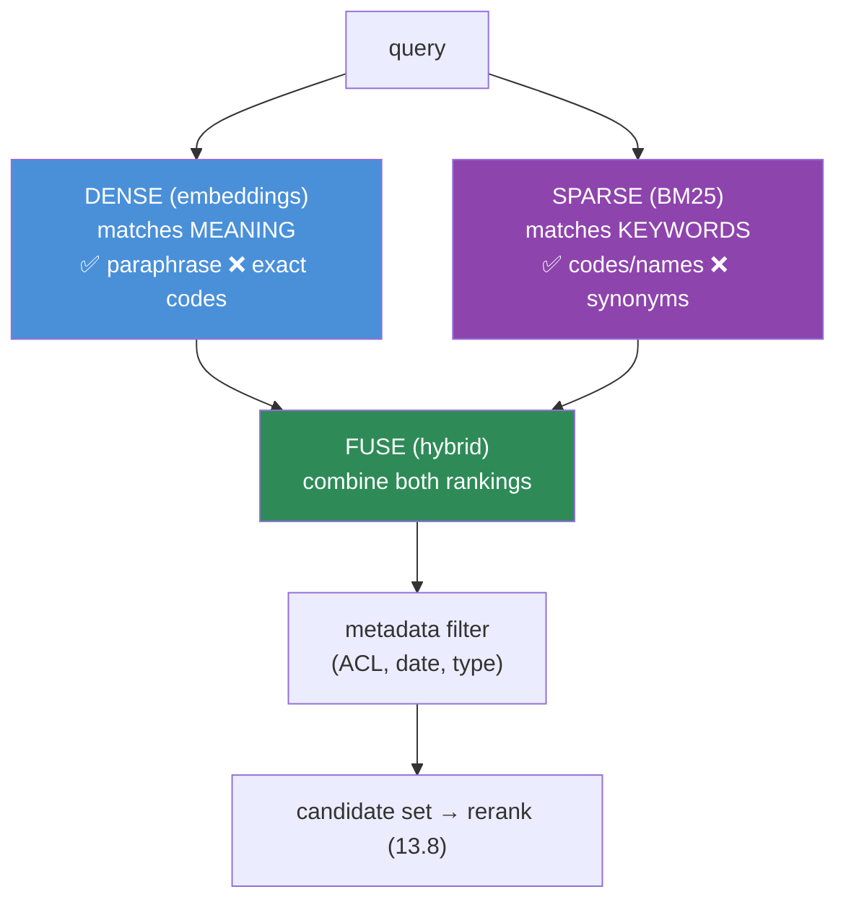
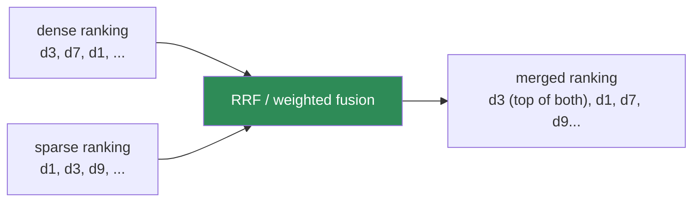
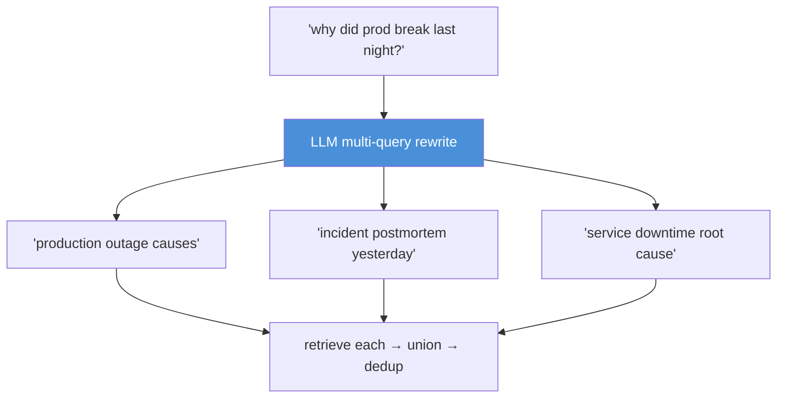
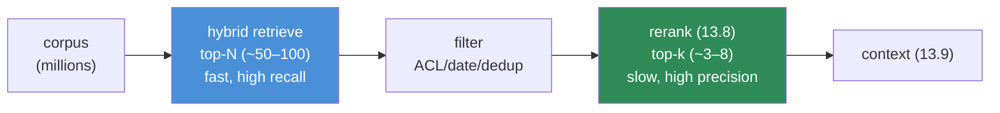

# 13.7 · Retrieval — Dense, Sparse, Hybrid ⭐

[⬅ 13.6 Vector Databases](13.6-vector-databases.md) · [🏠 Module 13](../README.md) · [➡ 13.8 Reranking](13.8-reranking.md)

> **The lesson in one line:** Dense (embedding) retrieval matches *meaning* but misses exact terms; sparse (BM25) retrieval matches *keywords* but misses paraphrases — so the best retrievers run **both and fuse the results (hybrid)**, then layer on metadata filtering, query expansion, and multi-query to catch what a single search would miss.


---

## 🎯 Learning objectives

- Distinguish **dense** vs **sparse** retrieval and their complementary failure modes.
- Understand **BM25** — how lexical scoring works and why it's still essential.
- Combine retrievers with **hybrid search** (fusion) and apply **metadata filtering**.
- Use **query expansion** and **multi-query** retrieval; know when each helps.

## ✅ Prerequisites

- [13.5 embeddings & similarity](13.5-embeddings-similarity.md), [13.6 vector databases](13.6-vector-databases.md).
- [10.3 bag-of-words / TF-IDF](../../10-NLP/weeks/10.3-text-representation.md) — the ancestor of BM25.

---

## 🧠 Mental model

> [!IMPORTANT]
> **Dense and sparse retrieval are good at opposite things, and each is blind where the other sees.** Dense embeddings capture *meaning*, so they match paraphrases with no shared words ("refund" ↔ "get my money back") — but they blur exact strings, so they fumble product codes, error numbers, rare names, and acronyms ("error `E-4021`", "the `XR-7` valve"). Sparse BM25 matches *exact terms*, so it nails those identifiers and rare keywords — but it's helpless on synonyms and rephrasings. **Hybrid retrieval runs both and merges the results, so you get semantic recall AND exact-term precision.** In practice, hybrid + reranking is the strongest, most robust setup.



---

## Dense retrieval

Embed query and chunks; return nearest by cosine ([13.5](13.5-embeddings-similarity.md)–[13.6](13.6-vector-databases.md)). Strengths and weaknesses:

| ✅ Good at | ❌ Bad at |
|---|---|
| Paraphrases, synonyms, meaning | Exact identifiers (codes, SKUs, error numbers) |
| Cross-lingual (with the right model) | Rare/out-of-vocabulary terms |
| "Fuzzy" conceptual queries | Precise keyword matches |
| Robustness to wording | Domain jargon the model never saw |

## Sparse retrieval and BM25

A **sparse** representation is a huge vector over the vocabulary, mostly zeros, with a weight per term the document actually contains. **BM25** is the dominant sparse scoring function — a refined TF-IDF ([10.3](../../10-NLP/weeks/10.3-text-representation.md)).

$$\text{BM25}(q, d) = \sum_{t \in q} \text{IDF}(t) \cdot \frac{f(t, d)\,(k_1 + 1)}{f(t, d) + k_1\left(1 - b + b\,\frac{|d|}{\text{avgdl}}\right)}$$

Intuition, term by term:
- **IDF(t)** — rare terms across the corpus count more (matching "mitochondria" is more informative than matching "the").
- **f(t, d)** — more occurrences in the document → higher score, but…
- **k₁ (saturation)** — with diminishing returns; the 10th occurrence adds little over the 3rd.
- **b · |d|/avgdl (length normalization)** — long documents don't win just by being long.

BM25 is fast, needs no training, is interpretable, and is a shockingly strong baseline — dense retrieval often *fails to beat BM25* on keyword-heavy queries.

| ✅ Good at | ❌ Bad at |
|---|---|
| Exact terms, codes, names, jargon | Synonyms, paraphrases |
| Rare/precise keywords | Conceptual "meaning" matches |
| Zero training; interpretable scores | Vocabulary mismatch (query words ≠ doc words) |

---

## Hybrid search — fuse the two

Run dense and sparse in parallel, then **fuse** their rankings. Two common fusion methods:

### Reciprocal Rank Fusion (RRF) — rank-based, robust
$$\text{RRF}(d) = \sum_{r \in \text{retrievers}} \frac{1}{k + \text{rank}_r(d)}$$

Each retriever contributes based on the *rank* it gave the document (not the raw score), with a small constant `k` (often 60). RRF is the go-to because it **needs no score normalization** — dense cosine (`[-1,1]`) and BM25 (unbounded) scores aren't comparable, but ranks always are.

### Weighted score fusion
Normalize each retriever's scores to `[0,1]` and combine: `α·dense + (1−α)·sparse`. More tunable but requires careful normalization; sensitive to score distributions.



> [!IMPORTANT]
> **Hybrid retrieval is the single most reliable quality upgrade in RAG after good chunking.** It fixes the most common production complaint — "it can't find things by their exact name/code" (a pure-dense failure) — while keeping semantic recall. Default to **hybrid (RRF) + reranking ([13.8](13.8-reranking.md))**.

---

## Metadata filtering

Restrict retrieval by structured attributes captured at ingestion ([13.3](13.3-ingestion-parsing.md)): date range, document type, department, language, and — critically — **access control**.

```python
hits = index.search(
    vector=embed(query), sparse=bm25(query), top_k=50,
    filter={
        "acl": {"$in": user.roles},        # 🔒 enforce access at retrieval (13.14)
        "date": {"$gte": "2025-01-01"},    # freshness
        "doc_type": {"$in": ["policy", "faq"]},
    },
)
```

> [!CAUTION]
> **Access-control filtering must happen at retrieval, before the LLM sees anything.** Filtering the *answer* is too late — the model already read forbidden text and may reveal it. See [13.14](13.14-security.md). Prefer **pre-filtering** (restrict the candidate set, then ANN) so security filters can't be traded away for recall.

---

## Query-side techniques

The query is often shorter and worded differently than the documents — **vocabulary mismatch**. Fix it on the query side:

| Technique | Idea | When it helps |
|---|---|---|
| **Query expansion** | add synonyms/related terms to the query before retrieval | short/ambiguous queries; sparse retrieval |
| **Multi-query** | LLM rewrites the query into several variations; retrieve for each; union results | complex or under-specified questions |
| **HyDE** (Hypothetical Document Embeddings) | LLM drafts a *hypothetical answer*, embed *that*, retrieve with it | dense retrieval when query ≠ document style |
| **Query decomposition** | break a multi-part question into sub-queries | multi-hop questions ([13.11](13.11-advanced-rag.md)) |
| **Step-back / rewrite** | generalize or clean a messy query | conversational, typo-laden queries |



> [!WARNING]
> **Query expansion and multi-query cost latency and LLM calls, and can *add noise*.** More queries → more candidates → more chances to retrieve irrelevant text. Use them where retrieval is genuinely failing (measure with [13.12](13.12-evaluation.md)), not by default. Reranking ([13.8](13.8-reranking.md)) is what cleans up the enlarged candidate set.

---

## The retrieval funnel



> [!IMPORTANT]
> **Retrieval optimizes recall; reranking optimizes precision.** Retrieve a *generous* candidate set (top-50–100) to make sure the right chunk is *somewhere* in it (recall), then let a slow, accurate reranker pick the best few (precision). Retrieving too few (top-5 straight to the LLM) is the most common cause of "the answer was in the docs but the bot didn't find it."

---

## 🏭 Production examples

| Symptom in prod | Fix |
|---|---|
| "Can't find things by product code / error number" | add **sparse/BM25** → hybrid |
| "Misses obvious paraphrases" | add/repair **dense** retrieval |
| "Right doc exists but never retrieved" | **retrieve more** (top-N up) + rerank; check chunking |
| "Returns other tenants' data" | **ACL metadata pre-filter** ([13.14](13.14-security.md)) |
| "Short queries retrieve junk" | **query expansion / HyDE** |

## ⚡ Performance considerations

- **Dense** needs the ANN index in memory; **sparse** (BM25) uses an inverted index (e.g., Elasticsearch/OpenSearch/Lucene, or `rank_bm25` for small corpora) — hybrid runs both, so budget both.
- **RRF is cheap** (just ranks); weighted fusion needs normalization.
- **Retrieve top-N generously** (recall) but keep N bounded — reranking cost grows with N ([13.8](13.8-reranking.md)).
- **Multi-query multiplies retrieval cost** by the number of rewrites plus an LLM call — cache and cap.
- **Cache** frequent query results ([13.16](13.16-performance.md)).

## 🔒 Security considerations

> [!CAUTION]
> - **Enforce ACLs at retrieval via metadata pre-filter** — never after generation ([13.14](13.14-security.md)).
> - **Query logs contain user intent and PII** — treat them as sensitive; they're also a re-identification risk.
> - **Query expansion via an LLM sends the user query to a model** — mind data flow; a crafted query could try to manipulate the rewriter (prompt injection on the query path).
> - **Multi-tenant BM25/dense indexes must be partitioned or filtered** so cross-tenant terms don't leak.

## 🚫 Common mistakes

| Mistake | Consequence |
|---|---|
| Dense-only retrieval | Fails on codes, names, rare terms |
| Sparse-only retrieval | Fails on synonyms/paraphrases |
| Retrieving too few candidates (top-5 → LLM) | Right chunk never makes the cut |
| Weighted fusion without score normalization | One retriever dominates arbitrarily |
| Query expansion by default | Added noise, latency, cost |
| ACL filter after generation | Data leak — model already saw it |
| No dedup of near-duplicate chunks | Redundant context, wasted window |

## 🐛 Debugging workflow

"The answer was in the docs but the bot missed it": (1) **Is the chunk in the top-N?** Print the raw retrieved candidates (before rerank). If absent → retrieval problem: try **hybrid** (add BM25 for exact terms), **raise top-N**, or fix **chunking**/embeddings. (2) If present but ranked low → a **reranking** job ([13.8](13.8-reranking.md)). (3) If the query wording is the issue → **expansion/HyDE**. Always inspect candidates *with scores* — dense and sparse separately — to see which retriever found it.

## 🏋️ Exercises

1. **Complementary failures.** Build a query set: half paraphrase-heavy, half code/name-heavy. Show dense wins the first, BM25 wins the second, hybrid wins both.
2. **Implement RRF.** Fuse a dense and a BM25 ranking with RRF. Compare Recall@10 to each alone.
3. **BM25 by hand.** Implement BM25 scoring; verify IDF down-weights common terms and length normalization prevents long-doc bias.
4. **Top-N sweep.** Measure Recall@N for N ∈ {5,10,20,50,100}. Show recall rises with N (motivating generous retrieval + rerank).
5. **Multi-query.** Add LLM multi-query rewriting; measure recall gain vs added latency/noise on hard queries.
6. **Filtered retrieval.** Add ACL metadata; prove forbidden docs never appear regardless of similarity.

## 🛠️ Mini project — "Hybrid search system"

**Goal:** a retriever combining dense + BM25 with RRF fusion, metadata filtering, and optional query expansion.

**Requirements:** dense index ([13.6](13.6-vector-databases.md)) + BM25 index; RRF and weighted fusion (configurable); metadata pre-filtering incl. ACL; optional multi-query/HyDE; an eval harness (Recall@k, MRR) comparing dense / sparse / hybrid.

**Folder structure**
```
hybrid-search/
├── dense.py        # embedding retrieval
├── sparse.py       # BM25
├── fuse.py         # RRF + weighted
├── expand.py       # multi-query / HyDE (optional)
├── filter.py       # metadata + ACL
└── eval.py         # dense vs sparse vs hybrid
```

**Testing:** hybrid ≥ max(dense, sparse) on a mixed query set; ACL filter airtight; RRF needs no score normalization.
**Evaluation:** Recall@10 and MRR per method; per-query-type breakdown.
**Security:** ACL pre-filter; partitioned tenant indexes.
**Monitoring:** log which retriever contributed each final hit.
**Future improvements:** learned sparse (SPLADE); reranking ([13.8](13.8-reranking.md)); cross-tenant isolation tests.

## 📄 Cheat sheet

| Concept | One line |
|---|---|
| **⭐ Dense** | embeddings; matches meaning; ❌ exact codes |
| **⭐ Sparse / BM25** | keyword scoring (refined TF-IDF); matches exact terms; ❌ synonyms |
| **BM25 parts** | IDF (rare=important) · TF saturation (k₁) · length norm (b) |
| **⭐ Hybrid** | run both + **fuse (RRF)** → semantic recall + exact precision |
| **RRF** | fuse by rank (`1/(k+rank)`) — no score normalization needed |
| **Metadata filter** | scope by date/type/**ACL** — enforce access at retrieval |
| **Query expansion / multi-query / HyDE** | fix vocabulary mismatch (costs latency/noise) |
| **⭐ Funnel** | retrieve top-N (recall) → filter → rerank top-k (precision) |

## 🎴 Flashcards

- **⭐ Dense vs sparse retrieval?** → Dense (embeddings) matches meaning/paraphrases but misses exact codes; sparse (BM25) matches exact terms but misses synonyms.
- **What is BM25?** → A refined TF-IDF: IDF weights rare terms, term frequency saturates (k₁), and long documents are length-normalized (b).
- **⭐ What is hybrid search and why use it?** → Run dense + sparse and fuse their rankings — you get semantic recall AND exact-term precision; the most reliable upgrade after good chunking.
- **What is RRF and why is it popular?** → Reciprocal Rank Fusion combines retrievers by rank (`1/(k+rank)`), needing no score normalization across incomparable scoring scales.
- **⭐ Retrieval vs reranking — which optimizes what?** → Retrieval optimizes recall (get the right chunk into a generous top-N); reranking optimizes precision (pick the best few).
- **When do you use multi-query/HyDE?** → When retrieval fails on short/mismatched queries — at the cost of latency, LLM calls, and added noise.
- **Where must ACL filtering happen?** → At retrieval (pre-filter), before the LLM sees any text — never after generation.

## 💬 Interview questions

1. Contrast dense and sparse retrieval. Give a query each one fails and the other handles.
2. Explain BM25 term by term. Why is it still a strong baseline?
3. What is hybrid search? Explain RRF and why it avoids score normalization.
4. Why retrieve a large candidate set and then rerank, instead of retrieving the final few directly?
5. When do query expansion, multi-query, and HyDE help — and what do they cost?
6. Where and why do you enforce access control in retrieval?

## 📝 Summary

- **Dense** retrieval matches meaning (great on paraphrases, weak on exact terms); **sparse/BM25** matches keywords (great on codes/names, weak on synonyms) — complementary failure modes.
- **Hybrid search fuses both** (RRF is the robust default, fusing by rank) and is the most reliable RAG upgrade after good chunking.
- **Metadata filtering** scopes search and **enforces access control at retrieval time**; **query expansion / multi-query / HyDE** fix vocabulary mismatch at a cost.
- The **funnel**: retrieve a generous top-N (recall) → filter → **rerank** to the best few (precision, [13.8](13.8-reranking.md)).

## 📚 References

1. **Robertson & Zaragoza (2009) — _The Probabilistic Relevance Framework: BM25 and Beyond_.** ⭐ BM25.
2. **Cormack et al. (2009) — _Reciprocal Rank Fusion_.** ⭐ The fusion method.
3. **Gao et al. (2022) — _HyDE: Precise Zero-Shot Dense Retrieval_.** Query-side generation.
4. **Formal et al. (2021) — _SPLADE_.** Learned sparse retrieval.
5. **[10.3 Vectorization](../../10-NLP/weeks/10.3-text-representation.md).** TF-IDF, the ancestor of BM25.

---

## 🧭 Navigation

| Direction | Link |
|---|---|
| ⬅ Previous | [13.6 · Vector Databases](13.6-vector-databases.md) |
| ➡ Next | [13.8 · Reranking](13.8-reranking.md) |
| 🏠 Module | [Module 13](../README.md) |
| 📖 Lessons | [Lesson index](README.md) |
