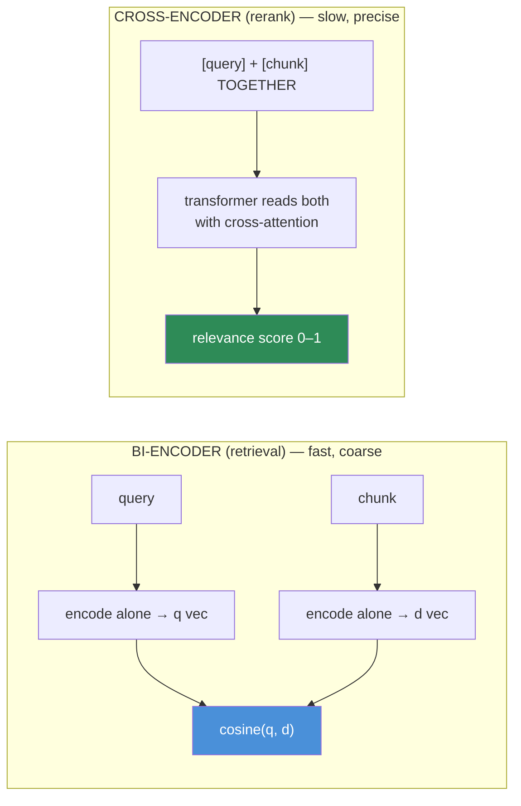
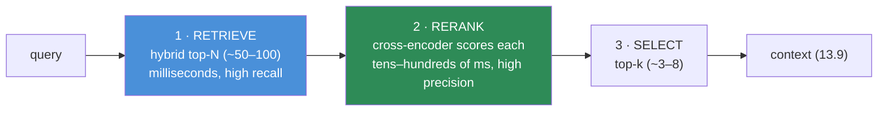

# 13.8 · Reranking

[⬅ 13.7 Retrieval](13.7-retrieval.md) · [🏠 Module 13](../README.md) · [➡ 13.9 Context Construction](13.9-context-construction.md)

> **The lesson in one line:** First-stage retrieval is fast but coarse — it scores query and chunk *independently*, so "similar" often isn't "relevant"; a **reranker** (a cross-encoder that reads the query and chunk *together*) re-scores the top candidates with far higher precision, so the few chunks that actually reach the LLM are the right ones.

---

## 🎯 Learning objectives

- Explain why first-stage retrieval is insufficient for final relevance.
- Understand **bi-encoders vs cross-encoders** and why cross-encoders are more accurate but slower.
- Place reranking in the pipeline: **retrieve many → rerank → keep few**.
- Reason about the precision/latency trade-off of reranking.

## ✅ Prerequisites

- [13.7 retrieval](13.7-retrieval.md) — the candidate set a reranker refines.
- [11.4 attention / cross-attention](../../11-LLMs/weeks/11.4-attention.md), [11.7 encoders](../../11-LLMs/weeks/11.7-encoder-decoder-types.md).

---

## 🧠 Mental model

> [!IMPORTANT]
> **Retrieval and reranking are two different questions.** Retrieval asks, cheaply and at scale, *"which chunks are roughly in the neighborhood?"* — it embeds the query and each chunk **separately** and compares vectors, so it never actually reads them *against each other*. Reranking asks the expensive, precise question *"given THIS query, how relevant is THIS specific chunk?"* — a **cross-encoder** feeds the query and chunk into a transformer **together**, letting attention compare every query word to every chunk word. That joint reading catches relevance that cosine similarity misses. You can't afford to run it on millions of chunks — so you run it on the ~50 that retrieval already narrowed to.



---

## Why first-stage retrieval isn't enough

Retrieval scores are a **proxy** for relevance, computed for speed:

- **Independent encoding.** A bi-encoder must compress a whole chunk into one vector *before* it ever sees the query. Nuances that matter only for *this* query are averaged away ([13.4 blurred embeddings](13.4-chunking.md)).
- **Similar ≠ relevant.** A chunk can be topically close (high cosine) yet not answer the question — same subject, wrong detail. It can even be the *opposite* of the answer (negation is hard for embeddings).
- **The top-1 is often not the best.** The right chunk is frequently in the retrieved top-20 but not ranked first — retrieval gets it *into the set*, reranking floats it *to the top*.

> [!IMPORTANT]
> **Retrieval maximizes recall; reranking maximizes precision.** The division of labor: cast a wide, cheap net (retrieve top-50–100 so the right chunk is *somewhere* in there), then apply an expensive, accurate filter (rerank down to the top-3–8 that go to the LLM). Neither replaces the other — **retrieval finds candidates, reranking orders them.**

---

## Cross-encoders and rerankers

A **cross-encoder reranker** takes `(query, chunk)` as a single joint input and outputs a scalar relevance score. Because query and chunk attend to each other, it models fine-grained relevance — at the cost of one forward pass **per candidate** (you can't precompute chunk vectors; the score depends on the query).

```python
from sentence_transformers import CrossEncoder

reranker = CrossEncoder("cross-encoder/ms-marco-MiniLM-L-6-v2")  # or a hosted reranker

def rerank(query, candidates, top_k=5):
    pairs = [(query, c.text) for c in candidates]     # each pair scored jointly
    scores = reranker.predict(pairs)                  # one forward pass per pair
    ranked = sorted(zip(candidates, scores), key=lambda x: -x[1])
    return [c for c, _ in ranked[:top_k]]
```

| Reranker type | Notes |
|---|---|
| **Cross-encoder (open)** | e.g., MS-MARCO MiniLM, BGE-reranker; run locally on GPU/CPU |
| **Hosted rerank APIs** | Cohere Rerank, Voyage rerank — no infra, per-call cost, data egress |
| **LLM-as-reranker** | prompt an LLM to score/order candidates — flexible, slower, pricier |
| **ColBERT (late interaction)** | token-level match; a middle ground between bi- and cross-encoders |

---

## The two-stage pipeline



> [!IMPORTANT]
> **Query → Retrieve Candidates → Rerank → Select Context.** This two-stage retrieve-then-rerank pattern is the backbone of high-quality RAG. It's how you get both scale (retrieval touches millions) and precision (reranking reads dozens carefully). **Adding a reranker is often the single biggest quality jump** for a system that already has decent retrieval — it directly fixes "relevant chunk was retrieved but ranked too low to make the cut."

---

## The precision/latency trade-off

| Dial | Effect |
|---|---|
| **N (candidates reranked)** | more N → higher recall into the reranker, but linear latency/cost (a pass per candidate) |
| **k (kept after rerank)** | more k → more context (risk: noise, lost-in-the-middle [13.9](13.9-context-construction.md)); fewer k → tighter, cheaper prompt |
| **Reranker size** | bigger → more accurate, slower |

Typical: retrieve **N≈50–100**, rerank, keep **k≈3–8**. Reranking adds **tens to a few hundred milliseconds** — usually worth it, but it's on the online critical path, so cap N and consider batching/caching ([13.16](13.16-performance.md)).

---

## 🏭 Production examples

| Situation | Reranking choice |
|---|---|
| High-stakes QA (legal/medical) | strong cross-encoder or hosted reranker; small k; precision over latency |
| High-QPS chat | lighter reranker, N capped, cache repeated queries |
| No infra to host models | hosted rerank API (accept egress + cost) |
| Complex relevance criteria | LLM-as-reranker with a rubric prompt |
| Latency-critical | skip rerank or use ColBERT; rely on strong hybrid retrieval |

## ⚡ Performance considerations

- Reranking is **O(N) transformer passes** per query — the cost scales with how many candidates you rerank, so **cap N**.
- **Batch** the (query, chunk) pairs through the reranker in one call; use GPU when available.
- **Cache** rerank scores for repeated (query, chunk) pairs; cache whole results for hot queries ([13.16](13.16-performance.md)).
- Reranking lets you use a **cheaper first-stage** (smaller embedding model, looser ANN) because it cleans up afterward — a net cost win sometimes.

## 🔒 Security considerations

> [!CAUTION]
> - **Rerank only what passed ACL filtering** ([13.7](13.7-retrieval.md), [13.14](13.14-security.md)) — never rerank forbidden chunks "just to score them"; the reranker (and any hosted API) then processes data the user can't see.
> - **Hosted rerankers export query + candidate text** — the same data-flow concern as hosted embeddings.
> - **Retrieved chunk text is still untrusted** — a reranker scores relevance, not safety; injection payloads pass through unchanged ([13.14](13.14-security.md)).

## 🚫 Common mistakes

| Mistake | Consequence |
|---|---|
| No reranking (retrieval order → LLM) | Relevant-but-low-ranked chunks never used |
| Reranking too few candidates (small N) | Reranker can't fix what retrieval didn't surface |
| Keeping too many after rerank (large k) | Noise + lost-in-the-middle ([13.9](13.9-context-construction.md)) |
| Reranking millions of chunks | Impossibly slow — rerank the retrieved subset only |
| Reranking before ACL filtering | Processes/leaks forbidden content |
| Assuming reranker fixes bad chunks | Garbage chunks ([13.4](13.4-chunking.md)) can't be reranked into good ones |

## 🐛 Debugging workflow

Chunk retrieved but answer still wrong? (1) **Print candidates with both retrieval and rerank scores.** Did the right chunk make the top-N (retrieval OK) but get ranked low by the reranker? Try a stronger reranker or check the chunk is self-contained ([13.4](13.4-chunking.md)). (2) Did it not make top-N at all? That's a **retrieval** problem ([13.7](13.7-retrieval.md)), not reranking — increase N or add hybrid. (3) Is k too small, cutting the right chunk? Compare answers at k=3 vs k=8.

## 🏋️ Exercises

1. **Rerank lift.** On a labeled set, measure MRR/NDCG@5 with retrieval-only vs retrieve-then-rerank. Quantify the jump.
2. **Bi vs cross.** Take 5 (query, chunk) pairs where cosine ranks a wrong chunk first; show a cross-encoder reorders them correctly.
3. **N sweep.** Fix k=5; vary reranked N ∈ {10,25,50,100}. Plot quality vs latency; find the knee.
4. **k sweep.** Fix N=50; vary kept k ∈ {1,3,5,10}; measure answer faithfulness ([13.12](13.12-evaluation.md)) — show too-large k hurts.
5. **LLM reranker.** Prompt an LLM to rank candidates with a rubric; compare to a cross-encoder on quality and cost.

## 🛠️ Mini project — "Reranking pipeline"

**Goal:** a two-stage retrieve→rerank service with measurable precision gains.

**Requirements:** hybrid retrieval ([13.7](13.7-retrieval.md)) → cross-encoder reranker (open or hosted, pluggable) → top-k selection; batched scoring; caching; an eval harness (MRR, NDCG@k) comparing retrieval-only vs reranked, and a latency report.

**Folder structure**
```
reranking/
├── retrieve.py     # hybrid top-N
├── rerank.py       # cross-encoder (pluggable backend)
├── select.py       # top-k + dedup
├── cache.py        # (query,chunk) score cache
└── eval.py         # MRR/NDCG: retrieval-only vs reranked
```

**Testing:** reranked NDCG@5 > retrieval-only; ACL filter runs before rerank; caching returns identical scores.
**Evaluation:** MRR/NDCG uplift; p95 latency added by reranking.
**Security:** rerank only ACL-passed candidates; note hosted-API egress.
**Monitoring:** track rerank latency and score distribution.
**Future improvements:** ColBERT late interaction; LLM reranker for hard queries; adaptive N.

## 📄 Cheat sheet

| Concept | One line |
|---|---|
| **Why rerank** | retrieval scores query & chunk separately → "similar" ≠ "relevant" |
| **Bi-encoder** | encode query & chunk alone → cosine (fast, coarse, scalable) |
| **⭐ Cross-encoder** | read query + chunk together with attention → precise relevance (slow) |
| **⭐ Two-stage** | retrieve top-N (recall) → rerank → keep top-k (precision) |
| **Cost** | one transformer pass per candidate → cap N |
| **Typical** | N≈50–100 retrieved, k≈3–8 kept |
| **Biggest win** | adding a reranker to decent retrieval |
| **Doesn't fix** | bad chunks or missing recall — rerank only what's retrieved |

## 🎴 Flashcards

- **⭐ Why isn't first-stage retrieval enough?** → It encodes query and chunk independently, so it measures similarity, not query-specific relevance — the best chunk is often retrieved but not ranked first.
- **⭐ Bi-encoder vs cross-encoder?** → Bi-encoder encodes query and chunk separately then compares vectors (fast, scalable); cross-encoder reads them together with attention (precise, one pass per candidate, slow).
- **Where does reranking sit?** → Between retrieval and context construction: retrieve top-N → rerank → keep top-k.
- **Retrieval vs reranking objective?** → Retrieval maximizes recall (get the right chunk into the set); reranking maximizes precision (order it to the top).
- **Why not rerank the whole corpus?** → A cross-encoder needs a forward pass per candidate — feasible for dozens, impossible for millions.
- **Can reranking fix bad chunks or missing recall?** → No — it can only reorder what retrieval already surfaced; fix chunking/retrieval upstream.

## 💬 Interview questions

1. Why is a reranking stage needed if retrieval already returns scored results?
2. Explain the difference between a bi-encoder and a cross-encoder, and the resulting cost/accuracy trade-off.
3. Describe the retrieve→rerank→select pipeline and typical N and k values.
4. Why can't you run a cross-encoder over the whole corpus?
5. How do N and k affect quality, latency, and the lost-in-the-middle risk?
6. Where does reranking sit relative to ACL filtering, and why?

## 📝 Summary

- First-stage retrieval scores query and chunk **independently**, so it captures similarity, not query-specific relevance — the right chunk is often retrieved but under-ranked.
- A **cross-encoder reranker reads query and chunk together**, producing precise relevance scores — accurate but one forward pass per candidate, so it runs only on the retrieved subset.
- The backbone pattern is **retrieve top-N (recall) → rerank → keep top-k (precision)**; adding a reranker is often the biggest single quality jump for a system with decent retrieval.
- Reranking **can't fix bad chunks or missing recall** — it only reorders what retrieval surfaced.

## 📚 References

1. **Nogueira & Cho (2019) — _Passage Re-ranking with BERT_.** ⭐ Cross-encoder reranking.
2. **Khattab & Zaharia (2020) — _ColBERT_.** Late-interaction middle ground.
3. **Cohere / Voyage reranker documentation.** Hosted rerankers in practice.
4. **[13.7 Retrieval](13.7-retrieval.md).** The candidate set reranking refines.

---

## 🧭 Navigation

| Direction | Link |
|---|---|
| ⬅ Previous | [13.7 · Retrieval — Dense, Sparse, Hybrid](13.7-retrieval.md) |
| ➡ Next | [13.9 · Context Construction](13.9-context-construction.md) |
| 🏠 Module | [Module 13](../README.md) |
| 📖 Lessons | [Lesson index](README.md) |
