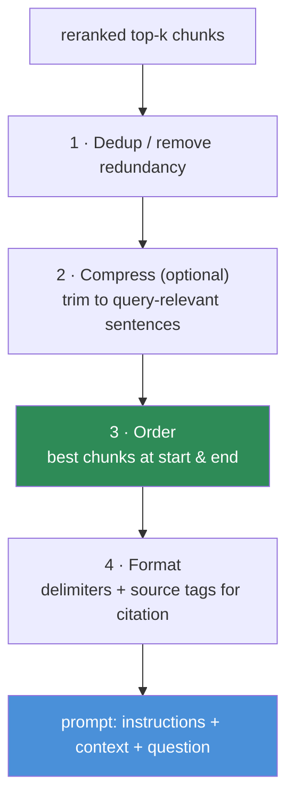
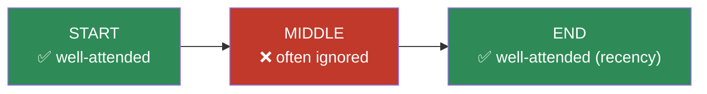
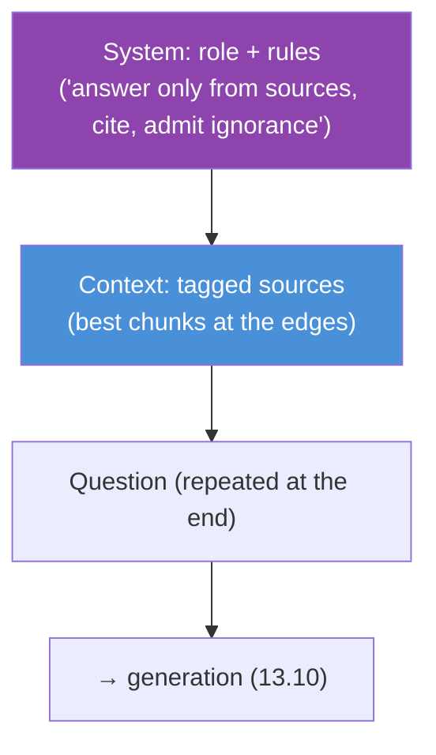

# 13.9 · Context Construction

[⬅ 13.8 Reranking](13.8-reranking.md) · [🏠 Module 13](../README.md) · [➡ 13.10 Generation](13.10-generation.md)

> **The lesson in one line:** Retrieval found the right chunks — now you must assemble them into a prompt the LLM will actually use well, which means fighting three enemies: the **context window limit**, the **lost-in-the-middle** effect (models attend most to the start and end, least to the middle), and **redundancy** that wastes space and confuses the model.

---

## 🎯 Learning objectives

- Understand the **context window** as a scarce, non-uniform resource.
- Order chunks to counter **lost-in-the-middle**.
- Apply **compression, redundancy removal, and deduplication** to fit and sharpen context.
- Format retrieved chunks into a prompt that supports **grounding and citation**.

## ✅ Prerequisites

- [13.8 reranking](13.8-reranking.md) — the ranked top-k this stage assembles.
- [11.15 KV cache / context length](../../11-LLMs/weeks/11.15-kv-cache.md), [11.3 positional encoding](../../11-LLMs/weeks/11.3-embeddings-positional.md).

---

## 🧠 Mental model

> [!IMPORTANT]
> **A big context window is not a bucket you dump chunks into — it's a stage, and where you place each chunk changes whether the model reads it.** Two hard facts govern this stage: (1) the window is **finite and costly** (every token is latency and money, [13.16](13.16-performance.md)), and (2) attention is **not uniform** — LLMs reliably use information at the **beginning and end** of the context and often **ignore the middle** (the "lost-in-the-middle" effect). So context construction is deliberate: **put the best chunks where the model looks, cut redundancy, compress the rest, and format for citation.** More context is not better context.



---

## The context window is scarce and non-uniform

Even with large windows, you face a budget: system prompt + instructions + **retrieved context** + question + room for the answer. Overfill and you get truncation, higher latency, higher cost, and — counterintuitively — **worse accuracy**.

> [!WARNING]
> **Stuffing more chunks in usually *lowers* answer quality.** Each extra chunk adds distractors the model must ignore, dilutes attention, and pushes the good chunk toward the ignored middle. This is why reranking to a **small k** ([13.8](13.8-reranking.md)) matters, and why "just use a 200k-token window and retrieve 100 chunks" performs worse than 5 well-chosen chunks. Precision beats volume.

---

## Lost-in-the-middle


> 🖼️ **Image placeholder — Lost-in-the-middle accuracy curve.** A line chart of answer accuracy (y) vs the position of the relevant passage within the context window (x), reproducing the characteristic U-shape: high at the start and end, dipping in the middle.
> _Suggested asset:_ `diagrams/lost-in-the-middle-curve.png` _(a real illustration to add; the Mermaid/SVG diagrams above cover the schematic view)._

Empirically, LLM accuracy on a fact is **highest when it sits at the start or end** of the context and **lowest in the middle** — a U-shaped curve. The mechanism ties to how attention and positional encoding treat long sequences ([11.3](../../11-LLMs/weeks/11.3-embeddings-positional.md), [11.15](../../11-LLMs/weeks/11.15-kv-cache.md)).



**Countermeasures:**
- **Order by relevance to the edges.** Put the most relevant chunk first (or last), the least relevant in the middle. A common pattern places the top chunk at the **end** (nearest the question) since many models weight recency.
- **Keep k small** so there is no "deep middle" to get lost in.
- **Put the question both before and after** the context for long contexts, so the model sees the task on both sides.

---

## Compression and redundancy removal

| Technique | What it does |
|---|---|
| **Deduplication** | drop near-identical chunks (common with overlap [13.4](13.4-chunking.md) or multi-query [13.7](13.7-retrieval.md)) |
| **Extractive compression** | keep only the query-relevant sentences of each chunk (e.g., sentence-level scoring) |
| **Abstractive compression** | an LLM summarizes chunks toward the query before the main call (costs an extra call) |
| **Contextual pruning** | remove boilerplate/headers that survived chunking |
| **Diversity (MMR)** | Maximal Marginal Relevance — pick chunks that are relevant *and* non-redundant, covering more of the answer |

> [!IMPORTANT]
> **Deduplication is mandatory, not optional.** Overlapping chunks and multi-query unions routinely surface the *same passage* two or three times. Duplicates waste the window, bias the model toward the repeated claim, and crowd out other evidence. Dedup near-duplicates (by hash, high cosine, or overlap) *before* building the prompt.

---

## 💻 Building the context

```python
def build_context(query, ranked_chunks, max_tokens=2000):
    chunks = dedup(ranked_chunks)                 # remove near-duplicates
    chunks = [compress(query, c) for c in chunks] # optional: keep relevant sentences
    chunks = fit_budget(chunks, max_tokens)       # greedily fit best chunks in budget

    # Order to beat lost-in-the-middle: strongest chunk LAST (nearest the question).
    ordered = order_for_attention(chunks)         # e.g., relevance ascending → best at end

    blocks = []
    for i, c in enumerate(ordered, 1):
        # Tag each block so the model can CITE it (13.10) and we can trace it (13.13).
        blocks.append(f"[Source {i} | {c.source} p.{c.page}]\n{c.text}")
    context = "\n\n---\n\n".join(blocks)

    return (
        "Answer ONLY using the sources below. Cite sources as [Source N]. "
        "If the answer isn't in the sources, say you don't know.\n\n"
        f"=== SOURCES ===\n{context}\n=== END SOURCES ===\n\n"
        f"Question: {query}"
    )
```

**Formatting choices carry weight:** clear delimiters (`=== SOURCES ===`, `---`) separate context from instructions and from each other (reducing injection blur, [13.14](13.14-security.md)); per-source tags enable **citation** ([13.10](13.10-generation.md)) and **tracing** ([13.13](13.13-debugging.md)); explicit "answer only from sources / say 'I don't know'" instructions curb hallucination.

---

## The order of the prompt



Typical high-quality layout: **instructions/rules first**, **sources in the middle** (ordered for attention), **question last** (recency, right before the answer). For very long contexts, restate the question after the sources too.

---

## 🏭 Production examples

| Concern | Construction tactic |
|---|---|
| Long-context QA with many hits | small k + dedup + best-at-end ordering |
| Answers must cite | per-source tags + "cite [Source N]" instruction |
| Token budget/cost pressure | extractive compression; MMR for coverage |
| Multi-turn chat | budget shared between history and retrieved context; summarize old turns |
| Conflicting sources | keep both, tag with dates, instruct the model to prefer recent/authoritative |

## ⚡ Performance considerations

- **Fewer, tighter tokens = lower latency and cost** ([13.16](13.16-performance.md)) — compression pays off directly on the online path.
- **Abstractive compression adds an LLM call** — only worth it when context is large and reused, or when quality demands it.
- **Stable prompt prefixes** (fixed system/instructions) enable **prefix/prompt caching** ([11.15](../../11-LLMs/weeks/11.15-kv-cache.md), [13.16](13.16-performance.md)) — keep the volatile part (sources) after the stable part.

## 🔒 Security considerations

> [!CAUTION]
> - **Retrieved text is untrusted data, not instructions.** Delimit it clearly and instruct the model to treat everything between the source markers as *reference material only* — a defense against **prompt injection through documents** ([13.14](13.14-security.md)). Delimiters help but are **not** a complete defense.
> - **Compression via an LLM sends retrieved (possibly sensitive) text to a model** — mind data flow.
> - **Source tags may reveal metadata** (file paths, internal doc names) to the user via citations — decide what's safe to expose.

## 🚫 Common mistakes

| Mistake | Consequence |
|---|---|
| Dumping all retrieved chunks in | Distractors, dilution, lost-in-the-middle, cost |
| No deduplication | Repeated passages waste window and bias the model |
| Best chunk buried in the middle | Model ignores it → wrong/incomplete answer |
| No delimiters between context and instructions | Injection blur; model confuses data with commands |
| No source tags | Can't cite or trace ([13.10](13.10-generation.md), [13.13](13.13-debugging.md)) |
| Volatile content before stable prefix | Breaks prompt caching |

## 🐛 Debugging workflow

Right chunks retrieved but answer still wrong/incomplete? (1) **Print the final assembled context** — is the answer's chunk actually in it (or did it get cut by the token budget)? (2) **Where is it positioned** — buried in the middle? Move it to an edge and retest. (3) **Duplicates crowding it out?** Dedup. (4) **Are delimiters/instructions clear**, or is the model treating a source as an instruction? This stage is where "good retrieval, bad answer" bugs frequently hide — read the exact string sent to the model.

## 🏋️ Exercises

1. **Lost-in-the-middle demo.** Place the answer chunk at position 1, middle, and last among 10 chunks. Measure answer accuracy at each position; reproduce the U-curve.
2. **Volume hurts.** Answer the same question with k=3 vs k=20 (same top-3 included). Show faithfulness drops as noise grows.
3. **Dedup impact.** Feed context with and without duplicate chunks; observe bias/quality changes.
4. **Compression.** Extractively compress each chunk to its query-relevant sentences; measure token savings vs quality.
5. **MMR.** Implement Maximal Marginal Relevance selection; show it covers a multi-part answer better than pure top-k.

## 🛠️ Mini project — "Context builder"

**Goal:** a context-construction module that dedups, compresses, orders, and formats reranked chunks within a token budget.

**Requirements:** dedup (hash/cosine/overlap); optional extractive compression; token-budget fitting; attention-aware ordering (best at edges); MMR option; source-tagged formatting with clear delimiters and citation instructions.

**Folder structure**
```
context-builder/
├── dedup.py        # near-duplicate removal
├── compress.py     # extractive / abstractive
├── order.py        # attention-aware ordering, MMR
├── budget.py       # token fitting
└── format.py       # delimiters + source tags + instructions
```

**Testing:** context ≤ budget; no duplicates; best chunk at an edge; delimiters/tags present.
**Evaluation:** answer faithfulness ([13.12](13.12-evaluation.md)) vs naive concatenation; token savings from compression/dedup.
**Security:** source text delimited as untrusted; decide exposed metadata.
**Future improvements:** learned compression; dynamic budget per query; conflict-aware ordering by recency.

## 📄 Cheat sheet

| Concept | One line |
|---|---|
| **Context window** | finite, costly budget: instructions + sources + question + answer room |
| **⭐ Lost-in-the-middle** | models use start & end, ignore the middle (U-curve) |
| **Ordering** | best chunks at the edges; strongest often **last** (recency) |
| **⭐ More ≠ better** | extra chunks add distractors → lower accuracy |
| **Dedup** | mandatory — overlap/multi-query create duplicates |
| **Compression** | extractive (keep relevant sentences) or abstractive (LLM summary) |
| **MMR** | relevant **and** diverse → better coverage |
| **Format** | delimiters + source tags → citation, tracing, injection defense |

## 🎴 Flashcards

- **⭐ What is lost-in-the-middle?** → LLMs use information at the start and end of context reliably but often ignore the middle — a U-shaped accuracy curve.
- **How do you counter it?** → Keep k small and put the most relevant chunks at the edges (often the strongest last, nearest the question).
- **⭐ Why is more context often worse?** → Extra chunks add distractors, dilute attention, and push good chunks into the ignored middle; precision beats volume.
- **Why is deduplication mandatory?** → Overlap and multi-query surface the same passage repeatedly, wasting the window and biasing the model.
- **What does source tagging enable?** → Citation, tracing/debugging, and clearer separation of untrusted data from instructions.
- **Why keep a stable prompt prefix?** → It enables prompt/prefix caching; put the volatile sources after the fixed instructions.

## 💬 Interview questions

1. Why isn't a larger context window a substitute for good context construction?
2. Explain lost-in-the-middle and how you mitigate it.
3. Why does adding more retrieved chunks often reduce answer quality?
4. What compression and dedup techniques do you apply, and what do they cost?
5. How do you format context to support citation and defend against document-borne injection?
6. How does prompt ordering interact with prompt caching?

## 📝 Summary

- The context window is a **finite, costly, non-uniform** resource — every token costs latency/money, and attention favors the **edges over the middle** (lost-in-the-middle).
- **More context is not better**: extra chunks add distractors and dilute attention, so **rerank to a small k**, **dedup**, and optionally **compress**.
- **Order for attention** (best chunks at the edges, often strongest last) and **format with delimiters + source tags** to enable citation, tracing, and injection defense.
- This stage is a frequent home for "good retrieval, bad answer" bugs — **read the exact string sent to the model.**

## 📚 References

1. **Liu et al. (2023) — _Lost in the Middle: How Language Models Use Long Contexts_.** ⭐ The U-curve.
2. **Carbonell & Goldstein (1998) — _Maximal Marginal Relevance_.** Relevance + diversity.
3. **Jiang et al. (2023) — _LLMLingua_.** Prompt compression.
4. **[11.3 Positional Encoding](../../11-LLMs/weeks/11.3-embeddings-positional.md).** Why position affects attention.

---

## 🧭 Navigation

| Direction | Link |
|---|---|
| ⬅ Previous | [13.8 · Reranking](13.8-reranking.md) |
| ➡ Next | [13.10 · Generation](13.10-generation.md) |
| 🏠 Module | [Module 13](../README.md) |
| 📖 Lessons | [Lesson index](README.md) |
