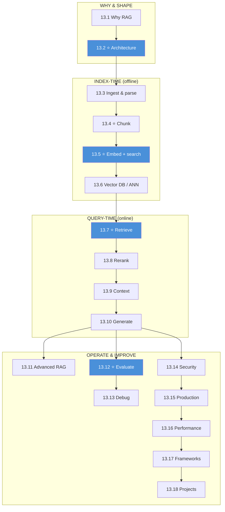

# Module 13 · RAG — Lessons

[⬅ Module home](../README.md) · [🗺 Roadmap](../../../ROADMAP.md) · [📚 Curriculum](../../../CURRICULUM.md)

> This is the map of Module 13. **RAG is a retrieval problem with a language model attached.** By the end you will build a semantic search engine from scratch, wire up real vector databases, combine dense + sparse retrieval with reranking, evaluate both retrieval and generation, debug hallucinations, secure the pipeline against document-borne prompt injection, and deploy a production RAG API.

---

## The rule of this module

> [!IMPORTANT]
> **Retrieval quality is the ceiling on generation quality.** The LLM is the last stage and the least controllable one — it can only be as right as the context it is handed. Every earlier stage (parse → clean → chunk → embed → index → retrieve → filter → rerank → construct) is where accuracy is won or lost. **If the right chunk never gets retrieved, the answer cannot be correct — the model will confidently fill the gap (hallucinate).**
>
> **The plan:** motivate RAG → see the whole pipeline → ingest & parse real documents → chunk well → build embeddings & similarity search by hand → index with vector DBs → retrieve (dense + sparse + hybrid) → rerank → construct context → generate with citations → advanced patterns → evaluate (retrieval *and* generation) → debug → secure → productionize → optimize → frameworks → projects.

This module **cashes in Modules 10–11.** [Word embeddings (10.4)](../../10-NLP/weeks/10.4-word-embeddings.md) and [sentence embeddings & attention (10.7)](../../10-NLP/weeks/10.7-attention.md) are what we index; [cosine similarity (06.2)](../../06-Mathematics/weeks/06.2-linear-algebra-vectors-matrices.md) is the retrieval metric; the [context window and prompt (11.1–11.3)](../../11-LLMs/weeks/11.1-what-is-a-language-model.md), [generation/decoding (11.14)](../../11-LLMs/weeks/11.14-inference-decoding.md), [LLM evaluation (11.17)](../../11-LLMs/weeks/11.17-evaluation.md), [safety/prompt injection (11.18)](../../11-LLMs/weeks/11.18-safety.md), and [production serving (11.20)](../../11-LLMs/weeks/11.20-production-architecture.md) are the generation half. **RAG is the assembly of retrieval + LLM into a grounded system.**

---

## The 18 lessons

| # | Lesson | The one thing | Build? |
|---|---|---|---|
| 13.1 | [Why RAG Exists](13.1-why-rag-exists.md) ⭐ | knowledge is **cut off, private, changing** → ground it | — |
| 13.2 | [RAG Architecture](13.2-rag-architecture.md) ⭐ | the **15-stage pipeline**, not "docs → vectors → LLM" | — |
| 13.3 | [Document Ingestion & Parsing](13.3-ingestion-parsing.md) | **parsing quality caps retrieval quality** (OCR, tables) | ✅ |
| 13.4 | [Chunking](13.4-chunking.md) ⭐ | the unit of retrieval — **size, overlap, structure** | ✅ |
| 13.5 | [Embeddings & Similarity Search](13.5-embeddings-similarity.md) ⭐ | dense vectors + **cosine**; search from scratch | ✅ |
| 13.6 | [Vector Databases](13.6-vector-databases.md) | **ANN**: HNSW, IVF, PQ — trade recall for speed | ✅ |
| 13.7 | [Retrieval](13.7-retrieval.md) ⭐ | dense + **sparse (BM25)** + **hybrid** + filtering | ✅ |
| 13.8 | [Reranking](13.8-reranking.md) | **cross-encoder** re-scores the top-k for precision | ✅ |
| 13.9 | [Context Construction](13.9-context-construction.md) | ordering, compression, **lost-in-the-middle** | — |
| 13.10 | [Generation](13.10-generation.md) | prompt template, **citations**, structured output | ✅ |
| 13.11 | [Advanced RAG](13.11-advanced-rag.md) | parent-child, multi-hop, graph, **agentic/corrective** | — |
| 13.12 | [RAG Evaluation](13.12-evaluation.md) ⭐ | **two problems**: retrieval (P/R/MRR/NDCG) + generation | ✅ |
| 13.13 | [RAG Debugging](13.13-debugging.md) | a **systematic** workflow for wrong/missing context | — |
| 13.14 | [RAG Security](13.14-security.md) | **injection through documents**, tenancy, PII | — |
| 13.15 | [Production RAG Architecture](13.15-production-architecture.md) | ingest / embed / retrieve / rerank / LLM as services | — |
| 13.16 | [RAG Performance](13.16-performance.md) | latency, **caching**, batching, cost | — |
| 13.17 | [RAG with Frameworks](13.17-frameworks.md) | LangChain / LlamaIndex / Haystack — help vs hide | ✅ |
| 13.18 | [Mini Projects & Summary](13.18-projects-summary.md) | 7 projects; the whole pipeline, connected | ✅ |

⭐ marks the load-bearing lessons. **13.5 (embeddings & search)** and **13.7 (retrieval)** make retrieval concrete; **13.2 (architecture)** and **13.12 (evaluation)** hold the whole module together.

---

## The dependency graph

**Read it as three phases:** *index-time* (offline: ingest → chunk → embed → index), *query-time* (online: retrieve → rerank → context → generate), and *operate* (evaluate → debug → secure → deploy → optimize). The offline phase is done once per document; the online phase runs on every query. **Most quality bugs live in the offline phase; most latency lives in the online phase.**

---

## The recurring through-lines

Threaded across all 18 lessons:

- **Retrieval quality is the ceiling on generation quality** — fix retrieval before touching prompts or models.
- **The chunk is the atom of RAG** — everything downstream inherits the chunk's boundaries.
- **Embeddings measure semantic similarity, not relevance or truth** — similar ≠ correct ≠ authorized.
- **Hybrid beats pure** — dense + sparse + rerank beats any single retriever.
- **Evaluate retrieval and generation separately** — a good answer from bad context is luck; a bad answer from good context is a generation bug.
- **A document is untrusted input** — text you retrieve can carry [prompt injection (11.18)](../../11-LLMs/weeks/11.18-safety.md).

---

## Navigation

| Direction | Link |
|---|---|
| 🏠 Module home | [Module 13](../README.md) |
| ➡ First lesson | [13.1 · Why RAG Exists](13.1-why-rag-exists.md) |
| 🗺 Roadmap | [ROADMAP.md](../../../ROADMAP.md) |
| 📚 Curriculum | [CURRICULUM.md](../../../CURRICULUM.md) |
