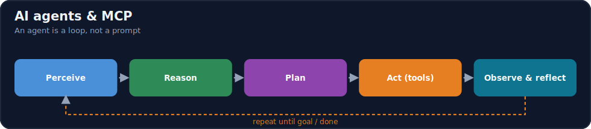
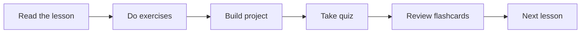

# Module 14 · AI Agents & Model Context Protocol (MCP)

[⬅ 13 · RAG](../13-RAG/README.md) · [🏠 docs](../README.md) · [🗺 Roadmap](../../ROADMAP.md) · [15 · Fine Tuning ➡](../15-Fine-Tuning/README.md)

> How modern AI agents work from first principles — architecture, planning, memory, tools, MCP, multi-agent systems, and production — before any framework.

---

## Purpose

This module covers **AI Agents**: LLM-driven systems that **reason, plan, use tools, remember, and act** in a loop to accomplish goals — and the **Model Context Protocol (MCP)**, the open standard for connecting agents to tools and data. It teaches the **engineering principles that power every agent** (not one framework), building on [prompt engineering](../12-Prompt-Engineering/README.md) (tool calling, context) and [RAG](../13-RAG/README.md) (retrieval as a tool). You will **build an agent from scratch** before seeing how frameworks simplify it.

## What you'll learn

- **What an agent is** and why it differs from a chatbot, a workflow, an LLM call, and RAG — the **perceive → reason → plan → act → observe → reflect** loop.
- **Agent architecture**: the control loop, planning (decomposition, hierarchical, dynamic), **tool calling** (schemas, validation, execution, retries), and **memory** (short/long-term, working, semantic, episodic, vector).
- **Reflection** (self-evaluation, correction, verification) and **agent loop** designs (fixed, adaptive, event-driven).
- **Multi-agent systems** (coordinator/worker/reviewer/critic) and their communication patterns.
- **MCP in depth**: host/client/server, resources/tools/prompts, the protocol lifecycle and transports — building a server and client from scratch.
- **Human-in-the-loop, safety, evaluation, and production architecture** for agents you can actually deploy.

## 📖 Lessons (start here)

> ✅ **This module's content is written.** Work through the lessons in order via the [lesson index](weeks/README.md).

| # | Lesson | Build? |
|---|---|---|
| 14.1 | [What Are AI Agents?](weeks/14.1-what-are-agents.md) ⭐ | — |
| 14.2 | [Agent Architecture](weeks/14.2-agent-architecture.md) ⭐ | ✅ |
| 14.3 | [Planning](weeks/14.3-planning.md) | ✅ |
| 14.4 | [Tool Calling](weeks/14.4-tool-calling.md) ⭐ | ✅ |
| 14.5 | [Agent Memory](weeks/14.5-memory.md) ⭐ | ✅ |
| 14.6 | [Reflection](weeks/14.6-reflection.md) | ✅ |
| 14.7 | [Agent Loops](weeks/14.7-agent-loops.md) | ✅ |
| 14.8 | [Multi-Agent Systems](weeks/14.8-multi-agent.md) | — |
| 14.9 | [Model Context Protocol (MCP)](weeks/14.9-mcp.md) ⭐ | ✅ |
| 14.10 | [Context Engineering for Agents](weeks/14.10-context-engineering.md) | — |
| 14.11 | [Agent Communication](weeks/14.11-communication.md) | — |
| 14.12 | [Human-in-the-Loop Systems](weeks/14.12-human-in-the-loop.md) | — |
| 14.13 | [Agent Safety](weeks/14.13-safety.md) ⭐ | — |
| 14.14 | [Agent Evaluation](weeks/14.14-evaluation.md) | ✅ |
| 14.15 | [Production Agent Architecture](weeks/14.15-production-architecture.md) | — |
| 14.16 | [Frameworks](weeks/14.16-frameworks.md) | ✅ |
| 14.17 | [Mini Projects & Summary](weeks/14.17-projects-summary.md) | ✅ |

**Companion artifacts:** [Exercises](exercises/README.md) · [Quiz](quizzes/quiz-01.md) · [Flashcards](flashcards/deck.md) · [Cheat sheet](cheat-sheets/agents-cheatsheet.md)

> [!IMPORTANT]
> **⭐ The rule of this module: an agent is a loop, not a prompt.** A chatbot answers once; an **agent runs an LLM in a loop that observes, decides on an action (usually a tool call), executes it, observes the result, and repeats until the goal is met.** The LLM is the *reasoning engine*; the **loop, the tools, the memory, and the guardrails around it** are the engineering — and they are what this module teaches. Everything the agent can *do* comes from its tools; everything it *knows* across steps comes from its memory; everything it's *allowed* to do comes from its permissions.
>
> Because an agent **acts in the world**, the two dangers that were theoretical for a chatbot become critical here: **an agent can loop forever (cost/latency), and an agent can be hijacked into taking harmful actions (security).** So this module treats **control (loops, budgets), safety (least privilege, sandboxing, human-in-the-loop), and evaluation (task success, not token accuracy)** as first-class — and standardizes tool/data access through **MCP**. **You will build an agent by hand ([14.2](weeks/14.2-agent-architecture.md)) and an MCP server/client ([14.9](weeks/14.9-mcp.md)) before touching a framework ([14.16](weeks/14.16-frameworks.md)).**

## How this module is organized

Content is delivered week by week. Each module uses the same subfolders:

| Folder | Contents |
|---|---|
| [`weeks/`](weeks/) | Weekly lesson content, one file per lesson (`14.1-…`, `14.2-…`). |
| [`diagrams/`](diagrams/) | Mermaid sources and exported diagram assets for this module. |
| [`exercises/`](exercises/) | Hands-on practice problems with solutions. |
| [`projects/`](projects/) | Buildable projects that apply this module's skills. |
| [`quizzes/`](quizzes/) | Self-assessment question banks with answer keys. |
| [`flashcards/`](flashcards/) | Spaced-repetition Q/A decks for active recall. |
| [`cheat-sheets/`](cheat-sheets/) | One-page quick references for this module. |
| [`references/`](references/) | Paper summaries and deep-dive notes. |

## Suggested study flow

## Related modules

- [Module 11 · LLMs](../11-LLMs/README.md) — the reasoning engine, tool use, safety.
- [Module 12 · Prompt Engineering](../12-Prompt-Engineering/README.md) — tool calling and context, the agent's substrate.
- [Module 13 · RAG](../13-RAG/README.md) — retrieval as an agent tool; context construction.
- [Module 16 · MLOps](../16-MLOps/README.md) — deploying and monitoring agent systems.

---

## Navigation

| Direction | Link |
|---|---|
| ⬆ Parent | [docs/](../README.md) |
| ⬅ Previous | [⬅ 13 · RAG](../13-RAG/README.md) |
| ➡ Next | [15 · Fine Tuning ➡](../15-Fine-Tuning/README.md) |
| 🗺 Roadmap | [ROADMAP.md](../../ROADMAP.md) |
| 📚 Curriculum | [CURRICULUM.md](../../CURRICULUM.md) |
| 🏠 Repo root | [README.md](../../README.md) |
