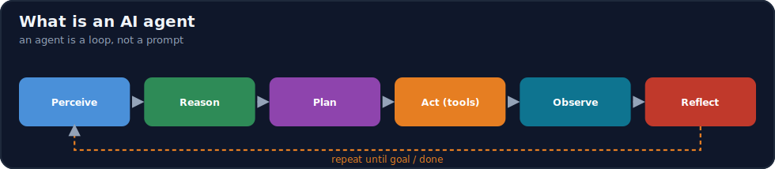
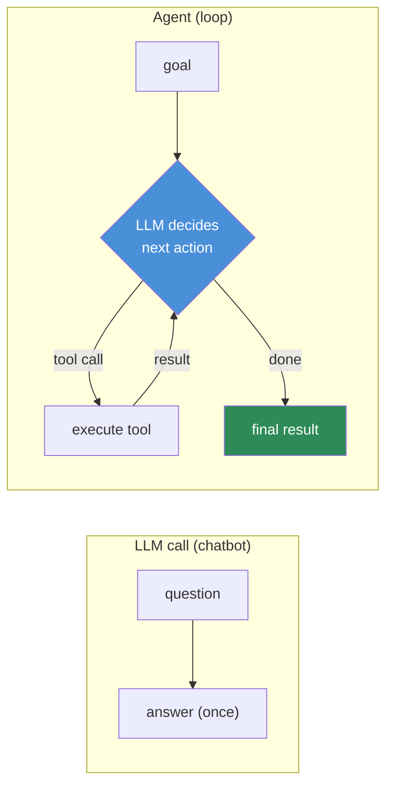
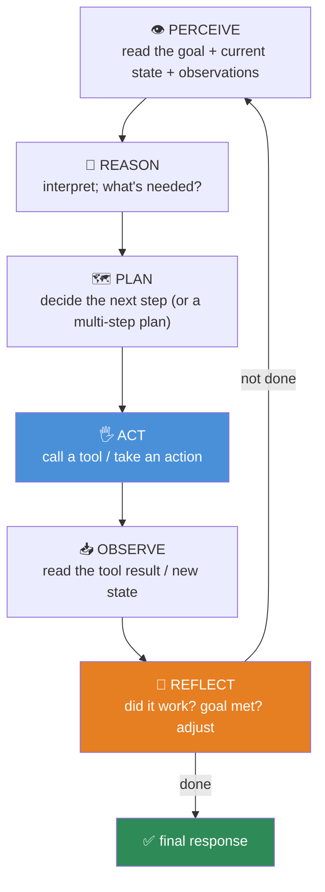
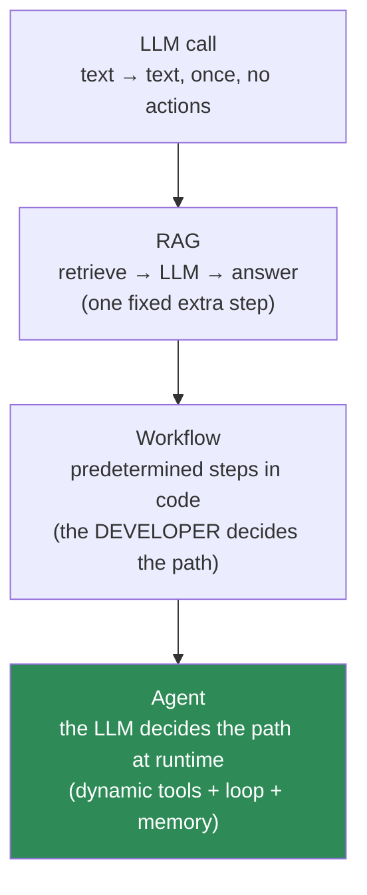

# 14.1 · What Are AI Agents? ⭐

[🏠 Module 14](../README.md) · [📖 Lessons](README.md) · [➡ 14.2 Agent Architecture](14.2-agent-architecture.md)

> **The lesson in one line:** A chatbot answers a question once; an **agent** runs an LLM in a *loop* that perceives a situation, decides on an action, takes it through a tool, observes the result, and repeats — so the LLM stops being a text generator and becomes a **decision-maker that acts in the world until a goal is met.**



---

## 🎯 Learning objectives

- Define an **AI agent** and distinguish it from a **chatbot, an LLM call, a workflow, and RAG**.
- Understand the **agent loop**: perceive → reason → plan → act → observe → reflect.
- Explain *why* agents exist — what problems a single LLM call can't solve.
- Recognize when a task needs an agent (and when it emphatically doesn't).

## ✅ Prerequisites

- [12.12 tool calling](../../12-Prompt-Engineering/weeks/12.12-tool-calling.md) — the mechanism agents are built on.
- [11.1 LLMs](../../11-LLMs/weeks/11.1-what-is-a-language-model.md), [13.1 RAG](../../13-RAG/weeks/13.1-why-rag-exists.md).

---

## 🧠 Mental model

> [!IMPORTANT]
> **A single LLM call is a function: text in, text out, once. An agent wraps that function in a loop and gives it hands.** Instead of answering immediately, the agent uses the LLM to *decide what to do next* — call a tool, look something up, run code — then feeds the **result back into the LLM** and asks again, over and over, until the goal is achieved. The LLM becomes the **reasoning engine (the "brain")** inside a system that also has **tools (hands)**, **memory (a notebook)**, and a **control loop (a nervous system)**. The shift is from *"generate an answer"* to *"take actions to accomplish a goal."*



---

## The agent loop: perceive → reason → plan → act → observe → reflect

Every agent, however simple or complex, cycles through these stages:



| Stage | What happens | Lesson |
|---|---|---|
| **Perceive** | ingest the goal, memory, and latest observation into context | [14.10](14.10-context-engineering.md) |
| **Reason** | the LLM interprets the situation | [14.6](14.6-reflection.md) |
| **Plan** | decide the next action or decompose the goal | [14.3](14.3-planning.md) |
| **Act** | emit a tool call; your code executes it | [14.4](14.4-tool-calling.md) |
| **Observe** | feed the tool result back into context | [14.2](14.2-agent-architecture.md) |
| **Reflect** | self-check; loop or finish | [14.6](14.6-reflection.md) |

---

## Agent vs everything it's confused with



| | Decides the control flow? | Loops? | Uses tools? | Has memory across steps? |
|---|---|---|---|---|
| **LLM call** | — (none) | no | no | no |
| **Chatbot** | — | no (turn-based) | maybe | conversation only |
| **RAG** | developer (fixed: retrieve→generate) | no | one (retriever) | no |
| **Workflow** | **developer** (hardcoded steps) | fixed | yes | passed between steps |
| **⭐ Agent** | **the LLM** (dynamic) | yes (until goal/budget) | yes (chooses which) | yes (multiple types) |

> [!IMPORTANT]
> **The defining line is: who decides what happens next?** In a workflow, *you* wrote the steps — the LLM just fills in blanks. In an **agent**, the **LLM decides at runtime** which tool to call, in what order, and when it's done. That dynamism is the agent's power (it handles open-ended, unpredictable tasks) and its danger (it can loop, wander, or be steered into harmful actions). **RAG is a fixed one-step retrieval; an agent might use retrieval as one of many tools, repeatedly, as it sees fit.**

---

## Why agents exist — what a single call can't do

| Limitation of one LLM call | What the agent adds |
|---|---|
| Can't take actions (only generates text) | **tools** — the LLM acts on the world ([14.4](14.4-tool-calling.md)) |
| Can't do multi-step tasks with dependencies | **the loop** — act, observe, act again ([14.7](14.7-agent-loops.md)) |
| Can't recover from a bad step | **reflection** — detect and correct errors ([14.6](14.6-reflection.md)) |
| Can't remember across steps/sessions | **memory** — working + long-term ([14.5](14.5-memory.md)) |
| Can't decide its own path for open-ended goals | **planning** — decompose and sequence ([14.3](14.3-planning.md)) |
| Can't know fresh/private facts | **retrieval as a tool** ([13](../../13-RAG/README.md)) |

An agent is the natural answer to: *"I have a goal that needs several steps, some external actions, and adaptation based on what happens along the way."*

---

## 🏭 Production examples

| System | Why it's an agent (not a chatbot/workflow) |
|---|---|
| Coding assistant that edits/tests code | loops: write → run tests → read failures → fix → repeat |
| Research assistant | plans queries, searches, reads, synthesizes across steps |
| Customer-support agent that resolves tickets | looks up orders, checks policy, takes actions, escalates |
| SQL/data agent | inspects schema, writes query, runs it, corrects on error |
| Ops copilot | reads metrics/logs, forms hypotheses, runs checks |

## ⚡ Performance considerations

- **Agents make many LLM calls per task** (one+ per loop step) — latency and cost scale with steps, not with one prompt ([14.14](14.14-evaluation.md)). Budget the number of steps.
- **Most tasks don't need an agent.** If the path is known, a **workflow** (fixed steps) is cheaper, faster, and more reliable. Use an agent only when the path is genuinely dynamic.
- Agent latency is dominated by **sequential LLM calls + tool latency** — parallelize independent steps where possible ([14.8](14.8-multi-agent.md)).

## 🔒 Security considerations

> [!CAUTION]
> - **An agent acts in the world**, so a hijack (prompt injection via a tool result or document, [12.16](../../12-Prompt-Engineering/weeks/12.16-security.md)) can cause *real* damage, not just a bad message. This is why safety ([14.13](14.13-safety.md)) is a first-class topic here.
> - **The loop can run away** — infinite loops, runaway cost, or destructive tool use — so budgets, termination conditions, and least privilege are mandatory from day one.
> - **More autonomy = more attack surface**; the agent decides its own actions, so an attacker who controls any input the agent reads can try to steer it.

## 🚫 Common mistakes

| Mistake | Consequence |
|---|---|
| Building an agent for a fixed-path task | Slower, costlier, flakier than a workflow |
| Calling any tool-using chatbot an "agent" | Muddled design; misses the loop/autonomy |
| No step budget or termination | Runaway loops and cost |
| Ignoring that the LLM now *acts* | Under-weighted safety |
| Conflating RAG with agents | RAG is one fixed step; agents choose steps dynamically |

## ✅ Best practices

- **Start with the simplest thing that works**: single call → RAG → workflow → agent. Escalate only when the task's path is truly dynamic.
- **Define the goal, tools, memory, and stopping condition explicitly** before writing the loop.
- **Bound autonomy** (max steps, budget, allowed tools) from the first version.
- **Treat the agent as an untrusted actor** with least-privilege tools ([14.13](14.13-safety.md)).

## 🏋️ Exercises

1. **Classify it.** For 8 real tasks (e.g., "translate this", "answer from our docs", "book a meeting across calendars"), decide: single call, RAG, workflow, or agent — and justify.
2. **Loop by hand.** On paper, trace the perceive→...→reflect loop for "find the cheapest flight and add it to my calendar." List the tools and observations at each step.
3. **Agent vs workflow.** Take one task and design it both ways; note where the agent's dynamism helps and where it adds risk/cost.
4. **Failure of a single call.** Find a task a single LLM call fails at, and explain which agent capability (tools/loop/memory/planning) fixes it.

## 🛠️ Mini project — "Agent or not?" decision tool

**Goal:** a small rubric + script that classifies a task as single-call / RAG / workflow / agent and explains why.

**Requirements:** encode the decision questions (needs actions? multi-step with dependencies? dynamic path? needs memory?); output the recommendation + the capabilities required.

**Folder structure**
```
agent-or-not/
├── rubric.py       # decision questions → recommendation
├── examples/       # labeled tasks
└── explain.py      # why this category
```

**Testing:** fixed-path tasks → workflow; dynamic multi-step + actions → agent; knowledge-only → RAG.
**Evaluation:** agreement with hand-labeled examples.
**Future improvements:** estimate cost/latency per category ([14.14](14.14-evaluation.md)).

## 📄 Cheat sheet

| Concept | One line |
|---|---|
| **⭐ Agent** | an LLM in a **loop** with tools, memory, and a goal |
| **Loop** | perceive → reason → plan → act → observe → reflect → repeat |
| **vs LLM call** | one shot, no actions vs iterative, acts on the world |
| **vs chatbot** | turn-based Q&A vs goal-driven autonomous steps |
| **vs RAG** | fixed retrieve→generate vs dynamically chooses tools (RAG can be one) |
| **⭐ vs workflow** | developer decides steps vs **the LLM decides steps at runtime** |
| **Brain/hands/notebook/leash** | LLM / tools / memory / permissions |
| **When to use** | dynamic, multi-step, action-taking goals — not fixed paths |

## 🎴 Flashcards

- **⭐ What is an AI agent?** → An LLM running in a loop that observes, decides on an action (usually a tool call), executes it, observes the result, and repeats until a goal is met.
- **⭐ Agent vs workflow — the defining difference?** → In a workflow the *developer* hardcodes the steps; in an agent the *LLM* decides the steps dynamically at runtime.
- **Agent vs RAG?** → RAG is a fixed retrieve-then-generate step; an agent may use retrieval as one of many tools, repeatedly, choosing when.
- **What are the agent loop stages?** → Perceive → reason → plan → act → observe → reflect (repeat).
- **Why do agents exist?** → A single LLM call can't take actions, do dependent multi-step tasks, recover from errors, remember across steps, or choose its own path — the agent loop adds all of these.
- **When should you NOT use an agent?** → When the task path is known/fixed — a workflow is cheaper, faster, and more reliable.
- **The four parts of an agent, by metaphor?** → Brain (LLM), hands (tools), notebook (memory), leash (permissions).

## 💬 Interview questions

1. Define an AI agent and contrast it with a chatbot, a workflow, and RAG.
2. What is the agent loop, and why is the feedback (observe) step essential?
3. "Who decides the control flow?" — how does this distinguish agents from workflows?
4. What can an agent do that a single LLM call cannot, and via which capability?
5. When is an agent the wrong choice, and what would you use instead?
6. Why does turning an LLM into an agent raise the stakes for safety?

## 📝 Summary

- An **agent is an LLM running in a loop** — perceive → reason → plan → act → observe → reflect — that uses **tools** to act, **memory** to persist, and **planning** to sequence, until a goal is met.
- It differs from a chatbot (turn-based Q&A), an LLM call (one shot), RAG (fixed one-step retrieval), and a workflow (developer-decided steps) by one thing: **the LLM decides the control flow at runtime.**
- That dynamism is the agent's **power and its danger** — it handles open-ended tasks but can loop, wander, or be hijacked into harmful **actions**, which is why control and safety are first-class here.
- **Use the simplest option that works**; reach for an agent only when the task is genuinely dynamic, multi-step, and action-taking. Next: build the loop ([14.2](14.2-agent-architecture.md)).

## 📚 References

1. **Anthropic (2024) — _Building Effective Agents_.** ⭐ Workflows vs agents; when to use each.
2. **Yao et al. (2022) — _ReAct: Reasoning + Acting_.** ⭐ The reason-act loop.
3. **[12.12 Tool & Function Calling](../../12-Prompt-Engineering/weeks/12.12-tool-calling.md).** The mechanism agents build on.
4. **[13.1 Why RAG Exists](../../13-RAG/weeks/13.1-why-rag-exists.md).** Retrieval as a capability.

---

## 🧭 Navigation

| Direction | Link |
|---|---|
| ⬅ Previous | [Module home](../README.md) |
| ➡ Next | [14.2 · Agent Architecture](14.2-agent-architecture.md) |
| 🏠 Module | [Module 14](../README.md) |
| 📖 Lessons | [Lesson index](README.md) |
