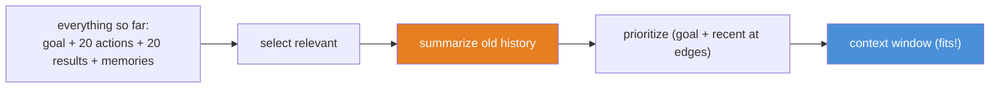
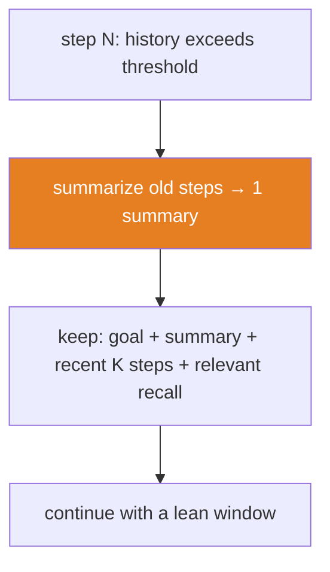

# 14.10 · Context Engineering for Agents

[⬅ 14.9 MCP](14.9-mcp.md) · [🏠 Module 14](../README.md) · [➡ 14.11 Agent Communication](14.11-communication.md)

> **The lesson in one line:** An agent's context window fills up fast — every step adds the goal, prior actions, tool results, and memories — so a long-running agent lives or dies by **context engineering**: selecting, prioritizing, and compressing information so the *relevant* state stays in the window as the task grows.

---

## 🎯 Learning objectives

- Apply **context selection, prioritization, compression, and dynamic assembly** to agents.
- Manage the **context window** across long, multi-step tasks.
- Understand why agent context is harder than single-prompt context.

## ✅ Prerequisites

- [12.11 context engineering](../../12-Prompt-Engineering/weeks/12.11-context-engineering.md), [14.5 memory](14.5-memory.md), [13.9 context construction](../../13-RAG/weeks/13.9-context-construction.md).

---

## 🧠 Mental model

> [!IMPORTANT]
> **In a single prompt you choose the context *once*; in an agent you must re-choose it *every step*, while it keeps growing.** Each loop iteration adds a decision, an action, and an observation ([14.2](14.2-agent-architecture.md)) — so by step 20 the naive context is the goal plus 20 verbose tool dumps, most of it now irrelevant, blowing past the window and burying the signal in the ignored middle ([12.11](../../12-Prompt-Engineering/weeks/12.11-context-engineering.md)). **The agent's job every step is to assemble the *smallest sufficient* context**: the goal, the relevant memories, a summary of history, and the latest observation — not the raw transcript. Context engineering is what lets an agent run for 50 steps in a 10-step-sized window.



---

## The levers (applied to agents)

| Lever | In an agent |
|---|---|
| **Selection** | include the goal, relevant memories ([14.5](14.5-memory.md) vector recall), and the last observation — not everything |
| **Prioritization** | goal and most recent/important state at the **edges** (lost-in-the-middle, [12.11](../../12-Prompt-Engineering/weeks/12.11-context-engineering.md)) |
| **Compression** | replace old action/observation runs with a **running summary** ("so far: X, Y; current: Z") |
| **Dynamic assembly** | rebuild the context *fresh each step* from memory + state, rather than appending forever |

### Dynamic context assembly
The key shift: **don't append to a growing transcript — reconstruct the context each step** from structured state.

```python
def assemble_context(goal, memory, last_obs, budget):
    return fit(budget, [
        goal,                                   # always: the anchor (prevents drift)
        memory.summary_of_progress(),           # compressed history (14.5)
        memory.recall_relevant(goal, k=3),      # vector-retrieved memories (13.7)
        last_obs,                               # the freshest observation (edge = attended)
    ])
```

> [!IMPORTANT]
> **Re-state the goal every step.** As history compresses and scrolls, an agent that doesn't see its goal each iteration **drifts** — it optimizes the last observation instead of the objective. Keeping the goal pinned at the top (and the latest state at the bottom) fights both drift and lost-in-the-middle.

---

## Managing context across long tasks



- **Rolling summarization** — when history exceeds a threshold, summarize the oldest portion into memory and drop the raw steps ([14.5](14.5-memory.md)).
- **Externalize state** — write intermediate results/findings to memory, keep only pointers in context.
- **Sub-task isolation** — give a worker sub-agent a *fresh, focused* context for its sub-task ([14.8](14.8-multi-agent.md)) rather than the whole history.
- **Structured scratchpad** — maintain a compact state object (findings, todo, decisions) instead of prose transcript.

---

## 🏭 Production examples

| Situation | Tactic |
|---|---|
| 50-step research task | rolling summary + externalized findings |
| Coding agent over a big repo | retrieve only relevant files per step (RAG as a tool) |
| Long chat + task | separate conversation summary from task scratchpad |
| Multi-agent | focused sub-contexts per worker |

## ⚡ Performance considerations

- **Context size drives per-step cost** — and it grows every step, so cost is super-linear without compression ([14.2](14.2-agent-architecture.md)). Summarize aggressively.
- **Summarization costs an LLM call** but saves far more on subsequent steps — net win on long tasks.
- **Prompt-cache the stable prefix** (system + tools) so only the volatile tail is re-processed.

## 🔒 Security considerations

> [!CAUTION]
> - **Every observation added to context is untrusted** ([12.16](../../12-Prompt-Engineering/weeks/12.16-security.md)) — summarization must not "launder" an injected instruction into a trusted-looking summary; keep summaries as data.
> - **Compression can drop safety-relevant details** — don't summarize away permission boundaries or an approval requirement.
> - **Externalized state is a data store** — scope and protect it ([14.5](14.5-memory.md)).

## 🚫 Common mistakes

| Mistake | Consequence |
|---|---|
| Appending forever to a transcript | Context overflow, cost blow-up |
| Not re-stating the goal each step | Goal drift |
| Dumping raw tool results | Signal buried, cost up |
| Summarizing too aggressively | Loses needed detail |
| Key state in the middle | Lost-in-the-middle |
| One giant shared context in multi-agent | Overload; no focus |

## ✅ Best practices

- **Assemble context fresh each step** from structured state; don't just append.
- **Pin the goal (top) and latest state (bottom)**; summarize the middle.
- **Externalize findings to memory**; keep context lean.
- **Give sub-agents focused contexts.**
- **Prompt-cache the stable prefix.**

## 🏋️ Exercises

1. **Overflow vs summarize.** Run a long task appending raw history until overflow; add rolling summarization; show it completes.
2. **Goal drift.** Remove the goal from mid-task context; observe drift; re-pin it; observe recovery.
3. **Externalize.** Write findings to memory and keep pointers; measure context-size reduction.
4. **Prefix cache.** Structure the prompt as stable prefix + volatile tail; measure the caching win.
5. **Sub-context.** Give a worker a focused context vs the whole history; compare quality and cost.

## 🛠️ Mini project — "Agent context manager"

**Goal:** a context manager that assembles a lean, relevant window each step.

**Requirements:** dynamic assembly (goal + summary + recall + last obs); rolling summarization at a threshold; externalized state store; edge-prioritized ordering; token budget; prefix-cache-friendly structure.

**Folder structure**
```
context-manager/
├── assemble.py     # build context each step
├── summarize.py    # rolling summarization
├── state.py        # externalized structured scratchpad
└── budget.py       # fit to window
```

**Testing:** long task fits window; goal always present; summaries don't leak injected instructions; key state at edges.
**Evaluation:** context size over steps; task success on long tasks ([14.14](14.14-evaluation.md)).
**Security:** summaries-as-data; don't drop safety details.
**Future improvements:** importance-weighted retention; learned summarization.

## 📄 Cheat sheet

| Concept | One line |
|---|---|
| **⭐ Agent context** | re-chosen **every step**, and it keeps growing |
| **Selection** | goal + relevant recall + last observation (not everything) |
| **Prioritization** | goal (top) + latest state (bottom); summarize the middle |
| **⭐ Compression** | rolling summary of old steps — survive long tasks |
| **Dynamic assembly** | rebuild fresh from state; don't append forever |
| **Re-state the goal** | every step — prevents drift |
| **Externalize** | findings → memory; keep pointers in context |
| **Cost** | grows super-linearly without compression |

## 🎴 Flashcards

- **⭐ Why is context engineering harder for agents than single prompts?** → You must re-select the context every step while it keeps growing with each action/observation; naive appending overflows the window.
- **What is dynamic context assembly?** → Rebuilding the context each step from structured state (goal + summary + recall + last observation) instead of appending to a transcript.
- **⭐ Why re-state the goal every step?** → Otherwise the agent drifts, optimizing the latest observation instead of the objective as history scrolls/compresses.
- **How do agents survive very long tasks?** → Rolling summarization of old steps, externalizing findings to memory, and giving sub-agents focused contexts.
- **Why does agent cost grow super-linearly?** → Context grows each step and is re-sent every call; without compression, per-step cost keeps rising.
- **What's a security risk of summarization?** → It can launder an injected instruction into a trusted-looking summary, or drop safety-relevant details — keep summaries as data and preserve guardrails.

## 💬 Interview questions

1. Why is context management the make-or-break for long-running agents?
2. What is dynamic context assembly, and how does it differ from appending?
3. How do you keep an agent from drifting off its goal?
4. How do rolling summarization and externalized state control context growth?
5. What are the security risks in summarizing agent context?

## 📝 Summary

- Agent context must be **re-chosen every step** while it **grows** — so long-running agents depend on **selection, prioritization, compression, and dynamic assembly**.
- **Assemble context fresh** each step (goal + summary + relevant recall + latest observation), **pin the goal** to prevent drift, and place key state at the **edges**.
- **Rolling summarization + externalized state** let an agent run far more steps than the window would naively allow; cost grows **super-linearly** without them.
- Keep summaries and observations as **untrusted data**, and never compress away **safety-relevant** details ([14.13](14.13-safety.md)).

## 📚 References

1. **[12.11 Context Engineering](../../12-Prompt-Engineering/weeks/12.11-context-engineering.md).** ⭐ The single-prompt foundation.
2. **Packer et al. (2023) — _MemGPT_.** ⭐ Managing context across long interactions.
3. **[13.9 Context Construction](../../13-RAG/weeks/13.9-context-construction.md).** Ordering and compression.
4. **[14.5 Agent Memory](14.5-memory.md).** Externalized state.

---

## 🧭 Navigation

| Direction | Link |
|---|---|
| ⬅ Previous | [14.9 · Model Context Protocol (MCP)](14.9-mcp.md) |
| ➡ Next | [14.11 · Agent Communication](14.11-communication.md) |
| 🏠 Module | [Module 14](../README.md) |
| 📖 Lessons | [Lesson index](README.md) |
