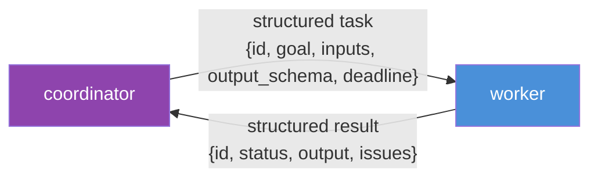
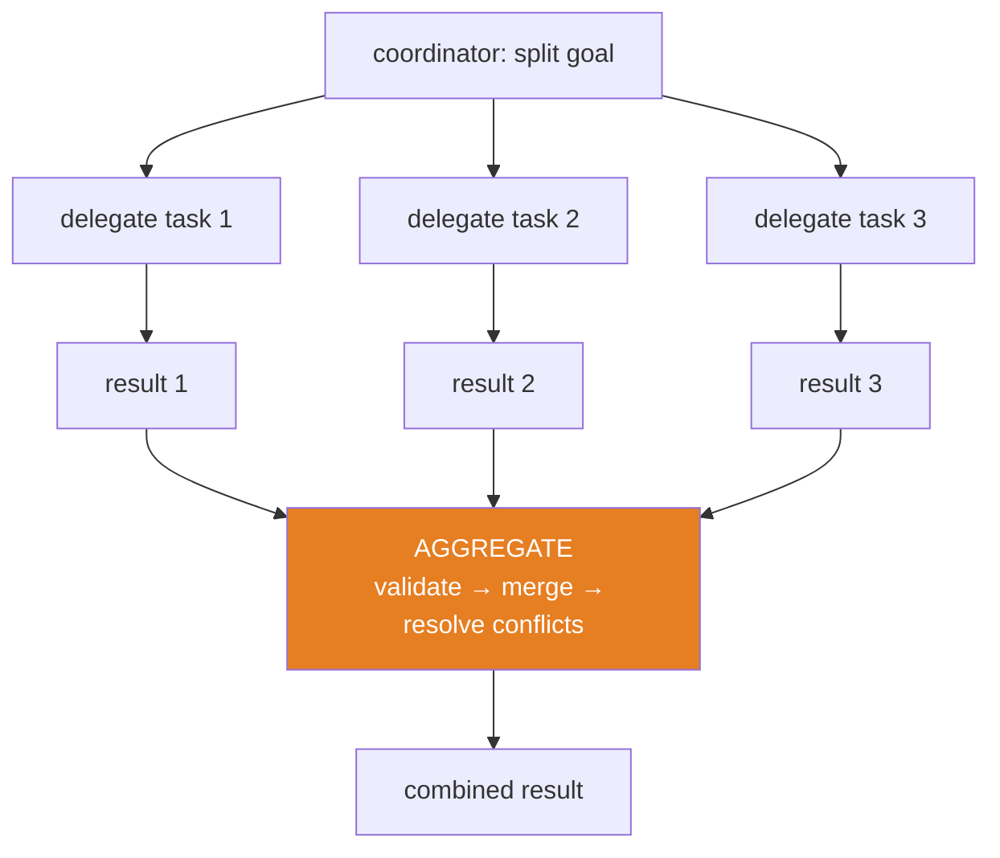

# 14.11 · Agent Communication

[⬅ 14.10 Context Engineering](14.10-context-engineering.md) · [🏠 Module 14](../README.md) · [➡ 14.12 Human-in-the-Loop](14.12-human-in-the-loop.md)

> **The lesson in one line:** When agents work together, *how they talk* determines whether the system is reliable — passing free-form prose invites misunderstanding and cost, so robust multi-agent systems use **structured messages, explicit task delegation, shared memory, and disciplined result aggregation**.

---

## 🎯 Learning objectives

- Design **structured messages** for inter-agent communication.
- Choose between **shared memory** and **message passing**, and **event-driven** coordination.
- Handle **task delegation** and **result aggregation** cleanly.

## ✅ Prerequisites

- [14.8 multi-agent systems](14.8-multi-agent.md), [12.6 structured outputs](../../12-Prompt-Engineering/weeks/12.6-structured-outputs.md), [14.5 memory](14.5-memory.md).

---

## 🧠 Mental model

> [!IMPORTANT]
> **Every message between agents is a lossy channel where one LLM's output becomes another LLM's input — so ambiguity compounds.** If a coordinator delegates "handle the data stuff" in prose, the worker guesses, and the result may not be what the coordinator expected — a misunderstanding that's expensive to detect. **Treat inter-agent communication like an API, not a chat**: structured messages with a defined schema (task, inputs, expected output, constraints), so each agent knows exactly what it received and must return. Structure turns a fuzzy conversation into a reliable contract.



---

## Communication mechanisms

| Mechanism | How | Best for |
|---|---|---|
| **Message passing** | agents send structured messages directly | delegation, request/response |
| **Shared memory / blackboard** | agents read/write a common store | many agents contributing to shared state |
| **Event-driven** | agents publish/subscribe to events | reactive, decoupled coordination ([14.7](14.7-agent-loops.md)) |

### Structured messages
Define a schema for tasks and results ([12.6](../../12-Prompt-Engineering/weeks/12.6-structured-outputs.md)):
```python
class Task(BaseModel):
    id: str
    goal: str
    inputs: dict
    output_schema: dict          # what the worker must return
    constraints: list[str]       # tools allowed, limits
    deadline_steps: int

class Result(BaseModel):
    task_id: str
    status: Literal["ok", "failed", "partial"]
    output: dict                 # validated against output_schema
    issues: list[str]            # what went wrong / needs review
```
Validated messages mean the coordinator can *trust the shape* of what it gets back and route on `status`.

### Shared memory (blackboard)
Agents read/write a common structured store (findings, decisions, todo). Good for accumulating shared state, but needs **access discipline** (who writes what) to avoid clobbering and confusion.

### Event-driven
Agents emit and react to events ("research_done", "review_failed"). Decouples agents (they don't call each other directly) and suits long-running/reactive systems.

---

## Task delegation & result aggregation



- **Delegation**: the coordinator hands each worker a **self-contained task** (goal + inputs + expected output) — the worker shouldn't need the whole history ([14.10](14.10-context-engineering.md)).
- **Aggregation**: collect results, **validate each**, **merge**, and **resolve conflicts** (workers may disagree). Aggregation is where a critic/reviewer often sits ([14.8](14.8-multi-agent.md)).

> [!IMPORTANT]
> **Aggregation is not concatenation.** Merging worker outputs means validating them, de-duplicating, reconciling contradictions, and synthesizing — an LLM step in itself. Naively gluing results together produces incoherent or contradictory output. Design the aggregation step deliberately.

---

## 🏭 Production examples

| System | Communication |
|---|---|
| Research: coordinator + workers | structured task/result messages + aggregation |
| Blackboard analysis | shared structured findings store |
| Pipeline (outline→draft→edit) | sequential structured hand-offs ([12.8](../../12-Prompt-Engineering/weeks/12.8-prompt-chaining.md)) |
| Reactive ops swarm | event-driven pub/sub |

## ⚡ Performance considerations

- **Minimal, structured hand-offs** cut tokens vs passing full context ([14.10](14.10-context-engineering.md)).
- **Parallel delegation** is the main speedup ([14.8](14.8-multi-agent.md)) — independent tasks at once.
- **Shared memory avoids re-sending** state to every agent, but adds coordination overhead.

## 🔒 Security considerations

> [!CAUTION]
> - **Inter-agent messages are untrusted input** — a worker's output (possibly injection-influenced) becomes the coordinator's input; **validate every message against its schema** and keep it as data ([12.16](../../12-Prompt-Engineering/weeks/12.16-security.md)).
> - **Shared memory is a cross-agent trust surface** — scope writes; a poisoned blackboard entry can steer every reader ([14.5](14.5-memory.md)).
> - **Injection can propagate** across the whole system via messages — structured contracts + validation contain it.

## 🚫 Common mistakes

| Mistake | Consequence |
|---|---|
| Free-form prose between agents | Misunderstanding, unreliability |
| Passing full context to every agent | Cost blow-up, overload |
| Concatenating instead of aggregating | Incoherent/contradictory output |
| Unvalidated messages | Injection propagation; shape errors |
| Uncontrolled shared-memory writes | Clobbering, confusion |
| No conflict resolution | Contradictory final result |

## ✅ Best practices

- **Structured, schema-validated messages** — treat comms like an API.
- **Self-contained delegated tasks** (goal + inputs + expected output).
- **Deliberate aggregation** — validate, merge, resolve conflicts (often via a critic).
- **Scope shared-memory writes**; validate every message as untrusted.
- **Prefer event-driven** for reactive/decoupled systems.

## 🏋️ Exercises

1. **Structured vs prose.** Delegate a task via prose vs a schema; measure misunderstanding rate.
2. **Aggregation.** Merge 3 worker outputs with a real aggregation step (validate+reconcile) vs concatenation; compare coherence.
3. **Blackboard.** Build a shared findings store with scoped writes; show two agents contributing without clobbering.
4. **Event-driven.** Wire a pub/sub where a "review_failed" event re-triggers a worker.
5. **Injection containment.** Poison a worker's result; show schema validation of the hand-off contains it.

## 🛠️ Mini project — "Agent message bus"

**Goal:** a structured communication layer for multi-agent systems.

**Requirements:** Task/Result schemas; message passing with validation; a shared blackboard with scoped writes; event pub/sub; an aggregation step (validate + merge + conflict-resolve); audit of messages.

**Folder structure**
```
message-bus/
├── schemas.py      # Task / Result / Event
├── passing.py      # validated message passing
├── blackboard.py   # scoped shared memory
├── events.py       # pub/sub
└── aggregate.py    # validate + merge + reconcile
```

**Testing:** invalid messages rejected; blackboard writes scoped; aggregation reconciles conflicts; events trigger correctly.
**Evaluation:** misunderstanding rate, aggregation coherence ([14.14](14.14-evaluation.md)).
**Security:** message validation; scoped writes; injection containment ([14.13](14.13-safety.md)).
**Future improvements:** typed channels; backpressure; distributed bus.

## 📄 Cheat sheet

| Concept | One line |
|---|---|
| **⭐ Comms = an API, not a chat** | structured, schema-validated messages |
| **Message passing** | direct structured request/response |
| **Shared memory (blackboard)** | common store; scope the writes |
| **Event-driven** | pub/sub; decoupled, reactive |
| **Delegation** | self-contained task (goal + inputs + expected output) |
| **⭐ Aggregation** | validate → merge → **resolve conflicts** (not concat) |
| **Security** | messages are untrusted; validate; contain injection |

## 🎴 Flashcards

- **⭐ Why use structured messages between agents?** → One LLM's output becomes another's input; ambiguity compounds, so a schema (task/inputs/expected output) turns a fuzzy chat into a reliable contract.
- **What are the three communication mechanisms?** → Message passing (direct), shared memory/blackboard (common store), and event-driven pub/sub.
- **What makes a good delegated task?** → Self-contained: goal + inputs + expected output + constraints, so the worker doesn't need the whole history.
- **⭐ Why is aggregation not concatenation?** → Merging results requires validating, de-duplicating, and reconciling contradictions — gluing them produces incoherent output.
- **Why are inter-agent messages a security concern?** → They're untrusted input; injection can propagate across the system, so validate every message and scope shared-memory writes.
- **When is event-driven communication best?** → Reactive, decoupled, long-running systems where agents shouldn't call each other directly.

## 💬 Interview questions

1. Why should inter-agent communication be structured rather than free-form?
2. Compare message passing, shared memory, and event-driven coordination.
3. What makes a well-formed delegated task?
4. Why is result aggregation more than concatenation?
5. How does injection propagate through a multi-agent system, and how do you contain it?

## 📝 Summary

- Inter-agent communication is a **lossy channel where ambiguity compounds**, so treat it like an **API**: **structured, schema-validated messages** for tasks and results.
- Use **message passing** (direct), **shared memory** (scoped blackboard), or **event-driven** pub/sub; delegate **self-contained tasks** and **aggregate deliberately** (validate → merge → resolve conflicts, not concatenate).
- **Messages are untrusted input** — validate every hand-off and scope shared writes to **contain injection propagation** across the system ([14.13](14.13-safety.md)).
- Minimal structured hand-offs also **cut cost** vs passing full context ([14.10](14.10-context-engineering.md)).

## 📚 References

1. **[12.6 Structured Outputs](../../12-Prompt-Engineering/weeks/12.6-structured-outputs.md).** ⭐ Message schemas.
2. **Wu et al. (2023) — _AutoGen_.** Conversational multi-agent messaging.
3. **[14.8 Multi-Agent Systems](14.8-multi-agent.md).** Roles and patterns.
4. **Blackboard architectural pattern.** Shared-memory coordination.

---

## 🧭 Navigation

| Direction | Link |
|---|---|
| ⬅ Previous | [14.10 · Context Engineering for Agents](14.10-context-engineering.md) |
| ➡ Next | [14.12 · Human-in-the-Loop Systems](14.12-human-in-the-loop.md) |
| 🏠 Module | [Module 14](../README.md) |
| 📖 Lessons | [Lesson index](README.md) |
