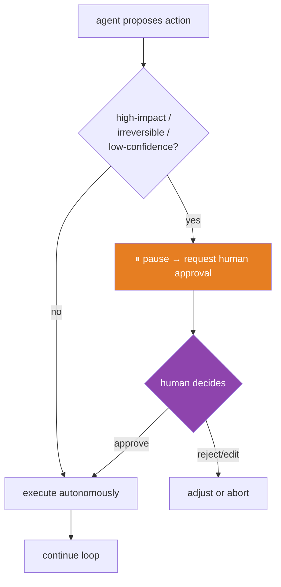
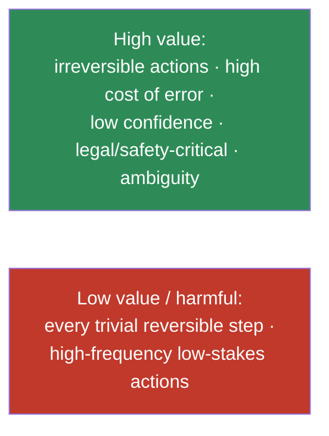

# 14.12 · Human-in-the-Loop Systems

[⬅ 14.11 Agent Communication](14.11-communication.md) · [🏠 Module 14](../README.md) · [➡ 14.13 Agent Safety](14.13-safety.md)

> **The lesson in one line:** Full autonomy is rarely the goal — the reliable pattern is an agent that does the work but **pauses for a human at the moments that matter**: approving high-impact actions, reviewing uncertain outputs, and escalating when it's stuck — trading a little speed for a lot of safety and trust.

---

## 🎯 Learning objectives

- Design **approval workflows, review checkpoints, manual overrides, escalation, and feedback collection**.
- Decide **where** human intervention improves safety and reliability (and where it just slows things down).
- Implement human-in-the-loop with **event-driven** pauses.

## ✅ Prerequisites

- [14.7 event-driven loops](14.7-agent-loops.md), [14.6 reflection](14.6-reflection.md), [14.13 safety](14.13-safety.md).

---

## 🧠 Mental model

> [!IMPORTANT]
> **An autonomous agent is fast but fallible; a human is slow but judicious — human-in-the-loop puts the human exactly where their judgment is worth the delay.** You don't review every step (that defeats the point); you insert checkpoints at **high-stakes, irreversible, or low-confidence** moments — the decisions where a mistake is expensive and a human catch is cheap. The agent runs freely on the safe, reversible majority of steps and **pauses for approval** on the dangerous few. This is the practical middle between "rubber-stamp everything" (unsafe) and "human does it all" (pointless).



---

## The intervention patterns

| Pattern | What | Where |
|---|---|---|
| **Approval workflow** | agent pauses; human approves/rejects before an action | before irreversible/high-impact actions (send, delete, pay, deploy) |
| **Review checkpoint** | human reviews an intermediate output before proceeding | after a plan, before executing a risky phase |
| **Manual override** | human can edit the agent's plan/action/output | any point; a "take the wheel" control |
| **Escalation** | agent hands off to a human when stuck/uncertain | low confidence, repeated failure, out-of-scope |
| **Feedback collection** | human corrections captured to improve the agent | continuous; feeds evaluation ([14.14](14.14-evaluation.md)) & memory ([14.5](14.5-memory.md)) |

### Approval workflow (the core one)
Implemented as an **event-driven pause** ([14.7](14.7-agent-loops.md)): the agent emits an "approval needed" event with the proposed action and its rationale, then **waits** (no busy-loop) until a human responds.

```python
def maybe_execute(action, agent):
    if action.permission == "dangerous" or agent.confidence(action) < THRESHOLD:
        decision = request_human_approval(action, context=agent.explain(action))  # blocks/awaits
        if not decision.approved:
            return Observation(ok=False, error=f"rejected by human: {decision.reason}")
        action = decision.edited or action        # human may edit before approving
    return execute_tool(action)                    # 14.4
```

> [!IMPORTANT]
> **Human-in-the-loop is only as good as what you show the human.** An approval prompt that just says "run delete_records?" invites rubber-stamping. Show the **action, its arguments, the agent's rationale, and the expected impact** so the human can make a real decision. And design for **approval fatigue**: if you ask too often, humans approve blindly — reserve prompts for genuinely high-stakes moments.

---

## Where human intervention helps (and where it doesn't)



> [!WARNING]
> **Too many checkpoints destroy the agent's value and cause approval fatigue; too few leave dangerous actions unguarded.** Calibrate by **impact and reversibility**: gate irreversible/high-cost actions, let reversible low-stakes ones run free. As trust grows (validated by evaluation, [14.14](14.14-evaluation.md)), you can *widen* autonomy — but start conservative.

---

## 🏭 Production examples

| Agent | Human-in-the-loop |
|---|---|
| Email/comms agent | approve before sending |
| Financial/ops agent | approve transactions/deploys; review plans |
| Code agent | human reviews the PR before merge |
| Support agent | escalate complex/angry cases to a human |
| Medical/legal assistant | mandatory human review; never auto-act |

## ⚡ Performance considerations

- **Approvals add human latency** (seconds to hours) — use **event-driven** waits (zero compute cost while idle, [14.7](14.7-agent-loops.md)); batch approvals where possible.
- **Async checkpoints** let the agent continue on independent work while awaiting approval on one branch.
- **Calibrated gating** minimizes interruptions while keeping safety.

## 🔒 Security considerations

> [!CAUTION]
> - **Human approval is the last line of defense against a hijacked agent** ([14.13](14.13-safety.md)) — if injection steers the agent toward a destructive action, the approval gate stops it. This is why high-impact actions **must** be gated, not merely logged.
> - **Show the true action to the human** — an attacker might try to make the displayed action differ from the executed one; approve the *exact* validated action.
> - **Authenticate approvers** — approval endpoints are high-value targets.

## 🚫 Common mistakes

| Mistake | Consequence |
|---|---|
| No gate on irreversible actions | Unrecoverable mistakes; hijack damage |
| Gating everything | Approval fatigue → blind approval; agent useless |
| Vague approval prompts | Rubber-stamping |
| Busy-waiting for approval | Wasted cost |
| Approving a different action than executed | Bypassed control |
| No escalation path | Agent stuck; bad outcomes |

## ✅ Best practices

- **Gate by impact & reversibility** — irreversible/high-cost/low-confidence → approval; reversible low-stakes → autonomous.
- **Show action + args + rationale + expected impact** for real decisions.
- **Event-driven waits**; async on independent branches.
- **Escalate** on low confidence / repeated failure / out-of-scope.
- **Capture feedback** into evaluation and memory.
- **Widen autonomy as trust is earned**, not by default.

## 🏋️ Exercises

1. **Approval gate.** Add an approval step before a "dangerous" tool; show it blocks a bad action.
2. **Fatigue.** Gate every step, then only high-impact ones; compare interruptions and safety.
3. **Escalation.** Make an agent escalate when confidence < threshold or after N failures.
4. **Event-driven wait.** Implement approval as an event-driven pause with zero idle cost.
5. **Feedback loop.** Capture human corrections and feed them into the eval set ([14.14](14.14-evaluation.md)).

## 🛠️ Mini project — "Approval & escalation layer"

**Goal:** a human-in-the-loop layer wrapping agent actions.

**Requirements:** permission-based gating (dangerous/high-impact → approval); confidence-based escalation; event-driven approval requests showing action+rationale+impact; manual override/edit; feedback capture; approver authentication; audit.

**Folder structure**
```
hitl/
├── gate.py         # decide when to pause (impact/confidence)
├── approval.py     # event-driven request/response + edit
├── escalate.py     # low-confidence / repeated-failure handoff
├── feedback.py     # capture corrections → eval/memory
└── audit.py        # log approvals/overrides
```

**Testing:** irreversible actions gated; only high-stakes prompts fire; escalation triggers correctly; exact action approved; approver authenticated.
**Evaluation:** interruption rate vs prevented-error rate ([14.14](14.14-evaluation.md)).
**Security:** gate as hijack defense; authenticated approvals ([14.13](14.13-safety.md)).
**Monitoring:** approval/override/escalation rates.
**Future improvements:** trust-based autonomy widening; batched approvals.

## 📄 Cheat sheet

| Concept | One line |
|---|---|
| **⭐ Human-in-the-loop** | pause for a human at high-stakes/irreversible/low-confidence moments |
| **Approval workflow** | gate before irreversible/high-impact actions |
| **Review checkpoint** | human reviews an intermediate output |
| **Manual override** | human edits plan/action/output |
| **Escalation** | hand off when stuck/uncertain/out-of-scope |
| **Feedback** | capture corrections → eval + memory |
| **⭐ Calibrate** | by impact & reversibility; avoid approval fatigue |
| **Implement as** | event-driven pause (idle-cheap) |
| **Security** | last line of defense vs hijack — show the exact action |

## 🎴 Flashcards

- **⭐ What is human-in-the-loop and where do you put the human?** → Insert checkpoints at high-stakes, irreversible, or low-confidence moments where human judgment is worth the delay — not on every step.
- **What are the intervention patterns?** → Approval workflows, review checkpoints, manual override, escalation, and feedback collection.
- **⭐ How do you calibrate how often to ask for approval?** → By impact and reversibility — gate irreversible/high-cost actions, let reversible low-stakes ones run free; too many prompts cause approval fatigue.
- **How should an approval request be presented?** → With the action, its arguments, the agent's rationale, and expected impact — so the human makes a real decision, not a rubber-stamp.
- **Why is human approval a security control?** → It's the last line of defense if injection hijacks the agent toward a destructive action.
- **How do you implement approval efficiently?** → As an event-driven pause that costs nothing while waiting.

## 💬 Interview questions

1. Where should a human be in the loop, and where shouldn't they?
2. Describe the human-in-the-loop patterns and when to use each.
3. How do you avoid approval fatigue while keeping safety?
4. Why is human approval a critical defense against a hijacked agent?
5. How do you implement approvals without wasting compute?
6. How does human feedback feed back into the agent's improvement?

## 📝 Summary

- Human-in-the-loop puts human judgment at **high-stakes, irreversible, or low-confidence** moments — the agent runs freely on the safe majority and **pauses for approval** on the dangerous few.
- The patterns are **approval workflows, review checkpoints, manual override, escalation, and feedback collection**; approval is the core one, implemented as an **event-driven pause** showing the action, rationale, and impact.
- **Calibrate by impact and reversibility** — too many checkpoints cause approval fatigue, too few leave danger unguarded — and **widen autonomy only as trust is earned**.
- Human approval is the **last line of defense against a hijacked agent** ([14.13](14.13-safety.md)) and a source of **feedback** for improvement ([14.14](14.14-evaluation.md)).

## 📚 References

1. **Anthropic — _Building Effective Agents_ (human oversight).** ⭐ Guardrails and stopping.
2. **[14.13 Agent Safety](14.13-safety.md).** Approval as defense-in-depth.
3. **[14.7 Agent Loops](14.7-agent-loops.md).** Event-driven pauses.
4. **[14.14 Agent Evaluation](14.14-evaluation.md).** Feedback into evaluation.

---

## 🧭 Navigation

| Direction | Link |
|---|---|
| ⬅ Previous | [14.11 · Agent Communication](14.11-communication.md) |
| ➡ Next | [14.13 · Agent Safety](14.13-safety.md) |
| 🏠 Module | [Module 14](../README.md) |
| 📖 Lessons | [Lesson index](README.md) |
