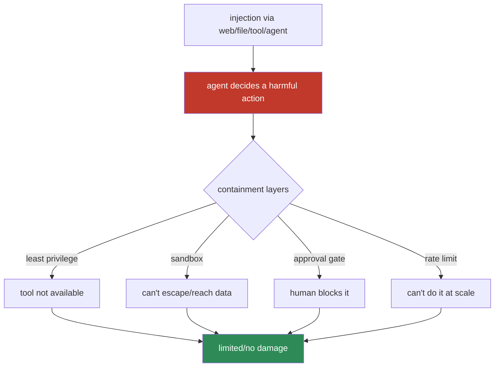
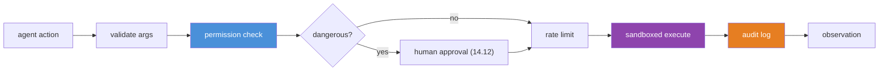

# 14.13 · Agent Safety ⭐

[⬅ 14.12 Human-in-the-Loop](14.12-human-in-the-loop.md) · [🏠 Module 14](../README.md) · [➡ 14.14 Agent Evaluation](14.14-evaluation.md)

> **The lesson in one line:** An agent takes *actions*, so a hijacked or malfunctioning one causes *real* damage — which makes safety not a feature but a foundation: **least privilege, sandboxing, permission boundaries, secret hygiene, rate limits, and audit logging**, all designed on the assumption that the agent *will* eventually be compromised.

> [!NOTE]
> This lesson is **strictly defensive** — it explains how to *contain* agents, not how to attack them. It extends [12.16 prompt security](../../12-Prompt-Engineering/weeks/12.16-security.md) and [11.18 LLM safety](../../11-LLMs/weeks/11.18-safety.md).

---

## 🎯 Learning objectives

- Apply **least privilege, permission boundaries, sandboxing, secret management, rate limiting, and audit logging** to agents.
- Design **safe tool execution** that contains a compromised agent.
- Internalize **assume-breach**: build so that a hijacked agent can do little harm.

## ✅ Prerequisites

- [12.16 prompt injection](../../12-Prompt-Engineering/weeks/12.16-security.md), [14.4 tool calling](14.4-tool-calling.md), [14.12 human-in-the-loop](14.12-human-in-the-loop.md).

---

## 🧠 Mental model

> [!IMPORTANT]
> **A chatbot that gets hijacked writes a bad message; an agent that gets hijacked *does a bad thing* — deletes data, sends money, leaks secrets.** And agents are hijackable: they read untrusted content (web pages, files, tool results, other agents' messages), any of which can carry prompt injection ([12.16](../../12-Prompt-Engineering/weeks/12.16-security.md)) that steers the loop. Since you **cannot guarantee the agent won't be compromised**, agent safety is **containment**: design so that *even a fully hijacked agent can't do much damage*. That's the assume-breach mindset — **the question isn't "will it be tricked?" but "what's the blast radius when it is?"**



---

## The controls

### Least privilege (the load-bearing one)
Give the agent the **minimum tools and access** its task needs — nothing more. A support agent needs to read orders, not delete the database. **Read-only by default**; grant write/dangerous capabilities only where required, scoped as narrowly as possible.

> [!IMPORTANT]
> **Least privilege is the single most important agent-safety control** because it works *regardless of how* the agent is compromised. You can't enumerate every injection; you *can* ensure the agent simply lacks the capability to do catastrophic things. If the agent has no `delete_all` tool, no injection can make it delete all.

### Permission boundaries & tiers
Tag every tool with a permission level (`read` / `write` / `dangerous`, [14.4](14.4-tool-calling.md)); the loop enforces what's allowed in the current context, and **dangerous tools require human approval** ([14.12](14.12-human-in-the-loop.md)).

### Sandboxing
Run code/shell/file tools in an **isolated environment** — containers, restricted filesystems, no network by default, resource/time limits. A sandbox contains both bugs and hijacks: even if the agent runs malicious code, it can't escape.

### Secret management
The agent should **never see raw secrets**. Keep API keys/credentials in a secrets manager; tools use them **server-side** without exposing them in the context (where they could be leaked via injection or logged). The agent calls `send_email`; it never handles the SMTP password.

### Rate limiting
Cap the **frequency and volume** of actions — API calls, tool invocations, spend, emails sent. Limits turn a runaway or hijacked agent from a catastrophe into a bounded incident, and stop cost-exhaustion loops ([14.7](14.7-agent-loops.md)).

### Audit logging
Log **every decision, tool call, argument, and result** — an immutable trail for debugging, incident forensics, and accountability. If something goes wrong, you must be able to reconstruct exactly what the agent did.

### Safe tool execution
Combine the above at the tool boundary ([14.4](14.4-tool-calling.md)): validate arguments, check permissions, sandbox, rate-limit, gate dangerous actions, log — **every call, every time.**



---

## Defense-in-depth

| Layer | Contains |
|---|---|
| **Least privilege** | the agent lacks harmful capabilities entirely |
| **Permission tiers + approval** | dangerous actions need a human |
| **Sandboxing** | code/file/shell can't escape or reach sensitive data |
| **Secret hygiene** | secrets never enter the context |
| **Rate limits** | bounded blast radius; no cost-exhaustion |
| **Audit logs** | detect, forensics, accountability |
| **Input treated as data** | injection resistance ([12.16](../../12-Prompt-Engineering/weeks/12.16-security.md)) |

> [!IMPORTANT]
> **No single control is enough — layer them.** Injection defenses fail; a sandbox might have a hole; an approval might be rubber-stamped. Defense-in-depth means an attacker must defeat *several independent* controls, and least privilege underlies them all: **minimize what the agent can do, then contain, gate, limit, and log the rest.**

---

## 🏭 Production examples

| Agent | Key controls |
|---|---|
| Code-execution agent | strong sandbox + no network + resource limits + rate limit |
| Ops/deploy agent | approval gates + audit + least-privilege service accounts |
| Data agent | read-only DB role + query limits + no raw credentials |
| Web-research agent | outputs-as-untrusted + no dangerous tools + rate limit |
| Multi-agent system | per-agent least privilege + validated hand-offs ([14.11](14.11-communication.md)) |

## ⚡ Performance considerations

- Safety controls add overhead (validation, sandbox startup, approval latency) — real but **non-negotiable** for action-taking agents.
- **Sandbox reuse/pooling** reduces per-call startup cost.
- **Rate limits** also protect *your* costs, not just security.

## 🔒 Security considerations (this is the lesson)

> [!CAUTION]
> - **Assume the agent will be hijacked** ([12.16](../../12-Prompt-Engineering/weeks/12.16-security.md)); minimize blast radius via least privilege.
> - **All agent inputs are untrusted** — tool results, files, web content, other agents ([14.11](14.11-communication.md)); keep them as data.
> - **Never put secrets in the context**; use server-side secret management.
> - **Gate irreversible/high-impact actions** with human approval ([14.12](14.12-human-in-the-loop.md)).
> - **Sandbox anything that executes**; rate-limit everything; audit everything.

## 🚫 Common mistakes

| Mistake | Consequence |
|---|---|
| Broad tool access "for flexibility" | Huge blast radius on hijack |
| Secrets in the prompt/context | Leaked via injection/logs |
| Running code without a sandbox | Escape, damage, data theft |
| No rate limits | Runaway cost; scaled damage |
| No audit log | Can't detect or investigate incidents |
| Relying only on injection defenses | They fail; no containment |
| No approval on destructive actions | Unrecoverable hijack damage |

## ✅ Best practices

- **Least privilege first** — the fewest, narrowest tools; read-only default.
- **Permission tiers + human approval** for dangerous actions.
- **Sandbox** all code/file/shell; **no secrets in context** (server-side).
- **Rate-limit** actions/spend; **audit-log** everything.
- **Treat all inputs as untrusted**; **defense-in-depth**, assume breach.

## 🏋️ Exercises

1. **Blast-radius test.** Give an agent a `delete` tool, then remove it; show injection can't cause deletion without the capability.
2. **Sandbox escape.** Run a code tool sandboxed (no network, resource cap); attempt an escape; show containment.
3. **Secret hygiene.** Route a credential server-side; prove it never appears in context or logs.
4. **Rate limit.** Cap tool calls/spend; show a runaway loop is bounded.
5. **Audit trail.** Log every decision/call; reconstruct a full agent run from logs.
6. **Approval gate.** Require approval for a destructive action; show a hijack attempt is blocked.

## 🛠️ Mini project — "Agent safety harness"

**Goal:** a safety layer that wraps agent tool execution with all controls.

**Requirements:** permission tiers + enforcement; least-privilege tool registry; sandbox for code/file tools (isolation, no-network, limits); server-side secret management; rate limiting (calls/spend); approval gates on dangerous tools ([14.12](14.12-human-in-the-loop.md)); immutable audit log; inputs-as-untrusted.

**Folder structure**
```
safety-harness/
├── privilege.py    # tool tiers + least-privilege registry
├── sandbox.py      # isolated execution + limits
├── secrets.py      # server-side secret access
├── ratelimit.py    # per-tool/spend caps
├── approve.py      # gate dangerous actions
└── audit.py        # immutable log
```

**Testing:** hijack attempt blocked at each layer; secrets never in context/logs; sandbox contained; rate limits enforced; every action audited.
**Evaluation:** blast-radius under simulated hijack; % dangerous actions gated.
**Security:** the whole project — defense-in-depth, assume breach.
**Monitoring:** anomalous action rates, denied actions, approval rates ([14.15](14.15-production-architecture.md)).
**Future improvements:** anomaly detection; per-tenant isolation; policy engine.

## 📄 Cheat sheet

| Control | One line |
|---|---|
| **⭐ Least privilege** | fewest/narrowest tools; read-only default — the top control |
| **Permission tiers** | read/write/dangerous; gate dangerous |
| **Sandboxing** | isolate code/file/shell; no network; limits |
| **Secret hygiene** | never in context; server-side only |
| **Rate limiting** | cap frequency/volume/spend — bound blast radius |
| **Audit logging** | log every decision/call/result — forensics |
| **Safe execution** | validate + permission + gate + sandbox + limit + log, every call |
| **⭐ Mindset** | assume breach; defense-in-depth; minimize blast radius |

## 🎴 Flashcards

- **⭐ Why is agent safety more critical than chatbot safety?** → An agent takes actions, so a hijack causes real damage (deleted data, sent money, leaked secrets), not just a bad message.
- **⭐ What is the single most important agent-safety control, and why?** → Least privilege — it contains the agent regardless of how it's compromised; if it lacks a dangerous capability, no injection can invoke it.
- **What is the assume-breach mindset?** → Design so that even a fully hijacked agent can do little damage — ask "what's the blast radius?" not "will it be tricked?"
- **Why must secrets never be in the context?** → They can be leaked via injection or logging; keep them server-side and let tools use them without exposing them.
- **What does sandboxing contain?** → Both bugs and hijacks — isolated execution (no network, resource limits) stops code/file/shell tools from escaping or reaching sensitive data.
- **Why rate-limit an agent?** → To bound the blast radius of a runaway or hijacked agent and prevent cost-exhaustion loops.
- **Why is one safety control never enough?** → Each can fail; defense-in-depth forces an attacker to defeat several independent layers, with least privilege underlying all.

## 💬 Interview questions

1. Why does turning an LLM into an agent fundamentally raise the security stakes?
2. What is least privilege for an agent, and why is it the load-bearing control?
3. Explain the assume-breach mindset and how it shapes agent design.
4. How do you handle secrets so a hijacked agent can't leak them?
5. What does sandboxing protect against, and how do you configure it?
6. Why are rate limiting and audit logging security controls, not just ops concerns?
7. Walk through a safe tool-execution pipeline with all its checks.

## 📝 Summary

- An agent **acts**, so a hijacked one does **real damage** — and agents are hijackable via injection in the untrusted content they read, so safety means **containment**, built on **assume-breach**.
- The controls: **least privilege** (the top one — minimize capabilities), **permission tiers + human approval**, **sandboxing**, **server-side secret management**, **rate limiting**, and **audit logging** — combined at the tool boundary into **safe execution**.
- **No single control suffices**; **defense-in-depth** forces an attacker through several independent layers, with least privilege underlying all — **the question is always "what's the blast radius when (not if) it's compromised?"**
- Treat **all agent inputs as untrusted** and **gate irreversible actions** with a human ([14.12](14.12-human-in-the-loop.md)).

## 📚 References

1. **OWASP — _Top 10 for LLM Applications_ (excessive agency, insecure tools).** ⭐ Agent risks.
2. **[12.16 Prompt Security](../../12-Prompt-Engineering/weeks/12.16-security.md) & [11.18 LLM Safety](../../11-LLMs/weeks/11.18-safety.md).** ⭐ Injection, least privilege.
3. **Anthropic — _Building Effective Agents_ (guardrails).** Containing autonomy.
4. **[14.4 Tool Calling](14.4-tool-calling.md).** Safe execution pipeline.

---

## 🧭 Navigation

| Direction | Link |
|---|---|
| ⬅ Previous | [14.12 · Human-in-the-Loop Systems](14.12-human-in-the-loop.md) |
| ➡ Next | [14.14 · Agent Evaluation](14.14-evaluation.md) |
| 🏠 Module | [Module 14](../README.md) |
| 📖 Lessons | [Lesson index](README.md) |
